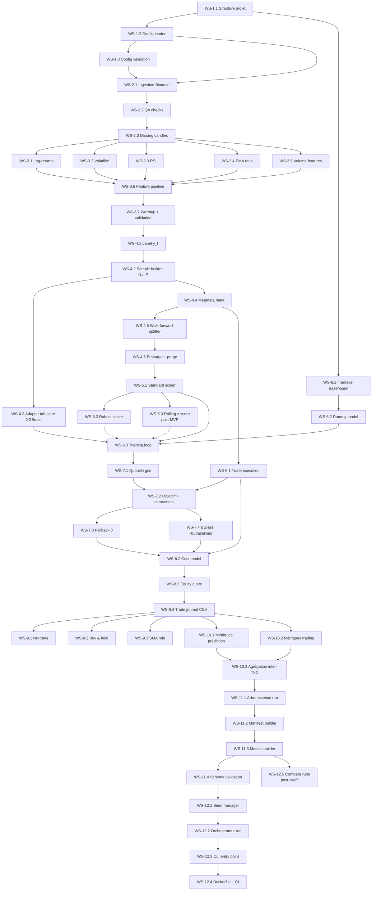

# Plan d'implémentation — Pipeline commun AI Trading

**Référence** : `docs/specifications/Specification_Pipeline_Commun_AI_Trading_v1.0.md` (v1.0 + addendum v1.1 + v1.2)
**Date** : 2026-02-27
**Portée** : pipeline complet (hors implémentation interne des modèles ML/DL)

> Ce plan découpe l'implémentation en **Work Streams (WS)** parallélisables et en **Milestones (M)** séquentiels.
> Chaque tâche est numérotée `WS-X.Y` et peut être convertie en fichier `docs/tasks/`.


## Table des matières

- [Vue d'ensemble](#vue-densemble)
- [Milestones et dépendances](#milestones-et-dépendances)
- [WS-1 — Fondations et configuration](#ws-1--fondations-et-configuration)
- [WS-2 — Ingestion des données et contrôle qualité](#ws-2--ingestion-des-données-et-contrôle-qualité)
- [WS-3 — Feature engineering](#ws-3--feature-engineering)
- [WS-4 — Construction des datasets et splitting walk-forward](#ws-4--construction-des-datasets-et-splitting-walk-forward)
- [WS-5 — Normalisation / scaling](#ws-5--normalisation--scaling)
- [WS-6 — Interface modèle et framework d'entraînement](#ws-6--interface-modèle-et-framework-dentraînement)
- [WS-7 — Calibration du seuil θ (Go/No-Go)](#ws-7--calibration-du-seuil-θ-gono-go)
- [WS-8 — Moteur de backtest](#ws-8--moteur-de-backtest)
- [WS-9 — Baselines](#ws-9--baselines)
- [WS-10 — Métriques et agrégation inter-fold](#ws-10--métriques-et-agrégation-inter-fold)
- [WS-11 — Artefacts, manifest et schémas JSON](#ws-11--artefacts-manifest-et-schémas-json)
- [WS-12 — Reproductibilité et orchestration](#ws-12--reproductibilité-et-orchestration)
- [Arborescence cible du code](#arborescence-cible-du-code)
- [Conventions](#conventions)


## Vue d'ensemble

```mermaid
flowchart LR
  subgraph M1["Milestone 1 — Fondations"]
    WS1[WS-1 Config]
    WS2[WS-2 Data + QA]
  end
  subgraph M2["Milestone 2 — Feature & Data Pipeline"]
    WS3[WS-3 Features]
    WS4[WS-4 Datasets + Split]
    WS5[WS-5 Scaling]
  end
  subgraph M3["Milestone 3 — Training Framework"]
    WS6[WS-6 Interface modèle]
    WS7[WS-7 Calibration θ]
  end
  subgraph M4["Milestone 4 — Evaluation Engine"]
    WS8[WS-8 Backtest]
    WS9[WS-9 Baselines]
    WS10[WS-10 Métriques]
  end
  subgraph M5["Milestone 5 — Production Readiness"]
    WS11[WS-11 Artefacts]
    WS12[WS-12 Reproducibilité + Orchestrateur]
  end
  M1 --> M2 --> M3 --> M4 --> M5
```



| Milestone | Work Streams | Description | Gate |
|---|---|---|---|
| **M1** | WS-1, WS-2 | Config chargeable, données brutes téléchargées et QA passé | Données Parquet validées, config parsée sans erreur |
| **M2** | WS-3, WS-4, WS-5 | Pipeline de features → datasets (N,L,F) → splits walk-forward → scaler | Tenseur X_seq reproductible, splits disjoints vérifiés |
| **M3** | WS-6, WS-7 | Interface plug-in modèle, boucle d'entraînement, calibration θ | Modèle dummy réussit fit/predict/calibration sur données synthétiques |
| **M4** | WS-8, WS-9, WS-10 | Backtest commun, 3 baselines, métriques de prédiction et trading | Métriques cohérentes sur données synthétiques et baselines |
| **M5** | WS-11, WS-12 | Artefacts conformes aux schémas JSON, orchestrateur bout-en-bout, Docker | Run complet reproductible avec manifest.json + metrics.json valides |


## Milestones et dépendances




---


## WS-1 — Fondations et configuration

**Objectif** : mettre en place la structure du projet, le chargement et la validation de la configuration YAML.
**Réf. spec** : §1.3, Annexe E.1, `configs/default.yaml`

### WS-1.1 — Structure du projet et dépendances

| Champ | Valeur |
|---|---|
| **Description** | Créer l'arborescence Python `ai_trading/` (nom du package Python interne — distinct du répertoire racine du repo `ai_trading_agent/`), le `__init__.py` (avec `__version__ = "1.0.0"` — single source of truth, lu dynamiquement par `pyproject.toml` via `[tool.setuptools.dynamic] version = {attr = "ai_trading.__version__"}`), le `pyproject.toml` (PEP 621 / PEP 517, build backend `setuptools.build_meta`), et mettre à jour `requirements.txt` avec toutes les dépendances (pandas, numpy, PyYAML, pydantic>=2.0, jsonschema, xgboost, torch, scikit-learn, scipy, ccxt, pyarrow). Un fichier `requirements-dev.txt` sépare les dépendances de développement (pytest, ruff). Configurer le logging avec `logging` standard, piloté par `config.logging` (level, format text/JSON, fichier optionnel). **Logging en deux phases** : (1) au démarrage du pipeline, configurer le logging vers **stdout uniquement** (le `run_dir` n'existe pas encore) ; (2) après création du `run_dir` (WS-11.1), ajouter dynamiquement un `FileHandler` vers `run_dir/pipeline.log` si `config.logging.file` est spécifié (`"pipeline.log"` par défaut, `null` = stdout only). |
| **Réf. spec** | §1 (périmètre), §16 (reproductibilité) |
| **Critères d'acceptation** | `pip install -e .` réussit. `import ai_trading` fonctionne. `ai_trading.__version__` retourne `"1.0.0"`. Linter (ruff) passe sans erreur. `requirements.txt` contient toutes les dépendances runtime. `requirements-dev.txt` existe et inclut pytest+ruff. |
| **Dépendances** | Aucune |

### WS-1.2 — Config loader (YAML → Pydantic v2 model)

| Champ | Valeur |
|---|---|
| **Description** | Implémenter un module `config.py` qui charge `configs/default.yaml` (ou un YAML passé en argument), le fusionne avec les overrides CLI éventuels, et retourne un objet config typé **Pydantic v2** (`BaseModel`). Le choix de Pydantic v2 (et non de simples dataclasses) est motivé par la validation intégrée (types, bornes, contraintes croisées via `@model_validator`), la sérialisation YAML/JSON native, et la génération automatique de schémas. **Override CLI** : supporter la dot notation via `argparse` : `--set splits.train_days=240 --set costs.slippage_rate_per_side=0.0005`. Le mécanisme parcourt la config imbriquée et remplace la valeur au chemin spécifié. Erreur explicite si le chemin n'existe pas dans le schéma. |
| **Réf. spec** | Annexe E.1 (tous les paramètres MVP) |
| **Critères d'acceptation** | Le config loader supporte : (1) chargement du default, (2) override par fichier custom, (3) override par CLI args en dot notation (`--set key.subkey=value`). Tous les champs de `configs/default.yaml` sont accessibles par attribut. La config est une instance Pydantic v2 avec validation automatique. |
| **Dépendances** | WS-1.1 |

### WS-1.3 — Validation de la configuration

| Champ | Valeur |
|---|---|
| **Description** | Ajouter une validation stricte de la configuration : types, bornes (ex: `embargo_bars >= 0`, `val_frac_in_train ∈ (0, 0.5]` — strictement positif pour garantir l'existence du validation set, nécessaire à l'early stopping et à la calibration θ), contraintes croisées (ex: `sma.fast < sma.slow <= min_warmup`), règle MVP `len(symbols) == 1`, **contrainte warmup-features** : `min_warmup >= max(features.params.rsi_period, features.params.ema_slow, max(features.params.vol_windows))` (garantit que toutes les features sont calculables après la zone warmup), et **règles non négociables du backtest** : `backtest.mode == "one_at_a_time"` et `backtest.direction == "long_only"` (§12.1, Annexe E.2.3). Erreur explicite (`raise`) si invalide. **Bornes numériques complètes (via Pydantic `Field`)** : `label.horizon_H_bars >= 1`, `window.L >= 2`, `splits.train_days >= 1`, `splits.test_days >= 1`, `splits.step_days >= 1`, `costs.fee_rate_per_side >= 0`, `costs.slippage_rate_per_side >= 0`, `thresholding.q_grid` chaque valeur ∈ `[0, 1]` et triée croissante, `thresholding.mdd_cap ∈ (0, 1]`, `thresholding.min_trades >= 0`, `backtest.initial_equity > 0`, `backtest.position_fraction ∈ (0, 1]`, `models.*.dropout ∈ [0, 1)`, `models.*.num_layers >= 1` (GRU, LSTM, PatchTST), `models.patchtst.n_heads` divise `models.patchtst.d_model`, `models.patchtst.stride <= models.patchtst.patch_size`, `baselines.sma.fast >= 2`, `training.batch_size >= 1`, `scaling.rolling_window >= 2` (si `scaling.method == rolling_zscore`). |
| **Réf. spec** | Annexe E.2.6 (un seul symbole), §8.1, §12.1, §13.3, Annexe E.2.3 |
| **Critères d'acceptation** | Tests unitaires couvrant : config valide OK, chaque violation levée avec message clair. En particulier : `backtest.mode != "one_at_a_time"` → erreur, `backtest.direction != "long_only"` → erreur, `min_warmup < max(rsi_period, ema_slow, max(vol_windows))` → erreur. Tests de bornes numériques : `horizon_H_bars=0` → erreur, `window.L=1` → erreur, `position_fraction=0` → erreur, `dropout=1.0` → erreur, `q_grid` non triée → erreur, `mdd_cap=0` → erreur, `min_trades=-1` → erreur, `num_layers=0` → erreur, `n_heads` ne divise pas `d_model` → erreur, `stride > patch_size` → erreur, `sma.fast=1` → erreur, `batch_size=0` → erreur. |
| **Dépendances** | WS-1.2 |


---


## WS-2 — Ingestion des données et contrôle qualité

**Objectif** : télécharger les données OHLCV depuis Binance et appliquer les contrôles qualité obligatoires.
**Réf. spec** : §4

### WS-2.1 — Ingestion OHLCV Binance

| Champ | Valeur |
|---|---|
| **Description** | Implémenter un module `data/ingestion.py` qui télécharge les données OHLCV via l'API Binance (ccxt) pour le symbole, timeframe et période configurés. **Convention de bornes** : `dataset.start` est inclus, `dataset.end` est **exclusif** (convention Python `[start, end[`). La dernière bougie téléchargée a donc `timestamp_utc < end`. **Pagination** : ccxt retourne un maximum de bougies par appel (~1000) ; le module doit boucler sur `fetch_ohlcv()` avec le paramètre `since` incrémenté jusqu'à couvrir toute la période demandée. **Retry** : en cas d'erreur réseau ou rate-limit (429), retenter avec backoff exponentiel (max 3 retries). **Cache locale** : si le fichier Parquet existe déjà et couvre la période, ne pas re-télécharger (vérification par bornes temporelles). Stockage en Parquet avec colonnes canoniques : `timestamp_utc, open, high, low, close, volume, symbol`. Tri croissant par `timestamp_utc`. Calcul du SHA-256 du fichier pour traçabilité. |
| **Réf. spec** | §4.1 (format canonique) |
| **Critères d'acceptation** | Fichier Parquet généré avec les colonnes attendues. SHA-256 stable sur relance. Tri vérifié par test. |
| **Dépendances** | WS-1.2 (config pour symbole, timeframe, période) |

### WS-2.2 — Contrôles qualité (QA) obligatoires

| Champ | Valeur |
|---|---|
| **Description** | Implémenter un module `data/qa.py` avec les contrôles : (1) régularité temporelle (pas Δ uniforme, pas de doublons), (2) détection des trous (missing candles), (3) détection des outliers (prix négatif, volume nul prolongé, OHLC incohérent : H ≥ max(O,C), L ≤ min(O,C)). Chaque contrôle lève une erreur explicite ou retourne un rapport structuré. |
| **Réf. spec** | §4.2 |
| **Critères d'acceptation** | Tests avec données synthétiques : doublons détectés, trous détectés, outliers détectés. Données propres → QA passe. |
| **Dépendances** | WS-2.1 |

### WS-2.3 — Politique de traitement des trous (missing candles)

| Champ | Valeur |
|---|---|
| **Description** | Implémenter la politique MVP : pas d'interpolation. (1) Détecter les positions des bougies manquantes. (2) Marquer comme invalides tous les samples dont la fenêtre d'entrée `[t-L+1, t]` ou la fenêtre de sortie `[t+1, t+H]` touche un trou. (3) Retourner un masque de validité `valid_mask` de shape `(N,)`. |
| **Réf. spec** | §4.3, §6.6 |
| **Critères d'acceptation** | Test : un trou à l'indice k invalide tous les samples dans `[k-H, k+L-1]`. Masque booléen correct. |
| **Dépendances** | WS-2.2 |


---


## WS-3 — Feature engineering

**Objectif** : calculer les 9 features MVP de manière strictement causale et auditable.
**Réf. spec** : §6

### WS-3.1 — Log-returns (logret_1, logret_2, logret_4)

| Champ | Valeur |
|---|---|
| **Description** | Implémenter les trois log-returns : `logret_k(t) = log(C_t / C_{t-k})` pour k ∈ {1, 2, 4}. Vérifier la causalité : aucune donnée future utilisée. |
| **Réf. spec** | §6.2 |
| **Critères d'acceptation** | Tests sur données synthétiques avec valeurs attendues calculées à la main. NaN aux positions `t < k`. |
| **Dépendances** | WS-2.3 |

### WS-3.2 — Volatilité rolling (vol_24, vol_72)

| Champ | Valeur |
|---|---|
| **Description** | Implémenter `vol_n(t) = std(logret_1[t-n+1..t], ddof=0)` pour n ∈ {24, 72}. Convention `ddof=0` (écart-type population). **Note** : le module `volatility.py` recalcule `logret_1 = log(C_t / C_{t-1})` en interne à partir des clôtures brutes plutôt que de dépendre de la sortie de la feature `logret_1` — choix intentionnel pour l'indépendance du registre (cf. WS-3.6, détail architecture point 2). |
| **Réf. spec** | §6.5 |
| **Critères d'acceptation** | Test numérique : résultat identique à `np.std(..., ddof=0)`. NaN aux positions `t < n`. |
| **Dépendances** | WS-2.3 |

### WS-3.3 — RSI (rsi_14, lissage de Wilder)

| Champ | Valeur |
|---|---|
| **Description** | Implémenter le RSI avec lissage de Wilder (n=14, ε=1e-12). Initialisation : moyenne simple sur les n premières valeurs. Cas limites : AL≈0 et AG>0 → 100, AG≈0 et AL>0 → 0, AG=AL=0 → 50. |
| **Réf. spec** | §6.3 |
| **Critères d'acceptation** | Tests numériques sur séries connues. Cas limites couverts. Résultat ∈ [0, 100]. |
| **Dépendances** | WS-2.3 |

### WS-3.4 — EMA ratio (ema_ratio_12_26)

| Champ | Valeur |
|---|---|
| **Description** | Implémenter EMA_n avec α = 2/(n+1). Initialisation : moyenne simple sur les n premières clôtures. Feature = EMA_12 / EMA_26 - 1. |
| **Réf. spec** | §6.4 |
| **Critères d'acceptation** | Tests numériques. Vérifier convergence sur séries constantes (ratio = 0). |
| **Dépendances** | WS-2.3 |

### WS-3.5 — Features de volume (logvol, dlogvol)

| Champ | Valeur |
|---|---|
| **Description** | `logvol(t) = log(V_t + ε)` avec ε=1e-8. `dlogvol(t) = logvol(t) - logvol(t-1)`. |
| **Réf. spec** | §6.2 |
| **Critères d'acceptation** | Tests : volume nul → logvol ≈ log(ε). dlogvol NaN à t=0. |
| **Dépendances** | WS-2.3 |

### WS-3.6 — Feature pipeline (assemblage) — architecture pluggable

| Champ | Valeur |
|---|---|
| **Description** | Architecture pluggable basée sur un **registre de features** (`features/registry.py`). Chaque feature est une classe héritant de `BaseFeature` et auto-enregistrée via le décorateur `@register_feature("nom")`. Le pipeline (`features/pipeline.py`) itère sur `config.features.feature_list`, résout chaque nom dans le registre, appelle `compute()`, et assemble le DataFrame résultat. Erreur explicite si une feature demandée n'est pas enregistrée. |
| **Réf. spec** | §6.2, Annexe E.1 (`features.feature_list`) |
| **Critères d'acceptation** | Le pipeline produit un DataFrame (N_total, F=9) avec les bonnes colonnes. Feature_version tracée. Test : une feature inconnue dans `feature_list` → `ValueError`. Test : le registre contient exactement les 9 features MVP après import. |
| **Dépendances** | WS-3.1 → WS-3.5 |

**Détails d'architecture (registre pluggable) :**

1. **`features/registry.py`** — Registre global et classe de base :
   - `FEATURE_REGISTRY: dict[str, type[BaseFeature]]` — dictionnaire nom → classe.
   - `@register_feature(name: str)` — décorateur qui enregistre la classe. Lève `ValueError` si doublon.
   - `BaseFeature(ABC)` — interface minimale :
     - `compute(self, ohlcv: pd.DataFrame, params: dict) -> pd.Series` — calcul causal, retourne une Series indexée par timestamp. Le dict `params` est le dict complet `config.features.params`.
     - `required_params -> list[str]` (class attribute) — liste des clés requises dans `params` pour cette feature (ex: `["rsi_period"]` pour RSI). Le pipeline valide la présence de ces clés avant l'appel à `compute()`.
     - `min_periods -> int` (property) — nombre minimum de bougies avant première valeur valide.

2. **Chaque module feature** (`log_returns.py`, `volatility.py`, etc.) :
   - Importe `@register_feature` et `BaseFeature`.
   - Déclare une ou plusieurs classes annotées `@register_feature("logret_1")`, etc.
   - Aucune logique d'orchestration — uniquement le calcul.
   - **Note (volatility.py)** : les features `vol_24` et `vol_72` recalculent `log(C_t / C_{t-1})` en interne à partir des clôtures brutes, plutôt que de dépendre de la sortie de la feature `logret_1`. Ce choix est intentionnel : il garantit l'indépendance de chaque feature dans le registre. Un helper interne `_compute_logret_1(close: pd.Series) -> pd.Series` peut être extrait dans `features/_helpers.py` pour éviter la duplication de code.

3. **`features/__init__.py`** — Auto-registration :
   - Importe explicitement tous les modules feature pour peupler le registre au chargement du package : `from ai_trading.features import log_returns, volatility, rsi, ema, volume`. Sans ces imports, `FEATURE_REGISTRY` serait vide et `compute_features()` échouerait.
   - Le même pattern s'applique à `models/__init__.py` pour le `MODEL_REGISTRY` (auto-import de `dummy.py`, des baselines `no_trade.py`, `buy_hold.py`, `sma_rule.py`, et des modèles futurs).

4. **`features/pipeline.py`** — Orchestrateur :
   - Importe `FEATURE_REGISTRY` (peuplé par les imports ci-dessus).
   - `compute_features(ohlcv, config) -> pd.DataFrame` : itère sur `feature_list`, résout dans le registre, **valide que les `required_params` de chaque feature sont présents dans `config.features.params`** (erreur explicite sinon), appelle `compute(ohlcv, config.features.params)`, assemble.
   - Validation : erreur explicite si feature manquante ou si le registre est vide.

5. **Ajout d'une feature future** : créer un fichier, implémenter `BaseFeature`, annoter `@register_feature("ma_feature")`, ajouter l'import dans `features/__init__.py`, et ajouter le nom dans `config.features.feature_list`.

> **Note** : cette architecture est un choix engineering (comment assembler). Les formules et contraintes des features restent définies dans la spec §6.

### WS-3.7 — Warmup et validation de causalité

| Champ | Valeur |
|---|---|
| **Description** | (1) Appliquer `min_warmup` : invalider les `min_warmup` premières bougies. (2) Audit de causalité automatisé : vérifier qu'aucune feature à t ne contient de NaN interne (hors zone warmup). (3) Combiner avec le `valid_mask` de WS-2.3 pour produire le masque final. |
| **Réf. spec** | §6.6 |
| **Critères d'acceptation** | Masque correct. Les `min_warmup` premières lignes sont exclues. Test d'absence de NaN dans la zone valide. |
| **Dépendances** | WS-3.6, WS-2.3 |


---


## WS-4 — Construction des datasets et splitting walk-forward

**Objectif** : construire les tenseurs (N,L,F), les labels, les métadonnées, et le splitter walk-forward avec embargo.
**Réf. spec** : §5, §7, §8

### WS-4.1 — Calcul de la cible y_t

| Champ | Valeur |
|---|---|
| **Description** | Implémenter les deux variantes de label : (1) `log_return_trade` : `y_t = log(Close[t+H] / Open[t+1])`. (2) `log_return_close_to_close` : `y_t = log(Close[t+H] / Close[t])`. Le choix est piloté par `config.label.target_type`. Invalider le sample si `t+1` ou `t+H` est un trou. |
| **Réf. spec** | §5.1, §5.2, §5.3 |
| **Critères d'acceptation** | Valeurs numériques correctes sur données synthétiques. Test : changement de `target_type` → valeurs différentes. Samples invalides correctement masqués. |
| **Dépendances** | WS-3.7 |

### WS-4.2 — Sample builder (N, L, F)

| Champ | Valeur |
|---|---|
| **Description** | Module `data/dataset.py` : pour chaque timestamp de décision t valide, construire la matrice X_t ∈ R^{L×F} (fenêtre [t-L+1, ..., t]). Produire le tenseur `X_seq` de shape (N, L, F), `y` de shape (N,), et un index de timestamps. N = nombre de samples valides. |
| **Réf. spec** | §7.1 |
| **Critères d'acceptation** | Shape correcte. Pas de NaN dans X_seq ni y pour les samples valides. Test : N < N_total (warmup + trous éliminés). |
| **Dépendances** | WS-4.1 |

### WS-4.3 — Adapter tabulaire pour XGBoost

| Champ | Valeur |
|---|---|
| **Description** | Fonction `flatten_seq_to_tab(X_seq) -> X_tab` qui aplatit (N, L, F) → (N, L*F) par concaténation temporelle. Nommage des colonnes : `{feature}_{lag}`. **Ordre d'exécution** : le flatten intervient **après le scaling** (le scaler opère sur X_seq (N,L,F), puis le modèle XGBoost appelle le flatten dans son `fit()`/`predict()`). |
| **Réf. spec** | §7.2 |
| **Critères d'acceptation** | Shape `(N, L*F)` correcte (ex : avec L=128, F=9 → 1152 colonnes). Nommage des colonnes `{feature}_{lag}`. Valeurs identiques à X_seq réarrangé. |
| **Dépendances** | WS-4.2 |

### WS-4.4 — Métadonnées d'exécution (meta)

| Champ | Valeur |
|---|---|
| **Description** | Pour chaque sample t, stocker : `decision_time`, `entry_time` (open t+1), `exit_time` (close t+H), `entry_price` (Open[t+1]), `exit_price` (Close[t+H]). Retourner un DataFrame `meta` de shape (N, 5+). |
| **Réf. spec** | §7.3 |
| **Critères d'acceptation** | Les prix sont ceux des bonnes bougies. Test de cohérence : `y_t ≈ log(exit_price / entry_price)` pour `target_type = log_return_trade`. Test de cohérence `close_to_close` : pour `target_type = log_return_close_to_close`, `y_t ≈ log(Close[t+H] / Close[t])` (indépendant de `entry_price`). |
| **Dépendances** | WS-4.2 |

### WS-4.5 — Walk-forward splitter

| Champ | Valeur |
|---|---|
| **Description** | Module `data/splitter.py`. Implémenter le rolling walk-forward avec bornes calculées en **dates UTC** (pas en nombre de bougies). Le nombre effectif de bougies par période dépend de la disponibilité des données dans l'intervalle de dates. **Convention** : `dataset.end` est exclusif (cf. WS-2.1). Soit `Δ_hours` la résolution du timeframe (1h pour le MVP, lu depuis `config.dataset.timeframe`). (1) Définir `total_days = (dataset.end - dataset.start).days` (jours calendaires, `dataset.end` exclus). (2) Pour chaque fold k, calculer les bornes temporelles en dates UTC : `train_start[k] = dataset.start + timedelta(days=k * step_days)`, `train_val_end[k] = train_start[k] + timedelta(days=train_days) - timedelta(hours=Δ_hours)` (dernière bougie incluse), `test_start[k] = train_start[k] + timedelta(days=train_days) + timedelta(hours=embargo_bars * Δ_hours)` (après embargo), `test_end[k] = test_start[k] + timedelta(days=test_days) - timedelta(hours=Δ_hours)`. (3) Extraction du val **en jours calendaires** : `val_days = floor(train_days * val_frac_in_train)`, `val_start[k] = train_start[k] + timedelta(days=train_days - val_days)`, `train_only_end[k] = val_start[k] - timedelta(hours=Δ_hours)`. (4) **Politique de troncation** : tout fold dont `test_end[k] > dataset.end` est **supprimé**. Seuls les folds pouvant couvrir `test_days` jours complets sont conservés. Assertion : `last_fold.test_end <= dataset.end`. (5) **Politique de samples minimum** : tout fold dont `N_train < min_samples_train` (défaut : 100) ou `N_test == 0` est **exclu** avec un warning loggé. Les métriques agrégées ne comptent que les folds valides. Les constantes `MIN_SAMPLES_TRAIN = 100` et `MIN_SAMPLES_TEST = 1` sont définies dans le module (modifiables en config si besoin futur). (6) **Assertion globale** : si après troncation et filtrage il ne reste aucun fold valide (`n_valid_folds == 0`), lever `ValueError("No valid folds: dataset too short for the given split parameters")`. (7) Retourner un itérateur de folds avec indices ou masques + bornes UTC par fold + nombre de samples (`N_train`, `N_val`, `N_test`) par fold. |
| **Réf. spec** | §8.1, §8.3, Annexe E.2.1 |
| **Critères d'acceptation** | Folds disjoints (aucun timestamp commun). Nombre de folds calculable : `n_folds = floor((total_days - train_days - test_days) / step_days) + 1`. Si `test_days == step_days` (cas MVP), cela se simplifie en `floor((total_days - train_days) / step_days)`. Bornes UTC enregistrées. **Test de troncation** : un fold dont `test_end > dataset.end` est exclu. **Test de bord** : la formule reste correcte lorsque la période totale n'est pas un multiple exact de `step_days`. **Test dates** : les bornes de split sont des dates UTC, pas des comptages de bougies — un gap de données dans l'intervalle ne décale pas les bornes temporelles mais réduit le nombre de samples du fold. **Test min samples** : un fold avec `N_train < MIN_SAMPLES_TRAIN` ou `N_test == 0` est exclu avec warning. |
| **Dépendances** | WS-4.2 |

### WS-4.6 — Embargo et purge

| Champ | Valeur |
|---|---|
| **Description** | Appliquer la règle de purge exacte de §8.2 : (1) définir `purge_cutoff = test_start − embargo_bars * Δ`, (2) un sample t est autorisé dans train/val si et seulement si `t + H <= purge_cutoff`. Supprimer les samples de la zone tampon entre val et test. Vérifier la disjonction stricte par test automatisé. **Attention** : l'embargo est appliqué une seule fois (entre fin de val et début de test), pas en double. Le splitter (WS-4.5) fixe `test_start` après l'embargo ; la purge retire ensuite les samples dont le label **chevauche** cette zone. Il n'y a pas de double embargo. |
| **Réf. spec** | §8.2, §8.4 |
| **Critères d'acceptation** | Test : aucun label du train ne dépend d'un prix dans la zone test. Gap d'au moins `embargo_bars` bougies vérifié. Test : la formule `t + H <= purge_cutoff` est respectée pour tout sample t du train/val. |
| **Dépendances** | WS-4.5 |

**Schéma temporel d'un fold (référence) :**

```
|---- train_only ----|---- val ----|--embargo--|---- test ----|
^                    ^            ^           ^              ^
train_start    train_only_end  train_val_end  test_start     test_end
                                     |
                               purge_cutoff = test_start - embargo_bars * Δ
                               Règle : sample t autorisé dans train/val
                               ssi t + H <= purge_cutoff
```

**Exemple numérique (paramètres MVP, fold k=0) :**

Avec `train_days=180`, `test_days=30`, `step_days=30`, `embargo_bars=4`, `H=4`, `Δ=1h`, `dataset.start=2024-01-01 00:00 UTC` :

| Borne | Calcul | Valeur |
|---|---|---|
| `train_start[0]` | `dataset.start` | `2024-01-01 00:00` |
| `train_val_end[0]` | `+ 180j - 1h` | `2024-06-28 23:00` |
| `val_start[0]` | `+ (180 - 36)j = + 144j` (val_frac=0.2 → val_days=36) | `2024-05-24 00:00` |
| `train_only_end[0]` | `val_start - 1h` | `2024-05-23 23:00` |
| `test_start[0]` | `+ 180j + 4×1h = + 180j 4h` | `2024-06-29 04:00` |
| `test_end[0]` | `test_start + 30j - 1h` | `2024-07-29 03:00` |
| `purge_cutoff` | `test_start - 4×1h` | `2024-06-29 00:00` |

**Zone purgée** : les samples t de train/val tels que `t + 4 > purge_cutoff` (c.-à-d. `t > 2024-06-28 20:00`). Cela purge les ~3 derniers samples de la zone val dont le label (H=4 bougies) déborderait dans la zone d'embargo. Il n'y a pas de double embargo : le gap temporel entre `train_val_end` et `test_start` est de `(embargo_bars + 1) × Δ = 5h` (4h d'embargo + 1h de la convention dernière-bougie-incluse), et la purge retire les samples dont le look-ahead chevauche ce gap.


---


## WS-5 — Normalisation / scaling

**Objectif** : normaliser les features sans fuite d'information (fit sur train uniquement).
**Réf. spec** : §9

### WS-5.1 — Standard scaler (fit-on-train)

| Champ | Valeur |
|---|---|
| **Description** | Module `data/scaler.py`. **Pré-condition** : X_train ne contient aucun NaN (garanti par le sample builder WS-4.2). Si NaN détecté → `raise ValueError("NaN in X_train before scaling")`. Implémenter le standard scaler : (1) estimer μ_j et σ_j sur l'ensemble des N_train × L valeurs du train pour chaque feature j, (2) transformer train/val/test avec `(x - μ) / (σ + ε)`. Un seul scaler global par feature (§ E.2.7). Sauvegarder les paramètres pour reproductibilité. **Guard constante** : si `σ_j < 1e-8`, la feature j est fixée à `0.0` après scaling et un `warning` est émis via logging. Ce seuil (`CONSTANT_FEATURE_SIGMA_THRESHOLD = 1e-8`) est défini comme constante dans le module. |
| **Réf. spec** | §9.1, Annexe E.2.7 |
| **Critères d'acceptation** | Stats estimées uniquement sur train (test non vu). Test : la moyenne du train transformé ≈ 0. Paramètres sérialisables. Test : feature constante (σ < 1e-8) → sortie = 0.0 + warning émis. |
| **Dépendances** | WS-4.6 |

### WS-5.2 — Robust scaler (option)

| Champ | Valeur |
|---|---|
| **Description** | Implémenter en option : centrage par médiane, échelle par IQR (fit sur train). Clipping/winsorization aux quantiles configurés (`robust_quantile_low`, `robust_quantile_high`). Activé par `config.scaling.method = robust`. |
| **Réf. spec** | §9.2 |
| **Critères d'acceptation** | Test : outliers extrêmes clippés. Stats estimées sur train uniquement. |
| **Dépendances** | WS-5.1 (même interface) |

### WS-5.3 — Rolling z-score (post-MVP)

| Champ | Valeur |
|---|---|
| **Description** | Implémenter l'option rolling z-score causal : `z_t = (x_t - mean(x[t-W..t-1])) / (std(x[t-W..t-1]) + ε)` où W = `config.scaling.rolling_window` (default 720). Activé par `config.scaling.method = rolling_zscore`. Contraintes : (1) estimation strictement causale (pas de fenêtres centrées), (2) frontières train/val/test traitées séquentiellement sans regarder le futur, (3) appliqué de manière identique à tous les modèles. |
| **Réf. spec** | §9.3 |
| **Critères d'acceptation** | Test : le z-score à t n'utilise aucune valeur > t. Stats identiques à `np.mean` / `np.std` sur la fenêtre `[t-W, t-1]`. NaN correct pour `t < W`. Même résultat qu'un calcul pandas rolling. |
| **Dépendances** | WS-5.1 (même interface) |
| **Priorité** | **Post-MVP** — désactivé par défaut (`config.scaling.method = standard`). |


---


## WS-6 — Interface modèle et framework d'entraînement

**Objectif** : définir le contrat d'interface pour les modèles plug-in et la boucle d'entraînement commune.
**Réf. spec** : §10

> **Note** : l'implémentation interne des modèles (XGBoost, CNN, GRU, LSTM, PatchTST, RL-PPO) est **hors scope** de ce plan. Seule l'interface et le framework d'entraînement sont couverts.

### WS-6.1 — Interface abstraite BaseModel (contrat plug-in modèle et baselines)

| Champ | Valeur |
|---|---|
| **Description** | Définir le **contrat d'interface plug-in** que tout modèle (XGBoost, CNN, GRU, LSTM, PatchTST, RL-PPO) **et toute baseline** (no-trade, buy & hold, SMA) doit respecter pour être intégré au pipeline. Ce contrat découple totalement le pipeline de la logique interne des modèles : le trainer, le calibrateur, le backtest et l'orchestrateur interagissent **uniquement** avec `BaseModel` — jamais avec un modèle concret. Classe abstraite `models/base.py` : `BaseModel(ABC)` exposant les méthodes `fit(X_train, y_train, X_val, y_val, config, run_dir, meta_train=None, meta_val=None, ohlcv=None) -> artifacts`, `predict(X, meta=None, ohlcv=None) -> y_hat`, `save(path)`, `load(path)`. Conventions d'entrée/sortie : X_seq (N,L,F), y (N,), y_hat (N,) en float. Le paramètre optionnel `meta_train` / `meta_val` est un DataFrame contenant les métadonnées d'exécution (colonnes : `decision_time`, `entry_time`, `exit_time`, `entry_price`, `exit_price`) produites par WS-4.4. Il est **nécessaire** pour le modèle RL (PPO) qui construit son environnement d'entraînement interactif à partir de ces prix et du `config.costs` pour calculer les rewards (net return après coûts), et gère les transitions `one_at_a_time` en interne. **Transition RL mode « skip »** (E.2.10) : après un Go à t, l'environnement RL avance directement au pas `t + H + 1` (l'agent ne voit pas les pas intermédiaires pendant un trade). Le nombre de décisions par épisode est donc variable. Ce mode est cohérent avec le backtest `one_at_a_time` et évite que l'agent apprenne à décider pendant un trade actif (ce qui n'aurait aucun effet en production). Le paramètre optionnel `ohlcv` est le DataFrame OHLCV complet (nécessaire pour la baseline SMA qui calcule ses signaux sur les clôtures brutes causales, cf. E.2.4). Pour les modèles supervisés (XGBoost, CNN, GRU, LSTM, PatchTST), `meta` et `ohlcv` sont ignorés par `fit()`/`predict()`. Cas RL : `predict()` retourne des actions binaires (N,). **Les baselines implémentent également `BaseModel`** : `fit()` est un no-op, `predict()` retourne directement les signaux (0/1). Un **registre unique de modèles** (`MODEL_REGISTRY` + décorateur `@register_model`) permet la résolution dynamique du modèle ou de la baseline depuis `config.strategy.name`, symétriquement au registre de features (WS-3.6). L'orchestrateur (WS-12.2) route par `strategy_type` pour bypasser la calibration θ sur les baselines (mais appelle `fit()` dans tous les cas). |
| **Réf. spec** | §10.1, §10.2, §10.4 |
| **Critères d'acceptation** | (1) Classe abstraite importable. (2) Un modèle qui n'implémente pas les méthodes lève `NotImplementedError`. (3) Le registre résout `config.strategy.name` → classe modèle (y compris pour les baselines). (4) Un nom inconnu lève `ValueError`. (5) Docstring du contrat exhaustive (shapes, types, contraintes anti-fuite). (6) La signature `fit()` accepte `meta_train`, `meta_val` et `ohlcv` optionnels — un `DummyModel` ou modèle supervisé peut les ignorer sans erreur, un modèle RL utilise `meta` pour construire son environnement, la SMA baseline utilise `ohlcv` pour calculer ses signaux. |
| **Dépendances** | WS-1.1 |

**Rôle architectural :** WS-6.1 est la **fondation du pattern plug-in**. Sans ce contrat, chaque modèle ou baseline nécessiterait du code spécifique dans le trainer et le pipeline, violant le principe §10 ("le pipeline ne doit pas contenir de logique spécifique à un modèle"). Tous les WS en aval (WS-6.2 DummyModel, WS-6.3 Fold trainer, WS-7 Calibration, WS-8 Backtest, WS-9 Baselines) dépendent de cette interface pour fonctionner de manière générique. Les baselines sont enregistrées dans le même `MODEL_REGISTRY` que les modèles ; l'orchestrateur (WS-12.2) utilise `strategy_type` (`model` ou `baseline`) pour déterminer s'il faut effectuer la calibration θ (bypassée pour les baselines et RL), mais `fit()` est **toujours appelé** (c'est un no-op pour les baselines — cela valide le contrat BaseModel de bout en bout). Le backtest et les métriques suivent le même chemin pour tous.

### WS-6.2 — Dummy model (pour tests d'intégration)

| Champ | Valeur |
|---|---|
| **Description** | Implémenter un `DummyModel(BaseModel)` qui retourne des prédictions aléatoires (seed fixée) ou une constante. Utilisé pour valider le pipeline de bout en bout avant d'intégrer les vrais modèles. **Sérialisation** : `save()` exporte un fichier JSON minimal (`{"seed": 42, "constant": 0.0}`) ; `load()` le recharge. Ce format sert également de test du contrat save/load. |
| **Réf. spec** | §10 |
| **Critères d'acceptation** | `DummyModel` passe fit/predict/save/load. Prédictions reproductibles avec seed fixée. |
| **Dépendances** | WS-6.1 |

### WS-6.3 — Fold trainer (orchestration fit/predict par fold)

| Champ | Valeur |
|---|---|
| **Description** | Module `training/trainer.py`. Orchestrateur d'entraînement par fold : (1) **scaling** (le trainer est le **seul responsable** du scaling : `scaler.fit(X_train)`, `X_train = scaler.transform(X_train)`, `X_val = scaler.transform(X_val)`, `X_test = scaler.transform(X_test)` — l'orchestrateur WS-12.2 ne touche pas au scaling, il le délègue entièrement au trainer), (2) appeler `model.fit(X_train, y_train, X_val, y_val, config, run_dir, meta_train, meta_val, ohlcv)` — le modèle gère en interne l'early stopping (patience configurable). (3) Logger loss train/val, best_epoch. (4) Pas de logique spécifique au modèle dans le trainer — le trainer passe systématiquement `meta_train`, `meta_val` et `ohlcv` ; les modèles supervisés les ignorent, le modèle RL utilise `meta` pour construire son environnement interactif, la SMA baseline utilise `ohlcv` pour ses signaux. (5) Le trainer délègue l'early stopping au modèle via `model.fit()` : les modèles DL implémentent la boucle epoch + patience dans leur `fit()`, XGBoost utilise son API native (`early_stopping_rounds`). Le trainer ne fait **pas** de boucle epoch lui-même — son rôle est l'orchestration du workflow (scale → fit → predict → save), pas la boucle d'entraînement interne. **Note `training.loss` et `training.optimizer`** : ces paramètres sont destinés **exclusivement** aux modèles DL (CNN1D, GRU, LSTM, PatchTST). XGBoost utilise son propre objectif natif (`reg:squarederror` pour MSE) et ignore `training.loss` / `training.optimizer`. Si un mapping futur est souhaité (mse → `reg:squarederror`, mae → `reg:absoluteerror`, huber → `reg:pseudohubererror`), il devra être géré dans l'implémentation du modèle XGBoost, pas dans le trainer. **Helper DL commun** : pour éviter la duplication de la boucle epoch + early stopping dans les 4 modèles DL (CNN1D, GRU, LSTM, PatchTST), un module `training/dl_train_loop.py` fournira un helper réutilisable `run_dl_training(model, train_loader, val_loader, loss_fn, optimizer, patience, max_epochs) -> TrainResult`. Ce helper encapsule la boucle epoch, le calcul de loss, l'early stopping, et le logging. Chaque modèle DL appelle ce helper dans son `fit()`. Ce module est implémenté dans le cadre de WS-6.3. |
| **Réf. spec** | §10.3 |
| **Critères d'acceptation** | Early stopping fonctionnel avec DummyModel. Logs de loss exportés. Patience configurable. |
| **Dépendances** | WS-6.2, WS-5.1 |


---


## WS-7 — Calibration du seuil θ (Go/No-Go)

**Objectif** : calibrer le seuil θ sur validation pour convertir les prédictions en décisions Go/No-Go.
**Réf. spec** : §11

### WS-7.1 — Grille de quantiles

| Champ | Valeur |
|---|---|
| **Description** | Module `calibration/threshold.py`. Pour un vecteur de prédictions `y_hat_val`, calculer θ(q) = quantile_q(y_hat_val) pour chaque q dans `config.thresholding.q_grid`. |
| **Réf. spec** | §11.2 |
| **Critères d'acceptation** | Pour q=0.5, θ ≈ médiane. Tests numériques. |
| **Dépendances** | WS-6.3 (pour obtenir y_hat_val) |

### WS-7.2 — Objectif d'optimisation et contraintes

| Champ | Valeur |
|---|---|
| **Description** | Pour chaque θ candidat : (1) générer les signaux Go/No-Go sur validation, (2) exécuter le backtest sur validation (réutiliser WS-8), (3) calculer les métriques. Retenir le θ qui maximise `net_pnl` sous contraintes `MDD <= mdd_cap` ET `n_trades >= min_trades`. En cas d'ex-aequo, préférer le quantile le plus haut (conservateur). **Application de θ aux prédictions test** : le calibrateur expose une méthode `apply_threshold(y_hat, theta) -> signals` qui effectue `signals[t] = 1 si y_hat[t] > θ, sinon 0`. Pour les modèles supervisés, cette méthode est appelée par l'orchestrateur (WS-12.2) après `predict(X_test)` pour produire les signaux Go/No-Go passés au backtest. Pour RL et baselines (`θ = null`), les prédictions sont déjà des signaux binaires (0/1) et sont utilisées directement sans application de seuil. |
| **Réf. spec** | §11.3 |
| **Critères d'acceptation** | Le θ retenu respecte les contraintes. Test : données où un seul θ est faisable → sélection correcte. |
| **Dépendances** | WS-7.1, WS-8.1 (backtest nécessaire pour évaluer les θ) |

### WS-7.3 — Fallback θ (aucun quantile valide)

| Champ | Valeur |
|---|---|
| **Description** | Implémenter la logique de fallback (Annexe E.2.2) : (1) relâcher `min_trades` à 0, (2) si aucun θ ne respecte MDD → θ = +∞ (no-trade pour ce fold), (3) émettre un warning loggé, (4) le fold est conservé avec n_trades=0 et PnL=0. |
| **Réf. spec** | Annexe E.2.2 |
| **Critères d'acceptation** | Test du cas fallback. Warning émis. Fold présent dans les métriques avec valeurs nulles. |
| **Dépendances** | WS-7.2 |

### WS-7.4 — Bypass RL et baselines

| Champ | Valeur |
|---|---|
| **Description** | La calibration θ est **bypassée** pour : (1) le modèle RL (§11.5) → `threshold.method = "none"`, `theta = null`, (2) les baselines (§11.4) → signaux directs sans seuil, sauf SMA paramétré explicitement. |
| **Réf. spec** | §11.4, §11.5 |
| **Critères d'acceptation** | Test : le pipeline détecte `strategy_type = baseline` ou `name = rl_ppo` et skip la calibration. |
| **Dépendances** | WS-7.2 |


---


## WS-8 — Moteur de backtest

**Objectif** : simuler l'exécution des trades, appliquer les coûts, et produire la courbe d'équité.
**Réf. spec** : §12

### WS-8.1 — Règles d'exécution des trades

| Champ | Valeur |
|---|---|
| **Description** | Module `backtest/engine.py`. Implémenter les règles : (1) Go à t → entrée long à Open[t+1], (2) sortie à Close[t+H], (3) mode `one_at_a_time` (nouveau Go ignoré si trade actif, cf. E.2.3), (4) long-only (pas de short). Le moteur prend en entrée un vecteur de signaux (0/1) et les métadonnées `meta`. **Paramètre `force_single_trade`** (`bool`, défaut `False`) : lorsqu'activé, le moteur exécute un **trade unique** couvrant toute la période (entrée à Open du 1er timestamp, sortie à Close du dernier timestamp), indépendamment du vecteur de signaux. Ce mode est utilisé par la baseline Buy & Hold (WS-9.2). Le flag est un paramètre du backtest engine, pas du modèle — la logique reste générique et aucune branche conditionnelle sur `strategy.name` n'est nécessaire dans l'engine. |
| **Réf. spec** | §12.1, Annexe E.2.3 |
| **Critères d'acceptation** | Test : signal Go pendant trade actif → ignoré. Entrée/sortie aux bons prix et timestamps. Test `force_single_trade=True` : un seul trade (entry = Open premier timestamp, exit = Close dernier timestamp), indépendamment du vecteur de signaux. Test `force_single_trade=False` : comportement standard (trades de H bougies). |
| **Dépendances** | WS-4.4 (meta avec prix) |

### WS-8.2 — Modèle de coûts

| Champ | Valeur |
|---|---|
| **Description** | Implémenter le modèle multiplicatif per-side : `p_entry_eff = Open[t+1] * (1+s)`, `p_exit_eff = Close[t+H] * (1-s)`, `M_net = (1-f)^2 * (p_exit_eff / p_entry_eff)`, `r_net = M_net - 1`. |
| **Réf. spec** | §12.2, §12.3 |
| **Critères d'acceptation** | Test numérique : calcul à la main vs implémentation. Coûts symétriques (achat et vente). |
| **Dépendances** | WS-8.1 |

### WS-8.3 — Courbe d'équité

| Champ | Valeur |
|---|---|
| **Description** | Construire la courbe d'équité normalisée (E_0 = 1.0) en mode **mark-to-market** avec résolution par bougie. **Pendant un trade ouvert** (entrée à Open[t+1], sortie à Close[t+H]) : l'equity est actualisée à chaque bougie intermédiaire t' avec `E_t' = E_entry * (1 + w * r_unrealized_t')`, où `r_unrealized_t'` est le rendement net simulé si la position était fermée à Close[t'] (coûts d'entrée ET de sortie inclus : `M_unrealized = (1-f)^2 * Close[t']*(1-s) / (p_entry_eff)`, `r_unrealized = M_unrealized - 1`). **Note** : la formule utilise `(1-f)^2` (identique à `M_net`) pour inclure les frais d'entrée et de sortie. Cela garantit la continuité de l'equity à la bougie de sortie : `M_unrealized(t+H) == M_net`. Avec un seul facteur `(1-f)`, l'equity aurait une discontinuité à la clôture du trade. À la bougie de sortie réelle (t+H), l'equity est mise à jour avec le rendement net effectif du trade : `E_exit = E_entry * (1 + w * r_net)` où `w = config.backtest.position_fraction` (§12.4). Dans le MVP, w = 1.0 (all-in). **Hors trade** : équité constante. Cette approche mark-to-market garantit que le MDD reflète les drawdowns intra-trade et que le Sharpe ratio (§14.2, calculé sur les `r_t = E_t / E_{t-1} - 1` par bougie) est correctement estimé. |
| **Réf. spec** | §12.4, Annexe E.2.8 (`equity_curve.csv`) |
| **Critères d'acceptation** | Courbe constante hors position. Pendant un trade ouvert, l'equity varie à chaque bougie (mark-to-market). E final = produit des (1 + w * r_net_i). Format CSV conforme (time_utc, equity, in_trade). Test : avec w < 1.0, l'impact d'un trade est réduit proportionnellement. Test mark-to-market : un trade avec drawdown intra-trade → l'equity baisse puis remonte avant la sortie réelle. **Exemple numérique** : `E_before = 1.0`, `w = 1.0`, `f = 0.001`, `s = 0.0003`, `Open[t+1] = 100`, `Close[t'] = 99` (bougie intermédiaire), `Close[t+H] = 102`. Calculs : `p_entry_eff = 100 * 1.0003 = 100.03`, `M_unrealized_t' = (0.999)² * 99 * 0.9997 / 100.03 ≈ 0.9874`, `r_unrealized_t' ≈ -0.0126`, `E_t' = 1.0 * (1 + 1.0 * (-0.0126)) = 0.9874`. À la sortie : `M_net = (0.999)² * 102 * 0.9997 / 100.03 ≈ 1.0174`, `r_net ≈ 0.0174`, `E_exit = 1.0 * (1 + 1.0 * 0.0174) = 1.0174`. Vérification de continuité : `M_unrealized(t+H) = (0.999)² * 102 * 0.9997 / 100.03 = M_net` ✓. |
| **Dépendances** | WS-8.2 |

### WS-8.4 — Journal de trades (trades.csv)

| Champ | Valeur |
|---|---|
| **Description** | Exporter chaque trade avec : `entry_time_utc, exit_time_utc, entry_price, exit_price, entry_price_eff, exit_price_eff, f, s, fees_paid, slippage_paid, y_true, y_hat, gross_return, net_return`. **Décomposition des coûts (approximation additive)** : `fees_paid = f * (entry_price + exit_price)` et `slippage_paid = s * (entry_price + exit_price)`. Cette approximation est cohérente à l'ordre 1 avec le modèle multiplicatif (l'écart est < 0.001% pour les taux MVP). Les colonnes `f` et `s` sont également exportées pour un recalcul exact si nécessaire. |
| **Réf. spec** | §12.6 |
| **Critères d'acceptation** | CSV parseable. Somme des net_return cohérente avec l'équité finale. Colonnes conformes. |
| **Dépendances** | WS-8.3 |


---


## WS-9 — Baselines

**Objectif** : implémenter les 3 baselines une seule fois dans un module réutilisable.
**Réf. spec** : §13

> **Architecture** : chaque baseline implémente `BaseModel` (WS-6.1) et est enregistrée dans le `MODEL_REGISTRY` via `@register_model`. `fit()` est un no-op (pas d'entraînement). `predict()` retourne directement les signaux Go/No-Go (vecteur d'entiers 0/1). L'orchestrateur (WS-12.2) passe systématiquement `ohlcv` et `meta` ; seule la SMA baseline utilise `ohlcv`.

### WS-9.1 — Baseline no-trade

| Champ | Valeur |
|---|---|
| **Description** | Module `baselines/no_trade.py`. Classe `NoTradeBaseline(BaseModel)` enregistrée `@register_model("no_trade")`. `fit()` = no-op. `predict()` retourne un vecteur de zéros (N,). Aucun trade. Équité constante E_t = 1.0. Métriques : net_pnl = 0, n_trades = 0, MDD = 0. |
| **Réf. spec** | §13.1 |
| **Critères d'acceptation** | Résultat trivial vérifié par test. |
| **Dépendances** | WS-8.1 |

### WS-9.2 — Baseline buy & hold

| Champ | Valeur |
|---|---|
| **Description** | Module `baselines/buy_hold.py`. Classe `BuyHoldBaseline(BaseModel)` enregistrée `@register_model("buy_hold")`. `fit()` = no-op. `predict()` retourne un vecteur de uns (N,). **Intégration avec le backtest** : l'orchestrateur (WS-12.2) passe `force_single_trade=True` au moteur de backtest lorsque `strategy.name == "buy_hold"`. Le moteur exécute alors un trade unique couvrant toute la période test (entrée à Open du 1er timestamp, sortie à Close du dernier timestamp), conformément à §12.5. Le modèle Buy & Hold lui-même reste générique (`predict()` = vecteur de 1) — c'est le **paramètre du backtest engine** qui contrôle le comportement spécial, pas le modèle. La courbe d'équité mark-to-market est calculée bougie par bougie sur toute la période. Coûts (f, s) appliqués une fois à l'entrée et une fois à la sortie. |
| **Réf. spec** | §12.5, §13.2 |
| **Critères d'acceptation** | Test : net_return cohérent avec le calcul (1-f)^2 * Close_end*(1-s) / (Open_start*(1+s)) - 1. n_trades = 1. |
| **Dépendances** | WS-8.2 |

### WS-9.3 — Baseline SMA rule (Go/No-Go)

| Champ | Valeur |
|---|---|
| **Description** | Module `baselines/sma_rule.py`. Classe `SmaRuleBaseline(BaseModel)` enregistrée `@register_model("sma_rule")`. `fit()` = no-op. `predict(X, meta=None, ohlcv=None)` utilise le paramètre `ohlcv` (DataFrame OHLCV complet passé par l'orchestrateur) pour calculer SMA_fast et SMA_slow sur toutes les clôtures disponibles causalement (E.2.4). Signal Go si SMA_fast > SMA_slow. Retourne un vecteur de signaux (0/1) soumis au backtest commun. Les premières décisions où SMA_slow n'est pas définie → No-Go. |
| **Réf. spec** | §13.3, Annexe E.2.4 |
| **Critères d'acceptation** | Paramètres fast=20, slow=50 par défaut. Test : signal correct sur séries synthétiques (tendance haussière → Go, baissière → No-Go). Utilise le backtest commun. |
| **Dépendances** | WS-8.1 |


---


## WS-10 — Métriques et agrégation inter-fold

**Objectif** : calculer les métriques de prédiction et de trading, puis agréger sur les folds.
**Réf. spec** : §14

### WS-10.1 — Métriques de prédiction

| Champ | Valeur |
|---|---|
| **Description** | Module `metrics/prediction.py`. Calculer sur la période test de chaque fold : MAE, RMSE, Directional Accuracy, Spearman IC (optionnel). Pour le modèle RL **et toutes les baselines** (`strategy_type == "baseline"`) : toutes les métriques de prédiction → `null` (les baselines ne prédisent pas un rendement en float, elles retournent des signaux binaires 0/1 ; MAE, RMSE, Spearman IC n'ont pas de sens). **Artefact `preds_test.csv`** : ce fichier est généré pour **toutes** les stratégies (modèles supervisés, RL et baselines). Pour les baselines et RL, la colonne `y_hat` contient les signaux Go/No-Go (0/1) et non un rendement prédit. Cela assure une structure d'artefacts uniforme et permet l'audit des signaux. |
| **Réf. spec** | §14.1, §11.5 |
| **Critères d'acceptation** | Tests numériques sur vecteurs connus. DA ∈ [0,1]. RL → null values. |
| **Dépendances** | WS-6.3 (prédictions), WS-4.1 (labels) |

### WS-10.2 — Métriques de trading

| Champ | Valeur |
|---|---|
| **Description** | Module `metrics/trading.py`. À partir de la courbe d'équité et de trades.csv : net_pnl, net_return, max_drawdown, Sharpe (non annualisé par défaut, calculé sur **toute la grille test** y compris les pas hors trade où `r_t = 0` — cohérent avec la formule spec §14.2 `r_t = E_t / E_{t-1} - 1` où E est constante hors trade), profit_factor, hit_rate, n_trades, avg_trade_return, median_trade_return, `exposure_time_frac = n_bougies_en_trade / n_bougies_total_test` (les bougies d'entrée et sortie comptent comme « en trade »). Cas limites du profit_factor (Annexe E.2.5). |
| **Réf. spec** | §14.2, Annexe E.2.5 |
| **Critères d'acceptation** | Tests numériques. Cas : 0 trades → profit_factor = null. Que des gagnants → null. Que des perdants → 0.0. MDD ∈ [0,1]. |
| **Dépendances** | WS-8.3, WS-8.4 |

### WS-10.3 — Agrégation inter-fold et vérification des critères d'acceptation

| Champ | Valeur |
|---|---|
| **Description** | Module `metrics/aggregation.py`. Pour chaque métrique m : calculer `mean(m)` et `std(m)` sur tous les folds test. Courbe d'équité stitchée avec **continuation** : `E_start[k+1] = E_end[k]` (l'equity du fold k+1 commence à la valeur finale du fold k, permettant de visualiser la performance cumulée sur tout le walk-forward). Export optionnel : `summary_metrics.csv` (tableau flat des métriques agrégées, artefact optionnel post-MVP, cf. §15.1). **Vérification des critères d'acceptation §14.4** : après agrégation, émettre des warnings si `net_pnl_mean <= 0`, `profit_factor_mean <= 1.0`, ou `max_drawdown_mean >= mdd_cap`. Ces avertissements sont informatifs (le run ne crashe pas) mais sont enregistrés dans les logs et dans le champ `aggregate.notes` du `metrics.json`. **Note §14.4 — comparaison inter-stratégies** : le critère « le meilleur modèle bat au moins une baseline » est un critère **cross-run** qui ne peut être vérifié automatiquement à l'intérieur d'un seul run. Il doit être évalué via le script `scripts/compare_runs.py` (cf. WS-12.5) après l'exécution de tous les runs (modèles + baselines). **Distinction §13.4 — types de comparaison** : le module doit étiqueter les métriques agrégées avec `comparison_type` = `go_nogo` (modèles, SMA, no-trade) ou `contextual` (buy & hold) afin de séparer la comparaison « pomme-à-pomme » (mêmes décisions Go/No-Go à horizon H) de la comparaison contextuelle (position continue). Le rapport final (`summary_metrics.csv` et `aggregate.notes`) doit refléter cette distinction. **Note schéma** : le champ `comparison_type` n'est pas structurel dans `metrics.schema.json` ; il doit être inclus en texte libre dans le champ `aggregate.notes` (conforme au schéma actuel) et dans le fichier `summary_metrics.csv` (post-MVP). |
| **Réf. spec** | §14.3, §14.4 |
| **Critères d'acceptation** | Test avec 3 folds synthétiques → mean et std corrects. Conforme à la structure `aggregate` du schéma metrics.schema.json. Test : avertissement émis si `net_pnl_mean <= 0`. Test stitched equity : `E_start[k+1] == E_end[k]` pour tout k. **Test gaps inter-fold** : si `step_days > test_days` (non MVP mais possible en config), émettre un warning (« Non-contiguous test periods detected: equity held constant during gap ») et maintenir l'equity constante pendant le gap entre les périodes test. |
| **Dépendances** | WS-10.1, WS-10.2 |


---


## WS-11 — Artefacts, manifest et schémas JSON

**Objectif** : produire les artefacts de sortie conformes aux schémas JSON, dans l'arborescence canonique.
**Réf. spec** : §15

### WS-11.1 — Arborescence du run

| Champ | Valeur |
|---|---|
| **Description** | Module `artifacts/run_dir.py`. Créer l'arborescence : `runs/<run_id>/manifest.json`, `metrics.json`, `config_snapshot.yaml`, `folds/fold_XX/` avec sous-fichiers. Le `run_id` suit la convention `YYYYMMDD_HHMMSS_<strategy>`. Le fichier `config_snapshot.yaml` est la config **fully resolved** (après merge des defaults, du fichier custom et des overrides CLI). C'est la seule version utile pour la reproductibilité : elle contient toutes les valeurs effectives utilisées lors du run, sans ambiguïté sur les defaults ou overrides appliqués. **Note** : la génération de `report.html` / `report.pdf` (mentionnée dans §15.1 comme optionnelle) est reportée post-MVP. |
| **Réf. spec** | §15.1 |
| **Critères d'acceptation** | Structure de dossiers conforme. Pas de fichier manquant (hors report.html/pdf, post-MVP). |
| **Dépendances** | WS-1.2 (config pour output_dir) |

### WS-11.2 — Manifest builder

| Champ | Valeur |
|---|---|
| **Description** | Module `artifacts/manifest.py`. Construire le `manifest.json` à partir de la config, des métadonnées dataset (SHA-256), des splits (bornes par fold), de la stratégie, des coûts, de l'environnement (python_version, platform, packages), du **commit Git** courant (`git_commit`, obtenu via `git rev-parse HEAD` ou `subprocess`), de la **version du pipeline** (`pipeline_version`, lue depuis `ai_trading.__version__`), et de la liste des artefacts. **Important** : la période `train` de chaque fold dans le manifest correspond à `train_only` (sans la portion val), conformément à la convention E.2.1. |
| **Réf. spec** | §15.2, Annexe A (schéma), Annexe E.2.1 |
| **Critères d'acceptation** | Le JSON produit est valide contre `manifest.schema.json`. Test d'intégration avec `jsonschema.validate()`. Test : la période `train` de chaque fold exclut la période `val` (bornes disjointes, cf. E.2.1). Test : le champ `git_commit` est présent et contient un hash hexadécimal valide (ou une valeur explicite `"unknown"` si non disponible). Test : le champ `pipeline_version` est présent et correspond à `ai_trading.__version__`. |
| **Dépendances** | WS-11.1, WS-4.5 (splits), WS-2.1 (SHA-256) |

### WS-11.3 — Metrics builder

| Champ | Valeur |
|---|---|
| **Description** | Module `artifacts/metrics_builder.py`. Construire le `metrics.json` avec : strategy, folds (par fold : period_test, threshold, prediction, trading), aggregate (mean/std). **En outre**, produire un fichier `metrics_fold.json` dans chaque répertoire `folds/fold_XX/` (conformément à l'arborescence §15.1 et au schéma manifest `per_fold.files.metrics_fold_json`). Ce fichier contient les métriques du fold individuel (même structure que l'objet fold dans `metrics.json`) **plus les champs `n_samples_train`, `n_samples_val`, `n_samples_test`** pour la traçabilité (cf. §8.4). |
| **Réf. spec** | §15.3, Annexe B (schéma) |
| **Critères d'acceptation** | Le JSON produit est valide contre `metrics.schema.json`. Test d'intégration. Chaque `folds/fold_XX/metrics_fold.json` est généré et cohérent avec l'entrée correspondante dans le `metrics.json` global. |
| **Dépendances** | WS-10.3, WS-7.2 |

### WS-11.4 — Validation des schémas JSON

| Champ | Valeur |
|---|---|
| **Description** | Fonction `validate_manifest(data)` et `validate_metrics(data)` utilisant `jsonschema` (Draft 2020-12) avec les schémas fournis (`manifest.schema.json`, `metrics.schema.json`). Appelée systématiquement en fin de run. Erreur explicite si invalide. |
| **Réf. spec** | §15.4 |
| **Critères d'acceptation** | Exemples fournis (example_manifest.json, example_metrics.json) passent la validation. Tests de violation (champ manquant) → erreur. |
| **Dépendances** | WS-11.2, WS-11.3 |


---


## WS-12 — Reproductibilité et orchestration

**Objectif** : garantir la reproductibilité totale et fournir un point d'entrée unique pour lancer un run.
**Réf. spec** : §16, §3

### WS-12.1 — Seed manager

| Champ | Valeur |
|---|---|
| **Description** | Module `utils/seed.py`. Fixer la seed globale pour : `random`, `numpy`, `torch` (si installé), `os.environ['PYTHONHASHSEED']`. Option `deterministic_torch` pour `torch.use_deterministic_algorithms(True)`. **Fallback** : si une opération CUDA/PyTorch non déterministe lève une erreur, retomber sur `torch.use_deterministic_algorithms(True, warn_only=True)` et logger un warning. Appelé une seule fois au début du run. |
| **Réf. spec** | §16.1 |
| **Critères d'acceptation** | Deux runs avec même seed → même résultat (test d'intégration). |
| **Dépendances** | WS-1.2 |

### WS-12.2 — Orchestrateur de run

| Champ | Valeur |
|---|---|
| **Description** | Module `pipeline/runner.py`. Orchestrer le pipeline complet : (1) charger config, (2) fixer seed, (3) ingestion + QA, (4) features, (5) dataset, (6) pour chaque fold : split → **déléguer au trainer** (le trainer effectue scale → fit → predict val → predict test → save ; l'orchestrateur ne fait **pas** le scaling lui-même) → calibrer θ (sauf baselines/RL) → **appliquer θ aux prédictions test** (`signals = apply_threshold(y_hat_test, θ)` pour supervisé ; signaux directs pour RL/baselines) → backtest (avec `force_single_trade=True` si `strategy.name == "buy_hold"`) → métriques, (7) agréger inter-fold avec vérification §14.4, (8) écrire artefacts (manifest, metrics, CSVs). L'orchestrateur passe systématiquement `ohlcv` et `meta` au trainer et au modèle via les signatures `BaseModel`. **Important** : le paramètre `ohlcv` passé aux modèles et baselines est le DataFrame OHLCV **complet** couvrant toute la période `[dataset.start, dataset.end[` — et non un sous-ensemble filtré par fold. Cela est nécessaire pour la baseline SMA (E.2.4 : calcul causal sur tout l'historique disponible) et pour le modèle RL (construction de l'environnement avec les prix réels). Les modèles supervisés ignorent ce paramètre. **Gestion des baselines** : si `strategy_type = baseline`, l'orchestrateur appelle `fit()` (c'est un no-op pour les baselines, mais l'appel valide le contrat BaseModel de bout en bout), **bypass** la calibration θ, et appelle `predict(X_val, meta=meta_val, ohlcv=ohlcv)` puis `predict(X_test, meta=meta_test, ohlcv=ohlcv)` pour obtenir les signaux. Les fichiers `preds_val.csv` et `preds_test.csv` sont générés même pour les baselines et RL (la colonne `y_hat` contient les signaux 0/1). |
| **Réf. spec** | §3 (dataflow), §14.4, tout le pipeline |
| **Critères d'acceptation** | Run complet avec DummyModel → arborescence correcte, JSON valides, métriques non nulles. Warnings §14.4 émis si seuils dépassés. |
| **Dépendances** | Tous les WS précédents |

### WS-12.3 — CLI entry point

| Champ | Valeur |
|---|---|
| **Description** | Script `scripts/run_pipeline.py` (ou CLI via `__main__.py`). Arguments : `--config`, `--strategy`, `--output-dir`, overrides divers. Logging structuré (level INFO par défaut). |
| **Réf. spec** | §16.2 |
| **Critères d'acceptation** | `python -m ai_trading --config configs/default.yaml` lance un run complet. Help (`--help`) lisible. |
| **Dépendances** | WS-12.2 |

### WS-12.4 — Dockerfile et CI

| Champ | Valeur |
|---|---|
| **Description** | Mettre à jour le `Dockerfile` existant pour : (1) installer toutes les dépendances, (2) copier le code, (3) `CMD` qui lance le pipeline. Créer le fichier `.github/workflows/ci.yml` avec un workflow CI minimal (GitHub Actions) : lint (ruff) + tests unitaires (pytest) sur push et PR vers `main`. **Note GPU** : le Dockerfile de base utilise `python:3.11-slim` (CPU only). Pour les modèles DL nécessitant un GPU, prévoir un `Dockerfile.gpu` optionnel basé sur `nvidia/cuda:12.x-runtime-ubuntu22.04` avec PyTorch+CUDA (post-MVP). |
| **Réf. spec** | §16 (reproductibilité, Dockerfile) |
| **Critères d'acceptation** | `docker build` + `docker run` exécutent un run complet. CI passe sur push. |
| **Dépendances** | WS-12.3 |

### WS-12.5 — Script de comparaison inter-stratégies (post-MVP)

| Champ | Valeur |
|---|---|
| **Description** | Script `scripts/compare_runs.py`. Charge les `metrics.json` de plusieurs runs (modèles + baselines), produit un tableau comparatif et vérifie le critère §14.4 : « le meilleur modèle bat au moins une baseline (no-trade et/ou buy & hold) en P&L net ou MDD ». **Distinction §13.4** : le script sépare explicitement (1) la comparaison « pomme-à-pomme » entre stratégies Go/No-Go (modèles, SMA, no-trade) et (2) la comparaison contextuelle avec buy & hold. Le résultat est un tableau CSV et/ou un rapport Markdown. |
| **Réf. spec** | §13.4, §14.4 |
| **Critères d'acceptation** | Test : avec 2+ fichiers `metrics.json` synthétiques, le script identifie correctement la meilleure stratégie et vérifie le critère §14.4. Les deux types de comparaison (Go/No-Go vs contextuelle) sont clairement séparés dans la sortie. |
| **Dépendances** | WS-11.3 (metrics.json produits) |
| **Priorité** | **Post-MVP** — exécuté manuellement après tous les runs. |


---


## Arborescence cible du code

```
ai_trading_agent/
├── configs/
│   └── default.yaml
├── docs/
│   ├── plan/
│   │   └── implementation.md          ← ce fichier
│   └── specifications/
│       ├── Specification_Pipeline_Commun_AI_Trading_v1.0.md
│       ├── manifest.schema.json
│       ├── metrics.schema.json
│       ├── example_manifest.json
│       └── example_metrics.json
├── ai_trading/                         ← package principal
│   ├── __init__.py
│   ├── config.py                       # WS-1.2, WS-1.3
│   ├── data/
│   │   ├── __init__.py
│   │   ├── ingestion.py                # WS-2.1
│   │   ├── qa.py                       # WS-2.2, WS-2.3
│   │   ├── dataset.py                  # WS-4.1, WS-4.2, WS-4.3, WS-4.4
│   │   ├── splitter.py                 # WS-4.5, WS-4.6
│   │   └── scaler.py                   # WS-5.1, WS-5.2, WS-5.3
│   ├── features/
│   │   ├── __init__.py                 # Auto-import de tous les modules feature (peuple FEATURE_REGISTRY)
│   │   ├── registry.py                 # WS-3.6 — BaseFeature ABC + FEATURE_REGISTRY + @register_feature
│   │   ├── _helpers.py                 # WS-3.2/3.6 — helpers partagés (_compute_logret_1, etc.)
│   │   ├── log_returns.py              # WS-3.1 — @register logret_1, logret_2, logret_4
│   │   ├── volatility.py               # WS-3.2 — @register vol_24, vol_72
│   │   ├── rsi.py                      # WS-3.3 — @register rsi_14
│   │   ├── ema.py                      # WS-3.4 — @register ema_ratio_12_26
│   │   ├── volume.py                   # WS-3.5 — @register logvol, dlogvol
│   │   └── pipeline.py                 # WS-3.6, WS-3.7 — orchestrateur via FEATURE_REGISTRY
│   ├── models/
│   │   ├── __init__.py                 # Auto-import de tous les modèles et baselines (peuple MODEL_REGISTRY)
│   │   ├── base.py                     # WS-6.1
│   │   └── dummy.py                    # WS-6.2
│   ├── training/
│   │   ├── __init__.py
│   │   ├── trainer.py                  # WS-6.3
│   │   └── dl_train_loop.py            # WS-6.3 — helper DL réutilisable (boucle epoch + early stopping PyTorch)
│   ├── calibration/
│   │   ├── __init__.py
│   │   └── threshold.py                # WS-7.1, WS-7.2, WS-7.3, WS-7.4
│   ├── backtest/
│   │   ├── __init__.py
│   │   └── engine.py                   # WS-8.1, WS-8.2, WS-8.3, WS-8.4
│   ├── baselines/
│   │   ├── __init__.py
│   │   ├── no_trade.py                 # WS-9.1
│   │   ├── buy_hold.py                 # WS-9.2
│   │   └── sma_rule.py                 # WS-9.3
│   ├── metrics/
│   │   ├── __init__.py
│   │   ├── prediction.py               # WS-10.1
│   │   ├── trading.py                  # WS-10.2
│   │   └── aggregation.py              # WS-10.3
│   ├── artifacts/
│   │   ├── __init__.py
│   │   ├── run_dir.py                  # WS-11.1
│   │   ├── manifest.py                 # WS-11.2
│   │   ├── metrics_builder.py          # WS-11.3
│   │   └── schema_validator.py         # WS-11.4
│   ├── utils/
│   │   ├── __init__.py
│   │   └── seed.py                     # WS-12.1
│   └── pipeline/
│       ├── __init__.py
│       └── runner.py                   # WS-12.2
├── scripts/
│   ├── run_pipeline.py                 # WS-12.3
│   └── compare_runs.py                 # WS-12.5 (post-MVP)
├── tests/
│   ├── test_config.py
│   ├── test_ingestion.py
│   ├── test_qa.py
│   ├── test_features.py
│   ├── test_dataset.py
│   ├── test_splitter.py
│   ├── test_scaler.py
│   ├── test_trainer.py
│   ├── test_threshold.py
│   ├── test_backtest.py
│   ├── test_baselines.py
│   ├── test_metrics.py
│   ├── test_artifacts.py              # Couvre WS-11.1 à WS-11.4
│   ├── test_seed.py                    # WS-12.1
│   ├── test_runner.py                  # WS-12.2
│   └── test_integration.py             # WS-12.2, WS-12.3 (bout en bout)
├── Dockerfile                          # WS-12.4
├── pyproject.toml                      # WS-1.1 (PEP 621)
├── requirements.txt
└── README.md
```


## Conventions

| Règle | Détail |
|---|---|
| **Langue code** | Anglais (noms de variables, fonctions, classes, docstrings) |
| **Langue docs** | Français (docs/, tâches, plan) |
| **Style** | snake_case, PEP 8, imports explicites (pas de `*`) |
| **Tests** | pytest, un fichier par module (`test_config.py`, `test_features.py`, etc.), TDD encouragé (RED → GREEN → REFACTOR). Les identifiants de tâche (`#NNN`) sont référencés dans les docstrings des classes/fonctions de test, pas dans le nom des fichiers. |
| **Strict code** | Aucun fallback silencieux, `raise` explicite en cas d'erreur, pas d'`except` trop large |
| **Anti-fuite** | Toute donnée future inaccessible à t. Scaler fit sur train uniquement. Embargo respecté. |
| **Reproductibilité** | Seed fixée, SHA-256 des données, config versionée, environnement tracé |
| **Artefacts** | JSON conformes aux schémas, validés par `jsonschema` en fin de run |
| **Config** | Tout paramètre modifiable dans `configs/default.yaml`, jamais hardcodé dans le code |
