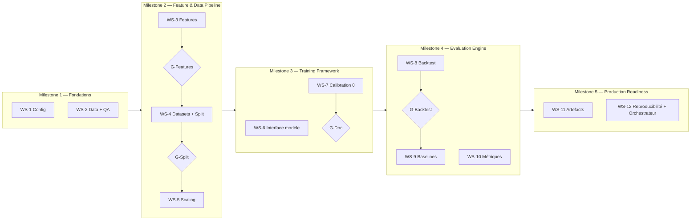
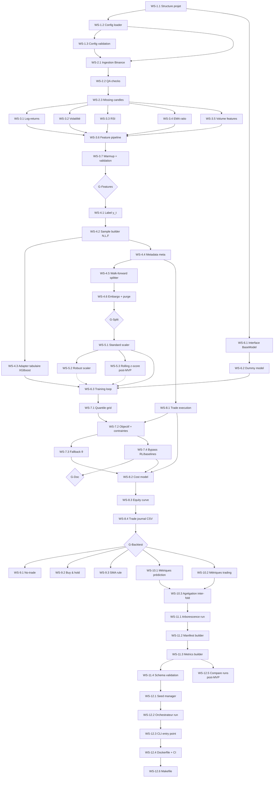
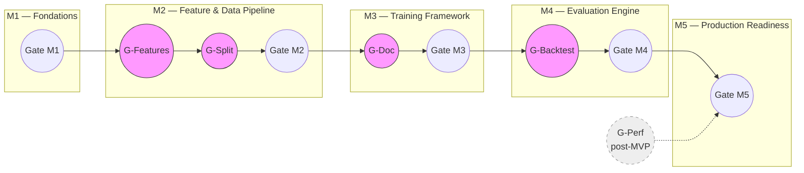

# Plan d'implémentation — Pipeline commun AI Trading

**Référence** : `docs/specifications/Specification_Pipeline_Commun_AI_Trading_v1.0.md` (v1.0 + addendum v1.1 + v1.2 + §17 spécification technique MVP)
**Date** : 2026-02-28
**Portée** : pipeline complet (hors implémentation interne des modèles ML/DL)

> Ce plan découpe l'implémentation en **Work Streams (WS)** parallélisables et en **Milestones (M)** séquentiels.
> Chaque tâche est numérotée `WS-X.Y` et peut être convertie en fichier `docs/tasks/`.


## Table des matières

- [Vue d'ensemble](#vue-densemble)
- [Cadre de Gates (Go/No-Go)](#cadre-de-gates-gono-go)
- [Milestones et dépendances](#milestones-et-dépendances)
- [WS-1 — Fondations et configuration](#ws-1--fondations-et-configuration)
- [WS-2 — Ingestion des données et contrôle qualité](#ws-2--ingestion-des-données-et-contrôle-qualité)
- [WS-3 — Feature engineering](#ws-3--feature-engineering)
- [WS-4 — Construction des datasets et splitting walk-forward](#ws-4--construction-des-datasets-et-splitting-walk-forward)
- [WS-5 — Normalisation / scaling](#ws-5--normalisation--scaling)
- [WS-6 — Interface modèle et framework d'entraînement](#ws-6--interface-modèle-et-framework-dentraînement)
- [WS-7 — Calibration du seuil θ (Go/No-Go)](#ws-7--calibration-du-seuil-θ-gono-go)
- [WS-8 — Moteur de backtest](#ws-8--moteur-de-backtest)
- [WS-9 — Baselines](#ws-9--baselines)
- [WS-10 — Métriques et agrégation inter-fold](#ws-10--métriques-et-agrégation-inter-fold)
- [WS-11 — Artefacts, manifest et schémas JSON](#ws-11--artefacts-manifest-et-schémas-json)
- [WS-12 — Reproductibilité et orchestration](#ws-12--reproductibilité-et-orchestration)
- [Arborescence cible du code](#arborescence-cible-du-code)
- [Conventions](#conventions)
- [Annexe — Synthèse des gates](#annexe--synthèse-des-gates)


## Vue d'ensemble



| Milestone | Work Streams | Description | Gate |
|---|---|---|---|
| **M1** | WS-1, WS-2 | Config chargeable, données brutes téléchargées et QA passé | Données Parquet validées, config parsée sans erreur |
| **M2** | WS-3, WS-4, WS-5 | Pipeline de features → datasets (N,L,F) → splits walk-forward → scaler | Tenseur X_seq reproductible, splits disjoints vérifiés |
| **M3** | WS-6, WS-7 | Interface plug-in modèle, boucle d'entraînement, calibration θ | Dummy + 2 baselines réussissent fit/predict/calibration sur données synthétiques |
| **M4** | WS-8, WS-9, WS-10 | Backtest commun, 3 baselines, métriques de prédiction et trading | Métriques cohérentes sur données synthétiques et baselines |
| **M5** | WS-11, WS-12 | Artefacts conformes aux schémas JSON, orchestrateur bout-en-bout, Makefile, Docker | Run complet reproductible avec manifest.json + metrics.json valides, `make run-all` fonctionnel |


## Cadre de Gates (Go/No-Go)

Objectif : rendre les gates de milestone auditables, comparables entre runs, et réellement décisionnels.

Les gates sont organisés en deux niveaux :
- **Gates de milestone (M1–M5)** : points de décision GO/NO-GO aux frontières entre milestones. Bloquants pour la progression.
- **Gates intra-milestone (G-Features, G-Split, G-Backtest, G-Doc)** : points de vérification intermédiaires au sein d'un milestone. Ils détectent les défauts structurels au plus tôt, avant qu'ils ne se propagent aux étapes suivantes. Bloquants pour les WS en aval au sein du même milestone.
- **Gate transversal anti-fuite (G-Leak)** : vérification continue appliquée à chaque étape manipulant des données temporelles. Intégré dans les critères de chaque gate intra-milestone et de milestone.

### Gates de milestone (M1–M5)

| Milestone | Critères de gate | Seuil / règle de décision | Preuves attendues | Décision |
|---|---|---|---|---|
| **M1** | Configuration et données sources prêtes | `0` erreur de validation config, `0` erreur QA bloquante, `>= 95%` de couverture de tests sur modules WS-1/WS-2 (mesurée via `pytest --cov=ai_trading.config --cov=ai_trading.data --cov-fail-under=95`) | Log de chargement config, rapport QA, `pytest` ciblé WS-1/WS-2 avec couverture, hash SHA-256 des données, rapport `gate_report_M1.json` | `GO` si les 3 seuils sont atteints, sinon `NO-GO` |
| **M2** | Pipeline data/feature causale et sans fuite | `0` fuite détectée par tests split/embargo, `100%` de disjonction train/val/test, reproductibilité `X_seq` bit-à-bit identique (même seed, même plateforme ; tolérance `atol=1e-7` pour cross-plateforme float32), taux de NaN hors warmup `= 0%` | Rapport de validation split/embargo, test anti-leakage, snapshot config, test de reproductibilité features | `GO` si les 4 seuils sont atteints |
| **M3** | Framework d'entraînement exploitable | `fit/predict` OK pour `>= 3` stratégies (dummy + 2 baselines parmi no_trade, buy_hold, sma_rule — les modèles ML/DL réels sont hors scope plan, cf. §10), calibration `theta` exécutable sur `100%` des folds valides (avec DummyModel), bypass `theta` fonctionnel pour `output_type == "signal"`, `0` crash entraînement sur `3` seeds (`42, 43, 44`) | Logs d'entraînement, courbes/pertes, artefact de calibration, tests unitaires WS-6/WS-7, `pytest` ciblé WS-6/WS-7/WS-9 | `GO` si exécution complète sans crash, calibration disponible pour `output_type == "regression"`, et bypass validé pour baselines |
| **M4** | Evaluation trading robuste | **M4-framework (scope plan)** : (a) Déterminisme backtest : delta Sharpe **non-annualisé** absolu `<= 0.02` et delta MDD absolu `<= 0.5` point de pourcentage entre `2` runs même seed (DummyModel + données synthétiques). (b) Pipeline complet sans crash pour DummyModel + 3 baselines (no_trade, buy_hold, sma_rule). (c) Métriques cohérentes : no_trade → `net_pnl=0, n_trades=0, MDD=0` ; buy_hold → `n_trades=1` ; sma_rule → `n_trades >= 0`. (d) `>= 95%` couverture tests WS-8/WS-9/WS-10. **M4-performance (post-intégration modèle réel, hors scope plan)** : Non-régression vs baseline de référence : Sharpe **non-annualisé** stratégie `>=` Sharpe baseline `- 0.05`, MDD stratégie `<=` MDD baseline `+ 1.0` pp, retour cumulé stratégie `>=` baseline `- 2.0` pp — évalué via `scripts/compare_runs.py` (WS-12.5) | Journaux de trades, equity curves, tests d'intégration backtest, tableau comparatif stratégie vs baselines (M4-performance uniquement) | `GO` si M4-framework (a+b+c+d) atteint. M4-performance évalué séparément post-intégration modèle |
| **M5** | Readiness de livraison | Reproductibilité e2e : `>= 95%` des champs numériques clés de `metrics.json` dans une tolérance relative `<= 1%` (même seed, cross-plateforme). **Champs numériques clés** : dans `aggregate` — `trading.mean.*` et `trading.std.*` (net_pnl, net_return, max_drawdown, sharpe, profit_factor, hit_rate, n_trades, avg_trade_return, median_trade_return, exposure_time_frac), `prediction.mean.*` et `prediction.std.*` (mae, rmse, directional_accuracy, spearman_ic — si applicable) ; par fold — `theta`, `n_trades`, `net_pnl`, `sharpe`, `max_drawdown`. Conformité artefacts : `100%` de validation JSON Schema. Exécution : `make run-all` + pipeline CI en succès (`0` job rouge) | Exécution CI verte, validation JSON Schema, dossier d'artefacts complet, logs d'orchestrateur, rapport de gate `gate_report_M5.json` | `GO` si les 3 seuils sont atteints, sinon `NO-GO` |

### Gates intra-milestone

Objectif : détecter les défauts structurels **au sein** d'un milestone, avant qu'ils ne se propagent aux Work Streams en aval. Chaque gate intra-milestone est un point de vérification bloquant : les WS en aval ne doivent pas commencer tant que le gate n'est pas `GO`.

| Gate | Position | Critères | Seuil / règle de décision | Preuves attendues | Décision |
|---|---|---|---|---|---|
| **G-Features** | Après WS-3.7, avant WS-4.1 | Features causales, complètes et sans fuite | (1) `9` features enregistrées dans `FEATURE_REGISTRY`, (2) `0` NaN hors zone warmup sur un dataset synthétique de `>= 500` bougies, (3) audit de causalité réussi : modification des prix `t > T` → features identiques pour `t <= T` (tolérance `atol=0`), (4) `feature_version` tracée pour chaque feature, (5) `>= 90%` couverture tests WS-3.* (`pytest --cov=ai_trading.features --cov-fail-under=90`) | `pytest` ciblé features avec couverture, log d'audit de causalité, rapport `gate_report_G_Features.json` | `GO` si les 5 critères sont atteints |
| **G-Split** | Après WS-4.6, avant WS-5.1 | Splits causaux, disjoints, embargo correct | (1) `100%` disjonction temporelle train/val/test par fold (aucun timestamp partagé), (2) purge E2E validée : `max(t + H × Δ for t in train_val_samples) < test_start` pour chaque fold, (3) `>= 1` fold valide après troncation et filtrage, (4) tenseur `X_seq` reproductible bit-à-bit (même seed, `atol=1e-7`), (5) taux de NaN dans `X_seq` et `y` = `0%`, (6) test anti-fuite scaler : indices `X_train` strictement disjoints de `X_val ∪ X_test` | Rapport split/embargo E2E, test de reproductibilité tenseur, rapport `gate_report_G_Split.json` | `GO` si les 6 critères sont atteints |
| **G-Backtest** | Après WS-8.4, avant WS-9.1 | Moteur de backtest déterministe et correct | (1) Déterminisme : `2` runs identiques (même seed, DummyModel, données synthétiques) → `trades.csv` identiques byte-à-byte (SHA-256), equity curves identiques (`atol=1e-10`), (2) cohérence equity-trades : `E_final == E_0 * Π(1 + w * r_net_i)` à `atol=1e-8`, (3) mode `one_at_a_time` respecté : aucun trade actif n'est interrompu par un nouveau Go (test sur séquence de signaux denses), (4) modèle de coûts correct : résultat numérique identique au calcul à la main sur `>= 3` cas de test, (5) `trades.csv` parseable et colonnes conformes | Tests déterminisme + cohérence + coûts, SHA-256 des CSVs, rapport `gate_report_G_Backtest.json` | `GO` si les 5 critères sont atteints |
| **G-Doc** | Après WS-7.4, avant gate M3 | Contrat plug-in et registres complets | (1) `output_type` déclaré et correct pour `>= 4` stratégies (dummy + 3 baselines), (2) `execution_mode` valeur par défaut `"standard"` sauf `BuyHoldBaseline` (`"single_trade"`), (3) `set(VALID_STRATEGIES) == set(MODEL_REGISTRY)` (cohérence registres), (4) docstrings conformes au contrat `BaseModel` (shapes, types, contraintes) sur `base.py`, `dummy.py` et les 3 baselines, (5) bypass θ fonctionnel pour `output_type == "signal"` sur données synthétiques | Tests unitaires registres + attributs, `pytest` ciblé WS-6/WS-7/WS-9, rapport inspection docstrings, rapport `gate_report_G_Doc.json` | `GO` si les 5 critères sont atteints |

### Gate transversal anti-fuite (G-Leak)

Objectif : garantir l'absence de fuite d'information temporelle (look-ahead) à **chaque** étape du pipeline manipulant des données. Contrairement aux gates ponctuels, G-Leak est une **vérification continue** intégrée dans les tests et dans chaque gate intra-milestone et de milestone.

| Étape | Vérification anti-fuite | Test automatisé |
|---|---|---|
| **Features** (WS-3) | Aucune feature à t ne dépend de données `t' > t` | Test de perturbation : modifier `Close[t > T]` → features identiques pour `t <= T` (`atol=0`). Inclus dans G-Features critère (3). |
| **Labels** (WS-4.1) | `y_t` n'utilise que `Open[t+1]` et `Close[t+H]` — pas de prix pour `t' > t+H` | Test unitaire : masquer les prix `t > t+H` → `y_t` identique |
| **Splits** (WS-4.5–4.6) | Aucun timestamp test dans train/val. Purge correcte. | Test E2E : `max(t + H × Δ for t in train_val) < test_start`. Inclus dans G-Split critère (2). |
| **Scaling** (WS-5) | `scaler.fit()` n'a jamais vu d'indices val/test | Assertion : `set(indices_fit) ⊂ set(indices_train)` et `set(indices_fit) ∩ set(indices_val ∪ indices_test) == ∅`. Inclus dans G-Split critère (6). |
| **Calibration θ** (WS-7) | θ calibré uniquement sur val, jamais sur test | Test : modifier `y_hat_test` arbitrairement → θ identique. Inclus dans gate M3. |
| **Backtest** (WS-8) | Signaux à t ne dépendent pas des prix `t' > t` | Test de perturbation généralisé (cf. WS-12.2 test de causalité). Inclus dans G-Backtest critère (1). |
| **Baselines** (WS-9) | SMA causale (backward-looking uniquement) | Test : modifier `Close[t > T]` → signaux SMA identiques pour `t <= T`. Inclus dans WS-9.3. |

Règle d'intégration : chaque gate (intra-milestone ou milestone) **inclut implicitement la vérification G-Leak** pour les étapes qu'il couvre. Un gate ne peut pas être `GO` si une fuite est détectée dans son périmètre, même si tous les autres critères sont satisfaits.

### Gate de performance (G-Perf) — post-MVP

Objectif : détecter les régressions de performance (temps d'exécution, mémoire) qui indiqueraient des implémentations sous-optimales (boucles Python naïves au lieu de vectorisation NumPy, copies mémoire inutiles, etc.).

| Critère | Seuil | Condition de mesure | Priorité |
|---|---|---|---|
| Temps d'exécution pipeline complet | `<= 120 s` (CPU, dataset synthétique 2000 bougies, 3 folds, DummyModel) | Mesuré par `time make run` avec fixture CI standard | Post-MVP |
| Temps d'exécution feature pipeline | `<= 5 s` (2000 bougies, 9 features) | Mesuré par benchmark pytest (`pytest-benchmark`) | Post-MVP |
| Pic mémoire résidente | `<= 2 GB` (dataset synthétique 2000 bougies) | Mesuré par `tracemalloc` ou `/usr/bin/time -v` | Post-MVP |
| Scalabilité linéaire | Doubler N_bougies → temps `<= 2.5x` (tolérance 25% pour overhead) | Benchmark paramétré sur `[1000, 2000, 4000]` bougies | Post-MVP |

**Règles** :
- G-Perf n'est **pas bloquant** pour les gates de milestone MVP. Il est informatif et produit un rapport `gate_report_G_Perf.json`.
- Les seuils sont calibrés sur un run CPU (pas de GPU). Ils seront ajustés après les premiers runs sur données réelles.
- La cible Makefile `gate-perf` (cf. WS-12.6) exécute les benchmarks et génère le rapport.
- Un dépassement de seuil émet un **warning** dans le gate report, pas un `NO-GO`.

### Règles transverses (applicables à tous les gates)

Règles transverses (applicables à tous les gates — milestone et intra-milestone) :
- Qualité code : `ruff`, `mypy` et `pytest` doivent être verts avant décision de gate. **Pré-requis outillage** : `mypy` doit être configuré dans `pyproject.toml` (section `[tool.mypy]`, `python_version = "3.11"`, `disallow_untyped_defs = true`, `warn_return_any = true`). `pytest-cov` doit être activé (`--cov=ai_trading --cov-report=term-missing`) pour les gates exigeant un seuil de couverture.
- Comparaison baseline : utiliser exactement la même période test, les mêmes coûts et la même convention de calcul métrique.
- Evidences minimales : chaque gate doit produire des traces horodatées (logs + artefacts) dans le `run_dir`.
- Données de test : les gates M1-M5 et les gates intra-milestone doivent être **vérifiables sur données synthétiques** (fixture CI, cf. WS-12.4) sans accès réseau. Les vérifications sur données réelles Binance sont complémentaires mais non bloquantes pour la décision de gate.
- Format des preuves : chaque gate produit un fichier `gate_report_<ID>.json` dans `reports/` (ou dans le `run_dir` pour les gates nécessitant un run) contenant : `date_utc`, `pipeline_version`, `gate`, résultats par critère (`criterion`, `threshold`, `actual`, `passed`), et statut global `GO`/`NO-GO`. Convention de nommage : `gate_report_M1.json` à `gate_report_M5.json` pour les milestones, `gate_report_G_Features.json`, `gate_report_G_Split.json`, `gate_report_G_Backtest.json`, `gate_report_G_Doc.json` pour les intra-milestone.
- Automatisation : les cibles Makefile `gate-m1` à `gate-m5` et `gate-features`, `gate-split`, `gate-backtest`, `gate-doc`, `gate-perf` (cf. WS-12.6) exécutent les vérifications automatisables et génèrent les rapports.
- Anti-fuite (G-Leak) : aucun gate ne peut être `GO` si une fuite temporelle est détectée dans son périmètre, même si tous les autres critères sont satisfaits.
- Statut intermédiaire : utiliser `GO avec réserves` uniquement si un plan d'action daté est documenté.
- Ordre d'exécution : au sein d'un milestone, les gates intra-milestone sont exécutés **avant** le gate de milestone. Un gate de milestone ne peut être `GO` que si tous les gates intra-milestone de son périmètre sont `GO`.


## Milestones et dépendances




---


## WS-1 — Fondations et configuration

**Objectif** : mettre en place la structure du projet, le chargement et la validation de la configuration YAML.
**Réf. spec** : §1.3, Annexe E.1, `configs/default.yaml`

### WS-1.1 — Structure du projet et dépendances

| Champ | Valeur |
|---|---|
| **Description** | Créer l'arborescence Python `ai_trading/` (nom du package Python interne — distinct du répertoire racine du repo `ai_trading_agent/`), le `__init__.py` (avec `__version__ = "1.0.0"` — single source of truth, lu dynamiquement par `pyproject.toml` via `[tool.setuptools.dynamic] version = {attr = "ai_trading.__version__"}`), le `pyproject.toml` (PEP 621 / PEP 517, build backend `setuptools.build_meta`), et mettre à jour `requirements.txt` avec toutes les dépendances (pandas, numpy, PyYAML, pydantic>=2.0, jsonschema, xgboost, torch, scikit-learn, scipy, ccxt, pyarrow). Un fichier `requirements-dev.txt` sépare les dépendances de développement (pytest, ruff, mypy). Configurer le logging avec `logging` standard, piloté par `config.logging` (level, format text/JSON, fichier optionnel). **Logging en deux phases** : (1) au démarrage du pipeline, configurer le logging vers **stdout uniquement** (le `run_dir` n'existe pas encore) ; (2) après création du `run_dir` (WS-11.1), ajouter dynamiquement un `FileHandler` vers `run_dir/pipeline.log` si `config.logging.file` est spécifié (`"pipeline.log"` par défaut, `null` = stdout only). **Responsabilité** : la phase (1) est configurée dans WS-1.1 ; l'ajout dynamique du `FileHandler` (phase 2) est effectué par l'orchestrateur (WS-12.2) immédiatement après la création du `run_dir`. **Messages clés à logger en INFO** (§17.7) : début/fin de chaque étape, nombre de samples par split par fold, seuil θ retenu, chemin du `run_dir`. Le niveau DEBUG ajoute shapes des tenseurs, durée de chaque étape, loss par epoch. |
| **Réf. spec** | §1 (périmètre), §16 (reproductibilité), §17.1 (stack et dépendances), §17.7 (logging et verbosité) |
| **Critères d'acceptation** | `pip install -e .` réussit. `import ai_trading` fonctionne. `ai_trading.__version__` retourne `"1.0.0"`. Linter (ruff) passe sans erreur. `requirements.txt` contient toutes les dépendances runtime. `requirements-dev.txt` existe et inclut pytest+ruff+mypy. |
| **Dépendances** | Aucune |

### WS-1.2 — Config loader (YAML → Pydantic v2 model)

| Champ | Valeur |
|---|---|
| **Description** | Implémenter un module `config.py` qui charge `configs/default.yaml` (ou un YAML passé en argument), le fusionne avec les overrides CLI éventuels, et retourne un objet config typé **Pydantic v2** (`BaseModel`). Le choix de Pydantic v2 (et non de simples dataclasses) est motivé par la validation intégrée (types, bornes, contraintes croisées via `@model_validator`), la sérialisation YAML/JSON native, et la génération automatique de schémas. **Override CLI** : supporter la dot notation via `argparse` : `--set splits.train_days=240 --set costs.slippage_rate_per_side=0.0005`. Le mécanisme parcourt la config imbriquée et remplace la valeur au chemin spécifié. Erreur explicite si le chemin n'existe pas dans le schéma. La configuration complète (après surcharges) est sauvegardée dans `config_snapshot.yaml` du run (§17.5). |
| **Réf. spec** | Annexe E.1 (tous les paramètres MVP), §17.5 (gestion de la configuration) |
| **Critères d'acceptation** | Le config loader supporte : (1) chargement du default, (2) override par fichier custom, (3) override par CLI args en dot notation (`--set key.subkey=value`). Tous les champs de `configs/default.yaml` sont accessibles par attribut. La config est une instance Pydantic v2 avec validation automatique. |
| **Dépendances** | WS-1.1 |

### WS-1.3 — Validation de la configuration

| Champ | Valeur |
|---|---|
| **Description** | Ajouter une validation stricte de la configuration : types, bornes (ex: `embargo_bars >= 0`, `val_frac_in_train ∈ (0, 0.5]` — strictement positif pour garantir l'existence du validation set, nécessaire à l'early stopping et à la calibration θ), contraintes croisées (ex: si `strategy.name == "sma_rule"` : `sma.fast < sma.slow <= min_warmup` ; cette contrainte n'est **validée que pour la stratégie SMA** — pour les autres stratégies, les paramètres `baselines.sma` sont ignorés et ne déclenchent pas d'erreur de validation croisée), règle MVP `len(symbols) == 1`, **contrainte warmup-features** : `min_warmup >= max(features.params.rsi_period, features.params.ema_slow, max(features.params.vol_windows))` (garantit que toutes les features sont calculables après la zone warmup), **contrainte warmup-window** : `min_warmup >= window.L` (garantit que la fenêtre d'entrée de chaque sample valide ne contient aucune bougie dans la zone warmup où les features ne sont pas définies ; sans cette contrainte, un sample dont la fenêtre commence avant `min_warmup` pourrait inclure des NaN), **contrainte embargo-horizon** (§17.5) : `embargo_bars >= label.horizon_H_bars` (l'embargo doit être au moins égal à l'horizon du label ; formulation affirmative — la condition de rejet est `embargo_bars < horizon_H_bars` → erreur explicite) (garantit que la zone d'embargo est au moins aussi large que l'horizon du label, empêchant toute fuite de données entre train/val et test ; erreur explicite si violée), **validation cohérence `strategy_type` ↔ `strategy.name`** : un mapping statique `VALID_STRATEGIES` dans `config.py` associe chaque `strategy.name` à son `strategy_type` attendu (ex : `{"xgboost_reg": "model", "cnn1d_reg": "model", ..., "no_trade": "baseline", "buy_hold": "baseline", "sma_rule": "baseline"}`). La validation vérifie que le `strategy_type` configuré correspond à celui déclaré dans ce mapping (ex : `strategy.name = "xgboost_reg"` avec `strategy_type = "baseline"` → erreur). Ce mapping est purement structurel et n'importe aucun module modèle, évitant toute dépendance circulaire avec le `MODEL_REGISTRY` (WS-6.1). La cohérence entre `VALID_STRATEGIES` et le `MODEL_REGISTRY` est vérifiée a posteriori par l'orchestrateur (WS-12.2) au démarrage du run, via un assert `set(VALID_STRATEGIES) == set(MODEL_REGISTRY)` — toute divergence est une erreur de développement, pas de configuration., et **règles non négociables du backtest** : `backtest.mode == "one_at_a_time"` et `backtest.direction == "long_only"` (§12.1, Annexe E.2.3), **contrainte walk-forward** : `splits.step_days >= splits.test_days` (garantit l'absence de chevauchement entre les périodes test de folds consécutifs ; en cas de violation, erreur explicite `"step_days < test_days would create overlapping test periods"` — **note** : cette contrainte est plus stricte que la spec §8.4, qui impose uniquement la disjonction intra-fold sans mentionner les chevauchements inter-folds ; le plan l'ajoute pour éviter les doubles comptages de bougies test dans l'equity stitchée). **Warning val_days minimum** : si `floor(train_days * val_frac_in_train) < 7`, émettre un warning `"val_days={val_days} < 7: insufficient for reliable early stopping and θ calibration"` (un jour de validation = 24 bougies à Δ=1h est insuffisant pour l'early stopping et la calibration θ). Erreur explicite (`raise`) si invalide (§17.5 : rejet explicite des configurations incohérentes). **Rejet des clés inconnues** : le modèle Pydantic utilise `model_config = ConfigDict(extra="forbid")` pour rejeter toute clé YAML non déclarée dans le schéma. Cela garantit la détection immédiate des typos et des paramètres obsolètes dans les fichiers de configuration. **Bornes numériques complètes (via Pydantic `Field`)** : `label.horizon_H_bars >= 1`, `window.L >= 2`, `splits.train_days >= 1`, `splits.test_days >= 1`, `splits.step_days >= 1`, `splits.min_samples_train >= 1` (défaut : 100, nombre minimum de samples train pour qu'un fold soit valide), `splits.min_samples_test >= 1` (défaut : 1, nombre minimum de samples test pour qu'un fold soit valide — **note** : la valeur 1 est un minimum technique accepté mais produit des métriques statistiquement non significatives ; en pratique, un seuil de 30+ est recommandé pour des métriques fiables), `costs.fee_rate_per_side >= 0`, `costs.slippage_rate_per_side >= 0`, `thresholding.q_grid` chaque valeur ∈ `[0, 1]` et triée croissante, `thresholding.mdd_cap ∈ (0, 1]`, `thresholding.min_trades >= 0`, `backtest.initial_equity > 0`, `backtest.position_fraction ∈ (0, 1]`, `models.*.dropout ∈ [0, 1)`, `models.*.num_layers >= 1` (GRU, LSTM, PatchTST), `models.patchtst.n_heads` divise `models.patchtst.d_model`, `models.patchtst.stride <= models.patchtst.patch_size`, `baselines.sma.fast >= 2`, `training.batch_size >= 1`, `scaling.rolling_window >= 2` (si `scaling.method == rolling_zscore`), **`reproducibility.global_seed >= 0`** (entier), **`reproducibility.deterministic_torch`** (booléen), **`metrics.sharpe_epsilon > 0`**, **`metrics.sharpe_annualized`** (booléen), **`artifacts.output_dir`** (chaîne non vide), **`artifacts.save_model`**, **`artifacts.save_equity_curve`**, **`artifacts.save_predictions`** (booléens). Validation supplémentaire (§17.5) : `strategy.name` absent du mapping statique `VALID_STRATEGIES` → erreur, `scaling.method = rolling_zscore` (non implémenté MVP) → erreur. |
| **Réf. spec** | Annexe E.2.6 (un seul symbole), §8.1, §12.1, §13.3, Annexe E.2.3, §17.5 (validation configuration) |
| **Critères d'acceptation** | Tests unitaires couvrant : config valide OK, chaque violation levée avec message clair. En particulier : `backtest.mode != "one_at_a_time"` → erreur, `backtest.direction != "long_only"` → erreur, `min_warmup < max(rsi_period, ema_slow, max(vol_windows))` → erreur, `min_warmup < window.L` → erreur, `embargo_bars < label.horizon_H_bars` → erreur (ex : `embargo_bars=2, H=4` → rejet), `strategy_type = "baseline"` avec `strategy.name = "xgboost_reg"` → erreur (incohérence mapping statique `VALID_STRATEGIES`), `strategy_type = "model"` avec `strategy.name = "no_trade"` → erreur. Tests de bornes numériques : `horizon_H_bars=0` → erreur, `window.L=1` → erreur, `position_fraction=0` → erreur, `dropout=1.0` → erreur, `q_grid` non triée → erreur, `mdd_cap=0` → erreur, `min_trades=-1` → erreur, `num_layers=0` → erreur, `n_heads` ne divise pas `d_model` → erreur, `stride > patch_size` → erreur, `sma.fast=1` → erreur, `batch_size=0` → erreur. Tests sections `reproducibility`/`artifacts`/`metrics` : `global_seed=-1` → erreur, `sharpe_epsilon=0` → erreur, `sharpe_epsilon=-1` → erreur, `output_dir=""` → erreur. Test `extra="forbid"` : une config YAML avec une clé inconnue (ex: `dataset.foo: bar`) → erreur Pydantic `extra fields not permitted`. Test `step_days < test_days` → erreur (chevauchement test interdit). |
| **Dépendances** | WS-1.2 |


---


## WS-2 — Ingestion des données et contrôle qualité

**Objectif** : télécharger les données OHLCV depuis Binance et appliquer les contrôles qualité obligatoires.
**Réf. spec** : §4

### WS-2.1 — Ingestion OHLCV Binance

| Champ | Valeur |
|---|---|
| **Description** | Implémenter un module `data/ingestion.py` qui télécharge les données OHLCV via l'API Binance (ccxt) pour le symbole, timeframe et période configurés. **Création du répertoire** : `os.makedirs(config.dataset.raw_dir, exist_ok=True)` au début de l'ingestion (le répertoire `data/raw/` n'existe pas nécessairement). **L'ingestion est une étape séparée et préalable** (§17.4) au pipeline de modélisation : les données sont téléchargées une seule fois (`make fetch-data` / `python -m ai_trading fetch`) puis réutilisées offline pour tous les runs. **Convention de bornes** : `dataset.start` est inclus, `dataset.end` est **exclusif** (convention Python `[start, end[`). La dernière bougie téléchargée a donc `timestamp_utc < end`. **Pagination** : ccxt retourne un maximum de bougies par appel (~1000) ; le module doit boucler sur `fetch_ohlcv()` avec le paramètre `since` incrémenté jusqu'à couvrir toute la période demandée. **Retry** : en cas d'erreur réseau ou rate-limit (429), retenter avec backoff exponentiel (max 3 retries). **Cache locale / mode idempotent** : si le fichier Parquet existe déjà et couvre la période, ne pas re-télécharger (vérification par bornes temporelles) ; sinon, seules les bougies manquantes sont récupérées (téléchargement incrémental, §17.4). Stockage en Parquet avec colonnes canoniques : `timestamp_utc, open, high, low, close, volume, symbol`. Tri croissant par `timestamp_utc`. Calcul du SHA-256 du fichier pour traçabilité. |
| **Réf. spec** | §4.1 (format canonique), §17.4 (ingestion étape préalable) |
| **Critères d'acceptation** | Fichier Parquet généré avec les colonnes attendues. SHA-256 stable sur relance. Tri vérifié par test. |
| **Dépendances** | WS-1.2 (config pour symbole, timeframe, période) |

### WS-2.2 — Contrôles qualité (QA) obligatoires

| Champ | Valeur |
|---|---|
| **Description** | Implémenter un module `data/qa.py` avec les contrôles : (1) régularité temporelle (pas Δ uniforme, pas de doublons), (2) détection des trous (missing candles), (3) détection des outliers (prix négatif, volume nul prolongé, OHLC incohérent : H ≥ max(O,C), L ≤ min(O,C)). Chaque contrôle lève une erreur explicite ou retourne un rapport structuré. |
| **Réf. spec** | §4.2 |
| **Critères d'acceptation** | Tests avec données synthétiques : doublons détectés, trous détectés, outliers détectés. Données propres → QA passe. |
| **Dépendances** | WS-2.1 |

### WS-2.3 — Politique de traitement des trous (missing candles)

| Champ | Valeur |
|---|---|
| **Description** | Implémenter la politique MVP : pas d'interpolation. (1) Détecter les positions des bougies manquantes. (2) Marquer comme invalides tous les samples dont la fenêtre d'entrée `[t-L+1, t]` ou la fenêtre de sortie `[t+1, t+H]` touche un trou. (3) Retourner un masque de validité `valid_mask` de shape `(N,)`. |
| **Réf. spec** | §4.3, §6.6 |
| **Critères d'acceptation** | Test : un trou à l'indice k invalide tous les samples dans `[k-H, k+L-1]`. Masque booléen correct. |
| **Dépendances** | WS-2.2 |


---


## WS-3 — Feature engineering

**Objectif** : calculer les 9 features MVP de manière strictement causale et auditable.
**Réf. spec** : §6

### WS-3.1 — Log-returns (logret_1, logret_2, logret_4)

| Champ | Valeur |
|---|---|
| **Description** | Implémenter les trois log-returns : `logret_k(t) = log(C_t / C_{t-k})` pour k ∈ {1, 2, 4}. Vérifier la causalité : aucune donnée future utilisée. |
| **Réf. spec** | §6.2 |
| **Critères d'acceptation** | Tests sur données synthétiques avec valeurs attendues calculées à la main. NaN aux positions `t < k`. |
| **Dépendances** | WS-2.3 |

### WS-3.2 — Volatilité rolling (vol_24, vol_72)

| Champ | Valeur |
|---|---|
| **Description** | Implémenter `vol_n(t) = std(logret_1(t-i), i ∈ [0, n-1], ddof=0)` pour n ∈ {24, 72}, c.-à-d. la fenêtre des n derniers log-returns `[t-n+1, t]` inclus (notation équivalente : `std(logret_1[t-n+1..t], ddof=0)`). Convention `ddof=0` (écart-type population). **Note** : le module `volatility.py` recalcule `logret_1 = log(C_t / C_{t-1})` en interne à partir des clôtures brutes plutôt que de dépendre de la sortie de la feature `logret_1` — choix intentionnel pour l'indépendance du registre (cf. WS-3.6, détail architecture point 2). |
| **Réf. spec** | §6.5 |
| **Critères d'acceptation** | Test numérique : résultat identique à `np.std(..., ddof=0)`. NaN aux positions `t < n`. |
| **Dépendances** | WS-2.3 |

### WS-3.3 — RSI (rsi_14, lissage de Wilder)

| Champ | Valeur |
|---|---|
| **Description** | Implémenter le RSI avec lissage de Wilder (n=14, ε=1e-12). Initialisation : moyenne simple sur les n premières valeurs. Cas limites : AL≈0 et AG>0 → 100, AG≈0 et AL>0 → 0, AG=AL=0 → 50. |
| **Réf. spec** | §6.3 |
| **Critères d'acceptation** | Tests numériques sur séries connues. Cas limites couverts. Résultat ∈ [0, 100]. |
| **Dépendances** | WS-2.3 |

### WS-3.4 — EMA ratio (ema_ratio_12_26)

| Champ | Valeur |
|---|---|
| **Description** | Implémenter EMA_n avec α = 2/(n+1). Initialisation : moyenne simple sur les n premières clôtures. Feature = EMA_12 / EMA_26 - 1. |
| **Réf. spec** | §6.4 |
| **Critères d'acceptation** | Tests numériques. Vérifier convergence sur séries constantes (ratio = 0). |
| **Dépendances** | WS-2.3 |

### WS-3.5 — Features de volume (logvol, dlogvol)

| Champ | Valeur |
|---|---|
| **Description** | `logvol(t) = log(V_t + ε)` avec ε=1e-8. `dlogvol(t) = logvol(t) - logvol(t-1)`. |
| **Réf. spec** | §6.2 |
| **Critères d'acceptation** | Tests : volume nul → logvol ≈ log(ε). dlogvol NaN à t=0. |
| **Dépendances** | WS-2.3 |

### WS-3.6 — Feature pipeline (assemblage) — architecture pluggable

| Champ | Valeur |
|---|---|
| **Description** | Architecture pluggable basée sur un **registre de features** (`features/registry.py`). Chaque feature est une classe héritant de `BaseFeature` et auto-enregistrée via le décorateur `@register_feature("nom")`. Le pipeline (`features/pipeline.py`) itère sur `config.features.feature_list`, résout chaque nom dans le registre, appelle `compute()`, et assemble le DataFrame résultat. Erreur explicite si une feature demandée n'est pas enregistrée. |
| **Réf. spec** | §6.2, Annexe E.1 (`features.feature_list`) |
| **Critères d'acceptation** | Le pipeline produit un DataFrame (N_total, F=9) avec les bonnes colonnes. Feature_version tracée. Test : une feature inconnue dans `feature_list` → `ValueError`. Test : le registre contient exactement les 9 features MVP après import. |
| **Dépendances** | WS-3.1 → WS-3.5 |

**Détails d'architecture (registre pluggable) :**

1. **`features/registry.py`** — Registre global et classe de base :
   - `FEATURE_REGISTRY: dict[str, type[BaseFeature]]` — dictionnaire nom → classe.
   - `@register_feature(name: str)` — décorateur qui enregistre la classe. Lève `ValueError` si doublon.
   - `BaseFeature(ABC)` — interface minimale :
     - `compute(self, ohlcv: pd.DataFrame, params: dict) -> pd.Series` — calcul causal, retourne une Series indexée par timestamp. Le dict `params` est le dict complet `config.features.params`.
     - `required_params -> list[str]` (class attribute) — liste des clés requises dans `params` pour cette feature (ex: `["rsi_period"]` pour RSI). Le pipeline valide la présence de ces clés avant l'appel à `compute()`.
     - `min_periods -> int` (property) — nombre minimum de bougies avant première valeur valide.

2. **Chaque module feature** (`log_returns.py`, `volatility.py`, etc.) :
   - Importe `@register_feature` et `BaseFeature`.
   - Déclare une ou plusieurs classes annotées `@register_feature("logret_1")`, etc.
   - Aucune logique d'orchestration — uniquement le calcul.
   - **Note (volatility.py)** : les features `vol_24` et `vol_72` recalculent `log(C_t / C_{t-1})` en interne à partir des clôtures brutes, plutôt que de dépendre de la sortie de la feature `logret_1`. Ce choix est intentionnel : il garantit l'indépendance de chaque feature dans le registre. Un helper interne `_compute_logret_1(close: pd.Series) -> pd.Series` peut être extrait dans `features/_helpers.py` pour éviter la duplication de code.

3. **`features/__init__.py`** — Auto-registration :
   - Importe explicitement tous les modules feature pour peupler le registre au chargement du package : `from ai_trading.features import log_returns, volatility, rsi, ema, volume`. Sans ces imports, `FEATURE_REGISTRY` serait vide et `compute_features()` échouerait.
   - Le même pattern s'applique à `models/__init__.py` pour le `MODEL_REGISTRY` (auto-import de `dummy.py`, des baselines `no_trade.py`, `buy_hold.py`, `sma_rule.py`, et des modèles futurs).

4. **`features/pipeline.py`** — Orchestrateur :
   - Importe `FEATURE_REGISTRY` (peuplé par les imports ci-dessus).
   - `compute_features(ohlcv, config) -> pd.DataFrame` : itère sur `feature_list`, résout dans le registre, **valide que les `required_params` de chaque feature sont présents dans `config.features.params`** (erreur explicite sinon), appelle `compute(ohlcv, config.features.params)`, assemble.
   - Validation : erreur explicite si feature manquante ou si le registre est vide.

5. **Ajout d'une feature future** : créer un fichier, implémenter `BaseFeature`, annoter `@register_feature("ma_feature")`, ajouter l'import dans `features/__init__.py`, et ajouter le nom dans `config.features.feature_list`.

> **Note** : cette architecture est un choix engineering (comment assembler). Les formules et contraintes des features restent définies dans la spec §6.

### WS-3.7 — Warmup et validation de causalité

| Champ | Valeur |
|---|---|
| **Description** | (1) Appliquer `min_warmup` : invalider les `min_warmup` premières bougies. (2) Audit de causalité automatisé : vérifier qu'aucune feature à t ne contient de NaN interne (hors zone warmup). (3) Combiner avec le `valid_mask` de WS-2.3 pour produire le masque final. |
| **Réf. spec** | §6.6 |
| **Critères d'acceptation** | Masque correct. Les `min_warmup` premières lignes sont exclues. Test d'absence de NaN dans la zone valide. |
| **Dépendances** | WS-3.6, WS-2.3 |


### Gate intra-milestone : G-Features

| Champ | Valeur |
|---|---|
| **Position** | Après WS-3.7, avant WS-4.1 |
| **Objectif** | Vérifier que le pipeline de features est complet, causal et sans fuite avant de construire les datasets |
| **Critères** | (1) `9` features enregistrées dans `FEATURE_REGISTRY`. (2) `0` NaN hors zone warmup sur dataset synthétique `>= 500` bougies. (3) Audit de causalité (G-Leak/Features) : modification des prix `t > T` → features identiques pour `t <= T` (`atol=0`). (4) `feature_version` tracée. (5) `>= 90%` couverture tests WS-3.* |
| **Automatisation** | `make gate-features` → `pytest tests/test_features.py -v --cov=ai_trading.features --cov-fail-under=90` + test de causalité + génération `reports/gate_report_G_Features.json` |
| **Décision** | `GO` si les 5 critères sont atteints. Bloquant pour WS-4. |


---


## WS-4 — Construction des datasets et splitting walk-forward

**Objectif** : construire les tenseurs (N,L,F), les labels, les métadonnées, et le splitter walk-forward avec embargo.
**Réf. spec** : §5, §7, §8

### WS-4.1 — Calcul de la cible y_t

| Champ | Valeur |
|---|---|
| **Description** | Implémenter les deux variantes de label : (1) `log_return_trade` : `y_t = log(Close[t+H] / Open[t+1])`. (2) `log_return_close_to_close` : `y_t = log(Close[t+H] / Close[t])`. Le choix est piloté par `config.label.target_type`. Invalider le sample si `t+1` ou `t+H` est un trou. |
| **Réf. spec** | §5.1, §5.2, §5.3 |
| **Critères d'acceptation** | Valeurs numériques correctes sur données synthétiques. Test : changement de `target_type` → valeurs différentes. Samples invalides correctement masqués. |
| **Dépendances** | WS-3.7 |

### WS-4.2 — Sample builder (N, L, F)

| Champ | Valeur |
|---|---|
| **Description** | Module `data/dataset.py` : pour chaque timestamp de décision t valide, construire la matrice X_t ∈ R^{L×F} (fenêtre [t-L+1, ..., t]). Produire le tenseur `X_seq` de shape (N, L, F), `y` de shape (N,), et un index de timestamps. N = nombre de samples valides. |
| **Réf. spec** | §7.1 |
| **Critères d'acceptation** | Shape correcte. Pas de NaN dans X_seq ni y pour les samples valides. Test : N < N_total (warmup + trous éliminés). |
| **Dépendances** | WS-4.1 |

### WS-4.3 — Adapter tabulaire pour XGBoost

| Champ | Valeur |
|---|---|
| **Description** | Fonction `flatten_seq_to_tab(X_seq) -> X_tab` qui aplatit (N, L, F) → (N, L*F) par concaténation temporelle en **C-order (row-major)** : les colonnes sont ordonnées par timestep puis par feature, i.e. `[f0_lag0, f1_lag0, ..., fF_lag0, f0_lag1, ..., fF_lagL-1]` (cohérent avec `np.reshape(X_seq, (N, L*F))` qui utilise C-order par défaut). Nommage des colonnes : `{feature}_{lag}` avec lag variant de 0 (plus ancien) à L-1 (plus récent). **Ordre d'exécution** : le flatten intervient **après le scaling** (le scaler opère sur X_seq (N,L,F), puis le modèle XGBoost appelle le flatten dans son `fit()`/`predict()`). **Note** : cette fonction est implémentée dans WS-4.3 mais n'est invoquée qu'après le scaling (WS-5), par `XGBoostModel.fit()`/`predict()`. |
| **Réf. spec** | §7.2 |
| **Critères d'acceptation** | Shape `(N, L*F)` correcte (ex : avec L=128, F=9 → 1152 colonnes). Nommage des colonnes `{feature}_{lag}`. Valeurs identiques à X_seq réarrangé. |
| **Dépendances** | WS-4.2 |

### WS-4.4 — Métadonnées d'exécution (meta)

| Champ | Valeur |
|---|---|
| **Description** | Pour chaque sample t, stocker : `decision_time`, `entry_time` (open t+1), `exit_time` (close t+H), `entry_price` (Open[t+1]), `exit_price` (Close[t+H]). Retourner un DataFrame `meta` de shape (N, 5+). |
| **Réf. spec** | §7.3 |
| **Critères d'acceptation** | Les prix sont ceux des bonnes bougies. Test de cohérence : `y_t ≈ log(exit_price / entry_price)` pour `target_type = log_return_trade`. Test de cohérence `close_to_close` : pour `target_type = log_return_close_to_close`, `y_t ≈ log(Close[t+H] / Close[t])` (indépendant de `entry_price`). |
| **Dépendances** | WS-4.2 |

### WS-4.5 — Walk-forward splitter

| Champ | Valeur |
|---|---|
| **Description** | Module `data/splitter.py`. Implémenter le rolling walk-forward avec bornes calculées en **dates UTC** (pas en nombre de bougies). Le nombre effectif de bougies par période dépend de la disponibilité des données dans l'intervalle de dates. **Convention** : `dataset.end` est exclusif (cf. WS-2.1). **Helper `parse_timeframe(tf: str) -> timedelta`** : convertir la chaîne timeframe (ex: `"1h"`, `"4h"`, `"1d"`) en `timedelta`, retournant `Δ_hours`. Lever `ValueError` si le format est invalide. Ce helper centralise la conversion et évite toute ambiguïté sur l'interprétation du timeframe. Soit `Δ_hours` la résolution du timeframe (1h pour le MVP, lu depuis `config.dataset.timeframe` via `parse_timeframe`). (1) Définir `total_days = (dataset.end - dataset.start).days` (jours calendaires, `dataset.end` exclus). (2) Pour chaque fold k, calculer les bornes temporelles en dates UTC : `train_start[k] = dataset.start + timedelta(days=k * step_days)`, `train_val_end[k] = train_start[k] + timedelta(days=train_days) - timedelta(hours=Δ_hours)` (dernière bougie incluse), `test_start[k] = train_start[k] + timedelta(days=train_days) + timedelta(hours=embargo_bars * Δ_hours)` (après embargo), `test_end[k] = test_start[k] + timedelta(days=test_days) - timedelta(hours=Δ_hours)`. (3) Extraction du val **en jours calendaires** : `val_days = floor(train_days * val_frac_in_train)` (l'arrondi par `floor` implique que `train_only_days = train_days - val_days` ; la fraction effective de validation peut légèrement différer de `val_frac_in_train` pour des combinaisons non entières, ex: `181 × 0.2 = 36.2 → val_days=36`, fraction effective 19.9%), `val_start[k] = train_start[k] + timedelta(days=train_days - val_days)`, `train_only_end[k] = val_start[k] - timedelta(hours=Δ_hours)`. (4) **Politique de troncation** : tout fold dont `test_end[k] > dataset.end` est **supprimé**. Seuls les folds pouvant couvrir `test_days` jours complets sont conservés. Assertion : `last_fold.test_end <= dataset.end`. (5) **Politique de samples minimum** : tout fold dont `N_train < config.splits.min_samples_train` (défaut : 100) ou `N_test < config.splits.min_samples_test` (défaut : 1) est **exclu** avec un warning loggé. Les métriques agrégées ne comptent que les folds valides. Ces seuils sont des paramètres de configuration (cf. `configs/default.yaml`, section `splits`) et non des constantes hardcodées dans le module. (6) **Assertion globale** : si après troncation et filtrage il ne reste aucun fold valide (`n_valid_folds == 0`), lever `ValueError("No valid folds: dataset too short for the given split parameters")`. (7) Retourner un itérateur de folds avec indices ou masques + bornes UTC par fold + nombre de samples (`N_train`, `N_val`, `N_test`) par fold. (8) **Logging des folds** : logger au niveau INFO les compteurs de folds — `n_folds_theoretical` (borne supérieure calculée par la formule, basée uniquement sur les dates sans considérer les gaps de données), `n_folds_valid` (après troncation et filtrage), `n_folds_excluded` (troncation + samples insuffisants) — pour diagnostiquer les problèmes de configuration. **Note estimation MVP** : avec les paramètres par défaut (`train_days=180, test_days=30, step_days=30, total_days≈730`), le nombre théorique de folds est ~18. **Avertissement timeframes larges** : pour Δ=4h ou Δ=1d, l'embargo (4 bougies) représente respectivement 16h ou 4 jours, ce qui réduit significativement le nombre de folds effectifs (jusqu'à -4 folds pour Δ=1d) et introduit des gaps plus larges entre les périodes test consécutives. Vérifier systématiquement `n_folds_valid` dans les logs. |
| **Réf. spec** | §8.1, §8.3, Annexe E.2.1 |
| **Critères d'acceptation** | Folds disjoints (aucun timestamp commun). Nombre de folds estimable (approximation excluant l'embargo, **borne supérieure** — le nombre réel peut être inférieur en raison de l'embargo et des gaps de données) : `n_folds_max ≈ floor((total_days - train_days - test_days) / step_days) + 1`. Si `test_days == step_days` (cas MVP), cela se simplifie en `floor((total_days - train_days) / step_days)`. **Important** : cette formule est une borne supérieure théorique, pas une assertion de test stricte. Le nombre réel de folds valides (`n_folds_valid`) dépend de l'embargo, des gaps de données et du filtrage par `min_samples_*`. Le test vérifie uniquement que `n_folds_valid <= n_folds_max` et que `n_folds_valid >= 1`. **Note** : cette formule est une borne supérieure théorique — l'embargo (4 bougies pour le MVP = 4h ≈ 0.17 jours) peut réduire le nombre de folds effectifs d'une unité pour des timeframes plus larges (ex: `1d` → embargo = 4 jours). Le nombre réel de folds valides est `n_folds_valid` tel que loggé après troncation et filtrage. **Convention des bornes du manifest** : les bornes temporelles `start_utc` et `end_utc` dans le manifest (`train`, `val`, `test`) sont **inclusives** — elles représentent le premier et le dernier timestamp de bougie valide de la période. Cette convention est cohérente avec l'exemple numérique du plan (`train_only_end[0] = 2024-05-23 23:00` = dernière bougie incluse). **Convention purge** : `purge_cutoff` est une borne **exclusive** (cf. règle `t + H × Δ <= purge_cutoff`). Le décalage de 1h entre `train_val_end` (borne inclusive, dernière bougie du bloc train+val) et `purge_cutoff` (borne exclusive) est attendu : `purge_cutoff = train_val_end + Δ` en termes de convention. Bornes UTC enregistrées. **Test de troncation** : un fold dont `test_end > dataset.end` est exclu. **Test de bord** : la formule reste correcte lorsque la période totale n'est pas un multiple exact de `step_days`. **Test dates** : les bornes de split sont des dates UTC, pas des comptages de bougies — un gap de données dans l'intervalle ne décale pas les bornes temporelles mais réduit le nombre de samples du fold. **Test min samples** : un fold avec `N_train < config.splits.min_samples_train` ou `N_test < config.splits.min_samples_test` est exclu avec warning. **Test parse_timeframe** : `parse_timeframe("1h")` retourne `timedelta(hours=1)`, `parse_timeframe("4h")` retourne `timedelta(hours=4)`, `parse_timeframe("invalid")` lève `ValueError`. **Test logging folds** : vérifier que les compteurs `n_folds_theoretical`, `n_folds_valid`, `n_folds_excluded` sont loggés et que `n_folds_theoretical == n_folds_valid + n_folds_excluded`. |
| **Dépendances** | WS-4.2 |

### WS-4.6 — Embargo et purge

| Champ | Valeur |
|---|---|
| **Description** | Appliquer la règle de purge exacte de §8.2 : (1) définir `purge_cutoff = test_start − embargo_bars * Δ`, (2) un sample t est autorisé dans train/val si et seulement si `t + H × Δ <= purge_cutoff` (où t est le timestamp de décision, H le nombre de bougies horizon, Δ la durée d'une bougie). Supprimer les samples de la zone tampon entre val et test. Vérifier la disjonction stricte par test automatisé. **Attention** : l'embargo est appliqué une seule fois (entre fin de val et début de test), pas en double. Le splitter (WS-4.5) fixe `test_start` après l'embargo ; la purge retire ensuite les samples dont le label **chevauche** cette zone. Il n'y a pas de double embargo. **Note sur la formule de la spec §8.2** : la spec définit `train_end = test_start − embargo_bars` et la condition `t + H ≤ train_end`. Avec cette définition, le `train_end` de la spec est équivalent au `purge_cutoff` du plan (`purge_cutoff = test_start − embargo_bars × Δ`), et la condition de purge est `t + H × Δ ≤ purge_cutoff` (un seul embargo). **Attention** : le `train_end` de la spec (= `purge_cutoff`) n'est **pas** le `train_val_end` du plan (qui est la dernière bougie du bloc train+val). Confondre les deux produirait une purge incorrecte. L'exemple numérique ci-dessous confirme cette interprétation. **Absence d'embargo train_only ↔ val** : conformément à la spec §8 qui ne mentionne la purge qu'entre train/val et test, il n'y a **aucun embargo entre train_only et val**. Les derniers samples du train_only peuvent avoir des labels dont les prix chevauchent la période val. Ceci est acceptable car la validation sert à l'early stopping et à la calibration θ (pas à une évaluation finale). Pour le modèle RL, l'early stopping sur val n'est pas affecté car le RL utilise les rewards (et non les prix val bruts) pour l'évaluation. Cette absence d'embargo train/val est **hors scope MVP** et pourra être ajoutée dans une version future si nécessaire. **Risque documenté** : sans embargo train/val, les derniers labels du train chevauchent la val. Pour les modèles DL avec early stopping, la loss val peut être artificiellement meilleure en début de validation (labels partiellement « vus » dans le train). L'impact est atténué par le fait que la validation est utilisée pour l'early stopping et la calibration θ (pas pour l'évaluation finale). Un embargo train/val optionnel est envisageable post-MVP si ce biais s'avère significatif. |
| **Réf. spec** | §8.2, §8.4 |
| **Critères d'acceptation** | Test : aucun label du train ne dépend d'un prix dans la zone test. Gap d'au moins `embargo_bars` bougies vérifié. Test : la formule `t + H × Δ <= purge_cutoff` est respectée pour tout sample t du train/val. **Test intégrité purge (end-to-end)** : pour chaque fold, vérifier que pour tout sample t conservé dans train/val, le label (qui dépend de `Close[t+H]`) ne chevauche aucun timestamp dans `[test_start, test_end]`. Ce test parcourt effectivement les timestamps et valide l'absence de fuite de données, plutôt que de vérifier une identité de formule (qui serait tautologique par construction). Concrètement : `max(t + H × Δ for t in train_val_samples) < test_start`. |
| **Dépendances** | WS-4.5 |

**Schéma temporel d'un fold (référence) :**

```
|---- train_only ----|---- val ----|--embargo--|---- test ----|
^                    ^            ^           ^              ^
train_start    train_only_end  train_val_end  test_start     test_end
                                     |
                               purge_cutoff = test_start - embargo_bars * Δ
                               Règle : sample t autorisé dans train/val
                               ssi t + H × Δ <= purge_cutoff
```

**Exemple numérique (paramètres MVP, fold k=0) :**

Avec `train_days=180`, `test_days=30`, `step_days=30`, `embargo_bars=4`, `H=4`, `Δ=1h`, `dataset.start=2024-01-01 00:00 UTC` :

| Borne | Calcul | Valeur |
|---|---|---|
| `train_start[0]` | `dataset.start` | `2024-01-01 00:00` |
| `train_val_end[0]` | `+ 180j - 1h` | `2024-06-28 23:00` |
| `val_start[0]` | `+ (180 - 36)j = + 144j` (val_frac=0.2 → val_days=36) | `2024-05-24 00:00` |
| `train_only_end[0]` | `val_start - 1h` | `2024-05-23 23:00` |
| `test_start[0]` | `+ 180j + 4×1h = + 180j 4h` | `2024-06-29 04:00` |
| `test_end[0]` | `test_start + 30j - 1h` | `2024-07-29 03:00` |
| `purge_cutoff` | `test_start - 4×1h` | `2024-06-29 00:00` |

**Zone purgée** : les samples t de train/val tels que `t + 4 > purge_cutoff` (c.-à-d. `t > 2024-06-28 20:00`). Cela purge les ~3 derniers samples de la zone val dont le label (H=4 bougies) déborderait dans la zone d'embargo. Il n'y a pas de double embargo : le gap temporel entre `train_val_end` et `test_start` est de `(embargo_bars + 1) × Δ = 5h` (4h d'embargo + 1h de la convention dernière-bougie-incluse), et la purge retire les samples dont le look-ahead chevauche ce gap.

**Convention des bornes — tableau récapitulatif (A-05) :**

| Borne | Convention | Exemple MVP |
|---|---|---|
| `dataset.start` | **Inclusive** | `2024-01-01 00:00` |
| `dataset.end` | **Exclusive** (Python `[start, end[`) | `2026-01-01 00:00` |
| `train_start[k]`, `val_start[k]`, `test_start[k]` | **Inclusive** (1er timestamp) | `2024-01-01 00:00` |
| `train_only_end[k]`, `train_val_end[k]`, `test_end[k]` | **Inclusive** (dernier timestamp) | `2024-05-23 23:00` |
| `purge_cutoff` | **Exclusive** (règle `t + H × Δ <= purge_cutoff`) | `2024-06-29 00:00` |

**Micro-gaps inter-fold (A-10)** : même avec `step_days == test_days` (cas MVP), un micro-gap de `Δ` (1h pour le MVP) existe entre la fin du test d'un fold et le début du test du fold suivant (artefact de la convention de bornes inclusives + embargo). Exemple : `test_end[0] = 2024-07-29 03:00`, `test_start[1] = 2024-07-29 04:00` → gap de 1h. Ce micro-gap est attendu et documenté ; l'equity stitchée (WS-10.3) est maintenue constante durant ces gaps.


### Gate intra-milestone : G-Split

| Champ | Valeur |
|---|---|
| **Position** | Après WS-4.6, avant WS-5.1 |
| **Objectif** | Vérifier que les datasets et splits sont causaux, disjoints et reproductibles avant le scaling |
| **Critères** | (1) `100%` disjonction temporelle train/val/test par fold (aucun timestamp partagé). (2) Purge E2E (G-Leak/Splits) : `max(t + H × Δ for t in train_val_samples) < test_start` pour chaque fold. (3) `>= 1` fold valide après troncation et filtrage. (4) Tenseur `X_seq` reproductible bit-à-bit (même seed, `atol=1e-7`). (5) `0%` NaN dans `X_seq` et `y`. (6) Anti-fuite scaler (G-Leak/Scaling) : assertion `set(indices_train) ∩ set(indices_val ∪ indices_test) == ∅` préparée (effectivement vérifiée après WS-5.1) |
| **Automatisation** | `make gate-split` → `pytest tests/test_dataset.py tests/test_splitter.py -v --cov=ai_trading.data --cov-fail-under=90` + test E2E split/embargo + test reproductibilité tenseur + génération `reports/gate_report_G_Split.json` |
| **Décision** | `GO` si les 6 critères sont atteints. Bloquant pour WS-5. |


---


## WS-5 — Normalisation / scaling

**Objectif** : normaliser les features sans fuite d'information (fit sur train uniquement).
**Réf. spec** : §9

### WS-5.1 — Standard scaler (fit-on-train)

| Champ | Valeur |
|---|---|
| **Description** | Module `data/scaler.py`. **Pré-condition** : X_train ne contient aucun NaN (garanti par le sample builder WS-4.2). Si NaN détecté → `raise ValueError("NaN in X_train before scaling")`. Implémenter le standard scaler : (1) estimer μ_j et σ_j sur l'ensemble des N_train × L valeurs du train pour chaque feature j, (2) transformer train/val/test avec `(x - μ) / (σ + ε)`. Un seul scaler global par feature (§ E.2.7). Sauvegarder les paramètres pour reproductibilité. **Convention tenseur 3D** : le scaler accepte un tenseur de shape `(N, L, F)`. En interne, `fit()` reshape en `(N*L, F)` pour calculer une paire (μ_j, σ_j) par feature j, puis `transform()` applique l'opération élément par élément sur le tenseur 3D original (broadcast sur les axes N et L). **Guard constante** : si `σ_j < 1e-8`, la feature j est fixée à `0.0` après scaling et un `warning` est émis via logging. Ce seuil (`CONSTANT_FEATURE_SIGMA_THRESHOLD = 1e-8`) est défini comme constante dans le module. **Note** : ce guard est une extension implementation-defined, non spécifiée dans la spec §9.1. Sans ce guard, une feature constante sur le train mais légèrement variable sur val/test produirait des valeurs extrêmes (~1e10) après scaling. |
| **Réf. spec** | §9.1, Annexe E.2.7 |
| **Critères d'acceptation** | Stats estimées uniquement sur train (test non vu). Test : la moyenne du train transformé ≈ 0. Paramètres sérialisables. Test : feature constante (σ < 1e-8) → sortie = 0.0 + warning émis. |
| **Dépendances** | WS-4.6 |

### WS-5.2 — Robust scaler (option)

| Champ | Valeur |
|---|---|
| **Description** | Implémenter en option : centrage par médiane, échelle par IQR (fit sur train). Clipping/winsorization aux quantiles configurés (`robust_quantile_low`, `robust_quantile_high`). Activé par `config.scaling.method = robust`. |
| **Réf. spec** | §9.2 |
| **Critères d'acceptation** | Test : outliers extrêmes clippés. Stats estimées sur train uniquement. |
| **Dépendances** | WS-5.1 (même interface) |

### WS-5.3 — Rolling z-score (post-MVP)

| Champ | Valeur |
|---|---|
| **Description** | Implémenter l'option rolling z-score causal : `z_t = (x_t - mean(x[t-W..t-1])) / (std(x[t-W..t-1]) + ε)` où W = `config.scaling.rolling_window` (default 720). Activé par `config.scaling.method = rolling_zscore`. Contraintes : (1) estimation strictement causale (pas de fenêtres centrées), (2) frontières train/val/test traitées séquentiellement sans regarder le futur, (3) appliqué de manière identique à tous les modèles. |
| **Réf. spec** | §9.3 |
| **Critères d'acceptation** | Test : le z-score à t n'utilise aucune valeur > t. Stats identiques à `np.mean` / `np.std` sur la fenêtre `[t-W, t-1]`. NaN correct pour `t < W`. Même résultat qu'un calcul pandas rolling. |
| **Dépendances** | WS-5.1 (même interface) |
| **Priorité** | **Post-MVP** — désactivé par défaut (`config.scaling.method = standard`). |


---


## WS-6 — Interface modèle et framework d'entraînement

**Objectif** : définir le contrat d'interface pour les modèles plug-in et la boucle d'entraînement commune.
**Réf. spec** : §10

> **Note** : l'implémentation interne des modèles (XGBoost, CNN, GRU, LSTM, PatchTST, RL-PPO) est **hors scope** de ce plan. Seule l'interface et le framework d'entraînement sont couverts.

### WS-6.1 — Interface abstraite BaseModel (contrat plug-in modèle et baselines)

| Champ | Valeur |
|---|---|
| **Description** | Définir le **contrat d'interface plug-in** que tout modèle (XGBoost, CNN, GRU, LSTM, PatchTST, RL-PPO) **et toute baseline** (no-trade, buy & hold, SMA) doit respecter pour être intégré au pipeline. Ce contrat découple totalement le pipeline de la logique interne des modèles : le trainer, le calibrateur, le backtest et l'orchestrateur interagissent **uniquement** avec `BaseModel` — jamais avec un modèle concret. Classe abstraite `models/base.py` : `BaseModel(ABC)` exposant les méthodes `fit(X_train, y_train, X_val, y_val, config, run_dir, meta_train=None, meta_val=None, ohlcv=None) -> artifacts`, `predict(X, meta=None, ohlcv=None) -> y_hat`, `save(path)`, `load(path)`. **Attribut de classe `output_type`** : chaque sous-classe déclare `output_type: Literal["regression", "signal"]`. Les modèles supervisés (XGBoost, CNN, GRU, LSTM, PatchTST) déclarent `output_type = "regression"` (prédiction d'un rendement en float → seuil θ appliqué par l'orchestrateur). Les baselines et le modèle RL déclarent `output_type = "signal"` (signaux binaires 0/1 directement exploitables → bypass θ). L'orchestrateur (WS-12.2) utilise `model.output_type` au lieu de `strategy_type` pour décider s'il faut appliquer la calibration θ. **Attribut de classe `execution_mode`** : chaque sous-classe déclare `execution_mode: Literal["standard", "single_trade"]` (défaut : `"standard"`). Seul `BuyHoldBaseline` déclare `execution_mode = "single_trade"`. L'orchestrateur passe `model.execution_mode` au moteur de backtest, éliminant tout branchement sur `strategy.name`. Conventions d'entrée/sortie : X_seq (N,L,F), y (N,), y_hat (N,) en float. Le paramètre optionnel `meta_train` / `meta_val` est un DataFrame contenant les métadonnées d'exécution (colonnes : `decision_time`, `entry_time`, `exit_time`, `entry_price`, `exit_price`) produites par WS-4.4. Il est **nécessaire** pour le modèle RL (PPO) qui construit son environnement d'entraînement interactif à partir de ces prix et du `config.costs` pour calculer les rewards (net return après coûts), et gère les transitions `one_at_a_time` en interne. **Transition RL mode « skip »** (E.2.10) : après un Go à t, l'environnement RL avance directement au pas `t + H + 1` (l'agent ne voit pas les pas intermédiaires pendant un trade). Le nombre de décisions par épisode est donc variable. Ce mode est cohérent avec le backtest `one_at_a_time` et évite que l'agent apprenne à décider pendant un trade actif (ce qui n'aurait aucun effet en production). **Unité de `rollout_steps`** : `config.models.rl_ppo.rollout_steps` compte des **pas de décision** (et non des bougies). En mode skip, chaque pas de décision consomme entre 1 et H+1 bougies selon le signal émis. Un rollout de 512 pas peut donc couvrir un nombre variable de bougies. **Convention gamma** : le discount factor `gamma` est appliqué **par pas de décision** (pas par bougie réelle). Les épisodes de longueurs variables sont gérés par un buffer de trajectoires avec padding et masque (`done`/`truncated`). Le paramètre optionnel `ohlcv` est le DataFrame OHLCV complet (nécessaire pour la baseline SMA qui calcule ses signaux sur les clôtures brutes causales, cf. E.2.4). Pour les modèles supervisés (XGBoost, CNN, GRU, LSTM, PatchTST), `meta` et `ohlcv` sont ignorés par `fit()`/`predict()`. **Validation RL** (A-07) : si le modèle déclare `output_type == "signal"` et utilise `meta` ou `ohlcv` dans son `fit()`/`predict()` (cas RL et SMA), l'absence de ces paramètres (`None`) doit lever une erreur explicite au début de `fit()` : `raise ValueError("meta_train is required for RL model")`. Le trainer passe systématiquement ces paramètres, mais le contrat doit imposer leur présence pour les modèles qui en dépendent. **Early stopping RL** (A-04) : le modèle RL implémente un mini-backtest interne sur la période de validation pour l'early stopping (basé sur le P&L net cumulé, cf. spec E.2.10). Ce mini-backtest utilise `meta_val` pour les prix d'entrée/sortie et `config.costs` pour les coûts. Le trainer ne fournit pas le moteur de backtest (WS-8) au modèle — le RL l'implémente en interne (version simplifiée). Cas RL : `predict()` retourne des actions binaires (N,). **Les baselines implémentent également `BaseModel`** : `fit()` est un no-op, `predict()` retourne directement les signaux (0/1). Un **registre unique de modèles** (`MODEL_REGISTRY` + décorateur `@register_model`) permet la résolution dynamique du modèle ou de la baseline depuis `config.strategy.name`, symétriquement au registre de features (WS-3.6). L'orchestrateur (WS-12.2) route par `model.output_type` pour bypasser la calibration θ sur les baselines et RL (mais appelle `fit()` dans tous les cas). |
| **Réf. spec** | §10.1, §10.2, §10.4 |
| **Critères d'acceptation** | (1) Classe abstraite importable. (2) Un modèle qui n'implémente pas les méthodes lève `NotImplementedError`. (3) Le registre résout `config.strategy.name` → classe modèle (y compris pour les baselines). (4) Un nom inconnu lève `ValueError`. (5) Docstring du contrat exhaustive (shapes, types, contraintes anti-fuite). (6) La signature `fit()` accepte `meta_train`, `meta_val` et `ohlcv` optionnels — un `DummyModel` ou modèle supervisé peut les ignorer sans erreur, un modèle RL utilise `meta` pour construire son environnement, la SMA baseline utilise `ohlcv` pour calculer ses signaux. (7) `output_type` est un attribut de classe obligatoire : `DummyModel.output_type == "regression"`, `NoTradeBaseline.output_type == "signal"`. (8) `execution_mode` a la valeur par défaut `"standard"` ; seul `BuyHoldBaseline.execution_mode == "single_trade"`. |
| **Dépendances** | WS-1.1 |

**Rôle architectural :** WS-6.1 est la **fondation du pattern plug-in**. Sans ce contrat, chaque modèle ou baseline nécessiterait du code spécifique dans le trainer et le pipeline, violant le principe §10 ("le pipeline ne doit pas contenir de logique spécifique à un modèle"). Tous les WS en aval (WS-6.2 DummyModel, WS-6.3 Fold trainer, WS-7 Calibration, WS-8 Backtest, WS-9 Baselines) dépendent de cette interface pour fonctionner de manière générique. Les baselines sont enregistrées dans le même `MODEL_REGISTRY` que les modèles ; l'orchestrateur (WS-12.2) utilise `model.output_type` (`"regression"` ou `"signal"`) pour déterminer s'il faut effectuer la calibration θ (bypassée pour `output_type == "signal"`, i.e. baselines et RL), et `model.execution_mode` (`"standard"` ou `"single_trade"`) pour configurer le moteur de backtest — éliminant tout branchement sur `strategy.name`. `fit()` est **toujours appelé** (c'est un no-op pour les baselines — cela valide le contrat BaseModel de bout en bout). Le backtest et les métriques suivent le même chemin pour tous.

### WS-6.2 — Dummy model (pour tests d'intégration)

| Champ | Valeur |
|---|---|
| **Description** | Implémenter un `DummyModel(BaseModel)` enregistré `@register_model("dummy")` qui retourne des prédictions aléatoires (seed fixée) ou une constante. Utilisé pour valider le pipeline de bout en bout avant d'intégrer les vrais modèles. **Sérialisation** : `save()` exporte un fichier JSON minimal (`{"seed": 42, "constant": 0.0}`) ; `load()` le recharge. Ce format sert également de test du contrat save/load. |
| **Réf. spec** | §10 |
| **Critères d'acceptation** | `DummyModel` passe fit/predict/save/load. Prédictions reproductibles avec seed fixée. |
| **Dépendances** | WS-6.1 |

### WS-6.3 — Fold trainer (orchestration fit/predict par fold)

| Champ | Valeur |
|---|---|
| **Description** | Module `training/trainer.py`. Orchestrateur d'entraînement par fold : (1) **scaling** (le trainer est le **seul responsable** du scaling : `scaler.fit(X_train)`, `X_train = scaler.transform(X_train)`, `X_val = scaler.transform(X_val)`, `X_test = scaler.transform(X_test)` — l'orchestrateur WS-12.2 ne touche pas au scaling, il le délègue entièrement au trainer), (2) appeler `model.fit(X_train, y_train, X_val, y_val, config, run_dir, meta_train, meta_val, ohlcv)` — le modèle gère en interne l'early stopping (patience configurable). (3) Logger loss train/val, best_epoch. (4) Pas de logique spécifique au modèle dans le trainer — le trainer passe systématiquement `meta_train`, `meta_val` et `ohlcv` ; les modèles supervisés les ignorent, le modèle RL utilise `meta` pour construire son environnement interactif, la SMA baseline utilise `ohlcv` pour ses signaux. (5) Le trainer délègue l'early stopping au modèle via `model.fit()` : les modèles DL implémentent la boucle epoch + patience dans leur `fit()`, XGBoost utilise son API native (`early_stopping_rounds`). Le trainer ne fait **pas** de boucle epoch lui-même — son rôle est l'orchestration du workflow (scale → fit → predict → save), pas la boucle d'entraînement interne. **Séparation des responsabilités predict()** : le trainer est responsable d'appeler `model.predict(X_val)` et `model.predict(X_test)` après le `fit()`. Il retourne les prédictions (`y_hat_val`, `y_hat_test`) à l'orchestrateur (WS-12.2), qui les utilise pour la calibration θ et le backtest. Le modèle lui-même n'a aucune connaissance du contexte d'appel (val vs test). **Note `training.loss` et `training.optimizer`** : ces paramètres sont destinés **exclusivement** aux modèles DL (CNN1D, GRU, LSTM, PatchTST). XGBoost utilise son propre objectif natif (`reg:squarederror` pour MSE) et ignore `training.loss` / `training.optimizer`. L'implémentation du modèle XGBoost **devra logger un warning** si `config.training.loss != "mse"`, car le mapping loss → objectif XGBoost n'est pas automatique dans le MVP. Si un mapping futur est souhaité (mse → `reg:squarederror`, mae → `reg:absoluteerror`, huber → `reg:pseudohubererror`), il devra être géré dans l'implémentation du modèle XGBoost, pas dans le trainer. **Helper DL commun** : pour éviter la duplication de la boucle epoch + early stopping dans les 4 modèles DL (CNN1D, GRU, LSTM, PatchTST), un module `training/dl_train_loop.py` fournira un helper réutilisable `run_dl_training(model, train_loader, val_loader, loss_fn, optimizer, patience, max_epochs) -> TrainResult`. Ce helper encapsule la boucle epoch, le calcul de loss, l'early stopping, et le logging. Chaque modèle DL appelle ce helper dans son `fit()`. Ce module est implémenté dans le cadre de WS-6.3. |
| **Réf. spec** | §10.3 |
| **Critères d'acceptation** | Early stopping fonctionnel avec DummyModel. Logs de loss exportés. Patience configurable. |
| **Dépendances** | WS-6.2, WS-5.1 |


---


## WS-7 — Calibration du seuil θ (Go/No-Go)

**Objectif** : calibrer le seuil θ sur validation pour convertir les prédictions en décisions Go/No-Go.
**Réf. spec** : §11

### WS-7.1 — Grille de quantiles

| Champ | Valeur |
|---|---|
| **Description** | Module `calibration/threshold.py`. Pour un vecteur de prédictions `y_hat_val`, calculer θ(q) = quantile_q(y_hat_val) pour chaque q dans `config.thresholding.q_grid`. |
| **Réf. spec** | §11.2 |
| **Critères d'acceptation** | Pour q=0.5, θ ≈ médiane. Tests numériques. |
| **Dépendances** | WS-6.3 (pour obtenir y_hat_val) |

### WS-7.2 — Objectif d'optimisation et contraintes

| Champ | Valeur |
|---|---|
| **Description** | Pour chaque θ candidat : (1) générer les signaux Go/No-Go sur validation, (2) exécuter le backtest sur validation (réutiliser WS-8) **avec équité réinitialisée à `E_0 = 1.0` pour chaque θ** (la calibration est indépendante entre candidats ; sans réinitialisation, les résultats dépendraient de l'ordre d'évaluation), (3) calculer les métriques. Retenir le θ qui maximise `net_pnl` sous contraintes `MDD <= mdd_cap` ET `n_trades >= min_trades`. En cas d'ex-aequo, préférer le quantile le plus haut (conservateur). **Application de θ aux prédictions test** : le calibrateur expose une méthode `apply_threshold(y_hat, theta) -> signals` qui effectue `signals[t] = 1 si y_hat[t] > θ, sinon 0`. Pour les modèles supervisés, cette méthode est appelée par l'orchestrateur (WS-12.2) après `predict(X_test)` pour produire les signaux Go/No-Go passés au backtest. Pour RL et baselines (`θ = null`), les prédictions sont déjà des signaux binaires (0/1) et sont utilisées directement sans application de seuil. |
| **Réf. spec** | §11.3 |
| **Critères d'acceptation** | Le θ retenu respecte les contraintes. Test : données où un seul θ est faisable → sélection correcte. |
| **Dépendances** | WS-7.1, WS-8.1 (backtest nécessaire pour évaluer les θ) |

### WS-7.3 — Fallback θ (aucun quantile valide)

| Champ | Valeur |
|---|---|
| **Description** | Implémenter la logique de fallback (Annexe E.2.2) : (1) relâcher `min_trades` à 0, (2) si aucun θ ne respecte MDD → θ = +∞ (no-trade pour ce fold), (3) émettre un warning loggé, (4) le fold est conservé avec n_trades=0 et PnL=0. |
| **Réf. spec** | Annexe E.2.2 |
| **Critères d'acceptation** | Test du cas fallback. Warning émis. Fold présent dans les métriques avec valeurs nulles. |
| **Dépendances** | WS-7.2 |

### WS-7.4 — Bypass RL et baselines

| Champ | Valeur |
|---|---|
| **Description** | La calibration θ est **bypassée** pour : (1) le modèle RL (§11.5) → `threshold.method = "none"`, `theta = null`, (2) les baselines (§11.4) → signaux directs sans seuil, sauf SMA paramétré explicitement. |
| **Réf. spec** | §11.4, §11.5 |
| **Critères d'acceptation** | Test : le pipeline détecte `model.output_type == "signal"` et skip la calibration. |
| **Dépendances** | WS-7.2 |


### Gate intra-milestone : G-Doc

| Champ | Valeur |
|---|---|
| **Position** | Après WS-7.4, avant gate M3 |
| **Objectif** | Vérifier que le contrat plug-in, les registres et les attributs structurels sont complets et cohérents avant de valider le milestone M3 |
| **Critères** | (1) `output_type` déclaré et correct pour `>= 4` stratégies (dummy + 3 baselines) : `DummyModel.output_type == "regression"`, `NoTradeBaseline.output_type == "signal"`, etc. (2) `execution_mode` par défaut `"standard"` sauf `BuyHoldBaseline` (`"single_trade"`). (3) `set(VALID_STRATEGIES) == set(MODEL_REGISTRY)` (cohérence registres). (4) Docstrings conformes au contrat `BaseModel` sur `base.py`, `dummy.py` et les 3 baselines. (5) Bypass θ fonctionnel pour `output_type == "signal"` vérifié sur données synthétiques. (6) Anti-fuite calibration (G-Leak/Calibration) : θ indépendant de `y_hat_test` (test de perturbation) |
| **Automatisation** | `make gate-doc` → `pytest tests/test_baselines.py tests/test_threshold.py tests/test_trainer.py -v` + inspection registres + génération `reports/gate_report_G_Doc.json` |
| **Décision** | `GO` si les 6 critères sont atteints. Le gate M3 ne peut être `GO` que si G-Doc est `GO`. |


---


## WS-8 — Moteur de backtest

**Objectif** : simuler l'exécution des trades, appliquer les coûts, et produire la courbe d'équité.
**Réf. spec** : §12

### WS-8.1 — Règles d'exécution des trades

| Champ | Valeur |
|---|---|
| **Description** | Module `backtest/engine.py`. Implémenter les règles : (1) Go à t → entrée long à Open[t+1], (2) sortie à Close[t+H], (3) mode `one_at_a_time` (nouveau Go ignoré si trade actif, cf. E.2.3), (4) long-only (pas de short). Le moteur prend en entrée un vecteur de signaux (0/1) et les métadonnées `meta`. **Paramètre `execution_mode`** (`Literal["standard", "single_trade"]`, défaut `"standard"`) : en mode `"single_trade"`, le moteur exécute un **trade unique** couvrant toute la période (entrée à `Open[first_test_timestamp]` **directement**, sans décalage t→t+1, conformément à la spec §12.5 ; sortie à `Close[last_test_timestamp]`), indépendamment du vecteur de signaux. Ce mode est utilisé par la baseline Buy & Hold (WS-9.2). La valeur de `execution_mode` est déclarée par chaque modèle/baseline via l'attribut de classe `BaseModel.execution_mode` (cf. WS-6.1) et transmise par l'orchestrateur — aucune branche conditionnelle sur `strategy.name` n'est nécessaire dans l'engine ni dans l'orchestrateur. |
| **Réf. spec** | §12.1, Annexe E.2.3 |
| **Critères d'acceptation** | Test : signal Go pendant trade actif → ignoré. Entrée/sortie aux bons prix et timestamps. Test `execution_mode="single_trade"` : un seul trade (entry = `Open[first_test_timestamp]` directement sans décalage t→t+1, exit = `Close[last_test_timestamp]`), indépendamment du vecteur de signaux. Test `execution_mode="standard"` : comportement standard (trades de H bougies). |
| **Dépendances** | WS-4.4 (meta avec prix) |

### WS-8.2 — Modèle de coûts

| Champ | Valeur |
|---|---|
| **Description** | Implémenter le modèle multiplicatif per-side : `p_entry_eff = Open[t+1] * (1+s)`, `p_exit_eff = Close[t+H] * (1-s)`, `M_net = (1-f)^2 * (p_exit_eff / p_entry_eff)`, `r_net = M_net - 1`. |
| **Réf. spec** | §12.2, §12.3 |
| **Critères d'acceptation** | Test numérique : calcul à la main vs implémentation. Coûts symétriques (achat et vente). |
| **Dépendances** | WS-8.1 |

### WS-8.3 — Courbe d'équité

| Champ | Valeur |
|---|---|
| **Description** | Construire la courbe d'équité normalisée (E_0 = 1.0) avec résolution par bougie, conforme à la spécification §12.4 et E.2.8. **Règle fondamentale** : l'equity est mise à jour **uniquement à la bougie de sortie** de chaque trade. En dehors des trades et pendant les trades ouverts, l'equity est constante (cf. E.2.8 : « L'équité est constante entre les trades »). À la bougie de sortie réelle (t+H) : `E_exit = E_entry * (1 + w * r_net)` où `w = config.backtest.position_fraction` (§12.4). Dans le MVP, w = 1.0 (all-in). **Hors trade** : équité constante. **Pendant un trade ouvert** (entre l'entrée à Open[t+1] et la sortie à Close[t+H]) : l'equity reste à `E_entry` — pas de mark-to-market intra-trade. Le CSV `equity_curve.csv` a une ligne par bougie avec les colonnes (time_utc, equity, in_trade). La colonne `in_trade` indique si un trade est actif (True/False). **Précision** : `in_trade[t] = False` à la bougie de décision (le trade n'est pas encore ouvert), `in_trade[t+1] = True` (le trade est ouvert dès l'entrée à Open[t+1]), `in_trade[t+H] = True` (dernière bougie du trade, sortie à Close[t+H]). L'equity ne change qu'aux bougies de sortie de trade. **Impact sur les métriques** : le MDD est calculé sur les valeurs d'equity per-candle (constantes par paliers, variant aux sorties de trade). Le Sharpe ratio (§14.2, calculé sur `r_t = E_t / E_{t-1} - 1`) aura `r_t = 0` pour toutes les bougies sauf les bougies de sortie de trade. **Mode `execution_mode = "single_trade"`** (Buy & Hold) : un seul trade couvrant toute la période test (entrée à `Open[first_test_timestamp]` directement sans décalage t→t+1, sortie à `Close[last_test_timestamp]`). L'equity reste constante à `E_entry` pendant toute la période sauf à la dernière bougie où elle est mise à jour avec le rendement net du trade unique. Coûts (f, s) appliqués une fois à l'entrée et une fois à la sortie. |
| **Réf. spec** | §12.4, Annexe E.2.8 (`equity_curve.csv`) |
| **Critères d'acceptation** | Courbe constante hors position. Pendant un trade ouvert, l'equity est constante (pas de mark-to-market) — elle ne change qu'à la bougie de sortie. E final = produit des (1 + w * r_net_i). Format CSV conforme (time_utc, equity, in_trade). Test : avec w < 1.0, l'impact d'un trade est réduit proportionnellement. **Exemple numérique** : `E_before = 1.0`, `w = 1.0`, `f = 0.001`, `s = 0.0003`, `Open[t+1] = 100`, `Close[t+H] = 102`. Calculs : `p_entry_eff = 100 * 1.0003 = 100.03`, `M_net = (0.999)² * 102 * 0.9997 / 100.03 ≈ 1.0174`, `r_net ≈ 0.0174`, `E_exit = 1.0 * (1 + 1.0 * 0.0174) = 1.0174`. Pendant les bougies intermédiaires (entre t+1 et t+H-1), `E_t' = 1.0` (constante). Test : un trade avec drawdown intra-marché → l'equity reste constante, le MDD ne capture pas le drawdown intra-trade (conforme §12.4). |
| **Dépendances** | WS-8.2 |

### WS-8.4 — Journal de trades (trades.csv)

| Champ | Valeur |
|---|---|
| **Description** | Exporter chaque trade avec : `entry_time_utc, exit_time_utc, entry_price, exit_price, entry_price_eff, exit_price_eff, f, s, fees_paid, slippage_paid, y_true, y_hat, gross_return, net_return`. **Décomposition des coûts (approximation additive)** : `fees_paid = f * (entry_price + exit_price)` et `slippage_paid = s * (entry_price + exit_price)`. Cette approximation est cohérente à l'ordre 1 avec le modèle multiplicatif (l'écart est < 0.001% pour les taux MVP). Les colonnes `f` et `s` sont également exportées pour un recalcul exact si nécessaire. **Note `y_hat` pour `output_type == "signal"`** (I-10) : pour les baselines et le RL, la colonne `y_hat` dans `trades.csv` vaut toujours 1 (Go) car un trade n'existe que si le signal est Go. Cette colonne est informationnellement nulle pour ces stratégies mais est présente pour uniformité de format. Pour les modèles supervisés (`output_type == "regression"`), `y_hat` contient le log-return prédit (float), utile pour le diagnostic. |
| **Réf. spec** | §12.6 |
| **Critères d'acceptation** | CSV parseable. Somme des net_return cohérente avec l'équité finale. Colonnes conformes. |
| **Dépendances** | WS-8.3 |


### Gate intra-milestone : G-Backtest

| Champ | Valeur |
|---|---|
| **Position** | Après WS-8.4, avant WS-9.1 |
| **Objectif** | Vérifier que le moteur de backtest est déterministe, correct et conforme avant d'implémenter les baselines et métriques |
| **Critères** | (1) Déterminisme : `2` runs identiques (même seed, DummyModel, données synthétiques) → `trades.csv` identiques (SHA-256), equity curves identiques (`atol=1e-10`). (2) Cohérence equity-trades : `E_final == E_0 * Π(1 + w * r_net_i)` à `atol=1e-8`. (3) Mode `one_at_a_time` : aucun trade chevauché (test sur séquence de signaux Go consécutifs). (4) Modèle de coûts : résultat identique au calcul à la main sur `>= 3` cas. (5) `trades.csv` parseable, colonnes conformes. (6) Anti-fuite backtest (G-Leak/Backtest) : signaux à t indépendants des prix `t' > t` (test de perturbation) |
| **Automatisation** | `make gate-backtest` → `pytest tests/test_backtest.py -v --cov=ai_trading.backtest --cov-fail-under=90` + tests déterminisme/cohérence/coûts + génération `reports/gate_report_G_Backtest.json` |
| **Décision** | `GO` si les 6 critères sont atteints. Bloquant pour WS-9 et WS-10. |


---


## WS-9 — Baselines

**Objectif** : implémenter les 3 baselines une seule fois dans un module réutilisable.
**Réf. spec** : §13

> **Architecture** : chaque baseline implémente `BaseModel` (WS-6.1) et est enregistrée dans le `MODEL_REGISTRY` via `@register_model`. `fit()` est un no-op (pas d'entraînement). `predict()` retourne directement les signaux Go/No-Go (vecteur d'entiers 0/1). L'orchestrateur (WS-12.2) passe systématiquement `ohlcv` et `meta` ; seule la SMA baseline utilise `ohlcv`.

### WS-9.1 — Baseline no-trade

| Champ | Valeur |
|---|---|
| **Description** | Module `baselines/no_trade.py`. Classe `NoTradeBaseline(BaseModel)` enregistrée `@register_model("no_trade")`. `fit()` = no-op. `predict()` retourne un vecteur de zéros (N,). Aucun trade. Équité constante E_t = 1.0. Métriques : net_pnl = 0, n_trades = 0, MDD = 0. |
| **Réf. spec** | §13.1 |
| **Critères d'acceptation** | Résultat trivial vérifié par test. |
| **Dépendances** | WS-8.1 |

### WS-9.2 — Baseline buy & hold

| Champ | Valeur |
|---|---|
| **Description** | Module `baselines/buy_hold.py`. Classe `BuyHoldBaseline(BaseModel)` enregistrée `@register_model("buy_hold")` avec `output_type = "signal"` et `execution_mode = "single_trade"`. `fit()` = no-op. `predict()` retourne un vecteur de uns (N,). **Intégration avec le backtest** : l'orchestrateur (WS-12.2) transmet `model.execution_mode` (= `"single_trade"`) au moteur de backtest, sans aucun branchement sur `strategy.name`. Le moteur exécute alors un trade unique couvrant toute la période test (entrée à `Open[first_test_timestamp]` directement sans décalage t→t+1, sortie à `Close[last_test_timestamp]`), conformément à §12.5. Le modèle Buy & Hold lui-même reste générique (`predict()` = vecteur de 1) — c'est l'attribut `execution_mode` déclaré par la classe qui contrôle le comportement, pas l'orchestrateur. **Note audit** : le fichier `preds_test.csv` contiendra des signaux `1` sur toute la période alors qu'un seul trade est exécuté. Cette divergence entre signaux et trades est documentée et attendue — les signaux reflètent l'intention du modèle (« toujours Go »), tandis que `trades.csv` reflète l'exécution réelle (`execution_mode = "single_trade"`). La courbe d'équité est constante pendant la durée du trade unique, avec mise à jour à la bougie de sortie (dernière bougie de la période test). Coûts (f, s) appliqués une fois à l'entrée et une fois à la sortie. |
| **Réf. spec** | §12.5, §13.2 |
| **Critères d'acceptation** | Test : net_return cohérent avec le calcul (1-f)^2 * Close_end*(1-s) / (Open_start*(1+s)) - 1. n_trades = 1. |
| **Dépendances** | WS-8.2 |

### WS-9.3 — Baseline SMA rule (Go/No-Go)

| Champ | Valeur |
|---|---|
| **Description** | Module `baselines/sma_rule.py`. Classe `SmaRuleBaseline(BaseModel)` enregistrée `@register_model("sma_rule")`. `fit()` = no-op. `predict(X, meta=None, ohlcv=None)` utilise le paramètre `ohlcv` (DataFrame OHLCV complet passé par l'orchestrateur) pour calculer SMA_fast et SMA_slow sur toutes les clôtures disponibles causalement (E.2.4). Signal Go si SMA_fast > SMA_slow. Retourne un vecteur de signaux (0/1) soumis au backtest commun. Les premières décisions où SMA_slow n'est pas définie → No-Go. **Alignement temporel** : `predict()` utilise `meta['decision_time']` pour identifier les timestamps correspondant aux indices de `X` (sous-ensemble val ou test). Le vecteur de signaux SMA est calculé sur tout l'historique OHLCV puis filtré aux timestamps présents dans `meta`. C'est `meta` qui assure la correspondance entre les signaux SMA et les positions dans le tenseur `X`. **Contrat de causalité strict** : l'orchestrateur passe le DataFrame OHLCV **complet** (`[dataset.start, dataset.end[`) ; `predict()` calcule les SMA via `pd.Series.rolling(window).mean()`, qui est **backward-looking par construction** (chaque valeur SMA_t utilise uniquement les clôtures `[t-window+1, ..., t]`). Le vecteur de signaux est ensuite filtré pour ne retourner que les indices correspondant à `X` (sous-ensemble val ou test). Il n'y a **aucun look-ahead** car `rolling()` ne consulte pas les valeurs futures. **Important** : `predict()` ne doit jamais utiliser de fonctions de type `apply()` ou `shift(-k)` qui introduiraient un accès aux prix futurs. Le test de causalité vérifie que pour chaque sample de décision t, `signal[t]` ne dépend que de `Close[t' <= t]`. |
| **Réf. spec** | §13.3, Annexe E.2.4 |
| **Critères d'acceptation** | Paramètres fast=20, slow=50 par défaut. Test : signal correct sur séries synthétiques (tendance haussière → Go, baissière → No-Go). Utilise le backtest commun. **Test de causalité** : sur une série OHLCV synthétique, modifier les prix futurs (t > T) et vérifier que `predict()` retourne le même signal pour tout t ≤ T — prouvant l'absence de look-ahead. |
| **Dépendances** | WS-8.1 |


---


## WS-10 — Métriques et agrégation inter-fold

**Objectif** : calculer les métriques de prédiction et de trading, puis agréger sur les folds.
**Réf. spec** : §14

### WS-10.1 — Métriques de prédiction

| Champ | Valeur |
|---|---|
| **Description** | Module `metrics/prediction.py`. Calculer sur la période test de chaque fold : MAE, RMSE, Directional Accuracy, Spearman IC (optionnel). **Convention DA pour y=0 et y_hat=0** : les samples dont `y_t = 0` exactement sont **exclus** du calcul de Directional Accuracy (direction indéterminée). De même, les samples dont `y_hat = 0` exactement sont **exclus** (`sign(0) = 0`, ni hausse ni baisse prédite). Si tous les samples éligibles sont exclus, DA = `null`. Pour le modèle RL **et toutes les baselines** (`model.output_type == "signal"`) : toutes les métriques de prédiction → `null` (les baselines ne prédisent pas un rendement en float, elles retournent des signaux binaires 0/1 ; MAE, RMSE, Spearman IC n'ont pas de sens). **Artefact `preds_test.csv`** : ce fichier est généré pour **toutes** les stratégies (modèles supervisés, RL et baselines), sous réserve que `config.artifacts.save_predictions = true`. Pour les baselines et RL, la colonne `y_hat` contient les signaux Go/No-Go (0/1) et non un rendement prédit — cette différence de sémantique est documentée et attendue. La colonne `y_true` reste toujours le log-return réel (float). Cela assure une structure d'artefacts uniforme et permet l'audit des signaux. **Note A-09** : pour distinguer la sémantique de `y_hat` (rendement prédit vs signal binaire) dans les fichiers CSV, chaque `metrics_fold.json` inclut un champ `"output_type": "regression"` (modèles supervisés) ou `"output_type": "signal"` (RL et baselines). Ce champ est dérivé automatiquement de `model.output_type` tel que déclaré dans le `MODEL_REGISTRY`. De plus, la première ligne du fichier `preds_test.csv` (header) inclut les colonnes `timestamp,y_true,y_hat,signal` — la colonne `y_hat` contient toujours la sortie brute du modèle et `signal` le Go/No-Go binaire. |
| **Réf. spec** | §14.1, §11.5 |
| **Critères d'acceptation** | Tests numériques sur vecteurs connus. DA ∈ [0,1]. RL → null values. |
| **Dépendances** | WS-6.3 (prédictions), WS-4.1 (labels) |

### WS-10.2 — Métriques de trading

| Champ | Valeur |
|---|---|
| **Description** | Module `metrics/trading.py`. À partir de la courbe d'équité et de trades.csv : net_pnl, net_return, max_drawdown, Sharpe (non annualisé par défaut, calculé sur **toute la grille test** y compris les pas hors trade où `r_t = 0` — cohérent avec la formule spec §14.2 `r_t = E_t / E_{t-1} - 1` où E est constante hors trade ; **epsilon** : le dénominateur du Sharpe utilise `config.metrics.sharpe_epsilon` pour éviter la division par zéro : `Sharpe = mean(r) / (std(r) + config.metrics.sharpe_epsilon)`), profit_factor, hit_rate, n_trades, avg_trade_return, median_trade_return, `exposure_time_frac = n_bougies_en_trade / n_bougies_total_test` où `bougies_en_trade = {t+1, t+2, ..., t+H}` (H bougies par trade ; les bougies d'entrée et sortie comptent comme « en trade »). Pour Buy & Hold (`execution_mode = "single_trade"`), `exposure_time_frac ≈ 1.0` (le trade couvre toute la période test). **Note I-08** : en mode `single_trade`, l'entrée est à `Open[first_test_timestamp]` directement (sans décalage t→t+1), donc la première bougie du test est à la fois bougie de décision et bougie d'entrée ; `exposure_time_frac = N_bougies_test / N_bougies_test = 1.0` exactement. **Comportement quand `n_trades == 0`** : `net_pnl = 0`, `net_return = 0`, `max_drawdown = 0`, `sharpe = null`, `profit_factor = null`, `hit_rate = null`, `avg_trade_return = null`, `median_trade_return = null`, `exposure_time_frac = 0.0`, `sharpe_per_trade = null`. **Sharpe annualisé (optionnel)** : `Sharpe_annualized = Sharpe * sqrt(K)` avec `K = 365.25 * 24 / Δ_hours` (nombre de bougies par an). Le flag `config.metrics.sharpe_annualized` contrôle si le Sharpe annualisé est calculé et stocké en plus du Sharpe non annualisé. Le Sharpe non annualisé reste la métrique principale stockée dans `metrics.json` ; le Sharpe annualisé peut être calculé à la demande pour la comparaison inter-timeframe. **Sharpe per trade (complémentaire)** : en plus du Sharpe sur la grille complète (qui est dilué par les rendements nuls hors trade), calculer `sharpe_per_trade = mean(r_net_trades) / (std(r_net_trades) + ε)` sur les rendements nets des trades uniquement. Cette métrique est plus comparable entre stratégies ayant des fréquences de trading différentes. Elle est stockée comme métrique complémentaire dans `metrics_fold.json` et `metrics.json` (champ `sharpe_per_trade`). Si `n_trades == 0`, `sharpe_per_trade = null`. Cas limites du profit_factor (Annexe E.2.5). |
| **Réf. spec** | §14.2, Annexe E.2.5 |
| **Critères d'acceptation** | Tests numériques. Cas : 0 trades → profit_factor = null. Que des gagnants → null. Que des perdants → 0.0. MDD ∈ [0,1]. |
| **Dépendances** | WS-8.3, WS-8.4 |

### WS-10.3 — Agrégation inter-fold et vérification des critères d'acceptation

| Champ | Valeur |
|---|---|
| **Description** | Module `metrics/aggregation.py`. Pour chaque métrique m : calculer `mean(m)` et `std(m, ddof=1)` (sample standard deviation, convention `ddof=1` car K folds est un échantillon, pas la population complète) sur tous les folds test. **Note** : les compteurs `n_samples_train`, `n_samples_val`, `n_samples_test` sont reportés par fold dans chaque item de `folds[]` de `metrics.json` (conformément au schéma `metrics.schema.json`) mais ne sont **pas agrégés** dans l'objet `aggregate` car leur moyenne/écart-type n'a pas de sens statistique. De même, `sharpe_per_trade` est reporté par fold mais **n'est pas inclus** dans l'agrégation inter-fold (mean/std) car sa comparabilité inter-fold est limitée par les différences de nombre de trades entre folds. **Liste exhaustive des métriques agrégées** (I-04) : les métriques incluses dans `aggregate.trading.mean/std` sont : `net_pnl`, `net_return`, `max_drawdown`, `sharpe`, `profit_factor`, `hit_rate`, `n_trades`, `avg_trade_return`, `median_trade_return`, `exposure_time_frac`. Les métriques de prédiction agrégées (si applicable) : `mae`, `rmse`, `directional_accuracy`, `spearman_ic`. **Exclues** de l'agrégation : `sharpe_per_trade`, `n_samples_train`, `n_samples_val`, `n_samples_test`. Courbe d'équité stitchée avec **continuation** : `E_start[k+1] = E_end[k]` (l'equity du fold k+1 commence à la valeur finale du fold k, permettant de visualiser la performance cumulée sur tout le walk-forward). **Production de l'equity curve stitchée** : **responsabilités** — WS-10.3 (`metrics/aggregation.py`) calcule et produit le DataFrame de l'equity stitchée avec continuation (`E_start[k+1] = E_end[k]`), puis l'écrit dans le fichier `equity_curve.csv` à la racine du `run_dir`. WS-11.1 définit le chemin canonique de ce fichier dans l'arborescence. WS-12.2 (orchestrateur) appelle WS-10.3 après tous les folds, puis enregistre le chemin dans le manifest via WS-11.2. Ce fichier correspond au champ `artifacts.files.equity_curve_csv` du manifest. Export optionnel : `summary_metrics.csv` (tableau flat des métriques agrégées, artefact optionnel post-MVP, cf. §15.1). **Vérification des critères d'acceptation §14.4** : après agrégation, émettre des warnings si `net_pnl_mean <= 0`, `profit_factor_mean <= 1.0`, ou `max_drawdown_mean >= mdd_cap`. Ces avertissements sont informatifs (le run ne crashe pas) mais sont enregistrés dans les logs et dans le champ `aggregate.notes` du `metrics.json`. **Note §14.4 — comparaison inter-stratégies** : le critère « le meilleur modèle bat au moins une baseline » est un critère **cross-run** qui ne peut être vérifié automatiquement à l'intérieur d'un seul run. Il doit être évalué via le script `scripts/compare_runs.py` (cf. WS-12.5) après l'exécution de tous les runs (modèles + baselines). **Distinction §13.4 — types de comparaison** : le module dérive automatiquement le `comparison_type` de `strategy.name` : les baselines `buy_hold` sont marquées `contextual`, tout le reste (modèles, SMA, no-trade) est marqué `go_nogo`. Cette dérivation est triviale et déterministe, éliminant le besoin de parser du texte libre. Le `comparison_type` est stocké comme champ dédié `aggregate.comparison_type` dans `metrics.json` (valeur : `"contextual"` ou `"go_nogo"`). Si le schéma `metrics.schema.json` ne contient pas encore ce champ, l'ajouter comme propriété optionnelle de type `string` avec `enum: ["contextual", "go_nogo"]`. Le champ `aggregate.notes` reste disponible pour les avertissements textuels (§14.4). Le script `compare_runs.py` (WS-12.5) exploite `comparison_type` pour séparer la comparaison « pomme-à-pomme » de la comparaison contextuelle. |
| **Réf. spec** | §14.3, §14.4 |
| **Critères d'acceptation** | Test avec 3 folds synthétiques → mean et std corrects. Conforme à la structure `aggregate` du schéma metrics.schema.json. Test : avertissement émis si `net_pnl_mean <= 0`. Test stitched equity : `E_start[k+1] == E_end[k]` pour tout k. **Test gaps inter-fold** : si `step_days > test_days` (non MVP mais possible en config), émettre un warning (« Non-contiguous test periods detected: equity held constant during gap ») et maintenir l'equity constante pendant le gap entre les périodes test. **Note A-10** : même avec `step_days == test_days`, des micro-gaps de Δ entre tests consécutifs sont attendus (cf. tableau des bornes WS-4.6) ; l'equity est maintenue constante durant ces micro-gaps. |
| **Dépendances** | WS-10.1, WS-10.2 |


---


## WS-11 — Artefacts, manifest et schémas JSON

**Objectif** : produire les artefacts de sortie conformes aux schémas JSON, dans l'arborescence canonique.
**Réf. spec** : §15

### WS-11.1 — Arborescence du run

| Champ | Valeur |
|---|---|
| **Description** | Module `artifacts/run_dir.py`. Créer l'arborescence : `runs/<run_id>/manifest.json`, `metrics.json`, `config_snapshot.yaml`, `pipeline.log`, `equity_curve.csv` (stitché global), `folds/fold_XX/` avec sous-fichiers par fold (`metrics_fold.json`, `equity_curve.csv`, `trades.csv`, `preds_val.csv`, `preds_test.csv`, artefacts modèle). Le `run_id` suit la convention `YYYYMMDD_HHMMSS_<strategy>`. Le fichier `config_snapshot.yaml` est la config **fully resolved** (après merge des defaults, du fichier custom et des overrides CLI). C'est la seule version utile pour la reproductibilité : elle contient toutes les valeurs effectives utilisées lors du run, sans ambiguïté sur les defaults ou overrides appliqués. **Note** : la génération de `report.html` / `report.pdf` (mentionnée dans §15.1 comme optionnelle) est reportée post-MVP. |
| **Réf. spec** | §15.1 |
| **Critères d'acceptation** | Structure de dossiers conforme. Pas de fichier manquant (hors report.html/pdf, post-MVP). |
| **Dépendances** | WS-1.2 (config pour `artifacts.output_dir`) |

### WS-11.2 — Manifest builder

| Champ | Valeur |
|---|---|
| **Description** | Module `artifacts/manifest.py`. Construire le `manifest.json` à partir de la config, des métadonnées dataset (SHA-256), des splits (bornes par fold), de la stratégie, des coûts, de l'environnement (python_version, platform, packages), du **commit Git** courant (`git_commit`, obtenu via `git rev-parse HEAD` ou `subprocess`), de la **version du pipeline** (`pipeline_version`, lue depuis `ai_trading.__version__`), et de la liste des artefacts. **Champ `pipeline_log`** (I-06) : renseigner conditionnellement `artifacts.files.pipeline_log` dans le manifest si `config.logging.file != null` (chemin relatif vers `pipeline.log` dans le `run_dir`). **Important** : la période `train` de chaque fold dans le manifest correspond à `train_only` (sans la portion val), conformément à la convention E.2.1. |
| **Réf. spec** | §15.2, Annexe A (schéma), Annexe E.2.1 |
| **Critères d'acceptation** | Le JSON produit est valide contre `manifest.schema.json`. Test d'intégration avec `jsonschema.validate()`. Test : la période `train` de chaque fold exclut la période `val` (bornes disjointes, cf. E.2.1). Test : le champ `git_commit` est présent et contient un hash hexadécimal valide (ou une valeur explicite `"unknown"` si non disponible). Test : le champ `pipeline_version` est présent et correspond à `ai_trading.__version__`. Test : si `config.logging.file != null`, le champ `artifacts.files.pipeline_log` est présent dans le manifest. |
| **Dépendances** | WS-11.1, WS-4.5 (splits), WS-2.1 (SHA-256) |

### WS-11.3 — Metrics builder

| Champ | Valeur |
|---|---|
| **Description** | Module `artifacts/metrics_builder.py`. Construire le `metrics.json` avec : strategy, folds (par fold : period_test, threshold, prediction, trading), aggregate (mean/std). **En outre**, produire un fichier `metrics_fold.json` dans chaque répertoire `folds/fold_XX/` (conformément à l'arborescence §15.1 et au schéma manifest `per_fold.files.metrics_fold_json`). Ce fichier contient les métriques du fold individuel (même structure que l'objet fold dans `metrics.json`) **plus les champs `n_samples_train`, `n_samples_val`, `n_samples_test`** pour la traçabilité (cf. §8.4). |
| **Réf. spec** | §15.3, Annexe B (schéma) |
| **Critères d'acceptation** | Le JSON produit est valide contre `metrics.schema.json`. Test d'intégration. Chaque `folds/fold_XX/metrics_fold.json` est généré et cohérent avec l'entrée correspondante dans le `metrics.json` global. |
| **Dépendances** | WS-10.3, WS-7.2 |

### WS-11.4 — Validation des schémas JSON

| Champ | Valeur |
|---|---|
| **Description** | Fonction `validate_manifest(data)` et `validate_metrics(data)` utilisant `jsonschema` (Draft 2020-12) avec les schémas fournis (`manifest.schema.json`, `metrics.schema.json`). Appelée systématiquement en fin de run. Erreur explicite si invalide. |
| **Réf. spec** | §15.4 |
| **Critères d'acceptation** | Exemples fournis (example_manifest.json, example_metrics.json) passent la validation. Tests de violation (champ manquant) → erreur. |
| **Dépendances** | WS-11.2, WS-11.3 |


---


## WS-12 — Reproductibilité et orchestration

**Objectif** : garantir la reproductibilité totale et fournir un point d'entrée unique pour lancer un run.
**Réf. spec** : §16, §3

### WS-12.1 — Seed manager

| Champ | Valeur |
|---|---|
| **Description** | Module `utils/seed.py`. Fixer la seed globale pour : `random`, `numpy`, `torch` (si installé), `os.environ['PYTHONHASHSEED']`. **Note XGBoost** : la seed globale doit également être passée comme `random_state=seed` dans les hyperparamètres XGBoost (à la charge de l'implémentation du modèle XGBoost, cf. spec §16.1). Option `deterministic_torch` pour `torch.use_deterministic_algorithms(True)`. **Fallback** : si une opération CUDA/PyTorch non déterministe lève une erreur, retomber sur `torch.use_deterministic_algorithms(True, warn_only=True)` et logger un warning. Appelé une seule fois au début du run. |
| **Réf. spec** | §16.1 |
| **Critères d'acceptation** | Deux runs avec même seed → même résultat (test d'intégration). **Protocole de test concret** : exécuter deux runs complets avec `DummyModel` sur un dataset synthétique fixe, même config et même seed. Comparer les fichiers `metrics.json` des deux runs : toutes les valeurs numériques doivent être identiques à une tolérance `atol=1e-7` (alignée sur la précision float32 ~1e-7 utilisée par convention mémoire et cohérente avec le seuil du gate M2 ; les tenseurs X_seq et y sont en float32, cf. section Conventions). Comparer également `equity_curve.csv` et `trades.csv` (identiques byte-à-byte via SHA-256). Si `deterministic_torch=True` et qu'une opération non déterministe est détectée, le fallback `warn_only=True` est activé et un warning est loggé au niveau WARNING. |
| **Dépendances** | WS-1.2 |

### WS-12.2 — Orchestrateur de run

| Champ | Valeur |
|---|---|
| **Description** | Module `pipeline/runner.py`. Orchestrer le pipeline complet : (1) charger config, (1b) **vérification cohérence registres** : `assert set(VALID_STRATEGIES) == set(MODEL_REGISTRY)` — détecte toute divergence entre le mapping statique de validation (WS-1.3) et le registre dynamique des modèles (WS-6.1), (2) fixer seed, (3) vérifier l'existence des données brutes (erreur si absentes — l'ingestion est une étape séparée, cf. WS-12.3 `fetch` et WS-12.6 `make fetch-data`) + QA, (4) features, (5) dataset, (5b) **logging phase 2** : après création du `run_dir` (WS-11.1), ajouter dynamiquement le `FileHandler` vers `run_dir/pipeline.log` (cf. WS-1.1 phase 2 — c'est l'orchestrateur qui est responsable de ce branchement), (6) pour chaque fold : split → **déléguer au trainer** (le trainer effectue scale → fit → predict val → predict test → save ; l'orchestrateur ne fait **pas** le scaling lui-même) → calibrer θ (si `model.output_type == "regression"`, sinon bypass) → **appliquer θ aux prédictions test** (`signals = apply_threshold(y_hat_test, θ)` pour `output_type == "regression"` ; signaux directs pour `output_type == "signal"`) → backtest (avec `execution_mode = model.execution_mode`, transmis directement de l'attribut de classe) → métriques, (7) agréger inter-fold avec vérification §14.4, (8) écrire artefacts (manifest, metrics, CSVs). L'orchestrateur passe systématiquement `ohlcv` et `meta` au trainer et au modèle via les signatures `BaseModel`. **Important** : le paramètre `ohlcv` passé aux modèles et baselines est le DataFrame OHLCV **complet** couvrant toute la période `[dataset.start, dataset.end[` — et non un sous-ensemble filtré par fold. Cela est nécessaire pour la baseline SMA (E.2.4 : calcul causal sur tout l'historique disponible) et pour le modèle RL (construction de l'environnement avec les prix réels). Les modèles supervisés ignorent ce paramètre. **Gestion des baselines** : si `model.output_type == "signal"`, l'orchestrateur appelle `fit()` (c'est un no-op pour les baselines, mais l'appel valide le contrat BaseModel de bout en bout), **bypass** la calibration θ, et appelle `predict(X_val, meta=meta_val, ohlcv=ohlcv)` puis `predict(X_test, meta=meta_test, ohlcv=ohlcv)` pour obtenir les signaux. Les fichiers `preds_val.csv` et `preds_test.csv` sont générés même pour les baselines et RL (la colonne `y_hat` contient les signaux 0/1). **Bypass calibration explicite** : l'orchestrateur **force** `thresholding.method = "none"` et `theta = null` lorsque `model.output_type == "signal"`, indépendamment de la configuration. Ce bypass est loggé au niveau INFO. **Génération conditionnelle des artefacts** : les artefacts sont générés en fonction des flags `config.artifacts.save_*` : si `save_predictions = false`, les fichiers `preds_val.csv` et `preds_test.csv` ne sont pas générés ; si `save_equity_curve = false`, le fichier `equity_curve.csv` n'est pas généré ; si `save_model = false`, les artefacts modèle (poids, paramètres) ne sont pas sauvegardés par fold. Le `manifest.json`, `metrics.json` et `config_snapshot.yaml` sont **toujours** générés (inconditionnels). **Dérivation automatique de `strategy.framework`** : le champ `strategy.framework` du manifest est **dérivé automatiquement** de `strategy.name` via un mapping interne (ex: `xgboost_reg` → `xgboost`, `cnn1d_reg` → `pytorch`, `gru_reg` → `pytorch`, `lstm_reg` → `pytorch`, `patchtst_reg` → `pytorch`, `rl_ppo` → `pytorch`, `no_trade` → `rule_based`, `buy_hold` → `rule_based`, `sma_rule` → `rule_based`). Le champ config `strategy.framework` est **optionnel et ignoré** : s'il est renseigné dans la config / le YAML, il est systématiquement écrasé par la valeur dérivée du mapping. Si la valeur config diffère du mapping, un warning est émis au niveau INFO (« config `strategy.framework` = X overridden by auto-derived value Y »). Cela garantit que le manifest reflète toujours le framework réel, tout en restant rétro-compatible avec les configs existantes qui le spécifient. |
| **Réf. spec** | §3 (dataflow), §14.4, tout le pipeline |
| **Critères d'acceptation** | Run complet avec DummyModel → arborescence correcte, JSON valides, métriques non nulles. Warnings §14.4 émis si seuils dépassés. **Test de causalité généralisé** : test d'intégration qui, pour chaque stratégie (modèle ou baseline), modifie les prix OHLCV futurs (`t > T`) dans le DataFrame passé à `predict()` et vérifie que les signaux pour `t ≤ T` restent identiques. Ce test généralise le test de causalité SMA (WS-9.3) à toutes les stratégies et détecte tout look-ahead accidentel introduit par un modèle ou une baseline. |
| **Dépendances** | Tous les WS précédents |

### WS-12.3 — CLI entry point

| Champ | Valeur |
|---|---|
| **Description** | Point d'entrée unique via `__main__.py` (le fichier `scripts/run_pipeline.py` est un simple wrapper qui délègue à `__main__.main()`). **Sous-commandes CLI** : `run` (pipeline complet, par défaut), `fetch` (ingestion OHLCV seulement, cf. WS-2.1), `qa` (contrôles qualité seulement, cf. WS-2.2). Arguments communs : `--config`, `--strategy`, `--output-dir`, overrides divers via `--set key=value`. Logging structuré (level INFO par défaut). |
| **Réf. spec** | §16.2 |
| **Critères d'acceptation** | `python -m ai_trading --config configs/default.yaml` lance un run complet. Help (`--help`) lisible. |
| **Dépendances** | WS-12.2 |

### WS-12.4 — Dockerfile et CI

| Champ | Valeur |
|---|---|
| **Description** | Mettre à jour le `Dockerfile` existant pour : (1) installer toutes les dépendances, (2) copier le code, (3) `CMD` qui lance le pipeline. Créer le fichier `.github/workflows/ci.yml` avec un workflow CI minimal (GitHub Actions) : lint (ruff) + tests unitaires (pytest) sur push et PR vers `main`. **Fixture de données synthétiques pour CI** : créer une fixture pytest (`conftest.py`) qui génère un mini-dataset OHLCV synthétique (ex: 500 bougies, prix brownien géométrique) en mémoire, sans dépendance réseau. Cette fixture est utilisée par les tests unitaires et le test d'intégration (`test_integration.py`) pour garantir que le CI fonctionne sans accès à l'API Binance. **Note P-05** : le test d'intégration devrait également valider au moins une baseline (ex: `no_trade`) en plus de `DummyModel`, pour vérifier le bypass θ de bout en bout. **Contenu du workflow CI** : `on: push/pull_request` (branches: `main`), job unique `test` sur `runs-on: ubuntu-latest`, étapes : (1) `actions/checkout@v4`, (2) `actions/setup-python@v5` avec `python-version: "3.11"`, (3) `pip install -r requirements.txt -r requirements-dev.txt`, (4) `make lint`, (5) `make test`. **Note GPU** : le Dockerfile de base utilise `python:3.11-slim` (CPU only). Pour les modèles DL nécessitant un GPU, prévoir un `Dockerfile.gpu` optionnel basé sur `nvidia/cuda:12.x-runtime-ubuntu22.04` avec PyTorch+CUDA (post-MVP). |
| **Réf. spec** | §16 (reproductibilité, Dockerfile) |
| **Critères d'acceptation** | `docker build` + `docker run` exécutent un run complet. CI passe sur push. |
| **Dépendances** | WS-12.3 |

### WS-12.5 — Script de comparaison inter-stratégies (post-MVP)

| Champ | Valeur |
|---|---|
| **Description** | Script `scripts/compare_runs.py`. Charge les `metrics.json` de plusieurs runs (modèles + baselines), produit un tableau comparatif et vérifie le critère §14.4 : « le meilleur modèle bat au moins une baseline (no-trade et/ou buy & hold) en P&L net ou MDD ». **Distinction §13.4** : le script sépare explicitement (1) la comparaison « pomme-à-pomme » entre stratégies Go/No-Go (modèles, SMA, no-trade) et (2) la comparaison contextuelle avec buy & hold. Le résultat est un tableau CSV et/ou un rapport Markdown. |
| **Réf. spec** | §13.4, §14.4 |
| **Critères d'acceptation** | Test : avec 2+ fichiers `metrics.json` synthétiques, le script identifie correctement la meilleure stratégie et vérifie le critère §14.4. Les deux types de comparaison (Go/No-Go vs contextuelle) sont clairement séparés dans la sortie. |
| **Dépendances** | WS-11.3 (metrics.json produits) |
| **Priorité** | **Post-MVP** — exécuté manuellement après tous les runs. |

### WS-12.6 — Makefile (pilotage du pipeline)

| Champ | Valeur |
|---|---|
| **Description** | Créer un `Makefile` à la racine du projet servant d'interface utilisateur principale du pipeline (§17.3). Le Makefile expose les cibles suivantes : `install` (pip install des dépendances), `fetch-data` (téléchargement OHLCV via `python -m ai_trading fetch`), `qa` (contrôles qualité), `run` (pipeline complet), `run-all` (enchaîne `fetch-data → qa → run`), `test` (pytest), `lint` (ruff + mypy), `docker-build`, `docker-run`, `clean`, `help`, **`gate-m1` à `gate-m5`** (vérification automatisée des critères de gate de milestone), **`gate-features`, `gate-split`, `gate-backtest`, `gate-doc`** (vérification automatisée des gates intra-milestone), **`gate-perf`** (benchmark de performance, post-MVP, non bloquant). **Variables surchargeables** : `CONFIG` (défaut `configs/default.yaml`), `MODEL` (surcharge de `strategy.name`), `SEED` (surcharge de `reproducibility.global_seed`). Les surcharges `MODEL` et `SEED` sont passées en override CLI `--set` au script Python. La cible `help` liste toutes les cibles avec leur description (via grep sur les commentaires `##`). **Cibles de gate milestone** : chaque `gate-m<N>` exécute les vérifications automatisables du gate M<N> (lint, tests ciblés avec couverture, validation JSON Schema, test de reproductibilité selon le milestone) et génère un fichier `reports/gate_report_M<N>.json` contenant le statut par critère et la décision GO/NO-GO. Exemple : `gate-m1` lance `pytest tests/test_config.py tests/test_ingestion.py tests/test_qa.py --cov=ai_trading.config --cov=ai_trading.data --cov-fail-under=95` + validation config + vérification SHA-256 données. **Cibles de gate intra-milestone** : `gate-features` lance `pytest tests/test_features.py -v --cov=ai_trading.features --cov-fail-under=90` + test de causalité ; `gate-split` lance `pytest tests/test_dataset.py tests/test_splitter.py -v --cov=ai_trading.data --cov-fail-under=90` + test E2E split/embargo ; `gate-backtest` lance `pytest tests/test_backtest.py -v --cov=ai_trading.backtest --cov-fail-under=90` + tests déterminisme/cohérence ; `gate-doc` lance `pytest tests/test_baselines.py tests/test_threshold.py tests/test_trainer.py -v` + inspection registres. Chaque cible intra-milestone génère un `reports/gate_report_G_<Name>.json`. **Cible `gate-perf`** (post-MVP) : lance les benchmarks de performance (temps d'exécution, mémoire) et génère `reports/gate_report_G_Perf.json` (non bloquant). **Dépendances inter-gates dans le Makefile** : `gate-m2` dépend de `gate-features` et `gate-split` ; `gate-m3` dépend de `gate-doc` ; `gate-m4` dépend de `gate-backtest`. Cette chaîne garantit que les gates intra-milestone passent avant les gates de milestone correspondants. **Workflow typique** (§17.3) : `make install` (une fois) → `make fetch-data` (une fois ou après changement de symbole/période) → `make qa` → `make run`. La cible `run-all` est un raccourci enchaînant les trois dernières étapes. |
| **Réf. spec** | §17.3 (pilotage du pipeline — Makefile) |
| **Critères d'acceptation** | `make help` affiche la liste des cibles disponibles. `make install` installe les dépendances de `requirements.txt`. `make test` lance `pytest tests/ -v`. `make lint` lance `ruff check` + `mypy`. `make run CONFIG=configs/default.yaml` lance le pipeline. `make fetch-data` déclenche l'ingestion. `make run-all` enchaîne fetch → qa → run. `make docker-build` + `make docker-run` fonctionnent. Les variables `CONFIG`, `MODEL`, `SEED` sont surchargeables (`make run MODEL=gru_reg SEED=123`). `make gate-m1` à `make gate-m5` exécutent les vérifications et génèrent `reports/gate_report_M<N>.json` avec statut GO/NO-GO. `make gate-features`, `make gate-split`, `make gate-backtest`, `make gate-doc` exécutent les vérifications intra-milestone et génèrent `reports/gate_report_G_<Name>.json`. `make gate-perf` exécute les benchmarks et génère `reports/gate_report_G_Perf.json` (non bloquant). Les dépendances inter-gates sont respectées : `gate-m2` échoue si `gate-features` ou `gate-split` n'est pas `GO`. |
| **Dépendances** | WS-12.3 (CLI entry point), WS-12.4 (Dockerfile pour cibles Docker) |


---


## Arborescence cible du code

```
ai_trading_agent/
├── Makefile                                # WS-12.6 — Point d'entrée utilisateur (§17.3)
├── configs/
│   └── default.yaml
├── docs/
│   ├── plan/
│   │   └── implementation.md          ← ce fichier
│   └── specifications/
│       ├── Specification_Pipeline_Commun_AI_Trading_v1.0.md
│       ├── manifest.schema.json
│       ├── metrics.schema.json
│       ├── example_manifest.json
│       └── example_metrics.json
├── ai_trading/                         ← package principal
│   ├── __init__.py
│   ├── config.py                       # WS-1.2, WS-1.3
│   ├── data/
│   │   ├── __init__.py
│   │   ├── ingestion.py                # WS-2.1
│   │   ├── qa.py                       # WS-2.2, WS-2.3
│   │   ├── dataset.py                  # WS-4.1, WS-4.2, WS-4.3, WS-4.4
│   │   ├── splitter.py                 # WS-4.5, WS-4.6
│   │   └── scaler.py                   # WS-5.1, WS-5.2, WS-5.3
│   ├── features/
│   │   ├── __init__.py                 # Auto-import de tous les modules feature (peuple FEATURE_REGISTRY)
│   │   ├── registry.py                 # WS-3.6 — BaseFeature ABC + FEATURE_REGISTRY + @register_feature
│   │   ├── _helpers.py                 # WS-3.2/3.6 — helpers partagés (_compute_logret_1, etc.)
│   │   ├── log_returns.py              # WS-3.1 — @register logret_1, logret_2, logret_4
│   │   ├── volatility.py               # WS-3.2 — @register vol_24, vol_72
│   │   ├── rsi.py                      # WS-3.3 — @register rsi_14
│   │   ├── ema.py                      # WS-3.4 — @register ema_ratio_12_26
│   │   ├── volume.py                   # WS-3.5 — @register logvol, dlogvol
│   │   └── pipeline.py                 # WS-3.6, WS-3.7 — orchestrateur via FEATURE_REGISTRY
│   ├── models/
│   │   ├── __init__.py                 # Auto-import de tous les modèles et baselines (peuple MODEL_REGISTRY)
│   │   ├── base.py                     # WS-6.1
│   │   └── dummy.py                    # WS-6.2
│   ├── training/
│   │   ├── __init__.py
│   │   ├── trainer.py                  # WS-6.3
│   │   └── dl_train_loop.py            # WS-6.3 — helper DL réutilisable (boucle epoch + early stopping PyTorch)
│   ├── calibration/
│   │   ├── __init__.py
│   │   └── threshold.py                # WS-7.1, WS-7.2, WS-7.3, WS-7.4
│   ├── backtest/
│   │   ├── __init__.py
│   │   └── engine.py                   # WS-8.1, WS-8.2, WS-8.3, WS-8.4
│   ├── baselines/
│   │   ├── __init__.py
│   │   ├── no_trade.py                 # WS-9.1
│   │   ├── buy_hold.py                 # WS-9.2
│   │   └── sma_rule.py                 # WS-9.3
│   ├── metrics/
│   │   ├── __init__.py
│   │   ├── prediction.py               # WS-10.1
│   │   ├── trading.py                  # WS-10.2
│   │   └── aggregation.py              # WS-10.3
│   ├── artifacts/
│   │   ├── __init__.py
│   │   ├── run_dir.py                  # WS-11.1
│   │   ├── manifest.py                 # WS-11.2
│   │   ├── metrics_builder.py          # WS-11.3
│   │   └── schema_validator.py         # WS-11.4
│   ├── utils/
│   │   ├── __init__.py
│   │   └── seed.py                     # WS-12.1
│   └── pipeline/
│       ├── __init__.py
│       └── runner.py                   # WS-12.2
├── scripts/
│   ├── run_pipeline.py                 # WS-12.3
│   └── compare_runs.py                 # WS-12.5 (post-MVP)
├── tests/
│   ├── test_config.py
│   ├── test_ingestion.py
│   ├── test_qa.py
│   ├── test_features.py
│   ├── test_dataset.py
│   ├── test_splitter.py
│   ├── test_scaler.py
│   ├── test_trainer.py
│   ├── test_threshold.py
│   ├── test_backtest.py
│   ├── test_baselines.py
│   ├── test_metrics.py
│   ├── test_artifacts.py              # Couvre WS-11.1 à WS-11.4
│   ├── test_seed.py                    # WS-12.1
│   ├── test_runner.py                  # WS-12.2
│   └── test_integration.py             # WS-12.2, WS-12.3 (bout en bout)
├── Dockerfile                          # WS-12.4
├── .gitignore                          # Exclure data/, runs/ du contrôle de version (§17.2)
├── pyproject.toml                      # WS-1.1 (PEP 621)
├── requirements.txt
└── README.md
```


## Conventions

| Règle | Détail |
|---|---|
| **Langue code** | Anglais (noms de variables, fonctions, classes, docstrings) |
| **Langue docs** | Français (docs/, tâches, plan) |
| **Style** | snake_case, PEP 8, imports explicites (pas de `*`) |
| **Tests** | pytest, un fichier par module (`test_config.py`, `test_features.py`, etc.), TDD encouragé (RED → GREEN → REFACTOR). Les identifiants de tâche (`#NNN`) sont référencés dans les docstrings des classes/fonctions de test, pas dans le nom des fichiers. Tests unitaires par module + test d'intégration minimal sur données synthétiques vérifiant l'arborescence de sortie, la conformité des JSON et la cohérence des métriques (§17.6). Objectif MVP : couverture > 80% des modules critiques (features, splits, backtest, metrics). **Note I-05** : les noms de fichiers de tests suivent la convention du plan (ex: `test_splitter.py`, `test_scaler.py`, `test_baselines.py`) qui prévaut sur les noms mentionnés dans la spec §17.2 (ex: `test_splits.py`, `test_scaling.py`). |
| **Strict code** | Aucun fallback silencieux, `raise` explicite en cas d'erreur, pas d'`except` trop large |
| **Anti-fuite** | Toute donnée future inaccessible à t. Scaler fit sur train uniquement. Embargo respecté. |
| **Reproductibilité** | Seed fixée, SHA-256 des données, config versionée, environnement tracé |
| **Artefacts** | JSON conformes aux schémas, validés par `jsonschema` en fin de run |
| **Config** | Tout paramètre modifiable dans `configs/default.yaml`, jamais hardcodé dans le code |
| **Mémoire** | Utiliser `float32` (et non `float64`) pour les tenseurs X_seq et y afin de réduire l'empreinte mémoire (~÷2). Avec L=128, F=9, N≈17000, un tenseur float32 occupe ~79 Mo vs ~157 Mo en float64. PyTorch utilise float32 par défaut ; aligner XGBoost et pandas sur cette convention. **Exception** (P-02) : les calculs de métriques (Sharpe, MDD, profit_factor, agrégation) doivent être effectués en `float64` pour éviter l'accumulation d'erreurs de précision (divisions et accumulations sur de nombreux trades/bougies). **Frontière float32/float64** : les paramètres du scaler (`μ_j`, `σ_j`) sont stockés et appliqués en `float64` (car ils sont calculés une fois par fold et réutilisés dans les calculs de métriques via l'equity). Les rendements du backtest, l'equity curve et tous les calculs intermédiaires de métriques sont en `float64`. Seuls les tenseurs d'entrée modèle (X_seq, y) et les poids du modèle restent en `float32`. |


---


## Annexe — Synthèse des gates

Tableau récapitulatif de tous les gates du plan, dans l'ordre d'exécution.



| # | Gate | Type | Position | Bloquant | Cible Makefile | Rapport |
|---|---|---|---|---|---|---|
| 1 | **M1** | Milestone | Fin M1 (après WS-2) | Oui | `gate-m1` | `gate_report_M1.json` |
| 2 | **G-Features** | Intra-milestone | Après WS-3.7 | Oui (WS-4) | `gate-features` | `gate_report_G_Features.json` |
| 3 | **G-Split** | Intra-milestone | Après WS-4.6 | Oui (WS-5) | `gate-split` | `gate_report_G_Split.json` |
| 4 | **M2** | Milestone | Fin M2 (après WS-5) | Oui | `gate-m2` | `gate_report_M2.json` |
| 5 | **G-Doc** | Intra-milestone | Après WS-7.4 | Oui (gate M3) | `gate-doc` | `gate_report_G_Doc.json` |
| 6 | **M3** | Milestone | Fin M3 (après WS-7) | Oui | `gate-m3` | `gate_report_M3.json` |
| 7 | **G-Backtest** | Intra-milestone | Après WS-8.4 | Oui (WS-9, WS-10) | `gate-backtest` | `gate_report_G_Backtest.json` |
| 8 | **M4** | Milestone | Fin M4 (après WS-10) | Oui | `gate-m4` | `gate_report_M4.json` |
| 9 | **M5** | Milestone | Fin M5 (après WS-12) | Oui | `gate-m5` | `gate_report_M5.json` |
| — | **G-Leak** | Transversal | Continu (toutes étapes) | Oui (implicite) | Intégré dans chaque gate | — |
| — | **G-Perf** | Performance | Post-MVP | Non | `gate-perf` | `gate_report_G_Perf.json` |
