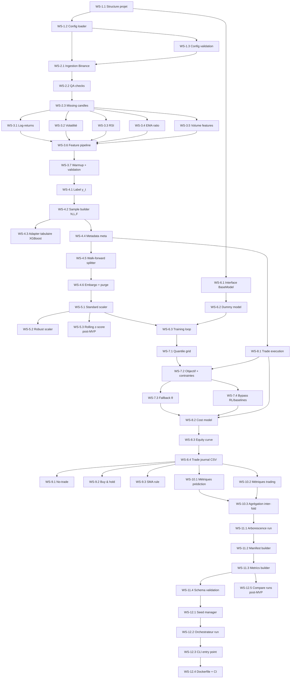

# Plan d'implémentation — Pipeline commun AI Trading

**Référence** : `docs/specifications/Specification_Pipeline_Commun_AI_Trading_v1.0.md` (v1.0 + addendum v1.1 + v1.2)
**Date** : 2026-02-27
**Portée** : pipeline complet (hors implémentation interne des modèles ML/DL)

> Ce plan découpe l'implémentation en **Work Streams (WS)** parallélisables et en **Milestones (M)** séquentiels.
> Chaque tâche est numérotée `WS-X.Y` et peut être convertie en fichier `docs/tasks/`.


## Table des matières

- [Vue d'ensemble](#vue-densemble)
- [Milestones et dépendances](#milestones-et-dépendances)
- [WS-1 — Fondations et configuration](#ws-1--fondations-et-configuration)
- [WS-2 — Ingestion des données et contrôle qualité](#ws-2--ingestion-des-données-et-contrôle-qualité)
- [WS-3 — Feature engineering](#ws-3--feature-engineering)
- [WS-4 — Construction des datasets et splitting walk-forward](#ws-4--construction-des-datasets-et-splitting-walk-forward)
- [WS-5 — Normalisation / scaling](#ws-5--normalisation--scaling)
- [WS-6 — Interface modèle et framework d'entraînement](#ws-6--interface-modèle-et-framework-dentraînement)
- [WS-7 — Calibration du seuil θ (Go/No-Go)](#ws-7--calibration-du-seuil-θ-gono-go)
- [WS-8 — Moteur de backtest](#ws-8--moteur-de-backtest)
- [WS-9 — Baselines](#ws-9--baselines)
- [WS-10 — Métriques et agrégation inter-fold](#ws-10--métriques-et-agrégation-inter-fold)
- [WS-11 — Artefacts, manifest et schémas JSON](#ws-11--artefacts-manifest-et-schémas-json)
- [WS-12 — Reproductibilité et orchestration](#ws-12--reproductibilité-et-orchestration)
- [Arborescence cible du code](#arborescence-cible-du-code)
- [Conventions](#conventions)


## Vue d'ensemble

```mermaid
flowchart LR
  subgraph M1["Milestone 1 — Fondations"]
    WS1[WS-1 Config]
    WS2[WS-2 Data + QA]
  end
  subgraph M2["Milestone 2 — Feature & Data Pipeline"]
    WS3[WS-3 Features]
    WS4[WS-4 Datasets + Split]
    WS5[WS-5 Scaling]
  end
  subgraph M3["Milestone 3 — Training Framework"]
    WS6[WS-6 Interface modèle]
    WS7[WS-7 Calibration θ]
  end
  subgraph M4["Milestone 4 — Evaluation Engine"]
    WS8[WS-8 Backtest]
    WS9[WS-9 Baselines]
    WS10[WS-10 Métriques]
  end
  subgraph M5["Milestone 5 — Production Readiness"]
    WS11[WS-11 Artefacts]
    WS12[WS-12 Reproducibilité + Orchestrateur]
  end
  M1 --> M2 --> M3 --> M4 --> M5
```



| Milestone | Work Streams | Description | Gate |
|---|---|---|---|
| **M1** | WS-1, WS-2 | Config chargeable, données brutes téléchargées et QA passé | Données Parquet validées, config parsée sans erreur |
| **M2** | WS-3, WS-4, WS-5 | Pipeline de features → datasets (N,L,F) → splits walk-forward → scaler | Tenseur X_seq reproductible, splits disjoints vérifiés |
| **M3** | WS-6, WS-7 | Interface plug-in modèle, boucle d'entraînement, calibration θ | Modèle dummy réussit fit/predict/calibration sur données synthétiques |
| **M4** | WS-8, WS-9, WS-10 | Backtest commun, 3 baselines, métriques de prédiction et trading | Métriques cohérentes sur données synthétiques et baselines |
| **M5** | WS-11, WS-12 | Artefacts conformes aux schémas JSON, orchestrateur bout-en-bout, Docker | Run complet reproductible avec manifest.json + metrics.json valides |


## Milestones et dépendances




---


## WS-1 — Fondations et configuration

**Objectif** : mettre en place la structure du projet, le chargement et la validation de la configuration YAML.
**Réf. spec** : §1.3, Annexe E.1, `configs/default.yaml`

### WS-1.1 — Structure du projet et dépendances

| Champ | Valeur |
|---|---|
| **Description** | Créer l'arborescence Python `ai_trading/` (nom du package Python interne — distinct du répertoire racine du repo `ai_trading_agent/`), le `__init__.py`, le `pyproject.toml` ou `setup.py`, et mettre à jour `requirements.txt` avec toutes les dépendances (pandas, numpy, PyYAML, jsonschema, xgboost, torch, etc.). |
| **Réf. spec** | §1 (périmètre), §16 (reproductibilité) |
| **Critères d'acceptation** | `pip install -e .` réussit. `import ai_trading` fonctionne. Linter (ruff/flake8) passe sans erreur. |
| **Dépendances** | Aucune |

### WS-1.2 — Config loader (YAML → dataclass/dict)

| Champ | Valeur |
|---|---|
| **Description** | Implémenter un module `config.py` qui charge `configs/default.yaml` (ou un YAML passé en argument), le fusionne avec les overrides CLI éventuels, et retourne un objet config typé (dataclass ou Pydantic). |
| **Réf. spec** | Annexe E.1 (tous les paramètres MVP) |
| **Critères d'acceptation** | Le config loader supporte : (1) chargement du default, (2) override par fichier custom, (3) override par CLI args. Tous les champs de `configs/default.yaml` sont accessibles par attribut. |
| **Dépendances** | WS-1.1 |

### WS-1.3 — Validation de la configuration

| Champ | Valeur |
|---|---|
| **Description** | Ajouter une validation stricte de la configuration : types, bornes (ex: `embargo_bars >= 0`, `val_frac_in_train ∈ [0, 0.5]`), contraintes croisées (ex: `sma.fast < sma.slow <= min_warmup`), règle MVP `len(symbols) == 1`, et **règles non négociables du backtest** : `backtest.mode == "one_at_a_time"` et `backtest.direction == "long_only"` (§12.1, Annexe E.2.3). Erreur explicite (`raise`) si invalide. |
| **Réf. spec** | Annexe E.2.6 (un seul symbole), §8.1, §12.1, §13.3, Annexe E.2.3 |
| **Critères d'acceptation** | Tests unitaires couvrant : config valide OK, chaque violation levée avec message clair. En particulier : `backtest.mode != "one_at_a_time"` → erreur, `backtest.direction != "long_only"` → erreur. |
| **Dépendances** | WS-1.2 |


---


## WS-2 — Ingestion des données et contrôle qualité

**Objectif** : télécharger les données OHLCV depuis Binance et appliquer les contrôles qualité obligatoires.
**Réf. spec** : §4

### WS-2.1 — Ingestion OHLCV Binance

| Champ | Valeur |
|---|---|
| **Description** | Implémenter un module `data/ingestion.py` qui télécharge les données OHLCV via l'API Binance (ccxt) pour le symbole, timeframe et période configurés. Stockage en Parquet avec colonnes canoniques : `timestamp_utc, open, high, low, close, volume, symbol`. Tri croissant par `timestamp_utc`. Calcul du SHA-256 du fichier pour traçabilité. |
| **Réf. spec** | §4.1 (format canonique) |
| **Critères d'acceptation** | Fichier Parquet généré avec les colonnes attendues. SHA-256 stable sur relance. Tri vérifié par test. |
| **Dépendances** | WS-1.2 (config pour symbole, timeframe, période) |

### WS-2.2 — Contrôles qualité (QA) obligatoires

| Champ | Valeur |
|---|---|
| **Description** | Implémenter un module `data/qa.py` avec les contrôles : (1) régularité temporelle (pas Δ uniforme, pas de doublons), (2) détection des trous (missing candles), (3) détection des outliers (prix négatif, volume nul prolongé, OHLC incohérent : H ≥ max(O,C), L ≤ min(O,C)). Chaque contrôle lève une erreur explicite ou retourne un rapport structuré. |
| **Réf. spec** | §4.2 |
| **Critères d'acceptation** | Tests avec données synthétiques : doublons détectés, trous détectés, outliers détectés. Données propres → QA passe. |
| **Dépendances** | WS-2.1 |

### WS-2.3 — Politique de traitement des trous (missing candles)

| Champ | Valeur |
|---|---|
| **Description** | Implémenter la politique MVP : pas d'interpolation. (1) Détecter les positions des bougies manquantes. (2) Marquer comme invalides tous les samples dont la fenêtre d'entrée `[t-L+1, t]` ou la fenêtre de sortie `[t+1, t+H]` touche un trou. (3) Retourner un masque de validité `valid_mask` de shape `(N,)`. |
| **Réf. spec** | §4.3, §6.6 |
| **Critères d'acceptation** | Test : un trou à l'indice k invalide tous les samples dans `[k-H, k+L-1]`. Masque booléen correct. |
| **Dépendances** | WS-2.2 |


---


## WS-3 — Feature engineering

**Objectif** : calculer les 9 features MVP de manière strictement causale et auditable.
**Réf. spec** : §6

### WS-3.1 — Log-returns (logret_1, logret_2, logret_4)

| Champ | Valeur |
|---|---|
| **Description** | Implémenter les trois log-returns : `logret_k(t) = log(C_t / C_{t-k})` pour k ∈ {1, 2, 4}. Vérifier la causalité : aucune donnée future utilisée. |
| **Réf. spec** | §6.2 |
| **Critères d'acceptation** | Tests sur données synthétiques avec valeurs attendues calculées à la main. NaN aux positions `t < k`. |
| **Dépendances** | WS-2.3 |

### WS-3.2 — Volatilité rolling (vol_24, vol_72)

| Champ | Valeur |
|---|---|
| **Description** | Implémenter `vol_n(t) = std(logret_1[t-n+1..t], ddof=0)` pour n ∈ {24, 72}. Convention `ddof=0` (écart-type population). |
| **Réf. spec** | §6.5 |
| **Critères d'acceptation** | Test numérique : résultat identique à `np.std(..., ddof=0)`. NaN aux positions `t < n`. |
| **Dépendances** | WS-2.3, WS-3.1 (dépend de logret_1) |

### WS-3.3 — RSI (rsi_14, lissage de Wilder)

| Champ | Valeur |
|---|---|
| **Description** | Implémenter le RSI avec lissage de Wilder (n=14, ε=1e-12). Initialisation : moyenne simple sur les n premières valeurs. Cas limites : AL≈0 et AG>0 → 100, AG≈0 et AL>0 → 0, AG=AL=0 → 50. |
| **Réf. spec** | §6.3 |
| **Critères d'acceptation** | Tests numériques sur séries connues. Cas limites couverts. Résultat ∈ [0, 100]. |
| **Dépendances** | WS-2.3 |

### WS-3.4 — EMA ratio (ema_ratio_12_26)

| Champ | Valeur |
|---|---|
| **Description** | Implémenter EMA_n avec α = 2/(n+1). Initialisation : moyenne simple sur les n premières clôtures. Feature = EMA_12 / EMA_26 - 1. |
| **Réf. spec** | §6.4 |
| **Critères d'acceptation** | Tests numériques. Vérifier convergence sur séries constantes (ratio = 0). |
| **Dépendances** | WS-2.3 |

### WS-3.5 — Features de volume (logvol, dlogvol)

| Champ | Valeur |
|---|---|
| **Description** | `logvol(t) = log(V_t + ε)` avec ε=1e-8. `dlogvol(t) = logvol(t) - logvol(t-1)`. |
| **Réf. spec** | §6.2 |
| **Critères d'acceptation** | Tests : volume nul → logvol ≈ log(ε). dlogvol NaN à t=0. |
| **Dépendances** | WS-2.3 |

### WS-3.6 — Feature pipeline (assemblage)

| Champ | Valeur |
|---|---|
| **Description** | Module `features/pipeline.py` qui orchestre le calcul de toutes les features dans l'ordre canonique de `feature_list` configuré. Retourne un DataFrame avec colonnes = features, index = timestamps. Vérifie que toutes les features demandées sont implémentées (erreur sinon). |
| **Réf. spec** | §6.2, Annexe E.1 (`features.feature_list`) |
| **Critères d'acceptation** | Le pipeline produit un DataFrame (N_total, F=9) avec les bonnes colonnes. Feature_version tracée. |
| **Dépendances** | WS-3.1 → WS-3.5 |

### WS-3.7 — Warmup et validation de causalité

| Champ | Valeur |
|---|---|
| **Description** | (1) Appliquer `min_warmup` : invalider les `min_warmup` premières bougies. (2) Audit de causalité automatisé : vérifier qu'aucune feature à t ne contient de NaN interne (hors zone warmup). (3) Combiner avec le `valid_mask` de WS-2.3 pour produire le masque final. |
| **Réf. spec** | §6.6 |
| **Critères d'acceptation** | Masque correct. Les `min_warmup` premières lignes sont exclues. Test d'absence de NaN dans la zone valide. |
| **Dépendances** | WS-3.6, WS-2.3 |


---


## WS-4 — Construction des datasets et splitting walk-forward

**Objectif** : construire les tenseurs (N,L,F), les labels, les métadonnées, et le splitter walk-forward avec embargo.
**Réf. spec** : §5, §7, §8

### WS-4.1 — Calcul de la cible y_t

| Champ | Valeur |
|---|---|
| **Description** | Implémenter les deux variantes de label : (1) `log_return_trade` : `y_t = log(Close[t+H] / Open[t+1])`. (2) `log_return_close_to_close` : `y_t = log(Close[t+H] / Close[t])`. Le choix est piloté par `config.label.target_type`. Invalider le sample si `t+1` ou `t+H` est un trou. |
| **Réf. spec** | §5.1, §5.2, §5.3 |
| **Critères d'acceptation** | Valeurs numériques correctes sur données synthétiques. Test : changement de `target_type` → valeurs différentes. Samples invalides correctement masqués. |
| **Dépendances** | WS-3.7 |

### WS-4.2 — Sample builder (N, L, F)

| Champ | Valeur |
|---|---|
| **Description** | Module `data/dataset.py` : pour chaque timestamp de décision t valide, construire la matrice X_t ∈ R^{L×F} (fenêtre [t-L+1, ..., t]). Produire le tenseur `X_seq` de shape (N, L, F), `y` de shape (N,), et un index de timestamps. N = nombre de samples valides. |
| **Réf. spec** | §7.1 |
| **Critères d'acceptation** | Shape correcte. Pas de NaN dans X_seq ni y pour les samples valides. Test : N < N_total (warmup + trous éliminés). |
| **Dépendances** | WS-4.1 |

### WS-4.3 — Adapter tabulaire pour XGBoost

| Champ | Valeur |
|---|---|
| **Description** | Fonction `flatten_seq_to_tab(X_seq) -> X_tab` qui aplatit (N, L, F) → (N, L*F) par concaténation temporelle. Nommage des colonnes : `{feature}_{lag}`. |
| **Réf. spec** | §7.2 |
| **Critères d'acceptation** | Shape `(N, L*F)` correcte (ex : avec L=128, F=9 → 1152 colonnes). Nommage des colonnes `{feature}_{lag}`. Valeurs identiques à X_seq réarrangé. |
| **Dépendances** | WS-4.2 |

### WS-4.4 — Métadonnées d'exécution (meta)

| Champ | Valeur |
|---|---|
| **Description** | Pour chaque sample t, stocker : `decision_time`, `entry_time` (open t+1), `exit_time` (close t+H), `entry_price` (Open[t+1]), `exit_price` (Close[t+H]). Retourner un DataFrame `meta` de shape (N, 5+). |
| **Réf. spec** | §7.3 |
| **Critères d'acceptation** | Les prix sont ceux des bonnes bougies. Test de cohérence : `y_t ≈ log(exit_price / entry_price)` pour target_type = `log_return_trade`. |
| **Dépendances** | WS-4.2 |

### WS-4.5 — Walk-forward splitter

| Champ | Valeur |
|---|---|
| **Description** | Module `data/splitter.py`. Implémenter le rolling walk-forward : (1) pour chaque fold k, calculer les bornes temporelles `train_start, train_end, val_start, val_end, test_start, test_end` en jours. (2) Extraire les indices de samples correspondants. (3) Le val est le dernier `val_frac_in_train` du train (sub-split temporel). (4) Retourner un itérateur de folds avec indices ou masques. |
| **Réf. spec** | §8.1, §8.3, Annexe E.2.1 |
| **Critères d'acceptation** | Folds disjoints (aucun timestamp commun). Nombre de folds calculable : `n_folds = floor((total_days - train_days - test_days) / step_days) + 1`. Si `test_days == step_days` (cas MVP), cela se simplifie en `floor((total_days - train_days) / step_days)`. Bornes UTC enregistrées. **Test de bord** : vérifier que la période test du dernier fold ne dépasse pas `dataset.end`, et que la formule reste correcte lorsque la période totale n'est pas un multiple exact de `step_days`. |
| **Dépendances** | WS-4.2 |

### WS-4.6 — Embargo et purge

| Champ | Valeur |
|---|---|
| **Description** | Appliquer la règle de purge exacte de §8.2 : (1) définir `train_end_purged = test_start − embargo_bars`, (2) un sample t est autorisé dans train/val si et seulement si `t + H <= train_end_purged`. Supprimer les samples de la zone tampon entre val et test. Vérifier la disjonction stricte par test automatisé. **Attention** : l'embargo est appliqué une seule fois (entre fin de val et début de test), pas en double. |
| **Réf. spec** | §8.2, §8.4 |
| **Critères d'acceptation** | Test : aucun label du train ne dépend d'un prix dans la zone test. Gap d'au moins `embargo_bars` bougies vérifié. Test : la formule `t + H <= test_start − embargo_bars` est respectée pour tout sample t du train/val. |
| **Dépendances** | WS-4.5 |


---


## WS-5 — Normalisation / scaling

**Objectif** : normaliser les features sans fuite d'information (fit sur train uniquement).
**Réf. spec** : §9

### WS-5.1 — Standard scaler (fit-on-train)

| Champ | Valeur |
|---|---|
| **Description** | Module `data/scaler.py`. Implémenter le standard scaler : (1) estimer μ_j et σ_j sur l'ensemble des N_train × L valeurs du train pour chaque feature j, (2) transformer train/val/test avec `(x - μ) / (σ + ε)`. Un seul scaler global par feature (§ E.2.7). Sauvegarder les paramètres pour reproductibilité. |
| **Réf. spec** | §9.1, Annexe E.2.7 |
| **Critères d'acceptation** | Stats estimées uniquement sur train (test non vu). Test : la moyenne du train transformé ≈ 0. Paramètres sérialisables. |
| **Dépendances** | WS-4.6 |

### WS-5.2 — Robust scaler (option)

| Champ | Valeur |
|---|---|
| **Description** | Implémenter en option : centrage par médiane, échelle par IQR (fit sur train). Clipping/winsorization aux quantiles configurés (`robust_quantile_low`, `robust_quantile_high`). Activé par `config.scaling.method = robust`. |
| **Réf. spec** | §9.2 |
| **Critères d'acceptation** | Test : outliers extrêmes clippés. Stats estimées sur train uniquement. |
| **Dépendances** | WS-5.1 (même interface) |

### WS-5.3 — Rolling z-score (post-MVP)

| Champ | Valeur |
|---|---|
| **Description** | Implémenter l'option rolling z-score causal : `z_t = (x_t - mean(x[t-W..t-1])) / (std(x[t-W..t-1]) + ε)` où W = `config.scaling.rolling_window` (default 720). Activé par `config.scaling.method = rolling_zscore`. Contraintes : (1) estimation strictement causale (pas de fenêtres centrées), (2) frontières train/val/test traitées séquentiellement sans regarder le futur, (3) appliqué de manière identique à tous les modèles. |
| **Réf. spec** | §9.3 |
| **Critères d'acceptation** | Test : le z-score à t n'utilise aucune valeur > t. Stats identiques à `np.mean` / `np.std` sur la fenêtre `[t-W, t-1]`. NaN correct pour `t < W`. Même résultat qu'un calcul pandas rolling. |
| **Dépendances** | WS-5.1 (même interface) |
| **Priorité** | **Post-MVP** — désactivé par défaut (`config.scaling.method = standard`). |


---


## WS-6 — Interface modèle et framework d'entraînement

**Objectif** : définir le contrat d'interface pour les modèles plug-in et la boucle d'entraînement commune.
**Réf. spec** : §10

> **Note** : l'implémentation interne des modèles (XGBoost, CNN, GRU, LSTM, PatchTST, RL-PPO) est **hors scope** de ce plan. Seule l'interface et le framework d'entraînement sont couverts.

### WS-6.1 — Interface abstraite BaseModel

| Champ | Valeur |
|---|---|
| **Description** | Classe abstraite `models/base.py` : `BaseModel` avec méthodes `fit(X_train, y_train, X_val, y_val, config, run_dir) -> artifacts`, `predict(X) -> y_hat`, `save(path)`, `load(path)`. Conventions d'entrée/sortie : X_seq (N,L,F), y (N,), y_hat (N,). Documentation du contrat pour le cas RL (predict retourne actions binaires). |
| **Réf. spec** | §10.1, §10.2 |
| **Critères d'acceptation** | Classe abstraite importable. Les modèles qui n'implémentent pas les méthodes lèvent `NotImplementedError`. |
| **Dépendances** | WS-1.1 |

### WS-6.2 — Dummy model (pour tests d'intégration)

| Champ | Valeur |
|---|---|
| **Description** | Implémenter un `DummyModel(BaseModel)` qui retourne des prédictions aléatoires (seed fixée) ou une constante. Utilisé pour valider le pipeline de bout en bout avant d'intégrer les vrais modèles. |
| **Réf. spec** | §10 |
| **Critères d'acceptation** | `DummyModel` passe fit/predict/save/load. Prédictions reproductibles avec seed fixée. |
| **Dépendances** | WS-6.1 |

### WS-6.3 — Training loop et early stopping

| Champ | Valeur |
|---|---|
| **Description** | Module `training/trainer.py`. Boucle d'entraînement générique : (1) appeler `model.fit()` avec early stopping sur loss validation (patience configurable). (2) Logger loss train/val, best_epoch. (3) Pas de logique spécifique au modèle dans le trainer. (4) Gérer le cas RL (bypass possible du trainer standard si le modèle gère son propre loop d'entraînement). |
| **Réf. spec** | §10.3 |
| **Critères d'acceptation** | Early stopping fonctionnel avec DummyModel. Logs de loss exportés. Patience configurable. |
| **Dépendances** | WS-6.2, WS-5.1 |


---


## WS-7 — Calibration du seuil θ (Go/No-Go)

**Objectif** : calibrer le seuil θ sur validation pour convertir les prédictions en décisions Go/No-Go.
**Réf. spec** : §11

### WS-7.1 — Grille de quantiles

| Champ | Valeur |
|---|---|
| **Description** | Module `calibration/threshold.py`. Pour un vecteur de prédictions `y_hat_val`, calculer θ(q) = quantile_q(y_hat_val) pour chaque q dans `config.thresholding.q_grid`. |
| **Réf. spec** | §11.2 |
| **Critères d'acceptation** | Pour q=0.5, θ ≈ médiane. Tests numériques. |
| **Dépendances** | WS-6.3 (pour obtenir y_hat_val) |

### WS-7.2 — Objectif d'optimisation et contraintes

| Champ | Valeur |
|---|---|
| **Description** | Pour chaque θ candidat : (1) générer les signaux Go/No-Go sur validation, (2) exécuter le backtest sur validation (réutiliser WS-8), (3) calculer les métriques. Retenir le θ qui maximise `net_pnl` sous contraintes `MDD <= mdd_cap` ET `n_trades >= min_trades`. En cas d'ex-aequo, préférer le quantile le plus haut (conservateur). |
| **Réf. spec** | §11.3 |
| **Critères d'acceptation** | Le θ retenu respecte les contraintes. Test : données où un seul θ est faisable → sélection correcte. |
| **Dépendances** | WS-7.1, WS-8.1 (backtest nécessaire pour évaluer les θ) |

### WS-7.3 — Fallback θ (aucun quantile valide)

| Champ | Valeur |
|---|---|
| **Description** | Implémenter la logique de fallback (Annexe E.2.2) : (1) relâcher `min_trades` à 0, (2) si aucun θ ne respecte MDD → θ = +∞ (no-trade pour ce fold), (3) émettre un warning loggé, (4) le fold est conservé avec n_trades=0 et PnL=0. |
| **Réf. spec** | Annexe E.2.2 |
| **Critères d'acceptation** | Test du cas fallback. Warning émis. Fold présent dans les métriques avec valeurs nulles. |
| **Dépendances** | WS-7.2 |

### WS-7.4 — Bypass RL et baselines

| Champ | Valeur |
|---|---|
| **Description** | La calibration θ est **bypassée** pour : (1) le modèle RL (§11.5) → `threshold.method = "none"`, `theta = null`, (2) les baselines (§11.4) → signaux directs sans seuil, sauf SMA paramétré explicitement. |
| **Réf. spec** | §11.4, §11.5 |
| **Critères d'acceptation** | Test : le pipeline détecte `strategy_type = baseline` ou `name = rl_ppo` et skip la calibration. |
| **Dépendances** | WS-7.2 |


---


## WS-8 — Moteur de backtest

**Objectif** : simuler l'exécution des trades, appliquer les coûts, et produire la courbe d'équité.
**Réf. spec** : §12

### WS-8.1 — Règles d'exécution des trades

| Champ | Valeur |
|---|---|
| **Description** | Module `backtest/engine.py`. Implémenter les règles : (1) Go à t → entrée long à Open[t+1], (2) sortie à Close[t+H], (3) mode `one_at_a_time` (nouveau Go ignoré si trade actif, cf. E.2.3), (4) long-only (pas de short). Le moteur prend en entrée un vecteur de signaux (0/1) et les métadonnées `meta`. |
| **Réf. spec** | §12.1, Annexe E.2.3 |
| **Critères d'acceptation** | Test : signal Go pendant trade actif → ignoré. Entrée/sortie aux bons prix et timestamps. |
| **Dépendances** | WS-4.4 (meta avec prix) |

### WS-8.2 — Modèle de coûts

| Champ | Valeur |
|---|---|
| **Description** | Implémenter le modèle multiplicatif per-side : `p_entry_eff = Open[t+1] * (1+s)`, `p_exit_eff = Close[t+H] * (1-s)`, `M_net = (1-f)^2 * (p_exit_eff / p_entry_eff)`, `r_net = M_net - 1`. |
| **Réf. spec** | §12.2, §12.3 |
| **Critères d'acceptation** | Test numérique : calcul à la main vs implémentation. Coûts symétriques (achat et vente). |
| **Dépendances** | WS-8.1 |

### WS-8.3 — Courbe d'équité

| Champ | Valeur |
|---|---|
| **Description** | Construire la courbe d'équité normalisée (E_0 = 1.0). En mode `one_at_a_time` : `E_exit = E_entry * (1 + w * r_net)` où `w = config.backtest.position_fraction` (§12.4). Dans le MVP, w = 1.0 (all-in). Hors trade : équité constante. Résolution par bougie (pas par trade). |
| **Réf. spec** | §12.4, Annexe E.2.8 (`equity_curve.csv`) |
| **Critères d'acceptation** | Courbe constante entre les trades (équité inchangée hors position). E final = produit des (1 + w * r_net_i). Format CSV conforme (time_utc, equity, in_trade). Test : avec w < 1.0, l'impact d'un trade est réduit proportionnellement. |
| **Dépendances** | WS-8.2 |

### WS-8.4 — Journal de trades (trades.csv)

| Champ | Valeur |
|---|---|
| **Description** | Exporter chaque trade avec : `entry_time_utc, exit_time_utc, entry_price, exit_price, entry_price_eff, exit_price_eff, f, s, fees_paid, slippage_paid, y_true, y_hat, gross_return, net_return`. |
| **Réf. spec** | §12.6 |
| **Critères d'acceptation** | CSV parseable. Somme des net_return cohérente avec l'équité finale. Colonnes conformes. |
| **Dépendances** | WS-8.3 |


---


## WS-9 — Baselines

**Objectif** : implémenter les 3 baselines une seule fois dans un module réutilisable.
**Réf. spec** : §13

### WS-9.1 — Baseline no-trade

| Champ | Valeur |
|---|---|
| **Description** | Module `baselines/no_trade.py`. Aucun trade. Équité constante E_t = 1.0. Métriques : net_pnl = 0, n_trades = 0, MDD = 0. |
| **Réf. spec** | §13.1 |
| **Critères d'acceptation** | Résultat trivial vérifié par test. |
| **Dépendances** | WS-8.1 |

### WS-9.2 — Baseline buy & hold

| Champ | Valeur |
|---|---|
| **Description** | Module `baselines/buy_hold.py`. Un seul trade : entrée au début du test (Open 1er timestamp), sortie à la fin (Close dernier timestamp). Coûts (f, s) appliqués une fois à l'entrée et une fois à la sortie. |
| **Réf. spec** | §12.5, §13.2 |
| **Critères d'acceptation** | Test : net_return cohérent avec le calcul (1-f)^2 * Close_end*(1-s) / (Open_start*(1+s)) - 1. n_trades = 1. |
| **Dépendances** | WS-8.2 |

### WS-9.3 — Baseline SMA rule (Go/No-Go)

| Champ | Valeur |
|---|---|
| **Description** | Module `baselines/sma_rule.py`. Calculer SMA_fast et SMA_slow sur toutes les clôtures disponibles causalement (E.2.4). Signal Go si SMA_fast > SMA_slow. Soumettre les signaux au backtest commun. Les premières décisions où SMA_slow n'est pas définie → No-Go. |
| **Réf. spec** | §13.3, Annexe E.2.4 |
| **Critères d'acceptation** | Paramètres fast=20, slow=50 par défaut. Test : signal correct sur séries synthétiques (tendance haussière → Go, baissière → No-Go). Utilise le backtest commun. |
| **Dépendances** | WS-8.1 |


---


## WS-10 — Métriques et agrégation inter-fold

**Objectif** : calculer les métriques de prédiction et de trading, puis agréger sur les folds.
**Réf. spec** : §14

### WS-10.1 — Métriques de prédiction

| Champ | Valeur |
|---|---|
| **Description** | Module `metrics/prediction.py`. Calculer sur la période test de chaque fold : MAE, RMSE, Directional Accuracy, Spearman IC (optionnel). Pour le modèle RL : toutes les métriques de prédiction → `null`. |
| **Réf. spec** | §14.1, §11.5 |
| **Critères d'acceptation** | Tests numériques sur vecteurs connus. DA ∈ [0,1]. RL → null values. |
| **Dépendances** | WS-6.3 (prédictions), WS-4.1 (labels) |

### WS-10.2 — Métriques de trading

| Champ | Valeur |
|---|---|
| **Description** | Module `metrics/trading.py`. À partir de la courbe d'équité et de trades.csv : net_pnl, net_return, max_drawdown, Sharpe (non annualisé par défaut), profit_factor, hit_rate, n_trades, avg_trade_return, median_trade_return, exposure_time_frac. Cas limites du profit_factor (Annexe E.2.5). |
| **Réf. spec** | §14.2, Annexe E.2.5 |
| **Critères d'acceptation** | Tests numériques. Cas : 0 trades → profit_factor = null. Que des gagnants → null. Que des perdants → 0.0. MDD ∈ [0,1]. |
| **Dépendances** | WS-8.3, WS-8.4 |

### WS-10.3 — Agrégation inter-fold et vérification des critères d'acceptation

| Champ | Valeur |
|---|---|
| **Description** | Module `metrics/aggregation.py`. Pour chaque métrique m : calculer `mean(m)` et `std(m)` sur tous les folds test. Optionnel : courbe d'équité stitchée (concaténation chronologique des périodes test). Optionnel : export `summary_metrics.csv` (tableau flat des métriques agrégées, artefact optionnel post-MVP, cf. §15.1). **Vérification des critères d'acceptation §14.4** : après agrégation, émettre des warnings si `net_pnl_mean <= 0`, `profit_factor_mean <= 1.0`, ou `max_drawdown_mean >= mdd_cap`. Ces avertissements sont informatifs (le run ne crashe pas) mais sont enregistrés dans les logs et dans le champ `aggregate.notes` du `metrics.json`. **Note §14.4 — comparaison inter-stratégies** : le critère « le meilleur modèle bat au moins une baseline » est un critère **cross-run** qui ne peut être vérifié automatiquement à l'intérieur d'un seul run. Il doit être évalué via le script `scripts/compare_runs.py` (cf. WS-12.5) après l'exécution de tous les runs (modèles + baselines). **Distinction §13.4 — types de comparaison** : le module doit étiqueter les métriques agrégées avec `comparison_type` = `go_nogo` (modèles, SMA, no-trade) ou `contextual` (buy & hold) afin de séparer la comparaison « pomme-à-pomme » (mêmes décisions Go/No-Go à horizon H) de la comparaison contextuelle (position continue). Le rapport final (`summary_metrics.csv` et `aggregate.notes`) doit refléter cette distinction. **Note schéma** : le champ `comparison_type` n'est pas structurel dans `metrics.schema.json` ; il doit être inclus en texte libre dans le champ `aggregate.notes` (conforme au schéma actuel) et dans le fichier `summary_metrics.csv` (post-MVP). |
| **Réf. spec** | §14.3, §14.4 |
| **Critères d'acceptation** | Test avec 3 folds synthétiques → mean et std corrects. Conforme à la structure `aggregate` du schéma metrics.schema.json. Test : avertissement émis si `net_pnl_mean <= 0`. |
| **Dépendances** | WS-10.1, WS-10.2 |


---


## WS-11 — Artefacts, manifest et schémas JSON

**Objectif** : produire les artefacts de sortie conformes aux schémas JSON, dans l'arborescence canonique.
**Réf. spec** : §15

### WS-11.1 — Arborescence du run

| Champ | Valeur |
|---|---|
| **Description** | Module `artifacts/run_dir.py`. Créer l'arborescence : `runs/<run_id>/manifest.json`, `metrics.json`, `config_snapshot.yaml`, `folds/fold_XX/` avec sous-fichiers. Le `run_id` suit la convention `YYYYMMDD_HHMMSS_<strategy>`. **Note** : la génération de `report.html` / `report.pdf` (mentionnée dans §15.1 comme optionnelle) est reportée post-MVP. |
| **Réf. spec** | §15.1 |
| **Critères d'acceptation** | Structure de dossiers conforme. Pas de fichier manquant (hors report.html/pdf, post-MVP). |
| **Dépendances** | WS-1.2 (config pour output_dir) |

### WS-11.2 — Manifest builder

| Champ | Valeur |
|---|---|
| **Description** | Module `artifacts/manifest.py`. Construire le `manifest.json` à partir de la config, des métadonnées dataset (SHA-256), des splits (bornes par fold), de la stratégie, des coûts, de l'environnement (python_version, platform, packages), du **commit Git** courant (`git_commit`, obtenu via `git rev-parse HEAD` ou `subprocess`), et de la liste des artefacts. **Important** : la période `train` de chaque fold dans le manifest correspond à `train_only` (sans la portion val), conformément à la convention E.2.1. |
| **Réf. spec** | §15.2, Annexe A (schéma), Annexe E.2.1 |
| **Critères d'acceptation** | Le JSON produit est valide contre `manifest.schema.json`. Test d'intégration avec `jsonschema.validate()`. Test : la période `train` de chaque fold exclut la période `val` (bornes disjointes, cf. E.2.1). Test : le champ `git_commit` est présent et contient un hash hexadécimal valide (ou une valeur explicite `"unknown"` si non disponible). |
| **Dépendances** | WS-11.1, WS-4.5 (splits), WS-2.1 (SHA-256) |

### WS-11.3 — Metrics builder

| Champ | Valeur |
|---|---|
| **Description** | Module `artifacts/metrics_builder.py`. Construire le `metrics.json` avec : strategy, folds (par fold : period_test, threshold, prediction, trading), aggregate (mean/std). **En outre**, produire un fichier `metrics_fold.json` dans chaque répertoire `folds/fold_XX/` (conformément à l'arborescence §15.1 et au schéma manifest `per_fold.files.metrics_fold_json`). Ce fichier contient les métriques du fold individuel (même structure que l'objet fold dans `metrics.json`). |
| **Réf. spec** | §15.3, Annexe B (schéma) |
| **Critères d'acceptation** | Le JSON produit est valide contre `metrics.schema.json`. Test d'intégration. Chaque `folds/fold_XX/metrics_fold.json` est généré et cohérent avec l'entrée correspondante dans le `metrics.json` global. |
| **Dépendances** | WS-10.3, WS-7.2 |

### WS-11.4 — Validation des schémas JSON

| Champ | Valeur |
|---|---|
| **Description** | Fonction `validate_manifest(data)` et `validate_metrics(data)` utilisant `jsonschema` (Draft 2020-12) avec les schémas fournis (`manifest.schema.json`, `metrics.schema.json`). Appelée systématiquement en fin de run. Erreur explicite si invalide. |
| **Réf. spec** | §15.4 |
| **Critères d'acceptation** | Exemples fournis (example_manifest.json, example_metrics.json) passent la validation. Tests de violation (champ manquant) → erreur. |
| **Dépendances** | WS-11.2, WS-11.3 |


---


## WS-12 — Reproductibilité et orchestration

**Objectif** : garantir la reproductibilité totale et fournir un point d'entrée unique pour lancer un run.
**Réf. spec** : §16, §3

### WS-12.1 — Seed manager

| Champ | Valeur |
|---|---|
| **Description** | Module `utils/seed.py`. Fixer la seed globale pour : `random`, `numpy`, `torch` (si installé), `os.environ['PYTHONHASHSEED']`. Option `deterministic_torch` pour `torch.use_deterministic_algorithms(True)`. Appelé une seule fois au début du run. |
| **Réf. spec** | §16.1 |
| **Critères d'acceptation** | Deux runs avec même seed → même résultat (test d'intégration). |
| **Dépendances** | WS-1.2 |

### WS-12.2 — Orchestrateur de run

| Champ | Valeur |
|---|---|
| **Description** | Module `pipeline/runner.py`. Orchestrer le pipeline complet : (1) charger config, (2) fixer seed, (3) ingestion + QA, (4) features, (5) dataset, (6) pour chaque fold : split → scale → train → predict val → calibrer θ → predict test → backtest → métriques, (7) agréger inter-fold avec vérification §14.4, (8) écrire artefacts (manifest, metrics, CSVs). Gestion du cas baselines (skip train/calibration). |
| **Réf. spec** | §3 (dataflow), §14.4, tout le pipeline |
| **Critères d'acceptation** | Run complet avec DummyModel → arborescence correcte, JSON valides, métriques non nulles. Warnings §14.4 émis si seuils dépassés. |
| **Dépendances** | Tous les WS précédents |

### WS-12.3 — CLI entry point

| Champ | Valeur |
|---|---|
| **Description** | Script `scripts/run_pipeline.py` (ou CLI via `__main__.py`). Arguments : `--config`, `--strategy`, `--output-dir`, overrides divers. Logging structuré (level INFO par défaut). |
| **Réf. spec** | §16.2 |
| **Critères d'acceptation** | `python -m ai_trading --config configs/default.yaml` lance un run complet. Help (`--help`) lisible. |
| **Dépendances** | WS-12.2 |

### WS-12.4 — Dockerfile et CI

| Champ | Valeur |
|---|---|
| **Description** | Mettre à jour le `Dockerfile` existant pour : (1) installer toutes les dépendances, (2) copier le code, (3) `CMD` qui lance le pipeline. Ajouter un workflow CI minimal (GitHub Actions) : lint + tests unitaires. |
| **Réf. spec** | §16 (reproductibilité, Dockerfile) |
| **Critères d'acceptation** | `docker build` + `docker run` exécutent un run complet. CI passe sur push. |
| **Dépendances** | WS-12.3 |

### WS-12.5 — Script de comparaison inter-stratégies (post-MVP)

| Champ | Valeur |
|---|---|
| **Description** | Script `scripts/compare_runs.py`. Charge les `metrics.json` de plusieurs runs (modèles + baselines), produit un tableau comparatif et vérifie le critère §14.4 : « le meilleur modèle bat au moins une baseline (no-trade et/ou buy & hold) en P&L net ou MDD ». **Distinction §13.4** : le script sépare explicitement (1) la comparaison « pomme-à-pomme » entre stratégies Go/No-Go (modèles, SMA, no-trade) et (2) la comparaison contextuelle avec buy & hold. Le résultat est un tableau CSV et/ou un rapport Markdown. |
| **Réf. spec** | §13.4, §14.4 |
| **Critères d'acceptation** | Test : avec 2+ fichiers `metrics.json` synthétiques, le script identifie correctement la meilleure stratégie et vérifie le critère §14.4. Les deux types de comparaison (Go/No-Go vs contextuelle) sont clairement séparés dans la sortie. |
| **Dépendances** | WS-11.3 (metrics.json produits) |
| **Priorité** | **Post-MVP** — exécuté manuellement après tous les runs. |


---


## Arborescence cible du code

```
ai_trading_agent/
├── configs/
│   └── default.yaml
├── docs/
│   ├── plan/
│   │   └── implementation.md          ← ce fichier
│   └── specifications/
│       ├── Specification_Pipeline_Commun_AI_Trading_v1.0.md
│       ├── manifest.schema.json
│       ├── metrics.schema.json
│       ├── example_manifest.json
│       └── example_metrics.json
├── ai_trading/                         ← package principal
│   ├── __init__.py
│   ├── config.py                       # WS-1.2, WS-1.3
│   ├── data/
│   │   ├── __init__.py
│   │   ├── ingestion.py                # WS-2.1
│   │   ├── qa.py                       # WS-2.2, WS-2.3
│   │   ├── dataset.py                  # WS-4.1, WS-4.2, WS-4.3, WS-4.4
│   │   ├── splitter.py                 # WS-4.5, WS-4.6
│   │   └── scaler.py                   # WS-5.1, WS-5.2, WS-5.3
│   ├── features/
│   │   ├── __init__.py
│   │   ├── log_returns.py              # WS-3.1
│   │   ├── volatility.py               # WS-3.2
│   │   ├── rsi.py                      # WS-3.3
│   │   ├── ema.py                      # WS-3.4
│   │   ├── volume.py                   # WS-3.5
│   │   └── pipeline.py                 # WS-3.6, WS-3.7
│   ├── models/
│   │   ├── __init__.py
│   │   ├── base.py                     # WS-6.1
│   │   └── dummy.py                    # WS-6.2
│   ├── training/
│   │   ├── __init__.py
│   │   └── trainer.py                  # WS-6.3
│   ├── calibration/
│   │   ├── __init__.py
│   │   └── threshold.py                # WS-7.1, WS-7.2, WS-7.3, WS-7.4
│   ├── backtest/
│   │   ├── __init__.py
│   │   └── engine.py                   # WS-8.1, WS-8.2, WS-8.3, WS-8.4
│   ├── baselines/
│   │   ├── __init__.py
│   │   ├── no_trade.py                 # WS-9.1
│   │   ├── buy_hold.py                 # WS-9.2
│   │   └── sma_rule.py                 # WS-9.3
│   ├── metrics/
│   │   ├── __init__.py
│   │   ├── prediction.py               # WS-10.1
│   │   ├── trading.py                  # WS-10.2
│   │   └── aggregation.py              # WS-10.3
│   ├── artifacts/
│   │   ├── __init__.py
│   │   ├── run_dir.py                  # WS-11.1
│   │   ├── manifest.py                 # WS-11.2
│   │   ├── metrics_builder.py          # WS-11.3
│   │   └── schema_validator.py         # WS-11.4
│   ├── utils/
│   │   ├── __init__.py
│   │   └── seed.py                     # WS-12.1
│   └── pipeline/
│       ├── __init__.py
│       └── runner.py                   # WS-12.2
├── scripts/
│   ├── run_pipeline.py                 # WS-12.3
│   └── compare_runs.py                 # WS-12.5 (post-MVP)
├── tests/
│   ├── test_config.py
│   ├── test_ingestion.py
│   ├── test_qa.py
│   ├── test_features.py
│   ├── test_dataset.py
│   ├── test_splitter.py
│   ├── test_scaler.py
│   ├── test_trainer.py
│   ├── test_threshold.py
│   ├── test_backtest.py
│   ├── test_baselines.py
│   ├── test_metrics.py
│   ├── test_artifacts.py
│   └── test_integration.py
├── Dockerfile                          # WS-12.4
├── requirements.txt
└── README.md
```


## Conventions

| Règle | Détail |
|---|---|
| **Langue code** | Anglais (noms de variables, fonctions, classes, docstrings) |
| **Langue docs** | Français (docs/, tâches, plan) |
| **Style** | snake_case, PEP 8, imports explicites (pas de `*`) |
| **Tests** | pytest, un fichier par module, TDD encouragé (RED → GREEN → REFACTOR) |
| **Strict code** | Aucun fallback silencieux, `raise` explicite en cas d'erreur, pas d'`except` trop large |
| **Anti-fuite** | Toute donnée future inaccessible à t. Scaler fit sur train uniquement. Embargo respecté. |
| **Reproductibilité** | Seed fixée, SHA-256 des données, config versionée, environnement tracé |
| **Artefacts** | JSON conformes aux schémas, validés par `jsonschema` en fin de run |
| **Config** | Tout paramètre modifiable dans `configs/default.yaml`, jamais hardcodé dans le code |
