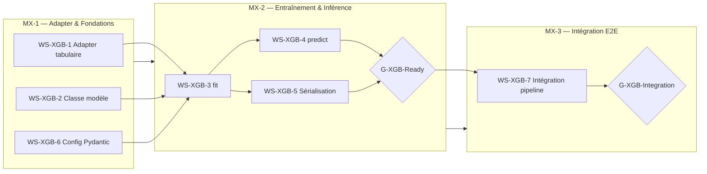
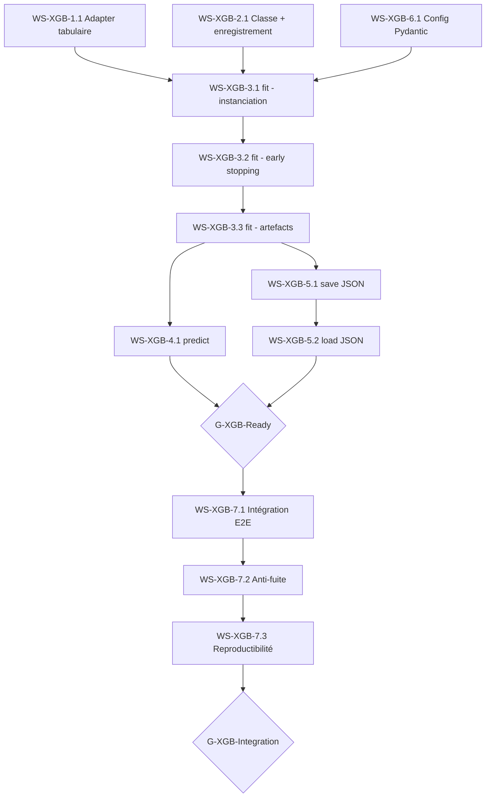
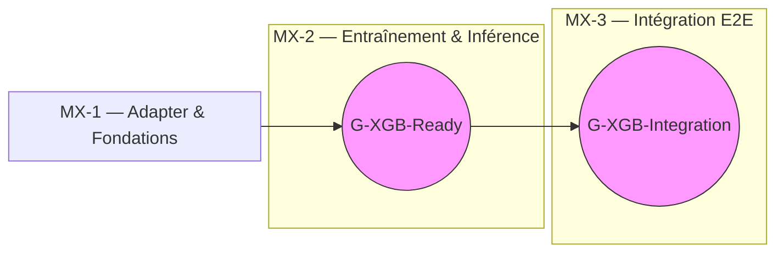

# Plan d'implémentation — Modèle XGBoost (Régression)

**Référence spec modèle** : `docs/specifications/models/Specification_Modele_XGBoost_v1.0.md`
**Référence spec pipeline** : `docs/specifications/Specification_Pipeline_Commun_AI_Trading_v1.0.md` (v1.0 + addendum v1.1 + v1.2)
**Référence plan pipeline** : `docs/plan/implementation.md`
**Date** : 2026-03-03
**Portée** : implémentation du plug-in modèle `xgboost_reg` dans le pipeline commun

> Ce plan découpe l'implémentation du modèle XGBoost en **Work Streams (WS-XGB)** séquentiels.
> Chaque tâche est numérotée `WS-XGB-X.Y` et peut être convertie en fichier `docs/tasks/`.
> Le pipeline commun (WS-1 à WS-13) est un prérequis : ce plan ne couvre que le code spécifique au modèle XGBoost.


## Table des matières

- [Vue d'ensemble](#vue-densemble)
- [Prérequis pipeline](#prérequis-pipeline)
- [Cadre de Gates (Go/No-Go)](#cadre-de-gates-gono-go)
- [Milestones et dépendances](#milestones-et-dépendances)
- [WS-XGB-1 — Adapter tabulaire](#ws-xgb-1--adapter-tabulaire)
- [WS-XGB-2 — Classe modèle XGBoost](#ws-xgb-2--classe-modèle-xgboost)
- [WS-XGB-3 — Entraînement (fit)](#ws-xgb-3--entraînement-fit)
- [WS-XGB-4 — Inférence (predict)](#ws-xgb-4--inférence-predict)
- [WS-XGB-5 — Sérialisation (save / load)](#ws-xgb-5--sérialisation-save--load)
- [WS-XGB-6 — Configuration et validation Pydantic](#ws-xgb-6--configuration-et-validation-pydantic)
- [WS-XGB-7 — Intégration pipeline et tests E2E](#ws-xgb-7--intégration-pipeline-et-tests-e2e)
- [Arborescence cible](#arborescence-cible)
- [Conventions](#conventions)
- [Annexe — Synthèse des gates](#annexe--synthèse-des-gates)


## Vue d'ensemble



Le modèle XGBoost s'insère dans le pipeline via le pattern plug-in `BaseModel` + `MODEL_REGISTRY` (cf. `docs/plan/guide_ajout_modele.md`). **Aucune modification du pipeline, du trainer, du calibrateur ou du backtest n'est nécessaire.**

Position dans le dataflow :

```
Features (N, L, F) → Adapter tabulaire (WS-XGB-1) → X_tab (N, L·F) → XGBoost fit/predict → ŷ (N,) → Calibration θ → Backtest
```


## Prérequis pipeline

L'implémentation XGBoost dépend des modules pipeline suivants, qui doivent être fonctionnels :

| Module pipeline | WS pipeline | Raison |
|---|---|---|
| `BaseModel` ABC + `MODEL_REGISTRY` | WS-6.1 | Interface abstraite héritée par `XGBoostRegModel`. |
| `FoldTrainer` | WS-6.3 | Appelle `fit()` / `predict()` du modèle. |
| Config loader + validation | WS-1.2, WS-1.3 | Lecture de `models.xgboost.*` depuis la config. |
| Adapter tabulaire `flatten_seq_to_tab()` | WS-4.3 | Fonction existante dans `ai_trading/data/dataset.py`. |
| Calibration θ | WS-7 | Appliquée automatiquement pour `output_type == "regression"`. |
| Backtest engine | WS-8 | Exécute les trades sur les signaux Go/No-Go. |
| Seed manager | WS-12.1 | Fournit `reproducibility.global_seed` pour `random_state`. |

**Milestone minimum requis** : **M3** (gate M3 GO). Le modèle XGBoost peut être implémenté dès que le framework d'entraînement et le backtest sont fonctionnels.


## Cadre de Gates (Go/No-Go)

Deux gates spécifiques au modèle XGBoost :

### G-XGB-Ready — Modèle unitairement fonctionnel

| Champ | Valeur |
|---|---|
| **Position** | Après WS-XGB-5, avant WS-XGB-7 |
| **Objectif** | Valider que le modèle XGBoost fonctionne en isolation (fit, predict, save, load, déterminisme). |
| **Critères** | (1) `fit()` converge avec early stopping (`best_iteration < n_estimators`) sur données synthétiques. (2) `predict()` retourne shape $(N,)$ dtype `float32`. (3) `save()` + `load()` → prédictions identiques (bit-exact). (4) Déterminisme : deux `fit()` + `predict()` même seed → sorties identiques. (5) Enregistrement : `"xgboost_reg"` dans `MODEL_REGISTRY`, `output_type == "regression"`. (6) Validation stricte : shape invalide → `ValueError`, dtype invalide → `TypeError`, `predict()` sans `fit()` → `RuntimeError`. (7) `>= 90%` couverture tests WS-XGB-1 à WS-XGB-5. |
| **Automatisation** | `pytest tests/test_adapter_xgboost.py tests/test_xgboost_model.py -v --cov=ai_trading.models.xgboost --cov=ai_trading.data.dataset --cov-fail-under=90` |
| **Décision** | `GO` si les 7 critères sont atteints, sinon `NO-GO`. |

### G-XGB-Integration — Intégration pipeline validée

| Champ | Valeur |
|---|---|
| **Position** | Après WS-XGB-7 |
| **Objectif** | Valider le run E2E avec XGBoost dans le pipeline complet. |
| **Critères** | (1) Run complet sans crash (features → split → scale → fit → predict → θ → backtest → métriques → artefacts). (2) `manifest.json` et `metrics.json` valides (JSON Schema). (3) `strategy.name == "xgboost_reg"` et `strategy.framework == "xgboost"` dans le manifest. (4) Métriques de prédiction non nulles (MAE, RMSE, DA). (5) Métriques de trading présentes et cohérentes. (6) Anti-fuite : modification des prix futurs → prédictions identiques pour `t <= T`. (7) Reproductibilité : deux runs même seed → `metrics.json` identiques (`atol=1e-7`). (8) `ruff check ai_trading/ tests/` clean. |
| **Automatisation** | `pytest tests/test_xgboost_integration.py -v --cov=ai_trading.models.xgboost --cov-fail-under=90` |
| **Décision** | `GO` si les 8 critères sont atteints, sinon `NO-GO`. |


## Milestones et dépendances



| Milestone | Work Streams | Description | Gate |
|---|---|---|---|
| **MX-1** | WS-XGB-1, WS-XGB-2, WS-XGB-6 | Adapter tabulaire réutilisé (existant WS-4.3), classe modèle enregistrée, config Pydantic validée | Compilation, tests unitaires adapter + config |
| **MX-2** | WS-XGB-3, WS-XGB-4, WS-XGB-5 | Entraînement avec early stopping, inférence float32, sérialisation JSON native | **G-XGB-Ready** : modèle unitairement fonctionnel |
| **MX-3** | WS-XGB-7 | Run E2E pipeline complet avec XGBoost, anti-fuite, reproductibilité | **G-XGB-Integration** : intégration pipeline validée |

> **Séquencement** : MX-1 → MX-2 → MX-3 (séquentiel strict). Au sein de MX-1, WS-XGB-1, WS-XGB-2 et WS-XGB-6 sont parallélisables. Au sein de MX-2, WS-XGB-4 et WS-XGB-5 sont parallélisables après WS-XGB-3.


---


## WS-XGB-1 — Adapter tabulaire

**Objectif** : réutiliser et valider l'adapter tabulaire existant (`flatten_seq_to_tab()`, WS-4.3 du plan pipeline) pour la conversion `X_seq (N, L, F)` → `X_tab (N, L·F)`.
**Réf. spec modèle** : §3

> **Note** : l'adapter tabulaire est déjà implémenté dans `ai_trading/data/dataset.py` (WS-4.3). Ce work stream valide son utilisation dans le contexte XGBoost et complète les tests si nécessaire.

### WS-XGB-1.1 — Validation de l'adapter existant

| Champ | Valeur |
|---|---|
| **Description** | Vérifier que la fonction `flatten_seq_to_tab()` de `ai_trading/data/dataset.py` satisfait les exigences de la spec XGBoost §3 : (1) aplatissement C-order `reshape(X_seq, (N, L * F))`, (2) nommage des colonnes `f{feature_idx}_t{lag_idx}`, (3) conservation du dtype float32, (4) rejet des entrées non-3D avec `ValueError`. Les tests existants dans `tests/test_adapter_xgboost.py` couvrent déjà ces cas. Ce WS vérifie l'exhaustivité de la couverture et ajoute des cas si nécessaire. |
| **Réf. spec** | Spec modèle §3.1, §3.2, §3.3 ; Spec pipeline §7.2 |
| **Critères d'acceptation** | Tests existants passent. Shape `(N, L·F)` correcte. Valeurs en C-order vérifiées numériquement. Dtype float32 préservé. `ValueError` sur entrée non-3D. Nommage colonnes conforme `f{i}_t{j}`. |
| **Dépendances** | WS-4.3 (pipeline — déjà implémenté) |


---


## WS-XGB-2 — Classe modèle XGBoost

**Objectif** : créer la classe `XGBoostRegModel` héritant de `BaseModel`, enregistrée dans `MODEL_REGISTRY`.
**Réf. spec modèle** : §2, §8.1

### WS-XGB-2.1 — Classe et enregistrement dans le registre

| Champ | Valeur |
|---|---|
| **Description** | Créer le fichier `ai_trading/models/xgboost.py` avec la classe `XGBoostRegModel` héritant de `BaseModel`. Attributs de classe : `output_type = "regression"`, `execution_mode = "standard"` (hérité de BaseModel). Décorateur `@register_model("xgboost_reg")`. Le constructeur `__init__()` initialise `self._model = None`. Ajouter l'import dans `ai_trading/models/__init__.py` pour peupler `MODEL_REGISTRY` automatiquement. Ajouter `"xgboost_reg"` à `VALID_STRATEGIES` dans `ai_trading/config.py` si ce n'est pas déjà le cas. |
| **Réf. spec** | Spec modèle §2.1, §2.3, §8.1 |
| **Critères d'acceptation** | `"xgboost_reg"` présent dans `MODEL_REGISTRY`. `MODEL_REGISTRY["xgboost_reg"]` retourne `XGBoostRegModel`. `XGBoostRegModel.output_type == "regression"`. `XGBoostRegModel.execution_mode == "standard"`. La classe hérite de `BaseModel` et implémente toutes les méthodes abstraites (stubs levant `NotImplementedError` pour `fit`, `predict`, `save`, `load` en attendant les WS suivants). |
| **Dépendances** | WS-6.1 (pipeline — BaseModel + MODEL_REGISTRY) |


---


## WS-XGB-3 — Entraînement (fit)

**Objectif** : implémenter la méthode `fit()` de `XGBoostRegModel` avec instanciation du régresseur, early stopping et extraction des artefacts.
**Réf. spec modèle** : §5

### WS-XGB-3.1 — Instanciation du régresseur et fit de base

| Champ | Valeur |
|---|---|
| **Description** | Implémenter `fit()` dans `XGBoostRegModel`. Étapes : (1) Validation stricte des entrées (`X_train.ndim == 3`, `X_train.shape[0] == y_train.shape[0]`, `X_train.dtype == np.float32`, idem pour X_val/y_val). (2) Aplatissement via `flatten_seq_to_tab()`. (3) Instanciation de `xgboost.XGBRegressor` avec les hyperparamètres lus depuis `config.models.xgboost` : `max_depth`, `n_estimators`, `learning_rate`, `subsample`, `colsample_bytree`, `reg_alpha`, `reg_lambda`. (4) Paramètres imposés (non configurables) : `objective="reg:squarederror"`, `tree_method="hist"`, `booster="gbtree"`, `verbosity=0`. (5) `random_state` = `config.reproducibility.global_seed`. (6) Appel à `self._model.fit(X_tab_train, y_train, eval_set=[(X_tab_val, y_val)], verbose=False)`. |
| **Réf. spec** | Spec modèle §5.1, §4.1, §4.3 |
| **Critères d'acceptation** | `fit()` s'exécute sans erreur sur données synthétiques. `self._model` est un `XGBRegressor` entraîné après `fit()`. Validation stricte : `ValueError` si `X_train.ndim != 3`, `ValueError` si shapes incompatibles, `TypeError` si dtype non float32. Tous les hyperparamètres sont lus depuis la config, aucun n'est hardcodé. |
| **Dépendances** | WS-XGB-1.1 (adapter), WS-XGB-2.1 (classe), WS-XGB-6.1 (config) |

### WS-XGB-3.2 — Early stopping

| Champ | Valeur |
|---|---|
| **Description** | Activer l'early stopping via `early_stopping_rounds = config.training.early_stopping_patience` (valeur MVP : 10). La métrique de validation surveillée est le RMSE (comportement par défaut de `XGBRegressor` avec `objective="reg:squarederror"`). Le modèle retenu est celui à `best_iteration`, pas le dernier. Vérifier que `self._model.best_iteration` est défini après `fit()`. **Sémantique** : nombre de boosting rounds consécutifs sans amélioration sur la validation. Si `best_iteration + early_stopping_patience >= n_estimators`, cela signifie que l'early stopping n'a pas déclenché — le modèle a convergé naturellement ou n'a pas eu assez de rounds. |
| **Réf. spec** | Spec modèle §5.2 |
| **Critères d'acceptation** | `best_iteration < n_estimators` sur données synthétiques (le modèle s'arrête avant la borne). `self._model.best_iteration` est un entier ≥ 0. `self._model.best_score` est un float fini. Early stopping piloté par `config.training.early_stopping_patience`, pas par une valeur hardcodée. |
| **Dépendances** | WS-XGB-3.1 |

### WS-XGB-3.3 — Artefacts d'entraînement

| Champ | Valeur |
|---|---|
| **Description** | La méthode `fit()` retourne un dictionnaire d'artefacts d'entraînement conformément au contrat `BaseModel.fit() -> dict`. Contenu minimal : `best_iteration` (int, 0-indexed), `best_score` (float, RMSE validation au best_iteration), `n_features_in` (int, = L·F, nombre de features tabulaires). Ces artefacts peuvent être enrichis post-MVP (ex : `evals_result` avec l'historique RMSE par round). Les artefacts sont loggés au niveau INFO par le trainer (WS-6.3). |
| **Réf. spec** | Spec modèle §5.3 |
| **Critères d'acceptation** | `fit()` retourne un dict contenant au minimum `"best_iteration"`, `"best_score"`, `"n_features_in"`. Les types sont corrects : int, float, int respectivement. `n_features_in == L * F` (vérifiable sur données synthétiques avec L et F connus). |
| **Dépendances** | WS-XGB-3.2 |


---


## WS-XGB-4 — Inférence (predict)

**Objectif** : implémenter la méthode `predict()` de `XGBoostRegModel`.
**Réf. spec modèle** : §6

### WS-XGB-4.1 — Prédiction et cast float32

| Champ | Valeur |
|---|---|
| **Description** | Implémenter `predict()` dans `XGBoostRegModel`. Étapes : (1) Vérifier que `self._model` est défini, sinon lever `RuntimeError("Model not fitted. Call fit() before predict().")`. (2) Validation stricte : `X.ndim == 3` → sinon `ValueError`, `X.dtype == np.float32` → sinon `TypeError`. (3) Aplatissement via `flatten_seq_to_tab(X)`. (4) Prédiction : `y_hat = self._model.predict(X_tab)`. (5) Cast explicite en float32 : `y_hat.astype(np.float32)` (XGBoost retourne du float64 internement). (6) Les paramètres `meta` et `ohlcv` sont **ignorés** (conformément à la spec §2.2 : ils ne sont utiles qu'au modèle RL et à la baseline SMA). |
| **Réf. spec** | Spec modèle §6.1, §6.2 |
| **Critères d'acceptation** | `predict()` retourne un array numpy de shape $(N,)$ et dtype `float32`. `RuntimeError` si `fit()` n'a pas été appelé. `ValueError` si `X.ndim != 3`. `TypeError` si `X.dtype != float32`. Les valeurs retournées sont des log-returns continus (float, non bornés). Appels multiples de `predict()` avec les mêmes données → résultats identiques (pas d'état mutable). |
| **Dépendances** | WS-XGB-3.3 (fit doit être fonctionnel pour pouvoir tester predict) |


---


## WS-XGB-5 — Sérialisation (save / load)

**Objectif** : implémenter les méthodes `save()` et `load()` au format JSON natif XGBoost.
**Réf. spec modèle** : §7

### WS-XGB-5.1 — Sauvegarde JSON native

| Champ | Valeur |
|---|---|
| **Description** | Implémenter `save()` dans `XGBoostRegModel`. Étapes : (1) Résoudre le chemin avec `self._resolve_path(path, "xgboost_model.json")` (méthode héritée de `BaseModel`). (2) Créer le répertoire parent si nécessaire : `resolved.parent.mkdir(parents=True, exist_ok=True)`. (3) Sérialiser : `self._model.save_model(str(resolved))`. Le format JSON est lisible, diffable et portable. Le pickle est **interdit** (non portable, risques de sécurité). Lever `RuntimeError` si `self._model` n'est pas défini (pas de `fit()` préalable). |
| **Réf. spec** | Spec modèle §7.1, §7.2 |
| **Critères d'acceptation** | `save()` crée un fichier `xgboost_model.json` dans le répertoire spécifié. Le fichier est un JSON valide. `RuntimeError` si le modèle n'est pas entraîné. Le fichier contient bien le modèle entraîné (vérifiable par `load()` + prédictions identiques). |
| **Dépendances** | WS-XGB-3.3 (fit fonctionnel) |

### WS-XGB-5.2 — Chargement JSON native

| Champ | Valeur |
|---|---|
| **Description** | Implémenter `load()` dans `XGBoostRegModel`. Étapes : (1) Résoudre le chemin avec `self._resolve_path(path, "xgboost_model.json")`. (2) Vérifier l'existence du fichier, sinon `FileNotFoundError`. (3) Instancier un `xgb.XGBRegressor()` vide. (4) Charger : `self._model.load_model(str(resolved))`. Pas de fallback silencieux si le fichier est corrompu — l'erreur XGBoost remonte. |
| **Réf. spec** | Spec modèle §7.1, §7.3 |
| **Critères d'acceptation** | `load()` restaure un modèle fonctionnel. `predict()` après `load()` retourne les mêmes résultats que `predict()` avant `save()` (identique bit-exact). `FileNotFoundError` si le fichier n'existe pas. Round-trip : `save()` → `load()` → `predict()` identique au `predict()` d'avant `save()`. |
| **Dépendances** | WS-XGB-5.1 |


---


## WS-XGB-6 — Configuration et validation Pydantic

**Objectif** : valider que la configuration Pydantic gère correctement le bloc `models.xgboost` et ses contraintes.
**Réf. spec modèle** : §11

### WS-XGB-6.1 — Validation du modèle Pydantic pour `models.xgboost`

| Champ | Valeur |
|---|---|
| **Description** | Vérifier que le modèle Pydantic dans `ai_trading/config.py` valide correctement le bloc `models.xgboost` avec les contraintes suivantes : `max_depth` : int > 0. `n_estimators` : int > 0. `learning_rate` : float, 0 < lr ≤ 1. `subsample` : float, 0 < s ≤ 1. `colsample_bytree` : float, 0 < c ≤ 1. `reg_alpha` : float ≥ 0. `reg_lambda` : float ≥ 0. Si le modèle Pydantic `XGBoostConfig` n'existe pas encore dans `config.py`, le créer conformément à la spec. Vérifier que `configs/default.yaml` contient les valeurs MVP (max_depth=5, n_estimators=500, learning_rate=0.05, subsample=0.8, colsample_bytree=0.8, reg_alpha=0.0, reg_lambda=1.0). Valider l'interaction avec les paramètres pipeline : `training.early_stopping_patience` → `early_stopping_rounds`, `reproducibility.global_seed` → `random_state`. |
| **Réf. spec** | Spec modèle §11.1, §11.2 |
| **Critères d'acceptation** | Config YAML MVP parsée sans erreur. Validation échoue sur : `max_depth=0`, `max_depth=-1`, `learning_rate=0`, `learning_rate=1.5`, `subsample=0`, `subsample=1.1`, `reg_alpha=-0.1`. Les 7 hyperparamètres sont lus depuis la config, aucun hardcodé. `configs/default.yaml` contient les valeurs MVP attendues. |
| **Dépendances** | WS-1.2, WS-1.3 (pipeline — config loader et validation) |


---


## WS-XGB-7 — Intégration pipeline et tests E2E

**Objectif** : valider le fonctionnement du modèle XGBoost dans le pipeline complet (features → splits → scaling → fit → predict → θ → backtest → métriques → artefacts).
**Réf. spec modèle** : §8, §10, §12.2

### WS-XGB-7.1 — Test d'intégration E2E

| Champ | Valeur |
|---|---|
| **Description** | Créer un test d'intégration `tests/test_xgboost_integration.py` qui exécute un pipeline complet avec XGBoost sur données synthétiques (fixture CI, ~500 bougies). Le test utilise `strategy.name: "xgboost_reg"` dans une config de test. **Étapes validées** : (1) Features calculées sans NaN hors warmup. (2) Splits walk-forward avec embargo. (3) Scaling fit sur train uniquement. (4) `fit()` converge avec early stopping. (5) `predict()` retourne des prédictions float32. (6) Calibration θ appliquée (quantile grid). (7) Backtest produit des trades. (8) Métriques calculées (prédiction + trading). (9) Artefacts générés (`manifest.json`, `metrics.json`, `xgboost_model.json` par fold). **Assertions** : `manifest.json` valide contre le JSON Schema, `strategy.name == "xgboost_reg"`, `strategy.framework == "xgboost"`, métriques de prédiction non nulles (MAE > 0, RMSE > 0, DA ∈ [0,1]). |
| **Réf. spec** | Spec modèle §8.1–§8.4, §12.2 (tests intégration) |
| **Critères d'acceptation** | Run E2E sans crash. `manifest.json` et `metrics.json` valides (JSON Schema). `strategy.name == "xgboost_reg"` dans le manifest. Au moins 1 fold complété. Métriques de prédiction non nulles. Sérialisation : fichier `xgboost_model.json` présent dans chaque fold. |
| **Dépendances** | G-XGB-Ready (modèle unitairement fonctionnel), WS-12.2 (orchestrateur pipeline) |

### WS-XGB-7.2 — Test anti-fuite (look-ahead)

| Champ | Valeur |
|---|---|
| **Description** | Valider l'absence de fuite temporelle dans le pipeline XGBoost. Tests : (1) **Causalité prédictions** : modifier les prix OHLCV futurs (`t > T`) dans le DataFrame → les prédictions pour `t <= T` restent identiques. (2) **Isolation fit/test** : vérifier que `eval_set` dans `fit()` ne contient jamais de données test (uniquement val). (3) **Scaler** : vérifier que les indices du `scaler.fit()` sont strictement disjoints de val/test. (4) **Calibration θ** : modifier `y_hat_test` arbitrairement → θ identique (θ calibré sur val uniquement). (5) **Adapter** : l'adapter ne réordonne pas les données (vérification C-order). |
| **Réf. spec** | Spec modèle §10 ; Spec pipeline §8.2 (embargo), G-Leak |
| **Critères d'acceptation** | Chaque test de perturbation démontre l'absence de fuite. Modification des données futures → aucun impact sur les sorties passées. θ stable quand seul y_hat_test change. |
| **Dépendances** | WS-XGB-7.1 |

### WS-XGB-7.3 — Test de reproductibilité

| Champ | Valeur |
|---|---|
| **Description** | Valider la reproductibilité du modèle XGBoost. Tests : (1) **Déterminisme local** : deux runs complets avec même seed et mêmes données synthétiques → `metrics.json` identiques (`atol=1e-7` pour les métriques float). (2) **Déterminisme fit/predict** : deux appels `fit()` + `predict()` avec même seed → prédictions identiques bit-exact. (3) **Sérialisation** : `save()` + `load()` + `predict()` → résultat identique au `predict()` d'avant `save()`. (4) **SHA-256** : les fichiers `trades.csv` des deux runs sont identiques byte-à-byte (comparaison SHA-256). XGBoost avec `tree_method="hist"` et `random_state` fixé est déterministe sur une même plateforme (CPU). |
| **Réf. spec** | Spec modèle §9 ; Spec pipeline §16 |
| **Critères d'acceptation** | Deux runs même seed → `metrics.json` identiques à `atol=1e-7`. `trades.csv` identiques (SHA-256). Prédictions identiques bit-exact après `save()` + `load()`. |
| **Dépendances** | WS-XGB-7.1, WS-12.1 (seed manager) |


---


## Arborescence cible

Fichiers créés ou modifiés par ce plan (en **gras** les fichiers à créer) :

```
ai_trading/
├── models/
│   ├── __init__.py                     # Modifié : ajout import xgboost
│   ├── base.py                         # Existant (WS-6.1)
│   ├── dummy.py                        # Existant (WS-6.2)
│   └── xgboost.py                      # **CRÉÉ** — WS-XGB-2.1, WS-XGB-3, WS-XGB-4, WS-XGB-5
├── data/
│   └── dataset.py                      # Existant — contient flatten_seq_to_tab() (WS-4.3)
├── config.py                           # Modifié si nécessaire : XGBoostConfig Pydantic (WS-XGB-6.1)
configs/
└── default.yaml                        # Existant — contient models.xgboost (vérification WS-XGB-6.1)
tests/
├── test_adapter_xgboost.py             # Existant — tests adapter (vérification WS-XGB-1.1)
├── test_xgboost_model.py               # **CRÉÉ** — WS-XGB-2.1, WS-XGB-3, WS-XGB-4, WS-XGB-5
└── test_xgboost_integration.py         # **CRÉÉ** — WS-XGB-7
```


## Conventions

| Règle | Détail |
|---|---|
| **Langue code** | Anglais (noms de variables, fonctions, classes) |
| **Langue docs** | Français (docs/, tâches, plan) |
| **Style** | snake_case, PEP 8, `ruff check` avant commit |
| **TDD** | RED → GREEN → REFACTOR. Tests d'abord, implémentation ensuite. |
| **Strict code** | Aucun fallback silencieux, `raise` explicite, pas d'`except` large |
| **Anti-fuite** | Scaler fit sur train uniquement, embargo respecté, θ calibré sur val |
| **Config-driven** | Tous les hyperparamètres lus depuis `config.models.xgboost`, pas de hardcoding |
| **Float32** | Tenseurs X_seq, y en float32. Métriques en float64. Cast explicite en `predict()`. |
| **Sérialisation** | JSON natif XGBoost uniquement. Pickle interdit. |
| **Reproductibilité** | `random_state = config.reproducibility.global_seed`. Déterministe sur même plateforme CPU. |
| **Nommage fichiers** | `xgboost.py` (modèle), `test_xgboost_model.py` (tests unitaires), `test_xgboost_integration.py` (tests E2E) |
| **Branche** | `task/NNN-xgboost-<slug>` depuis `Max6000i1`. Jamais de commit direct sur `Max6000i1`. |


---


## Annexe — Synthèse des gates



| # | Gate | Type | Position | Bloquant | Preuves |
|---|---|---|---|---|---|
| 1 | **G-XGB-Ready** | Intra-milestone | Après WS-XGB-5, avant WS-XGB-7 | Oui (WS-XGB-7) | Tests unitaires fit/predict/save/load, déterminisme, couverture ≥ 90% |
| 2 | **G-XGB-Integration** | Milestone final | Après WS-XGB-7 | Oui (livraison) | Run E2E, JSON Schema, anti-fuite, reproductibilité, ruff clean |

### Interaction avec les gates pipeline

| Gate pipeline | Impact XGBoost |
|---|---|
| **M3** (gate) | Prérequis : doit être `GO` avant de commencer MX-1. |
| **M4** (gate) | Après G-XGB-Integration GO, `xgboost_reg` peut être ajouté à `VALID_STRATEGIES_MVP` et aux vérifications de complétude des registres M4. |
| **G-Leak** (transversal) | WS-XGB-7.2 vérifie l'anti-fuite spécifiquement pour XGBoost. Intégré dans G-XGB-Integration. |
| **G-Perf** (post-MVP) | XGBoost peut être inclus dans les benchmarks de performance post-MVP. |
