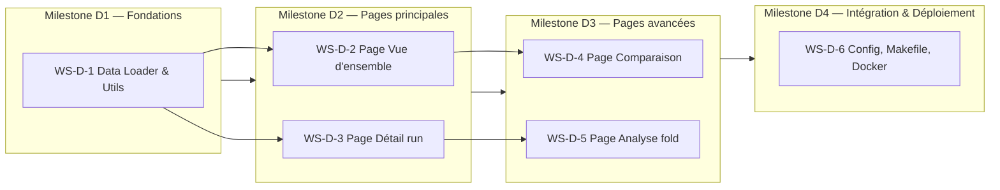

# Plan d'implémentation — Dashboard Streamlit AI Trading

**Référence** : `docs/specifications/streamlit/Specification_Dashboard_Streamlit_v1.0.md` (v1.0)
**Date** : 2026-03-04
**Portée** : Dashboard de visualisation post-exécution des runs du pipeline AI Trading

> Ce plan découpe l'implémentation en **Work Streams (WS-D)** — partiellement parallélisables — et en **Milestones (MD)** séquentiels.
> Chaque tâche est numérotée `WS-D-X.Y` et sera convertie en fichier `docs/tasks/streamlit/`.
> Le dashboard est un composant **en lecture seule** exploitant les artefacts produits par le pipeline principal (WS-1..WS-13).


## Table des matières

- [Vue d'ensemble](#vue-densemble)
- [Dépendances avec le pipeline principal](#dépendances-avec-le-pipeline-principal)
- [Milestones et dépendances](#milestones-et-dépendances)
- [WS-D-1 — Fondations et data loader](#ws-d-1--fondations-et-data-loader)
- [WS-D-2 — Page 1 — Vue d'ensemble des runs](#ws-d-2--page-1--vue-densemble-des-runs)
- [WS-D-3 — Page 2 — Détail d'un run](#ws-d-3--page-2--détail-dun-run)
- [WS-D-4 — Page 3 — Comparaison multi-runs](#ws-d-4--page-3--comparaison-multi-runs)
- [WS-D-5 — Page 4 — Analyse par fold](#ws-d-5--page-4--analyse-par-fold)
- [WS-D-6 — Configuration, déploiement et intégration](#ws-d-6--configuration-déploiement-et-intégration)
- [Arborescence cible du code](#arborescence-cible-du-code)
- [Conventions](#conventions)
- [Annexe — Correspondance spec ↔ tâches](#annexe--correspondance-spec--tâches)


## Vue d'ensemble



| Milestone | Work Streams | Description | Critère de validation |
|---|---|---|---|
| **MD-1** | WS-D-1 | Data loader fonctionnel, utilitaires, graphiques de base, tests unitaires | `data_loader.py` charge et valide `metrics.json`, `manifest.json`, CSV ; tests GREEN |
| **MD-2** | WS-D-2, WS-D-3 | Pages 1 (vue d'ensemble) et 2 (détail run) fonctionnelles avec graphiques | Pages 1 et 2 se chargent sans erreur avec un run réel ; tests d'intégration GREEN |
| **MD-3** | WS-D-4, WS-D-5 | Pages 3 (comparaison) et 4 (analyse fold) fonctionnelles | 4 pages complètes, test de smoke complet GREEN |
| **MD-4** | WS-D-6 | Makefile, configuration Streamlit, Dockerfile, documentation | `make dashboard` fonctionnel, test smoke E2E GREEN |


## Dépendances avec le pipeline principal

Le dashboard est un **consommateur** des artefacts produits par le pipeline. Il ne modifie ni le code du pipeline ni ses artefacts.

| Artefact pipeline | Module producteur | Utilisé par (dashboard) |
|---|---|---|
| `manifest.json` | `ai_trading.artifacts.manifest` (`build_manifest`, `write_manifest`) | `data_loader.py` → Pages 2, 3 |
| `metrics.json` | `ai_trading.artifacts.metrics_builder` (`build_metrics`, `write_metrics`) | `data_loader.py` → Pages 1, 2, 3, 4 |
| `config_snapshot.yaml` | `ai_trading.artifacts.run_dir` (`save_config_snapshot`) | `data_loader.py` → Pages 2, 3 |
| `equity_curve.csv` (stitché + par fold) | `ai_trading.metrics.aggregation` (`stitch_equity_curves`) + `ai_trading.backtest.equity` | `data_loader.py` → Pages 2, 3, 4 |
| `trades.csv` (par fold) | `ai_trading.backtest.trade_journal` | `data_loader.py` → Pages 2, 4 |
| `preds_val.csv`, `preds_test.csv` | `ai_trading.pipeline.runner` | `data_loader.py` → Page 4 |
| `metrics_fold.json` (par fold) | `ai_trading.artifacts.metrics_builder` (`write_fold_metrics`) | `data_loader.py` → Page 4 (chargement ciblé) |

**Logique existante à réutiliser** : le script `scripts/compare_runs.py` implémente déjà `load_metrics()` et `compare_strategies()` avec la validation des clés requises (`run_id`, `strategy`, `aggregate`). Cette logique doit être **factorisée** dans `data_loader.py` pour éviter la duplication (cf. spec §10.2 note DRY).

**Schémas JSON** : les schemas `docs/specifications/manifest.schema.json` et `docs/specifications/metrics.schema.json` sont utilisés par `ai_trading.artifacts.validation`. Le dashboard peut les réutiliser pour une validation optionnelle.

**Structure attendue de l'objet `aggregate` dans `metrics.json`** :

```json
{
  "aggregate": {
    "prediction": {
      "mean": { "mae": float, "rmse": float, "directional_accuracy": float|null, "spearman_ic": float|null },
      "std": { "mae": float, "rmse": float, "directional_accuracy": float|null, "spearman_ic": float|null }
    },
    "trading": {
      "mean": {
        "net_pnl": float, "net_return": float, "max_drawdown": float,
        "sharpe": float|null, "profit_factor": float|null, "hit_rate": float|null,
        "n_trades": float, "avg_trade_return": float|null, "median_trade_return": float|null,
        "exposure_time_frac": float
      },
      "std": { /* mêmes clés que mean */ }
    },
    "comparison_type": string|absent,
    "notes": string|absent
  }
}
```

> Les champs `comparison_type` et `notes` sont optionnels. Le `data_loader.py` doit les extraire s'ils sont présents et les ignorer sinon. Les métriques dans `mean`/`std` peuvent être `null` si tous les folds ont cette métrique à `null` (cf. §6.2).
>
> **Note** : `sharpe_per_trade` est exclu de l'agrégat inter-fold et n'apparaît que dans les métriques par fold (WS-D-3.2, tableau), où il peut prendre des valeurs extrêmes pour les folds avec peu de trades (spec §6.4). Le pipeline (`_EXCLUDED_METRICS` dans `aggregation.py`) l'exclut explicitement du calcul mean/std.


## WS-D-1 — Fondations et data loader

> Prérequis : pipeline principal M5 terminé (artefacts disponibles dans `runs/`).
> Référence spec : §4, §10, §11, §12, Annexe C.

### WS-D-1.1 — Dépendances et structure du projet

**Objectif** : installer les dépendances Streamlit et créer l'arborescence du code dashboard.

**Tâches** :
1. Créer `requirements-dashboard.txt` avec les dépendances (spec Annexe C) : `streamlit>=1.30`, `plotly>=5.18`, `pandas>=2.0`, `numpy>=1.24`, `PyYAML>=6.0`.
2. Créer l'arborescence cible sous `scripts/dashboard/` (spec §10.2) : `app.py`, `pages/`, `data_loader.py`, `charts.py`, `utils.py`.
3. Créer le fichier de configuration Streamlit `.streamlit/config.toml` (spec §10.4).
4. Vérifier les versions compatibles avec les dépendances existantes du pipeline (`requirements.txt`). Les packages `pandas`, `numpy`, `PyYAML` sont déjà présents — `requirements-dashboard.txt` ne doit pas introduire de conflits de version.

**Critères d'acceptation** :
- [ ] `requirements-dashboard.txt` existe avec versions conformes à Annexe C.
- [ ] Arborescence `scripts/dashboard/` créée (cf. §10.2).
- [ ] `.streamlit/config.toml` conforme à §10.4.
- [ ] `pip install -r requirements-dashboard.txt` passe sans conflit.

### WS-D-1.2 — Data loader : découverte et validation des runs

**Objectif** : implémenter le module `data_loader.py` pour la découverte, validation et chargement des artefacts de run.

**Tâches** :
1. Factoriser la logique de `scripts/compare_runs.py` (`load_metrics()`, validation des clés) dans `data_loader.py`.
2. Implémenter `discover_runs(runs_dir: Path) -> list[dict]` : scan du répertoire `runs/`, filtrage des sous-répertoires contenant `metrics.json` valide, exclusion des runs `strategy.name == "dummy"` (spec §4.3).
3. Implémenter `load_run_manifest(run_dir: Path) -> dict` : chargement et validation de `manifest.json`.
4. Implémenter `load_run_metrics(run_dir: Path) -> dict` : chargement et validation de `metrics.json` (clés requises : `run_id`, `strategy`, `aggregate`, spec §4.3).
5. Implémenter `load_config_snapshot(run_dir: Path) -> dict` : chargement de `config_snapshot.yaml`.
6. Validation : existence de `manifest.json` et `metrics.json` (obligatoires), parsing JSON sans erreur, présence des clés requises (spec §4.3).
7. Gestion des runs invalides : signalés mais ne bloquent pas le chargement des autres (spec §4.3).

**Critères d'acceptation** :
- [ ] `discover_runs()` découvre les runs valides et exclut les runs dummy.
- [ ] `load_run_metrics()` valide les clés `run_id`, `strategy`, `aggregate`.
- [ ] Runs invalides signalés sans bloquer les autres.
- [ ] Tests unitaires : run valide, run invalide (JSON cassé), run dummy exclu, répertoire vide, `metrics.json` manquant (fichier absent).

### WS-D-1.3 — Data loader : chargement des CSV

**Objectif** : implémenter le chargement des fichiers CSV conditionnels (equity_curve, trades, prédictions).

**Tâches** :
1. Implémenter `load_equity_curve(run_dir: Path) -> pd.DataFrame | None` : chargement de `equity_curve.csv` stitché (racine du run). Colonnes attendues : `time_utc`, `equity`, `in_trade`, `fold`. Retourne `None` si absent.
2. Implémenter `load_fold_equity_curve(fold_dir: Path) -> pd.DataFrame | None` : chargement de `folds/fold_XX/equity_curve.csv`. Colonnes : `time_utc`, `equity`, `in_trade`.
3. Implémenter `load_trades(run_dir: Path) -> pd.DataFrame | None` : chargement et concaténation de tous les `folds/fold_XX/trades.csv` avec ajout de la colonne `fold` (déduite du chemin, spec §6.6). Colonnes source : `entry_time_utc`, `exit_time_utc`, `entry_price`, `exit_price`, `entry_price_eff`, `exit_price_eff`, `f`, `s`, `fees_paid`, `slippage_paid`, `y_true`, `y_hat`, `gross_return`, `net_return`. Colonne calculée : `costs = fees_paid + slippage_paid` (spec §6.6).
4. Implémenter `load_fold_trades(fold_dir: Path) -> pd.DataFrame | None` : chargement d'un `trades.csv` spécifique.
5. Implémenter `load_predictions(fold_dir: Path, split: str) -> pd.DataFrame | None` : chargement de `preds_val.csv` ou `preds_test.csv`. Colonnes : `timestamp`, `y_true`, `y_hat`.
6. Implémenter `load_fold_metrics(fold_dir: Path) -> dict | None` : chargement optionnel de `metrics_fold.json` par fold. Retourne `None` si absent (spec §4.2 : « Le dashboard supporte son absence pour robustesse »). Ce fichier permet un chargement ciblé sans parser le `metrics.json` global.
7. Dégradation gracieuse : retourner `None` pour chaque fichier absent (spec §4.2).

**Critères d'acceptation** :
- [ ] Chargement correct de chaque type de CSV avec les bons types de colonnes.
- [ ] Colonne `fold` ajoutée automatiquement lors de la concaténation des trades.
- [ ] Colonne `costs` calculée (`fees_paid + slippage_paid`).
- [ ] Retour `None` si fichier absent (pas d'exception).
- [ ] Tests unitaires avec fixtures CSV synthétiques.

### WS-D-1.4 — Utilitaires de formatage et couleurs

**Objectif** : implémenter `utils.py` avec les helpers de formatage des métriques et la palette de couleurs.

**Tâches** :
1. Implémenter les fonctions de formatage conformes à §9.3 : `format_pct(value, decimals=2)` → `{value:.2%}`, `format_float(value, decimals=2)` → `{value:.2f}`, `format_int(value)` → `{value:,d}`, `format_timestamp(ts)` → `YYYY-MM-DD HH:MM`.
2. Implémenter `format_mean_std(mean, std, fmt_type)` : formatage `mean ± std` selon le type (pourcentage ou float), avec gestion du count si folds < total (spec §6.2).
3. Gestion des valeurs `null` : afficher `—` (tiret cadratin, spec §9.3).
4. Définir la palette de couleurs comme constantes (spec §9.2) : `COLOR_PROFIT = "#2ecc71"`, `COLOR_LOSS = "#e74c3c"`, `COLOR_NEUTRAL = "#3498db"`, `COLOR_WARNING = "#f39c12"`, `COLOR_DRAWDOWN = "rgba(231, 76, 60, 0.15)"`, `COLOR_FOLD_BORDER = "#95a5a6"`.
5. Implémenter les fonctions de seuils colorés pour KPI cards (spec §6.2) : `pnl_color(value)`, `sharpe_color(value)`, `mdd_color(value)`, `hit_rate_color(value)`, `profit_factor_color(value)`.
6. Implémenter `format_sharpe_per_trade(value, n_trades)` : pour gérer les valeurs extrêmes de Sharpe/Trade (spec §6.4). Règle : si `|value| > 1000`, afficher en notation scientifique (`{value:.2e}`). Indicateur ⚠️ si `n_trades ≤ 2`.

**Critères d'acceptation** :
- [ ] Formatage conforme à §9.3 pour chaque type de métrique.
- [ ] Valeurs `null`/`None` affichées comme `—`.
- [ ] Palette de couleurs conforme à §9.2.
- [ ] Seuils colorés conformes à §6.2.
- [ ] Formatage Sharpe/Trade avec notation scientifique pour valeurs extrêmes.
- [ ] Tests unitaires pour chaque fonction de formatage.

### WS-D-1.5 — Bibliothèque de graphiques (charts.py)

**Objectif** : implémenter les fonctions de génération de graphiques Plotly réutilisables.

**Tâches** :
1. Implémenter `chart_equity_curve(df, fold_boundaries=True, drawdown=True, in_trade_zones=True) -> go.Figure` : line chart d'equity curve avec annotations de frontières de folds (lignes verticales pointillées grises), zone de drawdown ombrée (spec §6.3), zones de position colorées.
2. Implémenter `chart_pnl_bar(fold_metrics: list[dict]) -> go.Figure` : bar chart du Net PnL par fold, coloré vert/rouge (spec §6.4).
3. Implémenter `chart_returns_histogram(trades_df: pd.DataFrame) -> go.Figure` : histogramme des rendements nets par trade (spec §6.5).
4. Implémenter `chart_returns_boxplot(trades_df: pd.DataFrame) -> go.Figure` : box plot des rendements par fold (spec §6.5).
5. Implémenter `chart_equity_overlay(curves: dict[str, pd.DataFrame]) -> go.Figure` : superposition de courbes d'équité multi-runs, normalisées départ=1.0 (spec §7.3).
6. Implémenter `chart_radar(runs_data: list[dict]) -> go.Figure` : radar chart 5 axes (Net PnL, Sharpe, 1-MDD, Win Rate, PF), normalisation min-max (spec §7.4).
7. Implémenter `chart_scatter_predictions(preds_df: pd.DataFrame, theta: float | None, threshold_method: str) -> go.Figure` : scatter plot y_hat vs y_true avec coloration Go/No-Go (spec §8.3). Détection du type signal via `threshold_method == "none"` → message informatif au lieu du scatter.
8. Implémenter `chart_fold_equity(df: pd.DataFrame, trades_df: pd.DataFrame | None) -> go.Figure` : equity curve du fold avec points d'entrée (▲ vert) et sortie (▼ rouge) des trades (spec §8.2).
9. Tous les graphiques utilisent `use_container_width=True` et les couleurs de §9.2.

**Critères d'acceptation** :
- [ ] Chaque fonction génère un `go.Figure` Plotly valide.
- [ ] Couleurs conformes à §9.2.
- [ ] Fold boundaries détectées par changement de colonne `fold` (spec §6.3).
- [ ] Normalisation equity à 1.0 (spec §6.3, §7.3).
- [ ] Signal type détecté, message informatif pour scatter si `method == "none"` (spec §8.3).
- [ ] Tests unitaires avec données synthétiques (pas de test visuel).


## WS-D-2 — Page 1 — Vue d'ensemble des runs

> Prérequis : WS-D-1 terminé.
> Référence spec : §5.

### WS-D-2.1 — Point d'entrée et navigation Streamlit

**Objectif** : créer `app.py` comme point d'entrée multi-pages Streamlit.

**Tâches** :
1. Configurer `st.set_page_config(layout="wide", page_title="AI Trading Dashboard")` (spec §9.4).
2. Implémenter le paramètre `--runs-dir` (ou variable d'environnement `AI_TRADING_RUNS_DIR`, défaut : `runs/`, spec §5.1). **Ordre de précédence** : `--runs-dir` CLI > `AI_TRADING_RUNS_DIR` env var > défaut `runs/`.
3. Charger les runs via `discover_runs()` au démarrage et stocker dans `st.session_state`.
4. Configurer la navigation multi-pages Streamlit.

**Critères d'acceptation** :
- [ ] L'application se lance avec `streamlit run scripts/dashboard/app.py`.
- [ ] Le paramètre `--runs-dir` est fonctionnel.
- [ ] La variable d'environnement `AI_TRADING_RUNS_DIR` est supportée.
- [ ] Les 4 pages sont accessibles via la navigation.

### WS-D-2.2 — Page 1 : tableau récapitulatif et filtres

**Objectif** : implémenter la page `1_overview.py` avec le tableau des runs et les filtres.

**Tâches** :
1. Construire le tableau récapitulatif avec les colonnes de §5.2 : Run ID, Stratégie, Type (`strategy_type`), Folds (`len(folds)`), Net PnL moy (`aggregate.trading.mean.net_pnl`), Sharpe moy (`aggregate.trading.mean.sharpe`), MDD moy (`aggregate.trading.mean.max_drawdown`), Win Rate moy (`aggregate.trading.mean.hit_rate`), Trades moy (`aggregate.trading.mean.n_trades`). **Tri par défaut** : Run ID décroissant (le plus récent en premier, basé sur le timestamp dans le run_id).
2. Implémenter le filtre par type (dropdown : Tous / Modèles / Baselines, spec §5.3).
3. Implémenter le filtre par stratégie (multiselect des noms présents, spec §5.3).
4. Implémenter le tri par clic sur en-tête de colonne (spec §5.3).
5. Rendre le tableau cliquable : clic sur une ligne → navigation vers Page 2 pour ce run (spec §5.2). Stockage du `run_id` sélectionné dans `st.session_state`.
6. Formatage des colonnes : Net PnL et MDD en `:.2%`, Sharpe en `:.2f`, Win Rate en `:.1%`, Trades en entier (conformément à §9.3).
7. Afficher un indicateur (tooltip) sur les runs dont `aggregate.notes` contient des warnings (spec §4.3). La colonne `comparison_type` peut être affichée comme filtre optionnel si présente.
8. Gestion du cas vide : message informatif si aucun run trouvé (spec §12.2 test edge case).

**Critères d'acceptation** :
- [ ] Tableau affiche toutes les colonnes de §5.2 avec formatage correct.
- [ ] Filtres type et stratégie fonctionnels.
- [ ] Tri par colonne fonctionnel.
- [ ] Clic sur une ligne navigue vers Page 2.
- [ ] Message informatif si répertoire vide ou uniquement runs dummy.
- [ ] Tests : fixture multi-runs, vérification des colonnes et du filtrage.


## WS-D-3 — Page 2 — Détail d'un run

> Prérequis : WS-D-1 terminé, WS-D-2.1 terminé (navigation).
> Référence spec : §6.

### WS-D-3.1 — En-tête et KPI cards

**Objectif** : implémenter l'en-tête du run et les cartes de métriques agrégées.

**Tâches** :
1. Afficher le bandeau d'en-tête (spec §6.1) : Run ID, Date (`manifest.created_at_utc`, format ISO 8601, parser et afficher en `YYYY-MM-DD HH:MM UTC`), Stratégie (`manifest.strategy.name`), Symbole (`manifest.dataset.symbols` joint par `", "`), Timeframe (`manifest.dataset.timeframe`), Période (`manifest.dataset.start` — `manifest.dataset.end` avec suffixe `(excl.)`, spec §6.1), Seed (`manifest.config_snapshot.reproducibility.global_seed`), Nombre de folds.
2. Implémenter les KPI cards (spec §6.2) : Net PnL, Sharpe Ratio, Max Drawdown, Hit Rate, Profit Factor, Nombre de trades. Format mean ± std avec seuils colorés.
3. Lecture du paramètre `metrics.sharpe_annualized` dans `config_snapshot.yaml` pour le label Sharpe (spec §6.2).
4. Gestion des valeurs `null` : afficher `—`, indication du count si folds contributifs < total (spec §6.2). Calculer `n_contributing` en parcourant `folds` et comptant les non-null par métrique.
5. Utiliser `st.columns()` pour la disposition des KPI cards (spec §9.4).

**Critères d'acceptation** :
- [ ] En-tête conforme à §6.1 avec toutes les informations.
- [ ] Suffixe `(excl.)` sur la date de fin.
- [ ] KPI cards avec mean ± std, seuils colorés conformes à §6.2.
- [ ] Label Sharpe conditionnel (annualisé ou non).
- [ ] Gestion des null et count de folds contributifs.
- [ ] Tests avec fixture de run complète.

### WS-D-3.2 — Equity curve stitchée et métriques par fold

**Objectif** : implémenter la courbe d'équité stitchée et le tableau des métriques par fold.

**Tâches** :
1. Charger `equity_curve.csv` stitché via `load_equity_curve()`.
2. Normaliser la courbe d'équité : **toujours** diviser toute la série par `equity[0]` pour garantir un départ à 1.0 (spec §6.3). Si `equity[0] == 0`, logger un warning et afficher un message d'erreur. Cette normalisation est nécessaire car `backtest.initial_equity` est configurable et peut ne pas être 1.0.
3. Afficher via `chart_equity_curve()` avec frontières de folds, drawdown, zones in_trade.
4. Implémenter le tableau métriques par fold (spec §6.4) : Fold, θ (`fold.threshold.theta`), Net PnL, Sharpe, MDD, Win Rate, N Trades, MAE, RMSE, DA (`directional_accuracy`), IC (`spearman_ic`), Sharpe/Trade (formaté via `format_sharpe_per_trade()` de `utils.py`).
5. Afficher `threshold.method` et `threshold.selected_quantile` dans le tableau pour chaque fold. Pour `method="none"` (baselines/signal), afficher θ comme `—` (N/A). Pour les méthodes de type regression, toujours afficher les trois champs du threshold object.
6. Indicateur ⚠️ pour folds avec `n_trades ≤ 2` sur la colonne Sharpe/Trade (spec §6.4).
7. Valeurs `null` affichées comme `—` (spec §6.4).
8. Graphique bar chart du Net PnL par fold via `chart_pnl_bar()`.
9. Dégradation si `equity_curve.csv` absent : message informatif (spec §4.2).

**Critères d'acceptation** :
- [ ] Equity curve normalisée à 1.0, frontières de folds visibles.
- [ ] Tableau métriques par fold avec toutes les colonnes de §6.4.
- [ ] θ accédé via `fold.threshold.theta` (pas directement comme float).
- [ ] Indicateur ⚠️ pour folds low-trade.
- [ ] Message informatif si equity curve absente.
- [ ] Bar chart PnL par fold fonctionnel.

### WS-D-3.3 — Distribution des trades et journal

**Objectif** : implémenter les visualisations de distribution des trades et le journal tabulaire.

**Tâches** :
1. Charger les trades via `load_trades()` (concaténation de tous les folds).
2. Afficher l'histogramme des rendements nets (`chart_returns_histogram()`, spec §6.5).
3. Afficher le box plot par fold (`chart_returns_boxplot()`, spec §6.5).
4. Afficher les statistiques : mean, median, std, skewness, best trade, worst trade (spec §6.5).
5. Implémenter le journal des trades paginé (spec §6.6) : Fold, Entry time, Exit time, Entry price, Exit price, Gross return, Costs (`fees_paid + slippage_paid`), Net return, Equity after. La colonne Equity after est reconstituée par jointure `pandas.merge_asof(direction='backward')` de `exit_time_utc` vers `equity_curve.csv → time_utc` du même fold (spec §6.6). Les timestamps correspondent exactement aux bars (1h) dans le cas nominal. Si aucune correspondance trouvée, la cellule affiche `—`.
6. Pagination : 50 lignes par page (spec §11.2).
7. Filtres : par fold, par signe (gagnant/perdant), par période (spec §6.6).
8. Dégradation si `trades.csv` absent : message informatif (spec §4.2, §12.2).
9. Colonne Equity after omise si `equity_curve.csv` absent (spec §6.6).

**Critères d'acceptation** :
- [ ] Histogramme et box plot des rendements fonctionnels.
- [ ] Statistiques affichées (mean, median, std, skewness, best, worst).
- [ ] Journal paginé à 50 lignes/page.
- [ ] Colonne Costs calculée correctement.
- [ ] Jointure asof pour Equity after correcte.
- [ ] Filtres par fold, signe, période fonctionnels.
- [ ] Dégradation gracieuse si trades ou equity curve absents.


## WS-D-4 — Page 3 — Comparaison multi-runs

> Prérequis : WS-D-2 terminé (Page 1 et session_state des runs).
> Référence spec : §7.

### WS-D-4.1 — Sélection et tableau comparatif

**Objectif** : implémenter la sélection des runs et le tableau comparatif.

**Tâches** :
1. Implémenter le multiselect en sidebar : 2 à 10 runs, avec nom de stratégie à côté du run ID (spec §7.1).
2. Construire le tableau comparatif avec les mêmes colonnes que §5.2, restreint aux runs sélectionnés (spec §7.2).
3. Mise en surbrillance : meilleure valeur en gras vert, pire en italique rouge (spec §7.2).
4. Vérification du critère §14.4 de la spec pipeline : icône ✅/❌ par run. Seuils : P&L net > 0, profit factor > 1.0 (hardcodés), MDD < `thresholding.mdd_cap` (lu depuis `config_snapshot.yaml` de chaque run, spec §7.2).
5. Lecture du champ `aggregate.notes` de `metrics.json` pour afficher les warnings éventuels (spec §7.2).

**Critères d'acceptation** :
- [ ] Multiselect 2-10 runs avec identification par stratégie.
- [ ] Tableau comparatif avec colonnes conformes à §5.2.
- [ ] Surbrillance meilleur/pire par colonne.
- [ ] Icône ✅/❌ basée sur critères §14.4 avec seuil MDD lu depuis config.
- [ ] Notes/warnings du pipeline affichés.
- [ ] Tests avec 2+ runs synthétiques.

### WS-D-4.2 — Courbes d'équité superposées et radar chart

**Objectif** : implémenter la superposition des courbes d'équité et le radar chart comparatif.

**Tâches** :
1. Charger les equity curves stitchées de chaque run sélectionné.
2. Afficher via `chart_equity_overlay()` : une courbe par run, normalisées à 1.0, légende cliquable (spec §7.3).
3. Afficher le radar chart via `chart_radar()` : 5 axes (Net PnL, Sharpe, 1−MDD, Win Rate, PF), normalisation min-max sur les runs sélectionnés (spec §7.4).
4. Dégradation si equity curves absentes pour certains runs : message informatif, radar chart toujours affiché (il dépend de metrics.json uniquement).

**Critères d'acceptation** :
- [ ] Courbes superposées normalisées avec légende interactive.
- [ ] Radar chart 5 axes avec normalisation min-max correcte.
- [ ] Dégradation gracieuse si equity curves partiellement absentes.
- [ ] Tests avec données synthétiques multi-runs.


## WS-D-5 — Page 4 — Analyse par fold

> Prérequis : WS-D-3 terminé (chargement des données par fold).
> Référence spec : §8.

### WS-D-5.1 — Navigation et equity curve du fold

**Objectif** : implémenter la sélection de fold et l'affichage de l'equity curve du fold.

**Tâches** :
1. Implémenter le dropdown de sélection du run puis du fold (spec §8.1).
2. Implémenter le slider alternatif pour navigation entre folds (spec §8.1).
3. Charger l'equity curve du fold via `load_fold_equity_curve()`.
4. Afficher via `chart_fold_equity()` : courbe d'équité avec points d'entrée ▲ vert et sortie ▼ rouge, zone de drawdown (spec §8.2).
5. Dégradation si `equity_curve.csv` du fold absent : message informatif.

**Critères d'acceptation** :
- [ ] Dropdown run + fold et slider fonctionnels.
- [ ] Equity curve du fold avec marqueurs d'entrée/sortie des trades.
- [ ] Zone de drawdown ombrée.
- [ ] Dégradation gracieuse si fichier absent.

### WS-D-5.2 — Prédictions vs réalisés

**Objectif** : implémenter le scatter plot prédictions vs réalisés avec coloration Go/No-Go.

**Tâches** :
1. Charger `preds_test.csv` du fold via `load_predictions()`.
2. Récupérer θ depuis `metrics.json → fold.threshold.theta` et la méthode depuis `fold.threshold.method`.
3. Reconstruire le signal Go/No-Go (spec §8.3) :
   - Si `method != "none"` (regression) : `signal = (y_hat > theta)`. Coloration vert (Go) / gris (No-Go).
   - Si `method == "none"` (signal) : message informatif « Scatter plot non disponible pour les modèles de type signal ».
4. Afficher via `chart_scatter_predictions()` : scatter y_hat (X) vs y_true (Y), diagonale pointillée, coloration Go/No-Go.
5. Afficher les métriques en encart : MAE, RMSE, DA, IC, θ (spec §8.3). θ affiché comme `—` si `null`.
6. Dégradation si `preds_test.csv` absent : message informatif.

**Critères d'acceptation** :
- [ ] Scatter plot avec coloration Go/No-Go correcte.
- [ ] Détection du type signal via `method == "none"`, message informatif.
- [ ] Diagonale de prédiction parfaite.
- [ ] Métriques en encart conformes.
- [ ] Dégradation gracieuse si prédictions absentes.

### WS-D-5.3 — Journal des trades du fold

**Objectif** : implémenter le journal des trades filtré sur le fold sélectionné.

**Tâches** :
1. Charger `trades.csv` du fold via `load_fold_trades()`.
2. Afficher le même tableau que §6.6 (WS-D-3.3) filtré sur le fold (spec §8.4).
3. Réutiliser la logique de pagination et filtrage existante.

**Critères d'acceptation** :
- [ ] Journal conforme à §6.6, filtré sur le fold.
- [ ] Réutilisation du code de WS-D-3.3 (DRY).


## WS-D-6 — Configuration, déploiement et intégration

> Prérequis : WS-D-1 à WS-D-5 terminés.
> Référence spec : §10, §11.

### WS-D-6.1 — Cible Makefile et commandes de lancement

**Objectif** : ajouter les cibles `dashboard` dans le Makefile existant.

**Tâches** :
1. Ajouter la cible `make dashboard` : `streamlit run scripts/dashboard/app.py` (spec §10.3).
2. Supporter le paramètre `RUNS_DIR` : `make dashboard RUNS_DIR=/path/to/runs` (spec §10.3).
3. Ajouter la cible `make install-dashboard` : `pip install -r requirements-dashboard.txt`.
4. Documenter les nouvelles cibles dans `make help`.

**Critères d'acceptation** :
- [ ] `make dashboard` lance le dashboard.
- [ ] `make dashboard RUNS_DIR=...` fonctionne.
- [ ] `make install-dashboard` installe les dépendances.
- [ ] `make help` affiche les cibles dashboard.

### WS-D-6.2 — Sécurité et performance

**Objectif** : implémenter les contraintes de sécurité et de performance.

**Tâches** :
1. Vérifier la lecture seule : aucune écriture dans le répertoire de runs (spec §11.1).
2. Validation des chemins avec `Path.resolve()` pour éviter les directory traversals (spec §11.1).
3. Appliquer `@st.cache_data` pour le chargement des JSON, CSV, YAML (spec §11.2).
4. Chargement paresseux des CSV volumineux : uniquement lorsque la page est affichée (spec §11.2).
5. Avertissement si un run contient plus de 200 folds (spec §11.2).
6. Pagination des tableaux de trades à 50 lignes/page (déjà dans WS-D-3.3, validation ici).

**Critères d'acceptation** :
- [ ] Aucune opération d'écriture dans le code dashboard.
- [ ] Chemins validés via `Path.resolve()`.
- [ ] `@st.cache_data` sur les fonctions de chargement.
- [ ] Avertissement > 200 folds fonctionnel.

### WS-D-6.3 — Dockerfile et documentation

**Objectif** : créer le Dockerfile dashboard (optionnel) et documenter le dashboard.

**Tâches** :
1. Créer le Dockerfile conforme à §10.5 (optionnel, basse priorité).
2. Mettre à jour `README.md` avec les instructions de lancement du dashboard.
3. Documenter les variables d'environnement (`AI_TRADING_RUNS_DIR`).

**Critères d'acceptation** :
- [ ] Dockerfile fonctionnel (si implémenté).
- [ ] README mis à jour avec section dashboard.

### WS-D-6.4 — Tests d'intégration et smoke test

**Objectif** : implémenter la suite de tests d'intégration du dashboard.

**Tâches** :
1. Test de smoke : lancement avec un run valide, vérification du chargement des 4 pages sans erreur (spec §12.2).
2. Test d'exclusion Dummy : répertoire avec uniquement un run dummy → tableau vide, message informatif (spec §12.2).
3. Test de comparaison : 2+ runs, vérification du tableau comparatif et courbes (spec §12.2).
4. Test edge case : répertoire vide → message informatif, pas de crash (spec §12.2).
5. Tests de dégradation (spec §12.2) :
   - `equity_curve.csv` absent → §6.3, §7.3, §8.2 affichent un message, §6.6 omet Equity after.
   - `trades.csv` absent → §6.5, §6.6, §8.4 affichent un message.
   - `preds_*.csv` absents → §8.3 affiche un message.
6. Tests de reconstruction du signal Go/No-Go (spec §8.3) :
   - θ positif : vérifier `signal = (y_hat > theta)` avec coloration correcte.
   - θ négatif : vérifier que le signal est reconstruit correctement.
   - θ = 0 : vérifier le comportement edge case.
   - `method == "none"` (modèle signal) : vérifier l'affichage du message informatif.
7. Créer des fixtures de test dédiées (runs synthétiques avec tous les artefacts) dans `tests/fixtures/dashboard/`.

**Critères d'acceptation** :
- [ ] Tous les tests d'intégration de §12.2 passent.
- [ ] Tests de reconstruction Go/No-Go couvrent θ positif, négatif, nul, et `method == "none"`.
- [ ] Fixtures de test dédiées créées.
- [ ] Pas de dépendance réseau dans les tests.
- [ ] Tests déterministes.


## Arborescence cible du code

```
scripts/
└── dashboard/
    ├── app.py                   # Point d'entrée Streamlit (WS-D-2.1)
    ├── pages/
    │   ├── 1_overview.py        # Page 1 — Vue d'ensemble (WS-D-2.2)
    │   ├── 2_run_detail.py      # Page 2 — Détail d'un run (WS-D-3)
    │   ├── 3_comparison.py      # Page 3 — Comparaison (WS-D-4)
    │   └── 4_fold_analysis.py   # Page 4 — Analyse par fold (WS-D-5)
    ├── data_loader.py           # Chargement et validation (WS-D-1.2, WS-D-1.3)
    ├── charts.py                # Graphiques Plotly (WS-D-1.5)
    └── utils.py                 # Formatage, couleurs, cache (WS-D-1.4)
.streamlit/
    └── config.toml              # Configuration Streamlit (WS-D-1.1)
requirements-dashboard.txt       # Dépendances (WS-D-1.1)
tests/
    ├── test_dashboard_data_loader.py   # Tests data_loader (WS-D-1.2, WS-D-1.3)
    ├── test_dashboard_utils.py         # Tests utilitaires (WS-D-1.4)
    ├── test_dashboard_charts.py        # Tests graphiques (WS-D-1.5)
    ├── test_dashboard_integration.py   # Tests d'intégration (WS-D-6.4)
    └── fixtures/
        └── dashboard/                  # Fixtures de test (runs synthétiques)
```


## Conventions

### Nommage
- Préfixe `WS-D-` pour les Work Streams du dashboard (éviter la collision avec `WS-` du pipeline).
- Préfixe `MD-` pour les milestones du dashboard.
- Fichiers de tâches : `docs/tasks/streamlit/NNN__slug.md`.
- Tests : `test_dashboard_<module>.py`.

### TDD
Le workflow TDD du pipeline principal s'applique au dashboard :
1. RED : écrire les tests d'abord.
2. GREEN : implémenter le minimum pour passer.
3. Commits structurés : `[WS-D-X] #NNN RED/GREEN: <résumé>`.

### Config-driven
Le dashboard ne hardcode aucun chemin ou paramètre configurable :
- Le répertoire de runs est configurable (`--runs-dir` / `AI_TRADING_RUNS_DIR`).
- Les seuils de métriques sont lus depuis les configs des runs (pas de valeurs par défaut dashboard).
- La palette de couleurs est centralisée dans `utils.py`.

### Sécurité
- Lecture seule absolue.
- Validation des chemins (`Path.resolve()`).
- Pas d'accès réseau.
- Pas de `st.file_uploader()`.

### DRY avec le pipeline
- La logique de chargement/validation de `metrics.json` est factorisée dans `data_loader.py` — le script `scripts/compare_runs.py` doit à terme importer depuis `data_loader.py` (ou les deux importent depuis un module commun).
- Les formules de métriques (PnL, Sharpe, etc.) ne sont **pas** recalculées par le dashboard : elles sont lues depuis `metrics.json`.


## Annexe — Correspondance spec ↔ tâches

| Section spec | Tâche(s) | Description |
|---|---|---|
| §4.1, §4.2, §4.3 | WS-D-1.2, WS-D-1.3 | Sources de données, validation |
| §5.1, §5.2, §5.3 | WS-D-2.1, WS-D-2.2 | Page 1 vue d'ensemble |
| §6.1 | WS-D-3.1 | En-tête du run |
| §6.2 | WS-D-3.1 | KPI cards métriques agrégées |
| §6.3 | WS-D-3.2 | Equity curve stitchée |
| §6.4 | WS-D-3.2 | Métriques par fold |
| §6.5 | WS-D-3.3 | Distribution des trades |
| §6.6 | WS-D-3.3 | Journal des trades |
| §7.1, §7.2 | WS-D-4.1 | Sélection et tableau comparatif |
| §7.3, §7.4 | WS-D-4.2 | Courbes superposées et radar chart |
| §8.1, §8.2 | WS-D-5.1 | Sélection fold et equity curve |
| §8.3 | WS-D-5.2 | Prédictions vs réalisés |
| §8.4 | WS-D-5.3 | Journal trades du fold |
| §9.1, §9.2, §9.3 | WS-D-1.4, WS-D-1.5 | Composants graphiques et conventions |
| §9.4 | WS-D-2.1, WS-D-3.1, WS-D-1.5 | Responsivité (layout wide, columns, container_width) |
| §10.1, §10.2 | WS-D-1.1 | Stack technique et structure |
| §10.3, §10.4 | WS-D-6.1 | Commandes de lancement |
| §10.5 | WS-D-6.3 | Dockerfile |
| §11.1 | WS-D-6.2 | Sécurité |
| §11.2 | WS-D-6.2 | Performance et cache |
| §12.1 | WS-D-1.2..1.5 | Tests unitaires |
| §12.2 | WS-D-6.4 | Tests d'intégration |
| Annexe A | — | Wireframes (référence visuelle) |
| Annexe B | WS-D-1.4 | Métriques affichées |
| Annexe C | WS-D-1.1 | Dépendances |
