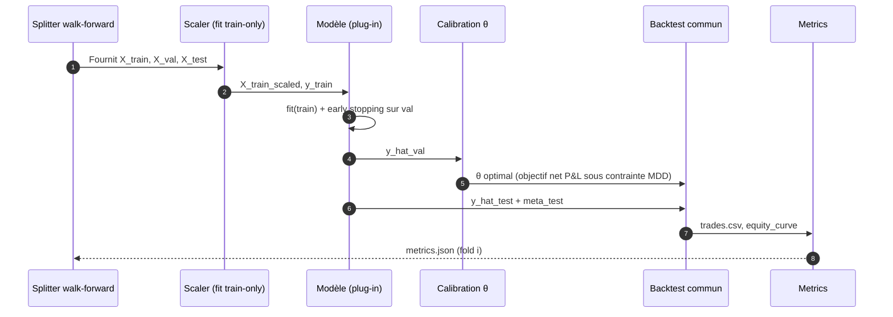
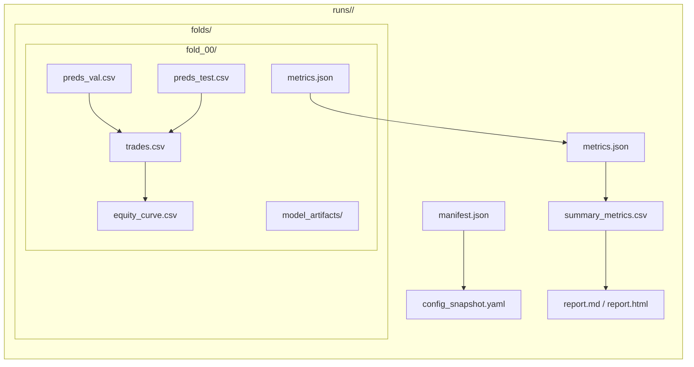

# Spécification formelle — Pipeline commun AI Trading

Comparaison rigoureuse de modèles ML/DL et baselines
sur données OHLCV (Binance) avec protocole walk-forward.

**Version 1.0** — 2026-02-27 (UTC)

Document de référence pour l'équipe projet.
But : imposer un pipeline unique (données, splits, coûts, backtest, métriques) afin que seule la qualité de prédiction varie entre modèles.


# Table des matières

- Historique des versions
- 1. Objet et périmètre
  - 1.1 Modèles supportés
  - 1.2 Baselines supportées
  - 1.3 Hypothèses et choix imposés (MVP)
- 2. Glossaire et notations
  - 2.1 Notations principales
- 3. Vue d'ensemble du pipeline
  - 3.1 Diagramme de flux (dataflow)
- 4. Données d'entrée et contrôle qualité
  - 4.1 Source et format
  - 4.2 Contrôles qualité (QA) obligatoires
  - 4.3 Politique de traitement des trous (missing candles)
- 5. Définition de la cible y_t et alignement avec l'exécution
  - 5.1 Conventions temporelles
  - 5.2 Cible par défaut: log-return du trade
  - 5.3 Alternative optionnelle (si justifiée): log-return close-to-close
- 6. Feature engineering: définitions mathématiques
  - 6.1 Série de base et conventions
  - 6.2 Liste canonique des features (MVP)
  - 6.3 RSI (Relative Strength Index) - lissage de Wilder
  - 6.4 EMA (Exponential Moving Average)
  - 6.5 Volatilité rolling (écart-type) - convention ddof
  - 6.6 Warm-up et invalidation des samples
- 7. Construction des datasets et formats de données
  - 7.1 Format séquentiel canonique (N, L, F)
  - 7.2 Adapter tabulaire pour XGBoost
  - 7.3 Métadonnées d'exécution (meta)
- 8. Protocole walk-forward et politique embargo/purge
  - 8.1 Paramètres de split (MVP)
  - 8.2 Purge liée à l'horizon H (éviter le chevauchement des labels)
  - 8.3 Définition formelle des périodes par fold
  - 8.4 Contraintes d'implémentation (tests)
- 9. Normalisation / scaling (fit sur train uniquement)
  - 9.1 Méthode par défaut (MVP): standardisation par feature
  - 9.2 Option avancée (si activée): scaling robuste ou clipping
  - 9.3 Rolling z-score (non MVP, à versionner)
- 10. Contrat d'interface des modèles (plug-in)
  - 10.1 Interface minimale
  - 10.2 Conventions d'entrée/sortie
  - 10.3 Entraînement et early stopping
  - 10.4 Déterminisme
- 11. Décision Go/No-Go et calibration du seuil θ
  - 11.1 Politique de calibration (MVP)
  - 11.2 Méthode par défaut: grille de quantiles
  - 11.3 Objectif de sélection du seuil
  - 11.4 Cas des baselines
- 12. Moteur de backtest commun et conventions de coûts
  - 12.1 Règles d'exécution (stratégies Go/No-Go)
  - 12.2 Conventions de coûts - représentation canonique
  - 12.3 Calcul du rendement net d'un trade (long-only)
  - 12.4 Mise à jour de la courbe d'équité
  - 12.5 Cas buy & hold (baseline continue)
  - 12.6 Journal de trades et audit
- 13. Baselines (implémentées une fois et réutilisées)
  - 13.1 Baseline no-trade
  - 13.2 Baseline buy & hold (continue)
  - 13.3 Baseline règle SMA (Go/No-Go)
  - 13.4 Remarques comparatives
- 14. Métriques et agrégation inter-fold
  - 14.1 Métriques de prédiction (sur test de chaque fold)
  - 14.2 Métriques trading (sur test de chaque fold)
  - 14.3 Agrégation inter-fold
  - 14.4 Critères d'acceptation (rappel)
- 15. Artefacts, structure de sortie et schémas JSON
  - 15.1 Arborescence canonique d'un run
  - 15.2 manifest.json - rôle
  - 15.3 metrics.json - rôle
  - 15.4 Schémas JSON (JSON Schema)
- 16. Reproductibilité et traçabilité
  - 16.1 Seeds et déterminisme
  - 16.2 Journalisation minimale
  - 16.3 Convention de versionning des features
- Annexes
  - Annexe A - JSON Schema: manifest.schema.json
  - Annexe B - JSON Schema: metrics.schema.json
  - Annexe C - Exemples (manifest.json, metrics.json)
  - Annexe D - Références (sélection)
  - Annexe E - Addendum v1.1: paramètres MVP et décisions best-practice
    - E.2.9 - Architectures DL par défaut
    - E.2.10 - Modèle Reinforcement Learning (PPO): spécification détaillée


# Historique des versions

| Version | Date | Auteur | Changements |
| --- | --- | --- | --- |
| 1.0 | 2026-02-27 | Équipe projet | Première spécification formelle (pipeline, features, coûts, artefacts). |
| 1.1 | 2026-02-27 | Équipe projet | Addendum : résolution des ambiguïtés, paramètres MVP figés, décisions best-practice (voir Annexe E). |
| 1.2 | 2026-02-27 | Équipe projet | Ajout du modèle Reinforcement Learning (PPO) : §1.1, §10, §11, Annexe E.2.9, E.2.10. |


# 1. Objet et périmètre

Ce document spécifie formellement le pipeline commun utilisé pour l'étude de trading algorithmique basée sur des données OHLCV provenant de Binance. Le pipeline doit permettre de comparer de manière rigoureuse et reproductible plusieurs stratégies (baselines + modèles ML/DL) qui prédisent un rendement futur à horizon H et produisent des décisions long-only de type Go/No-Go.

Le but premier est une comparaison méthodologiquement robuste (éviter les fuites d'information, appliquer des coûts identiques, agréger les résultats sur plusieurs fenêtres walk-forward), plutôt qu'une promesse de surperformance.


## 1.1 Modèles supportés

- XGBoost (régression) sur features tabulaires.
- CNN 1D (régression) sur fenêtre temporelle.
- GRU (régression) sur fenêtre temporelle.
- LSTM (régression) sur fenêtre temporelle.
- Transformer PatchTST (régression) sur fenêtre temporelle.
- Reinforcement Learning PPO (décision directe Go/No-Go) sur fenêtre temporelle.

## 1.2 Baselines supportées

- No-trade (jamais en position).
- Buy & hold (achat initial, conservation sur la période test).
- Règle SMA (signal basé sur moyenne mobile simple).
- Remarque: les baselines sont codées une fois (module commun) et réutilisées par tous.

## 1.3 Hypothèses et choix imposés (MVP)

- Données: OHLCV Binance, timeframe fixe (ex: 1h), période fixe (ex: 2 ans).
- Cible: rendement futur à horizon H (ex: 4h) traité en régression.
- Décision: long-only Go/No-Go.
- Exécution: entrée à l'ouverture de la bougie t+1, sortie à la clôture de t+H.
- Backtest: coûts fixés et appliqués partout (frais + slippage).
- Évaluation: protocole walk-forward (rolling window) + agrégation inter-fold.

# 2. Glossaire et notations

On indexe les bougies par un temps discret t correspondant à la clôture de la bougie. Les prix OHLCV sont notés O_t, H_t, L_t, C_t et V_t (Open, High, Low, Close, Volume). Le timeframe Δ est l'intervalle entre deux bougies (ex: 1h).


## 2.1 Notations principales

| Symbole | Définition |
| --- | --- |
| t | Indice temporel discret (bougie). Les features à t n'utilisent que l'information <= t. |
| Δ | Timeframe (ex: 1h). |
| H | Horizon de prédiction/exécution en nombre de bougies (ex: 4). |
| L | Longueur de la fenêtre d'entrée pour les modèles séquentiels (ex: 128). |
| F | Nombre de features par pas de temps. |
| X_t | Entrée modèle à l'instant t. Format séquentiel: X_t ∈ R^{L×F}. |
| y_t | Cible (rendement futur à horizon H). |
| ŷ_t | Prédiction du modèle pour y_t. |
| θ | Seuil Go/No-Go calibré sur validation. |


# 3. Vue d'ensemble du pipeline

Le pipeline est structuré en modules indépendants (ingestion, QA, features, dataset, split walk-forward, entraînement, calibration de seuil, backtest, métriques, artefacts). Le diagramme ci-dessous décrit le dataflow fonctionnel. Il constitue une référence: toute implémentation doit respecter les mêmes entrées/sorties et les mêmes conventions.


## 3.1 Diagramme de flux (dataflow)


<!-- Image intégrée dans le DOCX (non convertie). Voir version Mermaid ci-dessous. -->

Figure 1 - Dataflow du pipeline commun (vue fonctionnelle).


```mermaid
flowchart TD
  A[Ingestion OHLCV Binance\n(raw Parquet/CSV)] --> B[QA & Cleaning\n(timestamps, trous, outliers)]
  B --> C[Feature Engineering\n(causal, past-only)]
  C --> D[Build Samples\nX_seq(N,L,F), y_t, meta]
  D --> E[Walk-Forward Splitter\n(train/val/test + embargo)]
  E -->|Fold i| F[Scaler fit sur TRAIN\ntransform val/test]
  F --> G[Entraînement modèle\n(XGBoost/CNN/GRU/LSTM/PatchTST/RL-PPO)]
  G --> H[Prédictions sur VALIDATION]
  H --> I[Calibration seuil θ\nobjectif trading\n(biais anti faux positifs)]
  I --> J[Prédictions sur TEST]
  J --> K[Backtest commun\nentry Open[t+1], exit Close[t+H]\ncoûts (fees+slippage)]
  K --> L[Métriques\nML + Trading]
  L --> M[Artefacts fold\n(preds, trades, metrics, model)]
  M --> N[Agrégation inter-fold\n+ rapport final]
  subgraph Baselines
    B0[no-trade] --> K
    B1[buy&hold] --> K
    B2[règle SMA] --> K
  end
```

> Remarque: le diagramme Mermaid ci-dessus remplace la figure bitmap du DOCX.


# 4. Données d'entrée et contrôle qualité


## 4.1 Source et format

Les données sources sont des séries OHLCV (Open, High, Low, Close, Volume) récupérées depuis Binance. Le pipeline impose: (i) timezone UTC, (ii) timeframe unique par exécution, (iii) symboles et période figés par configuration.


### Format canonique (raw) attendu par le pipeline:

- Fichier Parquet par symbole (ou fichier multi-symboles avec colonne symbol).
- Colonnes minimales: timestamp_utc, open, high, low, close, volume, symbol.
- Tri strict par timestamp_utc croissant (et par symbol puis timestamp si multi-symboles).

## 4.2 Contrôles qualité (QA) obligatoires

Avant tout calcul de features, le pipeline exécute des contrôles QA qui doivent échouer explicitement (erreur) en cas d'anomalie non gérée.

- Régularité temporelle: la grille de timestamps doit être uniforme au pas Δ (pas de doublons).
- Gestion des trous: une bougie manquante doit être explicitement détectée (missing candle).
- Gestion des outliers: les valeurs aberrantes extrêmes doivent être détectées (ex: prix négatif, volume nul prolongé).
- Cohérence intra-bougie OHLC: vérifier que `H >= max(O, C)` et `L <= min(O, C)` pour chaque bougie. Toute violation est signalée comme anomalie.
- Alignement multi-symboles (si applicable): toutes les séries sont réindexées sur la même grille temporelle.

## 4.3 Politique de traitement des trous (missing candles)

Pour éviter d'introduire des artefacts, la règle par défaut du MVP est la suivante:
- une bougie manquante n'est pas interpolée;
- tout sample dont la fenêtre d'entrée ou la fenêtre de sortie (t+1 à t+H) touche un trou est marqué invalide et exclu.
Cette politique est conservative mais robuste.


# 5. Définition de la cible y_t et alignement avec l'exécution

Le pipeline traite la prédiction comme une régression: on prédit un rendement futur à horizon H puis on convertit cette prédiction en décision Go/No-Go via un seuil θ calibré sur validation. La définition du label doit être cohérente avec la règle d'exécution.


## 5.1 Conventions temporelles

À la fin de la bougie t (clôture), toutes les valeurs OHLCV de cette bougie sont connues. La décision est prise à ce moment. L'entrée se fait à l'ouverture de la bougie suivante (t+1). La sortie se fait à la clôture de la bougie t+H.


## 5.2 Cible par défaut: log-return du trade

Pour coller exactement au P&L du trade (entrée Open[t+1], sortie Close[t+H]), la cible par défaut est:


$$
y_t = \log( Close_{t+H} / Open_{t+1} )
$$

Cette cible est réaliste: elle incorpore l'incertitude sur le prix d'entrée Open[t+1] (inconnu à t). Elle évite une incohérence fréquente où l'on prédit un rendement Close-to-Close mais on exécute à l'Open.


## 5.3 Alternative optionnelle (si justifiée): log-return close-to-close

Alternative (à activer explicitement en configuration):


$$
y_t = \log( Close_{t+H} / Close_t )
$$

Si cette alternative est utilisée, le rapport doit indiquer explicitement la divergence entre prix d'entrée réel (Open[t+1]) et définition du label.


# 6. Feature engineering: définitions mathématiques

Les features sont calculées de manière strictement causale: la feature au temps t ne dépend que de valeurs observées à des temps <= t. Toute implémentation doit être explicitement auditée pour éviter les rollings centrés ou les lags négatifs.


## 6.1 Série de base et conventions

On définit pour chaque bougie t (timezone UTC):
- O_t = Open_t, H_t = High_t, L_t = Low_t, C_t = Close_t, V_t = Volume_t.
Les indicateurs ci-dessous utilisent par défaut la série des clôtures C_t.


## 6.2 Liste canonique des features (MVP)

La liste ci-dessous est le jeu de features minimal commun (MVP). Tout ajout de feature doit être approuvé collectivement et versionné (feature_version) afin de conserver la comparabilité.

| Feature | Définition (math) | Paramètres / notes |
| --- | --- | --- |
| logret_1 | logret_1(t) = log(C_t / C_{t-1}) | Return log à 1 pas. |
| logret_2 | logret_2(t) = log(C_t / C_{t-2}) | Return log à 2 pas. |
| logret_4 | logret_4(t) = log(C_t / C_{t-4}) | Return log à 4 pas (ex: 4h si Δ=1h). |
| vol_24 | vol_24(t) = std( logret_1(t-i) )_{i=0..23} | Écart-type sur 24 pas (ddof=0). |
| vol_72 | vol_72(t) = std( logret_1(t-i) )_{i=0..71} | Écart-type sur 72 pas (ddof=0). |
| logvol | logvol(t) = log(V_t + ε) | ε = 1e-8 (évite log(0)). |
| dlogvol | dlogvol(t) = logvol(t) - logvol(t-1) | Différence première du log-volume. |
| rsi_14 | RSI_14(t) = 100 - 100/(1 + RS_t) | RS_t défini via lissage de Wilder (voir §6.3). |
| ema_ratio_12_26 | ema_ratio(t) = EMA_12(t) / EMA_26(t) - 1 | EMA définie en §6.4, α = 2/(n+1). |


## 6.3 RSI (Relative Strength Index) - lissage de Wilder

On note n = 14 (par défaut). On définit la variation de clôture:
Δ_t = C_t - C_{t-1}
Gain_t = max(Δ_t, 0)
Loss_t = max(-Δ_t, 0)

On définit ensuite les moyennes lissées (Wilder):
AG_t = (AG_{t-1}*(n-1) + Gain_t) / n
AL_t = (AL_{t-1}*(n-1) + Loss_t) / n

Puis:
RS_t = AG_t / (AL_t + ε)
RSI_t = 100 - 100/(1 + RS_t)

Initialisation (t = n): AG_n et AL_n peuvent être initialisés comme les moyennes simples sur les n premières valeurs.


**Paramètres RSI :**
- n = 14
- ε = 1e-12 (évite division par zéro)

**Conventions :**
- Si AL_t ≈ 0 et AG_t > 0 → RSI_t → 100.
- Si AG_t ≈ 0 et AL_t > 0 → RSI_t → 0.
- Si AG_t = AL_t = 0 → RSI_t = 50.


## 6.4 EMA (Exponential Moving Average)

Pour une période n (ex: 12 ou 26), on définit le coefficient de lissage:
α_n = 2 / (n + 1)

Puis la moyenne mobile exponentielle:
EMA_n(t) = α_n * C_t + (1 - α_n) * EMA_n(t-1)

Initialisation: EMA_n(t0) = moyenne simple des n premières clôtures disponibles.
La feature ema_ratio_12_26 est définie comme EMA_12(t)/EMA_26(t) - 1 (ratio sans dimension).


## 6.5 Volatilité rolling (écart-type) - convention ddof

Pour une fenêtre n, la volatilité réalisée est définie comme l'écart-type population (ddof=0) des returns logret_1 sur n pas:
μ_t^{(n)} = (1/n) * Σ_{i=0..n-1} logret_1(t-i)
vol_n(t) = sqrt( (1/n) * Σ_{i=0..n-1} (logret_1(t-i) - μ_t^{(n)})^2 )

Dans le MVP, n ∈ {24, 72}. Toute annualisation est exclue (non nécessaire pour comparer des modèles).


## 6.6 Warm-up et invalidation des samples

Un sample à l'instant t est considéré valide uniquement si:
- toutes les features à t-L+1..t sont définies (pas de NaN),
- la cible y_t est définie (donc t+1 et t+H existent),
- aucune bougie manquante n'est présente dans la fenêtre d'entrée ou dans la fenêtre d'exécution.

On définit un paramètre min_warmup en configuration (ex: >= 200 bougies) afin d'éliminer les zones d'initialisation instables.


# 7. Construction des datasets et formats de données

Le pipeline produit une représentation unique des entrées pour garantir la comparabilité. Toutes les stratégies (modèles et baselines) utilisent la même timeline et les mêmes conventions d'exécution.


## 7.1 Format séquentiel canonique (N, L, F)

Pour chaque timestamp de décision t, on construit une matrice X_t ∈ R^{L×F} en empilant les vecteurs de features sur la fenêtre [t-L+1, ..., t]. L'ensemble forme un tenseur X ∈ R^{N×L×F}.


**Shapes :**
- `X_seq` : `(N, L, F)`
- `y` : `(N,)`
- `meta` : `(N,)` objets (timestamps / prices entry-exit)


## 7.2 Adapter tabulaire pour XGBoost

XGBoost consomme une matrice tabulaire 2D. Pour préserver l'équité (même information d'entrée), le pipeline impose un adapter standard qui aplatisse X_seq par concaténation temporelle:


$$
X_{tab}[t] = \text{vec}( X_{seq}[t] ) \in \mathbb{R}^{L \cdot F}
$$
$$
X_{tab} \in \mathbb{R}^{N \times (L \cdot F)}
$$

Aucune feature supplémentaire spécifique à XGBoost ne doit être ajoutée sans consensus (sinon la comparabilité est rompue).


## 7.3 Métadonnées d'exécution (meta)

Pour chaque décision t, le pipeline stocke les métadonnées nécessaires au backtest, indépendamment du modèle:
- decision_time = close_time(t)
- entry_time = open_time(t+1)
- exit_time = close_time(t+H)
- entry_price = Open_{t+1}
- exit_price = Close_{t+H}
Ces valeurs déterminent la cible par défaut et le calcul du P&L net.


# 8. Protocole walk-forward et politique embargo/purge


**Diagramme de séquence (fold walk-forward)**



Le découpage temporel est un composant critique. Il doit empêcher toute fuite d'information et refléter le scénario réel: entraîner sur le passé, tester sur le futur.


## 8.1 Paramètres de split (MVP)

- Train: 180 jours.
- Test: 30 jours.
- Step: 30 jours (glissement d'un mois).
- Validation: derniers 20% de la période train (sub-split temporel).
- Embargo: suppression d'un intervalle de embargo_bars bougies entre fin de train/val et début de test (par défaut embargo_bars = H).

## 8.2 Purge liée à l'horizon H (éviter le chevauchement des labels)

La cible y_t dépend de prix futurs jusqu'à t+H. Un split naïf qui coupe uniquement sur t peut fuiter: des labels du train peuvent dépendre de prix situés dans la zone test. Le pipeline applique donc une règle stricte de validité:
Un index t peut appartenir au train/val si et seulement si t+H <= train_end (après application de l'embargo).


**Règle de purge :** Soit `test_start` le début du test (indice de décision). On définit :

$$
\text{train\_end} = \text{test\_start} - \text{embargo\_bars}
$$

Un sample t est autorisé dans train/val si :

$$
t + H \leq \text{train\_end}
$$


## 8.3 Définition formelle des périodes par fold

Pour chaque fold k, le splitter doit produire des périodes disjointes (train/val/test) en timestamps UTC:
- train_k = [T_train_start, T_train_end]
- val_k = sous-intervalle terminal de train_k (val_frac_in_train)
- test_k = [T_test_start, T_test_end]
Le manifest.json doit enregistrer précisément ces bornes pour audit.


## 8.4 Contraintes d'implémentation (tests)

- Disjonction: aucun timestamp de décision t commun entre train/val/test.
- Purge: aucun label train/val ne dépend d'un prix dans la zone test.
- Causalité: toutes les features à t sont calculées sans utiliser de données > t.
- Traçabilité: sauvegarder pour chaque fold les bornes temporelles + le nombre de samples (N_train, N_val, N_test).

# 9. Normalisation / scaling (fit sur train uniquement)

La normalisation doit être appliquée sans fuite d'information. Toute statistique (moyenne, écart-type, quantiles) utilisée pour normaliser doit être estimée uniquement sur l'ensemble train du fold, puis appliquée à val/test.


## 9.1 Méthode par défaut (MVP): standardisation par feature

Pour chaque feature j ∈ {1..F}, on estime sur train:
μ_j = moyenne(X_train[..., j]) et σ_j = écart-type(X_train[..., j])
Puis on transforme:
X'[..., j] = (X[..., j] - μ_j) / (σ_j + ε)
avec ε = 1e-12. L'estimation est faite sur la concaténation de toutes les fenêtres train (N_train*L lignes).


## 9.2 Option avancée (si activée): scaling robuste ou clipping

Si les outliers perturbent fortement l'entraînement, une option robuste peut être activée, mais doit rester commune à tous:
- Robust scaling: centrer par médiane et échelle par IQR (fit sur train),
- Clipping/winsorization: clipper chaque feature à des quantiles (ex: 0.5% et 99.5%) estimés sur train.
Toute option doit être déclarée dans config_snapshot et loggée dans le manifest.


## 9.3 Rolling z-score (non MVP, à versionner)

Une alternative plus réaliste en présence de non-stationnarité est le rolling z-score causal:
z_t = (x_t - mean_{t-W..t-1}) / (std_{t-W..t-1} + ε)
où W est une fenêtre passée. Cette méthode est autorisée uniquement si:
- elle est appliquée de manière identique à tous les modèles,
- l'estimation est strictement causale (pas de fenêtres centrées),
- les frontières train/val/test sont traitées séquentiellement sans regarder le futur.
Dans le MVP, cette option est désactivée par défaut.


# 10. Contrat d'interface des modèles (plug-in)

Chaque modèle ML/DL est implémenté comme un plug-in respectant une interface minimale. Le pipeline (trainer) ne doit pas contenir de logique spécifique à un modèle.


## 10.1 Interface minimale

Chaque modèle doit exposer les méthodes suivantes:


```python
fit(X_train, y_train, X_val, y_val, config, run_dir) -> artifacts
predict(X) -> y_hat
save(path) / load(path)    # optionnel mais recommandé
```


## 10.2 Conventions d'entrée/sortie

- Entrée canonique: X_seq de shape (N, L, F) et y de shape (N,).
- Sortie: y_hat de shape (N,), en float (prédiction de log-return).
- XGBoost utilise l'adapter tabulaire standard X_tab = vec(X_seq).
- Le modèle RL (PPO) ne prédit pas de log-return : il émet directement une action Go (1) ou No-Go (0). Sa sortie `predict()` retourne un vecteur d'actions binaires de shape (N,). Le pipeline bypass la calibration de θ pour ce modèle (voir §11.5).
- Aucune fuite: le modèle ne doit pas accéder au test pendant fit, ni recalculer des scalers sur val/test.

## 10.3 Entraînement et early stopping

Le pipeline impose un early stopping sur validation temporelle (sous-split de train) pour limiter l'overfitting. Chaque modèle doit logguer au minimum:
- la loss train et val,
- l'epoch/best_iteration retenue,
- les hyperparamètres effectifs.
Le tuning est volontairement limité (2-3 hyperparamètres max) pour réduire le risque de sur-optimisation.


## 10.4 Déterminisme

La reproductibilité impose de fixer les seeds (numpy, torch, etc.) et, si possible, d'activer les options déterministes des frameworks. Le manifest doit enregistrer les seeds et versions de packages.


# 11. Décision Go/No-Go et calibration du seuil θ

Le modèle prédit un rendement futur ŷ_t. La décision est une règle simple afin de comparer proprement les modèles:
Go (ouvrir une position long) si ŷ_t > θ, sinon No-Go.
Le seuil θ n'est jamais calibré sur le test; il est calibré sur la validation temporelle du fold.


## 11.1 Politique de calibration (MVP)

On considère le faux positif (Go mais trade perdant) plus grave que le faux négatif (opportunité ratée). La calibration cherche donc un compromis: réduire la fréquence de trades pour améliorer la qualité.


## 11.2 Méthode par défaut: grille de quantiles

Soit ŷ_val l'ensemble des prédictions sur la validation. On définit une grille de quantiles Q = {q1, q2, ...}.
Pour chaque q ∈ Q:
- θ(q) = quantile_q(ŷ_val)
- on génère des signaux Go/No-Go sur la validation
- on backteste (règles + coûts identiques)
- on calcule les métriques trading sur validation
On retient le θ qui maximise un objectif sous contraintes.


## 11.3 Objectif de sélection du seuil

Objectif recommandé (simple et interprétable):
Maximiser P&L net sur validation sous contraintes de risque et de liquidité statistique:
- max_drawdown <= mdd_cap (ex: 25%)
- n_trades >= min_trades (ex: 20)
En cas d'ex-aequo, préférer le seuil le plus conservateur (plus haut quantile) pour réduire les faux positifs.


## 11.4 Cas des baselines

Les baselines produisent directement des signaux ou des positions. Elles ne calibrent pas de seuil θ, sauf si explicitement défini (ex: SMA rule paramétrée).


## 11.5 Cas du modèle RL (PPO)

Le modèle RL produit directement une décision (action) Go/No-Go à chaque pas de temps, sans passer par une prédiction de rendement suivie d'un seuil θ. L'agent apprend une politique π(a|s) qui maximise le rendement cumulé net de coûts.

**Conséquences sur le pipeline :**
- La calibration du seuil θ (§11.1–11.3) est **bypassée** pour le modèle RL.
- Le champ `threshold.method` dans metrics.json est fixé à `"none"` et `theta` = `null`.
- Les métriques de prédiction (MAE, RMSE, Directional Accuracy) ne sont **pas applicables** et sont fixées à `null` dans metrics.json.
- Les métriques de trading (§14.2) s'appliquent normalement.
- La comparaison avec les autres modèles se fait uniquement sur les métriques de trading.


# 12. Moteur de backtest commun et conventions de coûts

Le backtest est unique et mutualisé: il prend des signaux (Go/No-Go) ou une position cible, simule l'exécution (entrée/sortie), applique les coûts, calcule la courbe d'équité et les métriques. Aucun modèle n'implémente son propre backtest.


## 12.1 Règles d'exécution (stratégies Go/No-Go)

- Décision à la clôture de t.
- Si Go à t et aucune position n'est ouverte: entrée long à Open_{t+1}.
- Sortie automatique à Close_{t+H}.
- Long-only (pas de short).
- Mode position par défaut: one_at_a_time (un seul trade actif à la fois).

## 12.2 Conventions de coûts - représentation canonique

Pour éviter toute ambiguïté, les coûts sont paramétrés et stockés en 'per side' (par côté) puis appliqués de façon multiplicative. Deux paramètres suffisent:
- fee_rate_per_side = f (ex: 0.0005 pour 0.05%)
- slippage_rate_per_side = s (ex: 0.00025 pour 0.025%)

Les valeurs 'par trade' round-trip se déduisent par: fee_rt ≈ 2f et slippage_rt ≈ 2s.


## 12.3 Calcul du rendement net d'un trade (long-only)

Soit p_entry = Open_{t+1} et p_exit = Close_{t+H}. On modélise un slippage proportionnel (worst-case):
p_entry_eff = p_entry * (1 + s)
p_exit_eff = p_exit * (1 - s)

On applique ensuite les frais sur les deux côtés (achat puis vente). Le multiplicateur net du trade est:
M_net = (1 - f)^2 * (p_exit_eff / p_entry_eff)
Return net (simple): r_net = M_net - 1
Log-return net: lr_net = log(M_net)


**Formule finale :**

$$
M_{net} = (1 - f)^2 \cdot \frac{Close_{t+H} \cdot (1 - s)}{Open_{t+1} \cdot (1 + s)}
$$

$$
r_{net} = M_{net} - 1
$$


## 12.4 Mise à jour de la courbe d'équité

On considère une équité initiale E0 = 1.0 (normalisée). En mode one_at_a_time, à chaque trade:
E_{exit} = E_{entry} * (1 + r_net)
En dehors des trades (No-Go), l'équité reste constante.

Optionnel (si activé): une fraction d'exposition w ∈ (0,1] peut être introduite: E_{exit} = E_{entry} * (1 + w*r_net). Dans le MVP, w = 1 (all-in, sans levier).


## 12.5 Cas buy & hold (baseline continue)

La baseline buy & hold est définie comme une position long ouverte au début de la période test et fermée à la fin:
- entrée: Open du premier timestamp test disponible
- sortie: Close du dernier timestamp test
Les coûts (f, s) s'appliquent une fois à l'entrée et une fois à la sortie selon la même formule.


## 12.6 Journal de trades et audit

Le backtest produit un fichier trades.csv. Chaque trade contient au minimum:
- entry_time_utc, exit_time_utc
- entry_price, exit_price, entry_price_eff, exit_price_eff
- f, s, fees_paid, slippage_paid (ou équivalent)
- y_true, y_hat (si applicable)
- gross_return, net_return
Ce log permet de vérifier la cohérence des coûts et de diagnostiquer les performances.


# 13. Baselines (implémentées une fois et réutilisées)

Les baselines servent de points de référence obligatoires. Elles sont implémentées dans un module commun et évaluées avec le même moteur de backtest et les mêmes coûts.


## 13.1 Baseline no-trade

Définition: aucun trade n'est jamais ouvert. L'équité est constante (E_t = 1). Cette baseline quantifie la performance nulle et sert de borne inférieure.


## 13.2 Baseline buy & hold (continue)

Définition: achat au début de la période test, conservation jusqu'à la fin. Le calcul est effectué sur les prix de test, avec application des coûts à l'entrée et à la sortie (une fois chacun).


## 13.3 Baseline règle SMA (Go/No-Go)

Définition: on calcule deux moyennes mobiles simples sur les clôtures:
SMA_n(t) = (1/n) * Σ_{i=0..n-1} C_{t-i}
Signal à t:
Go si SMA_fast(t) > SMA_slow(t), sinon No-Go.

La règle SMA est ensuite backtestée avec les mêmes règles d'exécution que les modèles (entrée Open[t+1], sortie Close[t+H]) afin de rester comparable.


**Paramètres recommandés (MVP) :**
- fast = 20
- slow = 50

**Contraintes :** fast < slow et slow ≤ min_warmup.


## 13.4 Remarques comparatives

Le buy & hold est une baseline structurellement différente (position continue). Elle est utile pour contextualiser le marché mais ne correspond pas exactement au même mécanisme de décisions discrètes à horizon fixe. Le rapport doit donc présenter:
- une comparaison 'pomme-à-pomme' entre modèles et SMA/no-trade (décisions Go/No-Go à horizon H),
- et une comparaison contextuelle avec buy & hold.


# 14. Métriques et agrégation inter-fold

On rapporte deux familles de métriques: (i) qualité de prédiction (régression), (ii) performance trading après décision et après coûts. Les métriques sont calculées sur chaque fold test, puis agrégées (moyenne et écart-type).


## 14.1 Métriques de prédiction (sur test de chaque fold)

Soit y et ŷ les vecteurs sur la période test du fold.


$$
\text{MAE} = \text{mean}( |y - \hat{y}| )
$$
$$
\text{RMSE} = \sqrt{ \text{mean}( (y - \hat{y})^2 ) }
$$
$$
\text{Directional accuracy} = \text{mean}( \mathbb{1}[ \text{sign}(y) = \text{sign}(\hat{y}) ] )
$$
$$
\text{IC (Spearman)} = \text{corr}_{\text{spearman}}(y, \hat{y}) \quad \text{(optionnel)}
$$


## 14.2 Métriques trading (sur test de chaque fold)

À partir de la courbe d'équité E_t et de la liste de trades (net_return par trade), on calcule:


**Distinction `net_pnl` / `net_return` :**
- `net_pnl` = variation absolue de l'équité sur le fold test : `E_T - E_0` (avec E_0 = 1.0, c'est aussi `E_T - 1`). Sans dimension monétaire (équité normalisée).
- `net_return` = rendement relatif du fold test : `(E_T - E_0) / E_0 = E_T - 1`. En mode all-in (w = 1) et équité initiale 1.0, `net_pnl == net_return` numériquement. La distinction devient significative si l'on introduit une fraction d'exposition w < 1 ou un capital initial différent.


$$
\text{Net PnL} = E_T - 1
$$
$$
\text{MDD} = \max_t \left( \frac{\text{peak}_t - E_t}{\text{peak}_t} \right)
$$
$$
\text{Profit factor} = \frac{\sum \text{gains bruts}}{\sum \text{pertes brutes}}
$$
$$
\text{Hit rate} = \frac{\#\{\text{trades} : r_{net} > 0\}}{\#\text{trades}}
$$


### Sharpe ratio (indicatif)

Le Sharpe est rapporté à titre indicatif. Par défaut, on utilise les rendements par pas de temps sur la grille test:
r_t = E_t / E_{t-1} - 1
Sharpe = mean(r_t) / (std(r_t) + ε)
Une annualisation peut être appliquée via un facteur sqrt(K) où K est le nombre de pas par an (ex: K = 24*365 pour 1h). Dans le MVP, le rapport doit expliciter si la valeur est annualisée ou non.


## 14.3 Agrégation inter-fold

Pour chaque métrique m, on rapporte:
- m_mean = moyenne sur les folds test
- m_std = écart-type sur les folds test (stabilité)
Le pipeline peut également produire une courbe d'équité 'stitchée' en concaténant chronologiquement les périodes test.


## 14.4 Critères d'acceptation (rappel)

- Reproductibilité: même dataset + mêmes splits + même seed -> mêmes résultats.
- Backtest réaliste: coûts fixés et appliqués partout.
- Performance minimale: P&L net total > 0 ET profit factor > 1.0 (sur l'ensemble des folds).
- Risque borné: MDD < 25% (ou analyse détaillée si dépassé).
- Comparaison: le meilleur modèle bat au moins une baseline (no-trade et/ou buy & hold) en P&L net ou MDD.

# 15. Artefacts, structure de sortie et schémas JSON

Chaque exécution du pipeline génère un répertoire de run contenant les artefacts nécessaires à la reproductibilité et à l'audit (configuration, splits, prédictions, trades, métriques). Les noms et formats sont imposés.


## 15.1 Arborescence canonique d'un run

```
runs/<run_id>/
├── manifest.json
├── metrics.json
├── config_snapshot.yaml
├── folds/
│   ├── fold_00/
│   │   ├── preds_val.csv
│   │   ├── preds_test.csv
│   │   ├── trades.csv
│   │   ├── equity_curve.csv
│   │   ├── metrics_fold.json
│   │   └── model_artifacts/
│   ├── fold_01/
│   │   └── ...
│   └── ...
├── summary_metrics.csv       (optionnel, agrégats inter-fold)
├── equity_curve.csv          (optionnel, stitched)
└── report.html ou report.pdf (optionnel)
```


**Diagramme Mermaid — structure des artefacts**




## 15.2 manifest.json - rôle

manifest.json est le registre du run. Il doit contenir:
- l'identité du run (run_id, date UTC, version du pipeline, commit Git),
- un snapshot de la configuration (config_snapshot),
- la description du dataset (symboles, timeframe, bornes, hash des fichiers),
- la description des splits (bornes par fold, embargo),
- la stratégie évaluée (modèle ou baseline),
- la convention de coûts,
- la liste des artefacts générés et leurs chemins relatifs.


## 15.3 metrics.json - rôle

metrics.json contient les métriques par fold et les agrégats inter-fold. Il doit permettre de reconstruire les tableaux de comparaison sans relancer le backtest.


## 15.4 Schémas JSON (JSON Schema)

Pour garantir l'interopérabilité, les formats manifest.json et metrics.json sont spécifiés par des JSON Schemas (fournis en annexe et distribués en fichiers séparés: manifest.schema.json et metrics.schema.json).


# 16. Reproductibilité et traçabilité

Un objectif central du projet est la reproductibilité. Le pipeline doit donc:
- figer les données (période, timeframe, symboles) et conserver un hash (sha256) des fichiers raw,
- figer les splits walk-forward et enregistrer les bornes exactes,
- fixer les seeds et enregistrer la configuration complète,
- enregistrer les versions des dépendances et l'environnement d'exécution,
- idéalement fournir un Dockerfile pour rejouer l'expérience à l'identique.


## 16.1 Seeds et déterminisme

Le seed global est fixé en configuration. Il doit être appliqué à:
- numpy/random,
- framework DL (PyTorch / TensorFlow),
- XGBoost (random_state),
- toute opération de shuffling (si autorisée; par défaut, pas de shuffle temporel).


## 16.2 Journalisation minimale

- manifest.json et metrics.json conformes aux schémas.
- Log d'entraînement (loss train/val, best epoch) pour les modèles DL.
- Export des prédictions val/test (preds_*.csv) pour audit.
- Export des trades (trades.csv) et de la courbe d'équité.

## 16.3 Convention de versionning des features

Toute modification de la liste de features, de leur définition ou de leurs paramètres doit incrémenter feature_version et être décrite dans l'historique. Sans cela, des résultats issus de pipelines différents deviennent incomparables.


# Annexes


## Annexe A - JSON Schema: manifest.schema.json

Le schéma suivant définit formellement le contenu attendu de manifest.json. Il est fourni également en fichier séparé (manifest.schema.json).

```json
{
  "$schema": "https://json-schema.org/draft/2020-12/schema",
  "$id": "https://example.org/schemas/ai-trading/manifest.schema.json",
  "title": "AI Trading Pipeline - Run Manifest",
  "type": "object",
  "additionalProperties": false,
  "required": [
    "run_id",
    "created_at_utc",
    "pipeline_version",
    "git_commit",
    "config_snapshot",
    "dataset",
    "label",
    "window",
    "features",
    "splits",
    "strategy",
    "costs",
    "environment",
    "artifacts"
  ],
  "properties": {
    "run_id": {
      "type": "string",
      "description": "Identifiant unique du run (ex: YYYYMMDD_HHMMSS_<strategy>)."
    },
    "created_at_utc": {
      "type": "string",
      "format": "date-time"
    },
    "pipeline_version": {
      "type": "string"
    },
    "git_commit": {
      "type": "string"
    },
    "config_snapshot": {
      "type": "object",
      "description": "Copie de la configuration utilisée (équivalent du config.yaml)."
    },
    "dataset": {
      "type": "object",
      "additionalProperties": false,
      "required": [
        "exchange",
        "symbols",
        "timeframe",
        "start",
        "end",
        "timezone",
        "raw_files"
      ],
      "properties": {
        "exchange": {
          "type": "string",
          "enum": [
            "binance"
          ]
        },
        "symbols": {
          "type": "array",
          "items": {
            "type": "string"
          },
          "minItems": 1
        },
        "timeframe": {
          "type": "string",
          "description": "Ex: 1h, 15m."
        },
        "start": {
          "type": "string",
          "format": "date"
        },
        "end": {
          "type": "string",
          "format": "date"
        },
        "timezone": {
          "type": "string",
          "description": "Toujours UTC pour ce projet."
        },
        "raw_files": {
          "type": "array",
          "minItems": 1,
          "items": {
            "type": "object",
            "additionalProperties": false,
            "required": [
              "path",
              "sha256",
              "n_rows"
            ],
            "properties": {
              "path": {
                "type": "string"
              },
              "sha256": {
                "type": "string",
                "pattern": "^[a-fA-F0-9]{64}$"
              },
              "n_rows": {
                "type": "integer",
                "minimum": 0
              }
            }
          }
        }
      }
    },
    "label": {
      "type": "object",
      "additionalProperties": false,
      "required": [
        "horizon_H_bars",
        "target_type"
      ],
      "properties": {
        "horizon_H_bars": {
          "type": "integer",
          "minimum": 1
        },
        "target_type": {
          "type": "string",
          "enum": [
            "log_return_trade",
            "log_return_close_to_close"
          ]
        },
        "definition": {
          "type": "string"
        }
      }
    },
    "window": {
      "type": "object",
      "additionalProperties": false,
      "required": [
        "L",
        "min_warmup"
      ],
      "properties": {
        "L": {
          "type": "integer",
          "minimum": 2
        },
        "min_warmup": {
          "type": "integer",
          "minimum": 0
        }
      }
    },
    "features": {
      "type": "object",
      "additionalProperties": false,
      "required": [
        "feature_list",
        "feature_version"
      ],
      "properties": {
        "feature_list": {
          "type": "array",
          "items": {
            "type": "string"
          },
          "minItems": 1
        },
        "feature_version": {
          "type": "string"
        }
      }
    },
    "splits": {
      "type": "object",
      "additionalProperties": false,
      "required": [
        "scheme",
        "train_days",
        "test_days",
        "step_days",
        "val_frac_in_train",
        "embargo_bars",
        "folds"
      ],
      "properties": {
        "scheme": {
          "type": "string",
          "enum": [
            "walk_forward_rolling"
          ]
        },
        "train_days": {
          "type": "integer",
          "minimum": 1
        },
        "test_days": {
          "type": "integer",
          "minimum": 1
        },
        "step_days": {
          "type": "integer",
          "minimum": 1
        },
        "val_frac_in_train": {
          "type": "number",
          "minimum": 0.0,
          "maximum": 0.5
        },
        "embargo_bars": {
          "type": "integer",
          "minimum": 0
        },
        "folds": {
          "type": "array",
          "minItems": 1,
          "items": {
            "type": "object",
            "additionalProperties": false,
            "required": [
              "fold_id",
              "train",
              "val",
              "test"
            ],
            "properties": {
              "fold_id": {
                "type": "integer",
                "minimum": 0
              },
              "train": {
                "$ref": "#/$defs/period"
              },
              "val": {
                "$ref": "#/$defs/period"
              },
              "test": {
                "$ref": "#/$defs/period"
              }
            }
          }
        }
      }
    },
    "strategy": {
      "type": "object",
      "additionalProperties": false,
      "required": [
        "strategy_type",
        "name"
      ],
      "properties": {
        "strategy_type": {
          "type": "string",
          "enum": [
            "model",
            "baseline"
          ]
        },
        "name": {
          "type": "string",
          "description": "Ex: xgboost_reg, cnn1d_reg, gru_reg, lstm_reg, patchtst_reg, rl_ppo, no_trade, buy_hold, sma_rule."
        },
        "framework": {
          "type": "string"
        },
        "hyperparams": {
          "type": "object"
        },
        "thresholding": {
          "type": "object",
          "additionalProperties": false,
          "properties": {
            "method": {
              "type": "string",
              "enum": [
                "quantile_grid",
                "fixed_value",
                "none"
              ]
            },
            "q_grid": {
              "type": "array",
              "items": {
                "type": "number",
                "minimum": 0.0,
                "maximum": 1.0
              }
            },
            "objective": {
              "type": "string"
            },
            "mdd_cap": {
              "type": "number",
              "minimum": 0.0
            },
            "min_trades": {
              "type": "integer",
              "minimum": 0
            }
          }
        }
      }
    },
    "costs": {
      "type": "object",
      "additionalProperties": false,
      "required": [
        "fee_rate_per_side",
        "slippage_rate_per_side",
        "cost_model"
      ],
      "properties": {
        "cost_model": {
          "type": "string",
          "enum": [
            "per_side_multiplicative"
          ]
        },
        "fee_rate_per_side": {
          "type": "number",
          "minimum": 0.0
        },
        "slippage_rate_per_side": {
          "type": "number",
          "minimum": 0.0
        }
      }
    },
    "environment": {
      "type": "object",
      "additionalProperties": false,
      "properties": {
        "python_version": {
          "type": "string"
        },
        "platform": {
          "type": "string"
        },
        "packages": {
          "type": "object",
          "additionalProperties": {
            "type": "string"
          }
        }
      }
    },
    "artifacts": {
      "type": "object",
      "additionalProperties": false,
      "required": [
        "run_dir",
        "files"
      ],
      "properties": {
        "run_dir": {
          "type": "string"
        },
        "files": {
          "type": "object",
          "additionalProperties": false,
          "required": [
            "manifest_json",
            "metrics_json"
          ],
          "properties": {
            "manifest_json": {
              "type": "string"
            },
            "metrics_json": {
              "type": "string"
            },
            "config_yaml": {
              "type": "string"
            },
            "equity_curve_csv": {
              "type": "string"
            },
            "report_html": {
              "type": "string"
            },
            "report_pdf": {
              "type": "string"
            }
          }
        },
        "per_fold": {
          "type": "array",
          "items": {
            "type": "object",
            "additionalProperties": false,
            "required": [
              "fold_id",
              "files"
            ],
            "properties": {
              "fold_id": {
                "type": "integer",
                "minimum": 0
              },
              "files": {
                "type": "object",
                "additionalProperties": false,
                "properties": {
                  "preds_val_csv": {
                    "type": "string"
                  },
                  "preds_test_csv": {
                    "type": "string"
                  },
                  "trades_csv": {
                    "type": "string"
                  },
                  "metrics_fold_json": {
                    "type": "string"
                  },
                  "model_artifacts_dir": {
                    "type": "string"
                  },
                  "equity_curve_csv": {
                    "type": "string"
                  }
                }
              }
            }
          }
        }
      }
    }
  },
  "$defs": {
    "period": {
      "type": "object",
      "additionalProperties": false,
      "required": [
        "start_utc",
        "end_utc"
      ],
      "properties": {
        "start_utc": {
          "type": "string",
          "format": "date-time"
        },
        "end_utc": {
          "type": "string",
          "format": "date-time"
        }
      }
    }
  }
}
```


## Annexe B - JSON Schema: metrics.schema.json

Le schéma suivant définit formellement le contenu attendu de metrics.json. Il est fourni également en fichier séparé (metrics.schema.json).

```json
{
  "$schema": "https://json-schema.org/draft/2020-12/schema",
  "$id": "https://example.org/schemas/ai-trading/metrics.schema.json",
  "title": "AI Trading Pipeline - Metrics",
  "type": "object",
  "additionalProperties": false,
  "required": [
    "run_id",
    "strategy",
    "folds",
    "aggregate"
  ],
  "properties": {
    "run_id": {
      "type": "string"
    },
    "strategy": {
      "type": "object",
      "additionalProperties": false,
      "required": [
        "strategy_type",
        "name"
      ],
      "properties": {
        "strategy_type": {
          "type": "string",
          "enum": [
            "model",
            "baseline"
          ]
        },
        "name": {
          "type": "string"
        }
      }
    },
    "folds": {
      "type": "array",
      "minItems": 1,
      "items": {
        "type": "object",
        "additionalProperties": false,
        "required": [
          "fold_id",
          "period_test",
          "threshold",
          "prediction",
          "trading"
        ],
        "properties": {
          "fold_id": {
            "type": "integer",
            "minimum": 0
          },
          "period_test": {
            "$ref": "#/$defs/period"
          },
          "threshold": {
            "type": "object",
            "additionalProperties": false,
            "required": [
              "method"
            ],
            "properties": {
              "method": {
                "type": "string",
                "enum": [
                  "quantile_grid",
                  "fixed_value",
                  "none"
                ]
              },
              "theta": {
                "type": [
                  "number",
                  "null"
                ]
              },
              "selected_quantile": {
                "type": [
                  "number",
                  "null"
                ],
                "minimum": 0.0,
                "maximum": 1.0
              }
            }
          },
          "prediction": {
            "type": "object",
            "additionalProperties": false,
            "required": [
              "mae",
              "rmse",
              "directional_accuracy"
            ],
            "properties": {
              "mae": {
                "type": [
                  "number",
                  "null"
                ],
                "minimum": 0.0
              },
              "rmse": {
                "type": [
                  "number",
                  "null"
                ],
                "minimum": 0.0
              },
              "directional_accuracy": {
                "type": [
                  "number",
                  "null"
                ],
                "minimum": 0.0,
                "maximum": 1.0
              },
              "spearman_ic": {
                "type": [
                  "number",
                  "null"
                ],
                "minimum": -1.0,
                "maximum": 1.0
              }
            }
          },
          "trading": {
            "type": "object",
            "additionalProperties": false,
            "required": [
              "net_pnl",
              "net_return",
              "max_drawdown",
              "profit_factor",
              "n_trades"
            ],
            "properties": {
              "net_pnl": {
                "type": "number"
              },
              "net_return": {
                "type": "number"
              },
              "max_drawdown": {
                "type": "number",
                "minimum": 0.0,
                "maximum": 1.0
              },
              "sharpe": {
                "type": [
                  "number",
                  "null"
                ]
              },
              "profit_factor": {
                "type": [
                  "number",
                  "null"
                ],
                "minimum": 0.0
              },
              "hit_rate": {
                "type": [
                  "number",
                  "null"
                ],
                "minimum": 0.0,
                "maximum": 1.0
              },
              "n_trades": {
                "type": "integer",
                "minimum": 0
              },
              "avg_trade_return": {
                "type": [
                  "number",
                  "null"
                ]
              },
              "median_trade_return": {
                "type": [
                  "number",
                  "null"
                ]
              },
              "exposure_time_frac": {
                "type": [
                  "number",
                  "null"
                ],
                "minimum": 0.0,
                "maximum": 1.0
              }
            }
          }
        }
      }
    },
    "aggregate": {
      "type": "object",
      "additionalProperties": false,
      "required": [
        "prediction",
        "trading"
      ],
      "properties": {
        "prediction": {
          "$ref": "#/$defs/aggregate_block"
        },
        "trading": {
          "$ref": "#/$defs/aggregate_block"
        },
        "notes": {
          "type": "string"
        }
      }
    }
  },
  "$defs": {
    "period": {
      "type": "object",
      "additionalProperties": false,
      "required": [
        "start_utc",
        "end_utc"
      ],
      "properties": {
        "start_utc": {
          "type": "string",
          "format": "date-time"
        },
        "end_utc": {
          "type": "string",
          "format": "date-time"
        }
      }
    },
    "aggregate_block": {
      "type": "object",
      "additionalProperties": false,
      "required": [
        "mean",
        "std"
      ],
      "properties": {
        "mean": {
          "type": "object",
          "additionalProperties": {
            "type": [
              "number",
              "null"
            ]
          }
        },
        "std": {
          "type": "object",
          "additionalProperties": {
            "type": [
              "number",
              "null"
            ]
          }
        }
      }
    }
  }
}
```


## Annexe C - Exemples (manifest.json, metrics.json)

Exemples minimaux (valeurs fictives) pour illustrer la structure. Ces fichiers sont fournis séparément (example_manifest.json, example_metrics.json).

> **Note** : dans l'exemple de fold ci-dessous, les bornes temporelles sont arrondies aux jours calendaires.
> L'écart entre `val.end_utc` et `test.start_utc` (≈ 25 h) est supérieur aux 4 bougies d'embargo
> car l'implémentation aligne le début du test sur un jour entier. L'embargo minimum (`embargo_bars = H`)
> reste garanti ; l'arrondi ajoute un gap supplémentaire sans conséquence méthodologique.


### C.1 example_manifest.json

```json
{
  "run_id": "20260227_120000_xgboost_reg",
  "created_at_utc": "2026-02-27T12:00:00Z",
  "pipeline_version": "1.0.0",
  "git_commit": "abc123def",
  "config_snapshot": {
    "dataset": {
      "exchange": "binance",
      "symbols": [
        "BTCUSDT"
      ],
      "timeframe": "1h",
      "start": "2024-01-01",
      "end": "2026-01-01",
      "timezone": "UTC"
    },
    "label": {
      "horizon_H_bars": 4,
      "target_type": "log_return_trade"
    },
    "window": {
      "L": 128,
      "min_warmup": 200
    }
  },
  "dataset": {
    "exchange": "binance",
    "symbols": [
      "BTCUSDT"
    ],
    "timeframe": "1h",
    "start": "2024-01-01",
    "end": "2026-01-01",
    "timezone": "UTC",
    "raw_files": [
      {
        "path": "data/raw/BTCUSDT_1h_2024-01-01_2026-01-01.parquet",
        "sha256": "0000000000000000000000000000000000000000000000000000000000000000",
        "n_rows": 17520
      }
    ]
  },
  "label": {
    "horizon_H_bars": 4,
    "target_type": "log_return_trade",
    "definition": "log(Close[t+H]/Open[t+1])"
  },
  "window": {
    "L": 128,
    "min_warmup": 200
  },
  "features": {
    "feature_list": [
      "logret_1",
      "logret_2",
      "logret_4",
      "vol_24",
      "vol_72",
      "logvol",
      "dlogvol",
      "rsi_14",
      "ema_ratio_12_26"
    ],
    "feature_version": "mvp_v1"
  },
  "splits": {
    "scheme": "walk_forward_rolling",
    "train_days": 180,
    "test_days": 30,
    "step_days": 30,
    "val_frac_in_train": 0.2,
    "embargo_bars": 4,
    "folds": [
      {
        "fold_id": 0,
        "train": {
          "start_utc": "2024-01-01T00:00:00Z",
          "end_utc": "2024-05-26T23:00:00Z"
        },
        "val": {
          "start_utc": "2024-05-27T00:00:00Z",
          "end_utc": "2024-06-29T23:00:00Z"
        },
        "test": {
          "start_utc": "2024-07-01T00:00:00Z",
          "end_utc": "2024-07-30T23:00:00Z"
        }
      }
    ]
  },
  "strategy": {
    "strategy_type": "model",
    "name": "xgboost_reg",
    "framework": "xgboost",
    "hyperparams": {
      "max_depth": 5,
      "n_estimators": 500,
      "learning_rate": 0.05
    },
    "thresholding": {
      "method": "quantile_grid",
      "q_grid": [
        0.5,
        0.6,
        0.7,
        0.8,
        0.9,
        0.95
      ],
      "objective": "max_net_pnl_with_mdd_cap",
      "mdd_cap": 0.25,
      "min_trades": 20
    }
  },
  "costs": {
    "cost_model": "per_side_multiplicative",
    "fee_rate_per_side": 0.0005,
    "slippage_rate_per_side": 0.00025
  },
  "environment": {
    "python_version": "3.11.0",
    "platform": "linux",
    "packages": {
      "numpy": "1.26.0",
      "xgboost": "2.0.0"
    }
  },
  "artifacts": {
    "run_dir": "runs/20260227_120000_xgboost_reg",
    "files": {
      "manifest_json": "manifest.json",
      "metrics_json": "metrics.json",
      "config_yaml": "config_snapshot.yaml"
    },
    "per_fold": [
      {
        "fold_id": 0,
        "files": {
          "preds_val_csv": "folds/fold_00/preds_val.csv",
          "preds_test_csv": "folds/fold_00/preds_test.csv",
          "trades_csv": "folds/fold_00/trades.csv",
          "metrics_fold_json": "folds/fold_00/metrics_fold.json",
          "model_artifacts_dir": "folds/fold_00/model_artifacts/",
          "equity_curve_csv": "folds/fold_00/equity_curve.csv"
        }
      }
    ]
  }
}
```


### C.2 example_metrics.json

```json
{
  "run_id": "20260227_120000_xgboost_reg",
  "strategy": {
    "strategy_type": "model",
    "name": "xgboost_reg"
  },
  "folds": [
    {
      "fold_id": 0,
      "period_test": {
        "start_utc": "2024-07-01T00:00:00Z",
        "end_utc": "2024-07-30T23:00:00Z"
      },
      "threshold": {
        "method": "quantile_grid",
        "theta": 0.0012,
        "selected_quantile": 0.9
      },
      "prediction": {
        "mae": 0.0041,
        "rmse": 0.0062,
        "directional_accuracy": 0.53,
        "spearman_ic": 0.06
      },
      "trading": {
        "net_pnl": 0.021,
        "net_return": 0.021,
        "max_drawdown": 0.08,
        "sharpe": 0.9,
        "profit_factor": 1.12,
        "hit_rate": 0.54,
        "n_trades": 38,
        "avg_trade_return": 0.0006,
        "median_trade_return": 0.0003,
        "exposure_time_frac": 0.52
      }
    }
  ],
  "aggregate": {
    "prediction": {
      "mean": {
        "mae": 0.0041,
        "rmse": 0.0062,
        "directional_accuracy": 0.53,
        "spearman_ic": 0.06
      },
      "std": {
        "mae": 0.0,
        "rmse": 0.0,
        "directional_accuracy": 0.0,
        "spearman_ic": 0.0
      }
    },
    "trading": {
      "mean": {
        "net_pnl": 0.021,
        "net_return": 0.021,
        "max_drawdown": 0.08,
        "sharpe": 0.9,
        "profit_factor": 1.12,
        "hit_rate": 0.54,
        "n_trades": 38,
        "avg_trade_return": 0.0006,
        "median_trade_return": 0.0003,
        "exposure_time_frac": 0.52
      },
      "std": {
        "net_pnl": 0.0,
        "net_return": 0.0,
        "max_drawdown": 0.0,
        "sharpe": 0.0,
        "profit_factor": 0.0,
        "hit_rate": 0.0,
        "n_trades": 0.0,
        "avg_trade_return": 0.0,
        "median_trade_return": 0.0,
        "exposure_time_frac": 0.0
      }
    },
    "notes": "Agrégats calculés sur 1 fold dans cet exemple."
  }
}
```


## Annexe D - Références (sélection)

Références utiles pour la méthodologie (non exhaustif):

1. M. López de Prado, Advances in Financial Machine Learning, Wiley, 2018. (splits temporels, leakage, purging/embargo)
1. R. F. Engle, Autoregressive Conditional Heteroskedasticity with Estimates of the Variance of U.K. Inflation, Econometrica, 1982. (volatilité conditionnelle)
1. A. W. Lo, The Statistics of Sharpe Ratios, Financial Analysts Journal, 2002. (Sharpe et tests statistiques)
1. R. Almgren and N. Chriss, Optimal Execution of Portfolio Transactions, Journal of Risk, 2001. (coûts d'exécution)
1. J. Welles Wilder, New Concepts in Technical Trading Systems, 1978. (RSI et lissage de Wilder)


## Annexe E — Addendum v1.1 : résolution des ambiguïtés et paramètres MVP

> Date : 2026-02-27. Ce addendum complète la spec v1.0 en figeant les paramètres MVP et en tranchant
> les zones d'ambiguïté identifiées lors de la revue pré-implémentation.
> Tous les choix ci-dessous sont paramétrés dans `configs/default.yaml` (sauf mention contraire).

### E.1 Paramètres MVP figés (configurables)

Les valeurs ci-dessous sont les **defaults MVP**. Elles sont toutes paramétrables via le fichier de configuration YAML.

| Paramètre | Clé config | Valeur MVP | Réf. spec | Notes |
|---|---|---|---|---|
| Symbole | `dataset.symbols` | `["BTCUSDT"]` | §1.3 | Un seul symbole par run dans le MVP. Multi-symboles post-MVP. |
| Timeframe | `dataset.timeframe` | `1h` | §1.3, §2.1 | |
| Période début | `dataset.start` | `2024-01-01` | §1.3 | |
| Période fin | `dataset.end` | `2026-01-01` | §1.3 | ~2 ans de données. |
| Horizon H | `label.horizon_H_bars` | `4` | §2.1 | 4 bougies = 4h avec Δ=1h. |
| Type de cible | `label.target_type` | `log_return_trade` | §5.2 | |
| Fenêtre L | `window.L` | `128` | §2.1, §7.1 | |
| Min warmup | `window.min_warmup` | `200` | §6.6 | |
| Train days | `splits.train_days` | `180` | §8.1 | |
| Test days | `splits.test_days` | `30` | §8.1 | |
| Step days | `splits.step_days` | `30` | §8.1 | |
| Val fraction | `splits.val_frac_in_train` | `0.2` | §8.1 | |
| Embargo bars | `splits.embargo_bars` | `4` | §8.1 | = H par défaut. |
| Grille quantiles θ | `thresholding.q_grid` | `[0.5, 0.6, 0.7, 0.8, 0.9, 0.95]` | §11.2 | 6 quantiles pour une granularité suffisante. |
| MDD cap θ | `thresholding.mdd_cap` | `0.25` | §11.3 | |
| Min trades θ | `thresholding.min_trades` | `20` | §11.3 | |
| Fee per side | `costs.fee_rate_per_side` | `0.0005` | §12.2 | 0.05% (taker Binance). |
| Slippage per side | `costs.slippage_rate_per_side` | `0.00025` | §12.2 | 0.025%. |
| SMA fast | `baselines.sma.fast` | `20` | §13.3 | |
| SMA slow | `baselines.sma.slow` | `50` | §13.3 | |
| Seed globale | `reproducibility.global_seed` | `42` | §16.1 | |
| Scaler method | `scaling.method` | `standard` | §9.1 | `standard`, `robust` ou `rolling_zscore`. |
| Scaler ε | `scaling.epsilon` | `1e-12` | §9.1 | |
| Early stopping patience | `training.early_stopping_patience` | `10` | §10.3 | Epochs (DL) ou rounds (XGBoost). |
| Loss function (DL) | `training.loss` | `mse` | §10.3 | MSE (standard pour régression). |
| Optimizer (DL) | `training.optimizer` | `adam` | §10.3 | |
| Learning rate (DL) | `training.learning_rate` | `1e-3` | §10.3 | |
| Batch size (DL) | `training.batch_size` | `64` | §10.3 | |
| Max epochs (DL) | `training.max_epochs` | `100` | §10.3 | Borné par early stopping. |
| Sharpe annualisé | `metrics.sharpe_annualized` | `false` | §14.2 | Non annualisé dans le MVP. |
| RL hidden sizes | `models.rl_ppo.hidden_sizes` | `[64, 64]` | Annexe E.2.10 | Policy et Value networks. |
| RL clip epsilon | `models.rl_ppo.clip_epsilon` | `0.2` | Annexe E.2.10 | PPO clipping. |
| RL gamma | `models.rl_ppo.gamma` | `0.99` | Annexe E.2.10 | Discount factor. |
| RL GAE lambda | `models.rl_ppo.gae_lambda` | `0.95` | Annexe E.2.10 | Generalized Advantage Estimation. |
| RL PPO inner epochs | `models.rl_ppo.n_epochs_ppo` | `4` | Annexe E.2.10 | Epochs par rollout. |
| RL max episodes | `models.rl_ppo.max_episodes` | `200` | Annexe E.2.10 | Borné par early stopping sur val. |
| RL rollout steps | `models.rl_ppo.rollout_steps` | `512` | Annexe E.2.10 | Steps par rollout. |
| RL entropy coeff | `models.rl_ppo.entropy_coeff` | `0.01` | Annexe E.2.10 | Encouragement exploration. |
| RL learning rate | `models.rl_ppo.learning_rate` | `3e-4` | Annexe E.2.10 | PPO-specific. |
| Mode backtest | `backtest.mode` | `one_at_a_time` | §12.1, E.2.3 | **Imposé MVP** — un seul trade actif à la fois. Non modifiable. |
| Direction backtest | `backtest.direction` | `long_only` | §12.1 | **Imposé MVP** — pas de short. Non modifiable. |
| Fraction de position | `backtest.position_fraction` | `1.0` | §12.4 | All-in (w=1), pas de levier. |
| Équité initiale | `backtest.initial_equity` | `1.0` | §12.4 | Normalisée. |
| RSI période | `features.params.rsi_period` | `14` | §6.3 | Constante de la formule, exposée en config. |
| RSI epsilon | `features.params.rsi_epsilon` | `1e-12` | §6.3 | Évite division par zéro. |
| EMA fast | `features.params.ema_fast` | `12` | §6.4 | Période EMA rapide. |
| EMA slow | `features.params.ema_slow` | `26` | §6.4 | Période EMA lente. |
| Vol windows | `features.params.vol_windows` | `[24, 72]` | §6.5 | Fenêtres de volatilité. |
| Logvol epsilon | `features.params.logvol_epsilon` | `1e-8` | §6.2 | Évite log(0). |
| Volatility ddof | `features.params.volatility_ddof` | `0` | §6.5 | Population std (ddof=0). |
| XGBoost max_depth | `models.xgboost.max_depth` | `5` | §10 | |
| XGBoost n_estimators | `models.xgboost.n_estimators` | `500` | §10 | |
| XGBoost LR | `models.xgboost.learning_rate` | `0.05` | §10 | XGBoost-specific LR. |
| XGBoost subsample | `models.xgboost.subsample` | `0.8` | §10 | Extension impl-defined. |
| XGBoost colsample | `models.xgboost.colsample_bytree` | `0.8` | §10 | Extension impl-defined. |
| XGBoost reg_alpha | `models.xgboost.reg_alpha` | `0.0` | §10 | Extension impl-defined. |
| XGBoost reg_lambda | `models.xgboost.reg_lambda` | `1.0` | §10 | Extension impl-defined. |
| CNN1D conv layers | `models.cnn1d.n_conv_layers` | `2` | E.2.9 | |
| CNN1D filters | `models.cnn1d.filters` | `64` | E.2.9 | |
| CNN1D kernel | `models.cnn1d.kernel_size` | `3` | E.2.9 | |
| CNN1D dropout | `models.cnn1d.dropout` | `0.2` | E.2.9 | |
| CNN1D pooling | `models.cnn1d.pool` | `global_avg` | E.2.9 | Extension impl-defined. |
| GRU hidden | `models.gru.hidden_size` | `64` | E.2.9 | |
| GRU layers | `models.gru.num_layers` | `1` | E.2.9 | |
| GRU bidirectional | `models.gru.bidirectional` | `false` | E.2.9 | |
| GRU dropout | `models.gru.dropout` | `0.2` | E.2.9 | |
| LSTM hidden | `models.lstm.hidden_size` | `64` | E.2.9 | |
| LSTM layers | `models.lstm.num_layers` | `1` | E.2.9 | |
| LSTM bidirectional | `models.lstm.bidirectional` | `false` | E.2.9 | |
| LSTM dropout | `models.lstm.dropout` | `0.2` | E.2.9 | |
| PatchTST patch_size | `models.patchtst.patch_size` | `16` | E.2.9 | |
| PatchTST stride | `models.patchtst.stride` | `8` | E.2.9 | |
| PatchTST d_model | `models.patchtst.d_model` | `64` | E.2.9 | |
| PatchTST n_heads | `models.patchtst.n_heads` | `4` | E.2.9 | |
| PatchTST n_layers | `models.patchtst.n_layers` | `2` | E.2.9 | |
| PatchTST ff_dim | `models.patchtst.ff_dim` | `128` | E.2.9 | |
| PatchTST dropout | `models.patchtst.dropout` | `0.2` | E.2.9 | |
| RL value_loss_coeff | `models.rl_ppo.value_loss_coeff` | `0.5` | E.2.10 | Extension impl-defined. |
| RL deterministic eval | `models.rl_ppo.deterministic_eval` | `true` | E.2.10 | argmax at test time. |
| Sharpe epsilon | `metrics.sharpe_epsilon` | `1e-12` | §14.2 | Évite division par zéro. |
| Sauvegarde modèle | `artifacts.save_model` | `true` | §15.1 | Sauvegarder artefacts modèle par fold. |
| Sauvegarde equity | `artifacts.save_equity_curve` | `true` | §15.1, E.2.8 | |
| Sauvegarde prédictions | `artifacts.save_predictions` | `true` | §15.1, §16.2 | preds_val.csv + preds_test.csv. |
| Output dir | `artifacts.output_dir` | `runs` | §15.1 | Racine des runs. |
| Raw dir | `dataset.raw_dir` | `data/raw` | §4.1 | Répertoire des fichiers bruts. |
| Robust quantile low | `scaling.robust_quantile_low` | `0.005` | §9.2 | Quantile inférieur (si robust activé). |
| Robust quantile high | `scaling.robust_quantile_high` | `0.995` | §9.2 | Quantile supérieur (si robust activé). |
| Rolling window | `scaling.rolling_window` | `720` | §9.3 | Fenêtre rolling z-score (non MVP). |
| Deterministic torch | `reproducibility.deterministic_torch` | `true` | §16.1 | `torch.use_deterministic_algorithms()`. |

### E.2 Décisions best-practice (non paramétrables)

Les choix ci-dessous sont des **règles de conception** qui ne sont pas paramétrables. Ils sont documentés ici pour lever toute ambiguïté.

#### E.2.1 — Split train/val : val est extrait du train (disjonction)

**Décision** : Le splitter produit trois ensembles **strictement disjoints** :
- `train_only` = la portion temporelle initiale du train (80% par défaut).
- `val` = la portion temporelle finale du train (20% par défaut).
- `test` = la période suivante après embargo.

Le modèle reçoit `train_only` pour `fit()` et `val` pour early stopping et calibration de θ.
Le manifest enregistre les trois périodes (`train`, `val`, `test`) ; la période `train` dans le manifest correspond à `train_only` (sans val).

**Justification** : disjonction stricte (López de Prado, 2018). La validation temporelle ne doit jamais fuiter dans l'entraînement.

#### E.2.2 — Fallback θ quand aucun quantile ne satisfait les contraintes

**Décision** : Si aucun θ de la grille ne respecte simultanément `MDD <= mdd_cap` ET `n_trades >= min_trades` :
1. Relâcher `min_trades` à `0` et retenir le θ avec `MDD <= mdd_cap` le plus conservateur (quantile le plus haut).
2. Si aucun θ ne respecte même `MDD <= mdd_cap` : `θ = +∞` (no-trade pour ce fold).
3. Un **warning** est émis dans le log avec les détails.
4. Le fold est conservé dans les métriques (n_trades = 0, PnL = 0).

**Justification** : ne pas crasher le pipeline ; le fold no-trade est informatif (le modèle n'a pas trouvé de signal fiable).

#### E.2.3 — Chevauchement des trades : nouveau Go ignoré si trade actif

**Décision** : En mode `one_at_a_time`, si un signal Go arrive pendant qu'un trade est encore ouvert (t' < t_exit du trade en cours), le nouveau Go est **ignoré**. Le trade en cours se ferme normalement à `Close[t+H]`.

**Justification** : simplicité, reproductibilité, cohérence avec l'horizon fixe H.

#### E.2.4 — SMA baseline : calcul causal sur tout l'historique disponible

**Décision** : Les SMA de la baseline sont calculées sur **toutes les clôtures disponibles causalement** au moment de la décision (y compris les données antérieures au début du train). Les premières décisions où `SMA_slow` n'est pas encore définie sont marquées No-Go.

**Justification** : la SMA est un filtre causal. Limiter son historique au train serait artificiel et non représentatif de l'usage réel.

#### E.2.5 — Profit factor : cas limites

**Décision** :

| Cas | Valeur |
|---|---|
| 0 trades | `null` |
| Que des trades gagnants (pertes = 0) | `null` (infini non représentable ; le hit_rate = 1.0 est suffisant) |
| Que des trades perdants (gains = 0) | `0.0` |
| Cas normal | `Σ gains / Σ pertes` (en valeur absolue des net_return) |

**Justification** : `null` dans le JSON signifie « non applicable ». Conforme au schéma metrics.schema.json qui autorise `"type": ["number", "null"]`.

#### E.2.6 — Multi-symboles : un symbole par run (MVP)

**Décision** : Dans le MVP, chaque run traite **un seul symbole**. Le champ `dataset.symbols` est un tableau mais doit contenir exactement 1 élément. Le pipeline lève une erreur si `len(symbols) > 1`.

Le support multi-symboles (concaténation des samples, ou pipeline par symbole avec rapport consolidé) est reporté post-MVP.

#### E.2.7 — Scaler : un seul scaler global par feature

**Décision** : Un seul μ_j et σ_j par feature j, estimés sur l'ensemble des `N_train * L` valeurs du train. **Pas** de scaler par pas temporel dans la fenêtre.

**Justification** : simplicité, interprétabilité. Un scaler par pas temporel (position dans la fenêtre) n'a pas de justification théorique pour des features stationnaires.

#### E.2.8 — Formats CSV des artefacts

**preds_val.csv / preds_test.csv** :

| Colonne | Type | Description |
|---|---|---|
| `decision_time_utc` | datetime | Timestamp de la décision (clôture bougie t). |
| `y_true` | float | Valeur réelle du label. |
| `y_hat` | float | Prédiction du modèle. |

**equity_curve.csv** (par fold) :

| Colonne | Type | Description |
|---|---|---|
| `time_utc` | datetime | Timestamp (résolution = 1 bougie). |
| `equity` | float | Valeur de l'équité normalisée (E_0 = 1.0). |
| `in_trade` | bool | `true` si une position est ouverte à ce pas. |

La résolution est **par bougie** (pas par trade). L'équité est constante entre les trades.

#### E.2.9 — Architectures DL par défaut (configurables)

Les architectures ci-dessous sont les defaults MVP. Tous les hyperparamètres sont dans la config YAML.

| Modèle | Architecture MVP |
|---|---|
| **CNN 1D** | 2 couches Conv1d (filters=64, kernel=3) + ReLU + GlobalAvgPool + Linear(1). Dropout=0.2. |
| **GRU** | 1 couche GRU (hidden=64, bidirectional=false) + Linear(1). Dropout=0.2 sur input. |
| **LSTM** | 1 couche LSTM (hidden=64, bidirectional=false) + Linear(1). Dropout=0.2 sur input. |
| **PatchTST** | Patch size=16, stride=8, d_model=64, n_heads=4, n_layers=2, ff_dim=128, dropout=0.2. |
| **RL (PPO)** | Policy : MLP 2 couches (hidden=64, 64) + action head (2 actions : Go/No-Go). Value : MLP 2 couches (hidden=64, 64). Algorithme PPO (clip_epsilon=0.2, gamma=0.99, gae_lambda=0.95, n_epochs_ppo=4, batch_size=64). Reward = net_return du trade (coûts inclus) si Go, 0 si No-Go. |

**Justification** : architectures légères, adaptées à L=128 et F=9. Le but est la comparaison méthodologique, pas le tuning architectural.

#### E.2.10 — Modèle RL (PPO) : spécification complémentaire

**Formulation MDP :**

| Composante | Définition |
|---|---|
| **État** s_t | Fenêtre X_t ∈ R^{L×F} (aplatie en vecteur R^{L·F}) après scaling. |
| **Action** a_t | Discrète : 0 = No-Go, 1 = Go (long). |
| **Reward** r_t | Si a_t = 1 (Go) : r_net du trade (entrée Open[t+1], sortie Close[t+H], coûts inclus). Si a_t = 0 (No-Go) : 0. |
| **Transition** | Déterministe : passage à la bougie suivante disponible (après t+H si trade ouvert, mode one_at_a_time). |
| **Épisode** | Un fold walk-forward complet (train ou val ou test). |

**Entraînement :**
- L'agent est entraîné sur le fold train (les rewards sont calculés à partir des prix réels du train).
- L'early stopping est basé sur le P&L net cumulé sur validation.
- La politique est gelée après entraînement ; elle est évaluée en mode déterministe (argmax) sur le test.
- L'entraînement se fait en épisodes (rollouts) sur la période train, avec `max_episodes` contrôlé par config.

**Anti-fuite :** l'agent n'a accès qu'à l'état courant s_t (fenêtre passée). Les rewards ne sont observés qu'après exécution du trade. L'agent ne voit jamais les prix du test pendant l'entraînement.

**Comparabilité :** l'agent RL utilise les mêmes données, features, coûts et moteur de backtest que les autres modèles. Seul le mécanisme de décision diffère (politique apprise vs prédiction + seuil).
