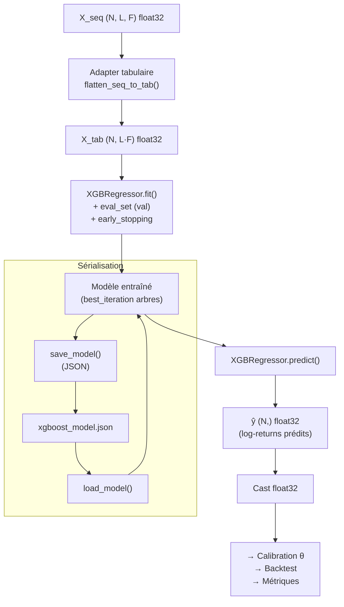

# Spécification formelle — Modèle XGBoost (Régression)

Plug-in `xgboost_reg` pour le Pipeline commun AI Trading.

**Version 1.0** — 2026-03-03 (UTC)

Document de référence pour l'implémentation du modèle XGBoost dans le pipeline.
Ce document est un complément de la spécification pipeline (v1.0 + addendum v1.1/v1.2).


# Table des matières

- Historique des versions
- 1. Objet et périmètre
  - 1.1 Rôle dans le pipeline
  - 1.2 Hypothèses et contraintes
- 2. Rappel du contrat d'interface (§10 spec pipeline)
  - 2.1 Interface `BaseModel`
  - 2.2 Conventions d'entrée/sortie
  - 2.3 Attributs de classe
- 3. Adapter tabulaire (§7.2 spec pipeline)
  - 3.1 Aplatissement `X_seq → X_tab`
  - 3.2 Nommage des colonnes
  - 3.3 Conservation du dtype
- 4. Architecture du modèle
  - 4.1 Framework et version
  - 4.2 Objectif (loss)
  - 4.3 Hyperparamètres par défaut (MVP)
  - 4.4 Tableau récapitulatif des hyperparamètres
- 5. Entraînement
  - 5.1 Procédure `fit()`
  - 5.2 Early stopping
  - 5.3 Métriques d'entraînement loguées
  - 5.4 Gestion de la validation
- 6. Inférence
  - 6.1 Procédure `predict()`
  - 6.2 Sortie et dtype
- 7. Sérialisation
  - 7.1 Format de sauvegarde
  - 7.2 Procédure `save()`
  - 7.3 Procédure `load()`
- 8. Intégration pipeline
  - 8.1 Enregistrement dans le registre
  - 8.2 Calibration du seuil θ
  - 8.3 Backtest
  - 8.4 Métriques applicables
- 9. Reproductibilité et déterminisme
  - 9.1 Seeds
  - 9.2 Manifest
- 10. Anti-fuite (look-ahead)
- 11. Configuration YAML
  - 11.1 Bloc `models.xgboost`
  - 11.2 Paramètres pipeline partagés
- 12. Contraintes d'implémentation et tests
  - 12.1 Validation stricte (no fallbacks)
  - 12.2 Tests requis
- Annexes
  - Annexe A — Diagramme de flux XGBoost dans le pipeline
  - Annexe B — Exemple de configuration complète
  - Annexe C — Feature importance et interprétabilité


# Historique des versions

| Version | Date | Auteur | Changements |
| --- | --- | --- | --- |
| 1.0 | 2026-03-03 | Équipe projet | Première spécification formelle du modèle XGBoost. |


# 1. Objet et périmètre

Ce document spécifie formellement le plug-in modèle **XGBoost en régression** (`xgboost_reg`) pour le pipeline commun AI Trading. Il détaille l'architecture, les hyperparamètres, la procédure d'entraînement, l'inférence, la sérialisation et l'intégration dans le pipeline.

Ce document est subordonné à la spécification pipeline v1.0 (et ses addenda). En cas de conflit, la spécification pipeline prévaut.


## 1.1 Rôle dans le pipeline

XGBoost est le modèle de **référence ML tabulaire** du pipeline. Il sert de :

1. **Benchmark ML** : premier modèle à implémenter et à valider, servant de baseline supervisée face aux modèles DL (CNN1D, GRU, LSTM, PatchTST) et au RL (PPO).
2. **Validateur de pipeline** : par sa simplicité d'entraînement (pas de GPU, convergence rapide), XGBoost est le premier modèle utilisé pour valider le pipeline bout-en-bout (features → splits → scaling → training → calibration θ → backtest → métriques → artefacts).
3. **Modèle de production candidat** : XGBoost est reconnu pour ses performances sur données tabulaires financières, notamment grâce à sa robustesse aux outliers et à ses capacités de régularisation intégrées.

Position dans le dataflow (voir §3 spec pipeline) :

```
Features (N, L, F) → Adapter tabulaire → X_tab (N, L·F) → XGBoost fit/predict → ŷ (N,) → Calibration θ → Backtest
```


## 1.2 Hypothèses et contraintes

- **Régression uniquement** : le modèle prédit un log-return continu $\hat{y}_t$, converti en décision Go/No-Go via le seuil $\theta$ calibré sur validation (§11 spec pipeline).
- **Pas de classification** : XGBoost n'est pas utilisé en mode classification dans le MVP. La décision binaire est déléguée au mécanisme de seuil commun.
- **Pas de features additionnelles** : aucune feature spécifique à XGBoost ne doit être ajoutée (§7.2 spec pipeline). Le modèle consomme exactement les mêmes features que les modèles DL, via l'adapter tabulaire.
- **Pas de GPU** : XGBoost est exécuté sur CPU (`tree_method: "hist"`, pas `"gpu_hist"`). L'utilisation GPU est une optimisation post-MVP.
- **Un seul symbole** : conforme à la contrainte MVP (§E.2.6 spec pipeline).


# 2. Rappel du contrat d'interface (§10 spec pipeline)


## 2.1 Interface `BaseModel`

Le modèle XGBoost implémente l'interface abstraite `BaseModel` définie dans `ai_trading/models/base.py` :

```python
class XGBoostRegModel(BaseModel):
    output_type = "regression"

    def fit(self, X_train, y_train, X_val, y_val, config, run_dir,
            meta_train=None, meta_val=None, ohlcv=None) -> dict: ...
    def predict(self, X, meta=None, ohlcv=None) -> np.ndarray: ...
    def save(self, path) -> None: ...
    def load(self, path) -> None: ...
```


## 2.2 Conventions d'entrée/sortie

| Paramètre | Shape | Dtype | Description |
|---|---|---|---|
| `X_train` | $(N_{\text{train}}, L, F)$ | float32 | Features d'entraînement (format séquentiel canonique). |
| `y_train` | $(N_{\text{train}},)$ | float32 | Labels d'entraînement (log-return $y_t$). |
| `X_val` | $(N_{\text{val}}, L, F)$ | float32 | Features de validation. |
| `y_val` | $(N_{\text{val}},)$ | float32 | Labels de validation. |
| `X` (predict) | $(N, L, F)$ | float32 | Features d'inférence. |
| `y_hat` (retour predict) | $(N,)$ | float32 | Prédictions de log-return. |
| `config` | — | `PipelineConfig` | Configuration complète du pipeline (Pydantic). |
| `run_dir` | — | `Path` | Répertoire du run courant. |

**Remarque** : les paramètres `meta_train`, `meta_val`, `ohlcv` et `meta` sont **ignorés** par XGBoost (ils ne sont utiles qu'au modèle RL et à la baseline SMA).


## 2.3 Attributs de classe

| Attribut | Valeur | Description |
|---|---|---|
| `output_type` | `"regression"` | Sortie continue → passage obligatoire par calibration θ. |
| `execution_mode` | `"standard"` | Mode par défaut (hérité de `BaseModel`). |


# 3. Adapter tabulaire (§7.2 spec pipeline)


## 3.1 Aplatissement `X_seq → X_tab`

XGBoost consomme une matrice tabulaire 2D. Le pipeline impose un adapter standard qui aplatit le tenseur séquentiel par concaténation temporelle (C-order, row-major) :

$$
X_{\text{tab}}[i] = \text{vec}(X_{\text{seq}}[i]) \in \mathbb{R}^{L \cdot F}
$$
$$
X_{\text{tab}} \in \mathbb{R}^{N \times (L \cdot F)}
$$

**Implémentation** : `numpy.reshape(X_seq, (N, L * F))` en C-order (défaut numpy).

L'adapter est une fonction pure, sans état, appliquée dans `fit()` et `predict()`.


## 3.2 Nommage des colonnes

Les colonnes de $X_{\text{tab}}$ sont nommées selon la convention :

```
f{feature_idx}_t{lag_idx}
```

Où `feature_idx` ∈ [0, F-1] et `lag_idx` ∈ [0, L-1], en C-order (le lag varie le plus vite).

Exemple pour L=3, F=2 : `f0_t0, f0_t1, f0_t2, f1_t0, f1_t1, f1_t2`.

Le nommage est optionnel (XGBoost accepte des matrices numpy sans noms de colonnes) mais recommandé pour :
- l'interprétabilité (feature importance),
- le débugging,
- la traçabilité dans les artefacts.


## 3.3 Conservation du dtype

L'adapter préserve le dtype d'entrée (float32). XGBoost convertit internement en sa représentation interne. La sortie de `predict()` est explicitement castée en float32 pour respecter le contrat.


# 4. Architecture du modèle


## 4.1 Framework et version

| Composant | Choix MVP |
|---|---|
| Bibliothèque | XGBoost ≥ 2.0 |
| API | `xgboost.XGBRegressor` (API scikit-learn) |
| Algorithme | Gradient Boosting sur arbres de décision (CART) |
| `tree_method` | `"hist"` (histogramme, CPU) |
| `booster` | `"gbtree"` (arbres, pas de booster linéaire) |

**Justification** : l'API scikit-learn de XGBoost est la plus simple à intégrer avec le pipeline. Le `tree_method: "hist"` est le plus performant sur CPU pour des datasets de taille moyenne.


## 4.2 Objectif (loss)

| Paramètre | Valeur | Description |
|---|---|---|
| `objective` | `"reg:squarederror"` | MSE (Mean Squared Error), objectif standard pour la régression de log-returns. |

L'objectif est fixé à `"reg:squarederror"` (MSE). Il est imposé par le pipeline et n'est **pas configurable** dans la config YAML du modèle. La cohérence avec `training.loss: mse` est assurée au niveau du pipeline.

**Justification** : le MSE est l'objectif standard pour la régression de séries financières. Il pénalise les grosses erreurs (rendements extrêmes), ce qui est souhaitable pour le trading. Un objectif MAE ou Huber pourrait être envisagé post-MVP.


## 4.3 Hyperparamètres par défaut (MVP)

Les hyperparamètres ci-dessous sont les defaults MVP, configurables via `configs/default.yaml` sous la clé `models.xgboost`.

### Contrôle de la complexité des arbres

| Paramètre | Clé config | Valeur MVP | Description |
|---|---|---|---|
| `max_depth` | `models.xgboost.max_depth` | `5` | Profondeur maximale de chaque arbre. Contrôle la complexité du modèle. |
| `n_estimators` | `models.xgboost.n_estimators` | `500` | Nombre maximal de boosting rounds (arbres). Borné par l'early stopping. |
| `learning_rate` | `models.xgboost.learning_rate` | `0.05` | Taux d'apprentissage (shrinkage). Réduit la contribution de chaque arbre. |

**Justification** :
- `max_depth=5` : compromis entre capacité et régularisation. Trop profond → overfitting sur les patterns de bruit financier. Trop peu profond → underfitting.
- `n_estimators=500` : borne haute confortable ; l'early stopping arrête bien avant en pratique.
- `learning_rate=0.05` : modéré, permet une convergence stable avec early stopping.

### Régularisation par sous-échantillonnage

| Paramètre | Clé config | Valeur MVP | Description |
|---|---|---|---|
| `subsample` | `models.xgboost.subsample` | `0.8` | Fraction des samples utilisée pour construire chaque arbre (stochastic gradient boosting). |
| `colsample_bytree` | `models.xgboost.colsample_bytree` | `0.8` | Fraction des features utilisée pour construire chaque arbre. |

**Justification** : le sous-échantillonnage (bagging) des samples et des features améliore la généralisation et réduit la variance. 80% est un choix classique.

### Régularisation L1/L2

| Paramètre | Clé config | Valeur MVP | Description |
|---|---|---|---|
| `reg_alpha` | `models.xgboost.reg_alpha` | `0.0` | Régularisation L1 sur les poids des feuilles. 0 = désactivée. |
| `reg_lambda` | `models.xgboost.reg_lambda` | `1.0` | Régularisation L2 sur les poids des feuilles. 1.0 = valeur XGBoost par défaut. |

**Justification** :
- `reg_alpha=0.0` : pas de sparsification des poids de feuilles au MVP.
- `reg_lambda=1.0` : régularisation L2 modérée (valeur par défaut de XGBoost), prévient l'overfitting sans nécessiter de tuning.


## 4.4 Tableau récapitulatif des hyperparamètres

| Paramètre | Clé config | Valeur MVP | Configurable | Type |
|---|---|---|---|---|
| `max_depth` | `models.xgboost.max_depth` | `5` | Oui | int |
| `n_estimators` | `models.xgboost.n_estimators` | `500` | Oui | int |
| `learning_rate` | `models.xgboost.learning_rate` | `0.05` | Oui | float |
| `subsample` | `models.xgboost.subsample` | `0.8` | Oui | float |
| `colsample_bytree` | `models.xgboost.colsample_bytree` | `0.8` | Oui | float |
| `reg_alpha` | `models.xgboost.reg_alpha` | `0.0` | Oui | float |
| `reg_lambda` | `models.xgboost.reg_lambda` | `1.0` | Oui | float |
| `objective` | — | `"reg:squarederror"` | Non (imposé) | str |
| `tree_method` | — | `"hist"` | Non (imposé) | str |
| `booster` | — | `"gbtree"` | Non (imposé) | str |
| `random_state` | — | `reproducibility.global_seed` | Via seed globale | int |
| `early_stopping_rounds` | — | `training.early_stopping_patience` | Via config pipeline | int |
| `verbosity` | — | `0` | Non (silencieux) | int |


# 5. Entraînement


## 5.1 Procédure `fit()`

La méthode `fit()` exécute les étapes suivantes dans cet ordre :

1. **Aplatissement** : convertir `X_train` $(N, L, F)$ → `X_tab_train` $(N, L \cdot F)$ via l'adapter tabulaire.
2. **Aplatissement validation** : convertir `X_val` → `X_tab_val`.
3. **Instanciation du régresseur** : créer un `xgboost.XGBRegressor` avec les hyperparamètres de la config.
4. **Seed** : fixer `random_state` à la valeur de `reproducibility.global_seed`.
5. **Fit** : appeler `regressor.fit(X_tab_train, y_train, eval_set=[(X_tab_val, y_val)], verbose=False)`.
6. **Early stopping** : activé via `early_stopping_rounds = training.early_stopping_patience`.
7. **Extraction des artefacts** : récupérer `best_iteration`, `best_score`, `evals_result`.
8. **Retour** : dictionnaire d'artefacts d'entraînement.

**Pseudo-code** :

```python
def fit(self, X_train, y_train, X_val, y_val, config, run_dir, **kwargs):
    X_tab_train = flatten_seq_to_tab(X_train)
    X_tab_val = flatten_seq_to_tab(X_val)

    xgb_params = config.models.xgboost
    self._model = xgb.XGBRegressor(
        max_depth=xgb_params.max_depth,
        n_estimators=xgb_params.n_estimators,
        learning_rate=xgb_params.learning_rate,
        subsample=xgb_params.subsample,
        colsample_bytree=xgb_params.colsample_bytree,
        reg_alpha=xgb_params.reg_alpha,
        reg_lambda=xgb_params.reg_lambda,
        objective="reg:squarederror",
        tree_method="hist",
        booster="gbtree",
        random_state=config.reproducibility.global_seed,
        early_stopping_rounds=config.training.early_stopping_patience,
        verbosity=0,
    )

    self._model.fit(
        X_tab_train, y_train,
        eval_set=[(X_tab_val, y_val)],
        verbose=False,
    )

    return {
        "best_iteration": self._model.best_iteration,
        "best_score": self._model.best_score,
        "n_features_in": X_tab_train.shape[1],
    }
```


## 5.2 Early stopping

L'early stopping est **obligatoire**. Il est piloté par le paramètre pipeline `training.early_stopping_patience` (valeur MVP : 10).

**Sémantique** : nombre de **boosting rounds** consécutifs sans amélioration de la métrique de validation avant arrêt de l'entraînement.

| Aspect | Comportement |
|---|---|
| Métrique surveillée | RMSE sur `eval_set` (validation). |
| Rounds max | `models.xgboost.n_estimators` (500). |
| Patience | `training.early_stopping_patience` (10 rounds). |
| Modèle retenu | Celui à `best_iteration` (pas le dernier). |

**Remarque** (§10.3 spec pipeline) : la patience de 10 rounds XGBoost est **beaucoup moins coûteuse** que 10 epochs DL. Cette asymétrie est acceptée au MVP.


## 5.3 Métriques d'entraînement loguées

Le modèle XGBoost doit loguer au minimum les informations suivantes (conformément au §10.3 spec pipeline) :

| Métrique | Source | Description |
|---|---|---|
| `best_iteration` | `model.best_iteration` | Round du meilleur modèle (0-indexed). |
| `best_score` | `model.best_score` | RMSE de validation au `best_iteration`. |
| `n_estimators_actual` | `best_iteration + 1` | Nombre effectif d'arbres du modèle final. |
| `train_rmse_history` | `evals_result["validation_0"]["rmse"]` | Historique RMSE validation par round. |
| `n_features_in` | `X_tab.shape[1]` | Nombre de features tabulaires ($L \cdot F$). |
| `hyperparams` | Config | Hyperparamètres effectifs utilisés. |


## 5.4 Gestion de la validation

- La validation est **strictement temporelle** : val est le split temporel final du train, disjoint du test (§E.2.1 spec pipeline).
- XGBoost utilise `y_val` **uniquement** pour l'early stopping (via `eval_set`).
- Aucun boosting round ne refit sur les données de validation.
- Le scaler est fit sur train uniquement (déjà appliqué en amont par le pipeline).


# 6. Inférence


## 6.1 Procédure `predict()`

1. **Aplatissement** : convertir `X` $(N, L, F)$ → `X_tab` $(N, L \cdot F)$.
2. **Prédiction** : appeler `self._model.predict(X_tab)`.
3. **Cast** : convertir la sortie en `float32`.
4. **Retour** : array numpy $(N,)$ float32.

```python
def predict(self, X, meta=None, ohlcv=None):
    X_tab = flatten_seq_to_tab(X)
    y_hat = self._model.predict(X_tab)
    return y_hat.astype(np.float32)
```


## 6.2 Sortie et dtype

- `y_hat` : shape $(N,)$, dtype `float32`.
- Valeurs : log-returns prédits (continus, non bornés).
- Interprétation : $\hat{y}_t > \theta$ → Go (long) ; $\hat{y}_t \leq \theta$ → No-Go.

Le cast en `float32` est obligatoire car XGBoost retourne des `float64` en interne.


# 7. Sérialisation


## 7.1 Format de sauvegarde

Le modèle XGBoost est sérialisé au format **JSON natif** de XGBoost via `save_model()` / `load_model()`.

| Aspect | Choix |
|---|---|
| Format | JSON (`.json`) |
| Nom de fichier | `xgboost_model.json` |
| Répertoire | `<run_dir>/folds/fold_XX/model_artifacts/` |

**Justification** :
- Le format JSON est lisible, diffable, et portable.
- Alternative : le format binaire `.ubj` (Universal Binary JSON) est plus compact mais moins auditable.
- Le pickle est **interdit** : il est non portable entre versions et présente des risques de sécurité.


## 7.2 Procédure `save()`

```python
def save(self, path: Path) -> None:
    resolved = self._resolve_path(path, "xgboost_model.json")
    resolved.parent.mkdir(parents=True, exist_ok=True)
    self._model.save_model(str(resolved))
```


## 7.3 Procédure `load()`

```python
def load(self, path: Path) -> None:
    resolved = self._resolve_path(path, "xgboost_model.json")
    if not resolved.exists():
        raise FileNotFoundError(f"Model file not found: {resolved}")
    self._model = xgb.XGBRegressor()
    self._model.load_model(str(resolved))
```

**Validations** :
- `FileNotFoundError` si le fichier n'existe pas.
- Pas de fallback silencieux si le fichier est corrompu.


# 8. Intégration pipeline


## 8.1 Enregistrement dans le registre

Le modèle est enregistré dans `MODEL_REGISTRY` via le décorateur `@register_model("xgboost_reg")` :

```python
from ai_trading.models.base import BaseModel, register_model

@register_model("xgboost_reg")
class XGBoostRegModel(BaseModel):
    output_type = "regression"
    ...
```

Le nom `"xgboost_reg"` est utilisé dans :
- `strategy.name` de la config YAML,
- `manifest.json` (champ `strategy.name`),
- `metrics.json` (champ `strategy.name`),
- le nom du répertoire de run (ex : `20260227_120000_xgboost_reg`).


## 8.2 Calibration du seuil θ

XGBoost est un modèle de type `"regression"` → la calibration de $\theta$ s'applique normalement (§11 spec pipeline) :

1. Prédictions sur validation : $\hat{y}_{\text{val}}$.
2. Grille de quantiles : $q \in \{0.5, 0.6, 0.7, 0.8, 0.9, 0.95\}$.
3. Pour chaque $q$ : $\theta(q) = \text{quantile}_q(\hat{y}_{\text{val}})$.
4. Backtest sur validation avec chaque $\theta$.
5. Sélection du $\theta$ maximisant le P&L net sous contraintes (MDD $\leq$ 25%, $n_{\text{trades}} \geq$ 20).

Le champ `threshold.method` dans `metrics.json` est `"quantile_grid"` et `theta` contient la valeur numérique retenue.


## 8.3 Backtest

Le backtest est commun à tous les modèles (§12 spec pipeline). XGBoost n'implémente aucun backtest spécifique.

Les signaux Go/No-Go issus de la comparaison $\hat{y}_t > \theta$ sont passés au moteur de backtest commun qui applique :
- entrée à $O_{t+1}$, sortie à $C_{t+H}$,
- coûts (fees + slippage) per side multiplicatifs,
- mode `one_at_a_time`.


## 8.4 Métriques applicables

Toutes les métriques du pipeline s'appliquent au modèle XGBoost :

**Métriques de prédiction** (§14.1 spec pipeline) :
| Métrique | Applicable | Description |
|---|---|---|
| MAE | Oui | Mean Absolute Error |
| RMSE | Oui | Root Mean Squared Error |
| Directional Accuracy | Oui | Proportion signaux corrects |
| Spearman IC | Oui | Corrélation de rang |

**Métriques de trading** (§14.2 spec pipeline) :
| Métrique | Applicable |
|---|---|
| Net P&L | Oui |
| Max Drawdown | Oui |
| Sharpe | Oui |
| Profit Factor | Oui |
| Hit Rate | Oui |
| N trades | Oui |
| Avg/Median trade return | Oui |
| Exposure time fraction | Oui |


# 9. Reproductibilité et déterminisme


## 9.1 Seeds

La reproductibilité est assurée par :

| Seed | Source | Utilisation |
|---|---|---|
| `random_state` | `reproducibility.global_seed` | Passé à `XGBRegressor(random_state=...)`. Contrôle le tirage aléatoire de `subsample` et `colsample_bytree`. |

XGBoost avec `tree_method="hist"` et `random_state` fixé est **déterministe** sur une même plateforme (CPU). La reproductibilité cross-plateforme n'est pas garantie par XGBoost (différences de précision flottante entre architectures).


## 9.2 Manifest

Le manifest (§15.2 spec pipeline) enregistre pour XGBoost :

```json
{
  "strategy": {
    "name": "xgboost_reg",
    "framework": "xgboost",
    "hyperparams": {
      "max_depth": 5,
      "n_estimators": 500,
      "learning_rate": 0.05,
      "subsample": 0.8,
      "colsample_bytree": 0.8,
      "reg_alpha": 0.0,
      "reg_lambda": 1.0
    }
  },
  "environment": {
    "packages": {
      "xgboost": "2.x.x"
    }
  }
}
```


# 10. Anti-fuite (look-ahead)

Le modèle XGBoost respecte les règles anti-fuite du pipeline (§ spec pipeline, AGENTS.md) :

| Règle | Vérification |
|---|---|
| Données point-in-time | Les features sont causales (passées uniquement). L'adapter tabulaire ne réordonne pas les données. |
| Embargo | `embargo_bars ≥ H` entre train/val et test (appliqué par le splitter, en amont de XGBoost). |
| Scaler fit sur train uniquement | Appliqué en amont par le pipeline. XGBoost reçoit des données déjà scalées. |
| Splits train < val < test | Appliqué par le splitter walk-forward. |
| `fit()` n'accède pas au test | `eval_set` ne contient que la validation, jamais le test. |
| Pas de recalibrage a posteriori | Le modèle est gelé après `fit()`. `predict()` n'a pas d'état mutable. |
| θ calibré sur val, pas test | Calibration effectuée par le module calibration, pas par XGBoost. |


# 11. Configuration YAML


## 11.1 Bloc `models.xgboost`

```yaml
models:
  xgboost:
    max_depth: 5                    # Profondeur max par arbre
    n_estimators: 500               # Nombre max de boosting rounds
    learning_rate: 0.05             # Shrinkage (LR XGBoost-specific)
    subsample: 0.8                  # Fraction samples par arbre
    colsample_bytree: 0.8          # Fraction features par arbre
    reg_alpha: 0.0                  # Régularisation L1
    reg_lambda: 1.0                 # Régularisation L2
```

**Validation Pydantic** (config loader) :
- `max_depth` : int > 0.
- `n_estimators` : int > 0.
- `learning_rate` : float, 0 < lr ≤ 1.
- `subsample` : float, 0 < s ≤ 1.
- `colsample_bytree` : float, 0 < c ≤ 1.
- `reg_alpha` : float ≥ 0.
- `reg_lambda` : float ≥ 0.


## 11.2 Paramètres pipeline partagés

Les paramètres suivants du pipeline interagissent avec XGBoost :

| Paramètre pipeline | Clé config | Impact sur XGBoost |
|---|---|---|
| `training.early_stopping_patience` | → | `early_stopping_rounds` du régresseur. |
| `reproducibility.global_seed` | → | `random_state` du régresseur. |
| `training.loss` | — | Vérifié cohérent avec `objective="reg:squarederror"` (MSE). |
| `training.learning_rate` | — | **Ignoré** par XGBoost (utilise `models.xgboost.learning_rate`). |
| `training.max_epochs` | — | **Ignoré** par XGBoost (utilise `models.xgboost.n_estimators`). |
| `training.batch_size` | — | **Ignoré** par XGBoost (pas de mini-batch). |
| `training.optimizer` | — | **Ignoré** par XGBoost (pas d'optimiseur externe). |


# 12. Contraintes d'implémentation et tests


## 12.1 Validation stricte (no fallbacks)

Conformément aux règles du projet (AGENTS.md) :

- **Pas de valeur par défaut silencieuse** : tous les hyperparamètres sont lus depuis la config. Aucune valeur hardcodée.
- **Pas de `except` large** : les erreurs XGBoost remontent telles quelles.
- **Validation explicite** :
  - `X_train.ndim == 3` → sinon `ValueError`.
  - `X_train.shape[0] == y_train.shape[0]` → sinon `ValueError`.
  - `X_train.dtype == np.float32` → sinon `TypeError`.
  - Après `fit()` : `self._model` est défini → sinon `RuntimeError` dans `predict()`.

## 12.2 Tests requis

Les tests doivent couvrir :

| Catégorie | Tests |
|---|---|
| **Adapter** | Shape (N, L·F), nommage colonnes, valeurs C-order, dtype préservé, erreurs non-3D. |
| **Enregistrement** | `"xgboost_reg"` dans `MODEL_REGISTRY`, `output_type == "regression"`. |
| **Interface** | `fit()` retourne un dict avec `best_iteration`, `predict()` retourne shape $(N,)$ float32. |
| **Early stopping** | `best_iteration < n_estimators` (le modèle s'arrête avant la borne). |
| **Sérialisation** | `save()` + `load()` → prédictions identiques. |
| **Déterminisme** | Deux `fit()` + `predict()` avec même seed → sorties identiques (bit-exact). |
| **Anti-fuite** | `predict()` indépendant de l'ordre d'appel. `fit()` n'utilise pas y_val pour le fitting. |
| **Validation stricte** | Shape invalide → `ValueError`. Dtype invalide → `TypeError`. `predict()` sans `fit()` → erreur. |
| **Intégration** | Pipeline bout-en-bout avec XGBoost (features → split → scale → fit → predict → θ → backtest → métriques). |


# Annexes


## Annexe A — Diagramme de flux XGBoost dans le pipeline




## Annexe B — Exemple de configuration complète

Extrait de `configs/default.yaml` pour un run XGBoost :

```yaml
strategy:
  strategy_type: model
  name: xgboost_reg

models:
  xgboost:
    max_depth: 5
    n_estimators: 500
    learning_rate: 0.05
    subsample: 0.8
    colsample_bytree: 0.8
    reg_alpha: 0.0
    reg_lambda: 1.0

training:
  loss: mse
  early_stopping_patience: 10

reproducibility:
  global_seed: 42
  deterministic_torch: true
```


## Annexe C — Feature importance et interprétabilité

XGBoost offre nativement des mécanismes d'interprétabilité qui peuvent être exploités pour l'analyse post-hoc :

| Mécanisme | API | Description |
|---|---|---|
| Feature importance (gain) | `model.feature_importances_` | Gain moyen apporté par chaque feature lors des splits. |
| Feature importance (weight) | `model.get_booster().get_score(importance_type="weight")` | Nombre de fois qu'une feature est utilisée dans les splits. |
| Feature importance (cover) | `model.get_booster().get_score(importance_type="cover")` | Nombre moyen de samples couvertes par les splits utilisant la feature. |
| SHAP values | `shap.TreeExplainer(model)` | Contributions marginales de chaque feature à chaque prédiction (nécessite la bibliothèque `shap`). |

**Note** : l'export de feature importance est une fonctionnalité **post-MVP** (optionnelle). Elle peut être activée dans les artefacts pour l'audit et l'interprétabilité, mais n'est pas requise pour le pipeline minimal.

**Analyse recommandée** :
- Vérifier que les features les plus importantes sont cohérentes avec l'intuition financière (ex : `logret_1`, `vol_24` devraient apparaître parmi les top features).
- Vérifier l'absence de features dominantes suspectes (signe potentiel de fuite ou d'artefact).
- Comparer la distribution de feature importance entre folds pour détecter l'instabilité.
