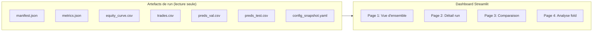

# Spécification formelle — Dashboard Streamlit AI Trading

Visualisation interactive des résultats de runs du pipeline AI Trading.

**Version 1.0** — 2026-03-03 (UTC)

Document de référence pour l'implémentation du dashboard de visualisation.
But : fournir une interface graphique interactive permettant d'explorer, comparer et auditer les résultats des runs produits par le pipeline commun AI Trading.


# Table des matières

- Historique des versions
- 1. Objet et périmètre
  - 1.1 Objectifs
  - 1.2 Hors périmètre (MVP)
  - 1.3 Hypothèses et contraintes
- 2. Glossaire
- 3. Vue d'ensemble du dashboard
  - 3.1 Architecture fonctionnelle
  - 3.2 Navigation et pages
- 4. Sources de données
  - 4.1 Structure des artefacts de run
  - 4.2 Fichiers exploités par le dashboard
  - 4.3 Validation des données à l'import
- 5. Page 1 — Vue d'ensemble des runs
  - 5.1 Sélection des runs
  - 5.2 Tableau récapitulatif
  - 5.3 Filtrage et tri
- 6. Page 2 — Détail d'un run
  - 6.1 En-tête du run
  - 6.2 Métriques agrégées
  - 6.3 Courbe d'équité (stitchée)
  - 6.4 Métriques par fold
  - 6.5 Distribution des trades
  - 6.6 Journal des trades
- 7. Page 3 — Comparaison multi-runs
  - 7.1 Sélection des runs à comparer
  - 7.2 Tableau comparatif
  - 7.3 Superposition des courbes d'équité
  - 7.4 Radar chart des métriques
- 8. Page 4 — Analyse par fold
  - 8.1 Sélection du fold
  - 8.2 Courbe d'équité du fold
  - 8.3 Prédictions vs réalisés
  - 8.4 Trade journal du fold
- 9. Composants visuels et conventions graphiques
  - 9.1 Bibliothèque de graphiques
  - 9.2 Palette de couleurs
  - 9.3 Conventions d'affichage des métriques
  - 9.4 Responsivité
- 10. Configuration et déploiement
  - 10.1 Stack technique
  - 10.2 Structure du code
  - 10.3 Commande de lancement
  - 10.4 Configuration Streamlit
  - 10.5 Dockerfile (optionnel)
- 11. Sécurité et performance
  - 11.1 Contraintes de sécurité
  - 11.2 Performance et mise en cache
- 12. Stratégie de tests
  - 12.1 Tests unitaires
  - 12.2 Tests d'intégration
- Annexes
  - Annexe A — Wireframes des pages
  - Annexe B — Métriques affichées (référence)
  - Annexe C — Dépendances


# Historique des versions

| Version | Date | Auteur | Changements |
| --- | --- | --- | --- |
| 1.0 | 2026-03-03 | Équipe projet | Première spécification formelle du dashboard Streamlit. |


# 1. Objet et périmètre

Ce document spécifie le dashboard de visualisation Streamlit pour le projet AI Trading Pipeline. Le dashboard est un outil post-exécution qui exploite les artefacts produits par le pipeline (`metrics.json`, `manifest.json`, `equity_curve.csv`, `trades.csv`, `preds_*.csv`) pour fournir une exploration interactive des résultats.


## 1.1 Objectifs

- **Explorer** les résultats d'un run individuel (métriques, trades, equity curve).
- **Comparer** plusieurs runs côte-à-côte (modèles vs baselines, hyperparamètres différents).
- **Auditer** les décisions fold par fold (prédictions, seuil θ, trades individuels).
- **Exporter** des visualisations et tableaux pour les rapports.


## 1.2 Hors périmètre (MVP)

- Lancement de runs depuis le dashboard (le dashboard est en lecture seule).
- Modification de la configuration YAML.
- Visualisation temps réel (streaming de métriques pendant un run).
- Alerting ou notifications.
- Authentification multi-utilisateurs.


## 1.3 Hypothèses et contraintes

- Les artefacts de run respectent la structure canonique décrite dans la spec pipeline (§15.1).
- Les fichiers `metrics.json` et `manifest.json` sont conformes aux JSON Schemas du pipeline.
- Le dashboard est exécuté en local (pas de déploiement cloud dans le MVP).
- Le répertoire `runs/` est accessible en lecture depuis le processus Streamlit.


# 2. Glossaire

| Terme | Définition |
| --- | --- |
| Run | Une exécution complète du pipeline, identifiée par un `run_id` unique. |
| Fold | Une fenêtre du protocole walk-forward (train/val/test). |
| Equity curve | Courbe cumulée de l'équité au cours du temps après exécution des trades. |
| Stitched equity | Concaténation chronologique des equity curves de tous les folds test. |
| θ (theta) | Seuil Go/No-Go calibré sur validation pour chaque fold. |
| Manifest | Fichier `manifest.json` contenant les métadonnées d'un run. |
| Metrics | Fichier `metrics.json` contenant les métriques par fold et agrégées. |


# 3. Vue d'ensemble du dashboard


## 3.1 Architecture fonctionnelle



Le dashboard est une application Streamlit multi-pages. Chaque page correspond à un niveau de détail croissant : vue globale → run individuel → comparaison → fold.


## 3.2 Navigation et pages

| Page | Nom | Description |
| --- | --- | --- |
| 1 | Vue d'ensemble | Liste de tous les runs disponibles, tableau récapitulatif |
| 2 | Détail d'un run | Métriques, equity curve, trades pour un run sélectionné |
| 3 | Comparaison | Superposition de métriques et courbes pour 2+ runs |
| 4 | Analyse par fold | Drill-down dans un fold spécifique (prédictions, trades) |


# 4. Sources de données


## 4.1 Structure des artefacts de run

Le dashboard exploite l'arborescence canonique définie dans la spec pipeline (§15.1) :

```
runs/<run_id>/
├── manifest.json               (systématique)
├── metrics.json                (systématique)
├── config_snapshot.yaml        (systématique)
├── pipeline.log                (systématique)
├── equity_curve.csv            (conditionnel : save_equity_curve)
└── folds/
    ├── fold_00/
    │   ├── metrics_fold.json   (systématique)
    │   ├── preds_val.csv       (conditionnel : save_predictions)
    │   ├── preds_test.csv      (conditionnel : save_predictions)
    │   ├── trades.csv          (conditionnel : save_trades)
    │   ├── equity_curve.csv    (conditionnel : save_equity_curve)
    │   └── model_artifacts/
    ├── fold_01/
    │   └── ...
    └── ...
```


## 4.2 Fichiers exploités par le dashboard

| Fichier | Format | Usage principal |
| --- | --- | --- |
| `manifest.json` | JSON | Métadonnées du run (stratégie, config, splits, hashes) |
| `metrics.json` | JSON | Métriques par fold et agrégées |
| `config_snapshot.yaml` | YAML | Configuration figée du run |
| `equity_curve.csv` | CSV | Courbe d'équité mark-to-market. **Conditionnel** : produit uniquement si `artifacts.save_equity_curve = true` dans la config. **Colonnes version stitchée** (racine du run) : `time_utc`, `equity`, `in_trade`, `fold`. **Colonnes version par fold** (`folds/fold_XX/`) : `time_utc`, `equity`, `in_trade` (pas de colonne `fold`). |
| `trades.csv` | CSV | Journal des trades par fold. **Conditionnel** : produit uniquement si `artifacts.save_trades = true` dans la config. |
| `preds_val.csv` | CSV | Prédictions sur validation par fold. **Conditionnel** : produit uniquement si `artifacts.save_predictions = true` dans la config. |
| `preds_test.csv` | CSV | Prédictions sur test par fold. **Conditionnel** : produit uniquement si `artifacts.save_predictions = true` dans la config. |
| `metrics_fold.json` | JSON | Métriques par fold (systématiquement généré par le pipeline, permet un chargement ciblé sans parser le `metrics.json` global). Le dashboard supporte son absence pour robustesse. |
| `pipeline.log` | Texte | Log d'exécution du pipeline (systématiquement généré par le pipeline, exploitable pour diagnostic). Le dashboard supporte son absence pour robustesse. |

> **Dégradation gracieuse** : lorsqu'un fichier conditionnel est absent, les pages et composants qui en dépendent affichent un message informatif (ex : "Equity curve non disponible pour ce run") au lieu de leur contenu normal. Les autres pages du dashboard restent pleinement fonctionnelles.


## 4.3 Validation des données à l'import

Lors du chargement d'un run, le dashboard vérifie :
- Existence de `manifest.json` et `metrics.json` (obligatoires).
- Parsing JSON sans erreur.
- Présence des clés requises : `run_id`, `strategy`, `aggregate` dans `metrics.json`.
- **Exclusion de la stratégie Dummy** : les runs dont `strategy.name == "dummy"` sont silencieusement ignorés. La stratégie Dummy est un outil de test du pipeline et n'a pas de valeur analytique. **Note** : un run dummy peut également être absent de la liste si son exécution a échoué avant la génération de `metrics.json` (le filtrage par existence du fichier l'élimine en amont). Le filtre par nom de stratégie est une sécurité complémentaire pour les runs dummy complets.
- Les runs invalides sont signalés dans la sidebar avec un indicateur d'erreur, mais ne bloquent pas le chargement des autres runs.

> **Clés optionnelles exploitables** : l'objet `aggregate` peut contenir les sous-clés `comparison_type` (ex : `"go_nogo"`, `"contextual"`) et `notes` (texte libre). Si présentes, le dashboard peut les utiliser pour qualifier le type de comparaison dans le tableau §5.2 ou la page §7.


# 5. Page 1 — Vue d'ensemble des runs


## 5.1 Sélection des runs

- **Découverte automatique** : le dashboard scanne `runs/` et liste tous les sous-répertoires contenant un `metrics.json` valide. Les runs de stratégie `dummy` sont exclus (cf. §4.3).
- **Sélection du répertoire** : un paramètre `--runs-dir` (ou variable d'environnement `AI_TRADING_RUNS_DIR`) permet de pointer vers un répertoire alternatif. Défaut : `runs/`.


## 5.2 Tableau récapitulatif

Le tableau principal affiche une ligne par run avec les colonnes suivantes :

| Colonne | Source | Description |
| --- | --- | --- |
| Run ID | `metrics.json → run_id` | Identifiant unique du run |
| Stratégie | `metrics.json → strategy.name` | Nom du modèle ou baseline |
| Type | `metrics.json → strategy.strategy_type` | `model` ou `baseline` |
| Folds | `metrics.json → len(folds)` | Nombre de folds walk-forward. **Note** : `folds` est un **array d'objets** (un par fold). Le count s'obtient par `len(folds)`. |
| Net PnL (moy) | `metrics.json → aggregate.trading.mean.net_pnl` | P&L net moyen inter-fold |
| Sharpe (moy) | `metrics.json → aggregate.trading.mean.sharpe` | Sharpe ratio moyen |
| MDD (moy) | `metrics.json → aggregate.trading.mean.max_drawdown` | Max drawdown moyen |
| Win Rate (moy) | `metrics.json → aggregate.trading.mean.hit_rate` | Hit rate moyen (clé JSON : `hit_rate`) |
| Trades (moy) | `metrics.json → aggregate.trading.mean.n_trades` | Nombre moyen de trades par fold |

Le tableau est cliquable : un clic sur une ligne ouvre la Page 2 pour ce run.


## 5.3 Filtrage et tri

- **Filtre par type** : dropdown `Tous / Modèles / Baselines`.
- **Filtre par stratégie** : multiselect des noms de stratégies présents.
- **Tri** : clic sur l'en-tête de colonne (ascendant / descendant).


# 6. Page 2 — Détail d'un run


## 6.1 En-tête du run

Bandeau d'information affiché en haut de page :

| Champ | Source |
| --- | --- |
| Run ID | `manifest.json → run_id` |
| Date | `manifest.json → created_at_utc` |
| Stratégie | `manifest.json → strategy.name` |
| Framework | `manifest.json → strategy.framework` (ex : `xgboost`, `pytorch`, `rule_based`, `none`) |
| Symbole | `manifest.json → dataset.symbols` (array de strings, joindre par `", "` pour affichage) |
| Timeframe | `manifest.json → dataset.timeframe` |
| Période | `manifest.json → dataset.start` — `dataset.end`. **Note** : `end` est une borne **exclusive** (convention du pipeline). L'affichage **recommandé** est `"2017-08-17 — 2026-01-01 (excl.)"` avec le suffixe `(excl.)`. Ne pas soustraire un jour à la date de fin car la granularité temporelle du dataset peut être inférieure au jour (ex : `1h`). |
| Seed | `manifest.json → config_snapshot.reproducibility.global_seed` |
| Nombre de folds | Comptage des dossiers `fold_*` |


## 6.2 Métriques agrégées

Affichage sous forme de **KPI cards** (une carte par métrique) :

| Métrique | Format | Seuil coloré |
| --- | --- | --- |
| Net PnL (mean ± std) | Pourcentage, 2 décimales | Vert si > 0, rouge sinon |
| Sharpe Ratio (mean ± std) | Float, 2 décimales | Vert si > 1, orange si > 0, rouge sinon. **Note** : le Sharpe peut être annualisé ou non selon le paramètre `metrics.sharpe_annualized` dans `config_snapshot.yaml` (défaut : `false`). Le dashboard doit lire ce paramètre et afficher le label « Sharpe Ratio (annualisé) » ou « Sharpe Ratio » en conséquence. |
| Max Drawdown (mean ± std) | Pourcentage, 2 décimales | Vert si < 10%, orange si < 25%, rouge sinon |
| Hit Rate (mean ± std) | Pourcentage, 1 décimale | Vert si > 55%, orange si > 50%, rouge sinon |
| Profit Factor (mean ± std) | Float, 2 décimales | Vert si > 1, rouge sinon |
| Nombre de trades (mean) | Entier | Information uniquement |

> **Note sur les valeurs null** : certaines métriques (`profit_factor`, `sharpe`, etc.) peuvent être `null` pour des folds individuels (ex : 0 trades, uniquement des trades gagnants). L'agrégation (mean/std) est calculée sur le sous-ensemble de folds non-null. Si le nombre de folds contribuant est inférieur au nombre total de folds, afficher l'indication du count (ex : « 1.31 ± 0.12 (8/10 folds) »). **Note d'implémentation** : le `metrics.json` ne stocke pas de champ `n_contributing` par métrique. Le dashboard doit calculer lui-même le count en parcourant l'array `folds` et en comptant les folds non-null pour chaque métrique. Si **tous** les folds produisent `null` pour une métrique, afficher `—` sans mean/std. La valeur `null` est affichée comme `—`.


## 6.3 Courbe d'équité (stitchée)

- **Graphique principal** : courbe d'équité concaténant chronologiquement les périodes test de tous les folds.
- **Axe X** : timestamps UTC.
- **Axe Y** : valeur de l'équité (normalisée, départ = 1.0). **Note** : la spec pipeline impose `backtest.initial_equity = 1.0` (valeur normalisée), mais le champ est configurable. Le dashboard doit normaliser en divisant toute la série par `equity[0]` pour garantir un départ à 1.0 quel que soit le run.
- **Annotations** : lignes verticales pointillées aux frontières entre folds. **Note** : le fichier `equity_curve.csv` stitché (à la racine du run) contient une colonne `fold` (entier, 0-indexé) qui identifie le fold d'origine de chaque ligne. Les frontières de fold se détectent par changement de valeur de cette colonne.
- **Drawdown** : zone ombrée sous la courbe d'équité représentant le drawdown courant.
- **Zones de position** : le fichier `equity_curve.csv` contient une colonne `in_trade` (bool) qui peut être exploitée pour colorer les zones où une position est active.
- **Interactivité** : zoom, pan, hover avec affichage des valeurs.


## 6.4 Métriques par fold

Tableau détaillé avec une ligne par fold :

| Colonne | Description |
| --- | --- |
| Fold | Numéro du fold (fold_00, fold_01, ...) |
| θ | Seuil calibré pour ce fold. **Attention** : `threshold` est un objet `{method, theta, selected_quantile}` dans `metrics.json`. Accès au seuil numérique via `fold.threshold.theta`. Afficher aussi `threshold.method` et `threshold.selected_quantile` si pertinent. |
| Net PnL | P&L net du fold |
| Sharpe | Sharpe ratio |
| MDD | Max drawdown |
| Win Rate | Hit rate. Clé JSON : `hit_rate`. |
| N Trades | Nombre de trades |
| MAE | Mean Absolute Error (prédiction) |
| RMSE | Root Mean Squared Error |
| DA (Dir. Accuracy) | Directional Accuracy. Clé JSON : `directional_accuracy`. Les valeurs `null` (0 échantillons éligibles, cf. §9.3) sont affichées comme `—`. |
| IC | Information Coefficient (Spearman). Clé JSON : `spearman_ic`. Les valeurs `null` (`y_true` ou `y_hat` constant sur le fold, variance nulle) sont affichées comme `—`. |
| Sharpe/Trade | Sharpe per trade (optionnel, exclu de l'agrégat inter-fold). Clé JSON : `sharpe_per_trade`. **Attention aux valeurs aberrantes** : les folds avec très peu de trades (ex : `n_trades = 1`) peuvent produire des valeurs extrêmes (ex : ±10⁹). Le dashboard doit afficher un indicateur visuel (ex : icône ⚠️ ou tooltip) pour les folds où `n_trades ≤ 2`, et peut tronquer l'affichage à un nombre raisonnable de décimales. |

Graphique complémentaire : **bar chart** du Net PnL par fold, coloré vert/rouge selon signe.


## 6.5 Distribution des trades

- **Histogramme** des rendements nets par trade (toutes folds confondus).
- **Box plot** des rendements nets par fold.
- **Statistiques affichées** : mean, median, std, skewness, best trade, worst trade.


## 6.6 Journal des trades

Tableau paginé et filtrable de tous les trades :

| Colonne | Source |
| --- | --- |
| Fold | Numéro du fold. **Note** : cette colonne n'existe pas dans `trades.csv`. Le numéro de fold est déduit du chemin fichier `folds/fold_XX/trades.csv`. Le dashboard doit l'ajouter à la volée lors du chargement. |
| Entry time | Timestamp d'entrée (`entry_time_utc`) |
| Exit time | Timestamp de sortie (`exit_time_utc`) |
| Entry price | Prix d'entrée (`entry_price`) |
| Exit price | Prix de sortie (`exit_price`) |
| Gross return | Rendement brut (`gross_return`) |
| Costs | Coûts (fee + slippage). **Note** : cette colonne unique n'existe pas dans `trades.csv`. Le pipeline fournit deux colonnes séparées : `fees_paid` et `slippage_paid`. Le dashboard doit calculer `costs = fees_paid + slippage_paid`. |
| Net return | Rendement net (`net_return`) |
| Equity after | Équité après le trade. **Note** : cette colonne n'existe pas dans `trades.csv`. Elle doit être reconstituée par jointure `asof` (backward) de `exit_time_utc` vers `equity_curve.csv → time_utc` **du même fold** (fichier `folds/fold_XX/equity_curve.csv`) pour obtenir la valeur `equity` au bar de sortie du trade. Si l'on utilise le fichier stitché (racine du run), filtrer d'abord sur la colonne `fold` correspondante. Si `equity_curve.csv` est absent (flag `save_equity_curve` désactivé), cette colonne est omise. **Précision d'implémentation** : le pipeline génère l'equity curve avec un point par bar (1h) et les timestamps de `exit_time_utc` dans `trades.csv` correspondent exactement à des timestamps de bar. La jointure asof backward est donc exacte dans le cas nominal (pas d'approximation). |

Filtres : par fold, par signe (gagnant / perdant), par période.

> **Colonnes supplémentaires disponibles** : le pipeline produit également `entry_price_eff`, `exit_price_eff`, `f` (taux de fee), `s` (taux de slippage), `y_true` et `y_hat` dans `trades.csv`. Ces colonnes ne sont pas affichées dans le tableau principal du MVP, mais peuvent être exploitées dans une vue détaillée ou un export CSV. Les colonnes `y_true`/`y_hat` permettent notamment d'auditer la relation entre prédiction et trade.


## 7.1 Sélection des runs à comparer

- **Multiselect** dans la sidebar permettant de choisir 2 à 10 runs parmi ceux découverts.
- Affichage du nom de stratégie à côté du run ID pour identification rapide.


## 7.2 Tableau comparatif

Tableau reprenant les mêmes colonnes que le tableau de la Page 1 (§5.2), restreint aux runs sélectionnés.

Mise en surbrillance :
- **Meilleure valeur** par colonne en gras vert.
- **Pire valeur** par colonne en italique rouge.

Le critère §14.4 de la spec pipeline est vérifié et affiché sous forme d'icône ✅ / ❌ par run. Les seuils exacts sont : P&L net > 0, profit factor > 1.0 (hardcodés dans le pipeline), et MDD < `thresholding.mdd_cap` (configurable). Le seuil MDD est lu depuis le `config_snapshot.yaml` de chaque run (`thresholding.mdd_cap`), et non pas hardcodé à une valeur par défaut dans le dashboard. Le dashboard lit le champ `aggregate.notes` dans `metrics.json` qui contient les éventuels warnings émis par le pipeline pour ces critères.


## 7.3 Superposition des courbes d'équité

- Graphique unique avec une courbe par run sélectionné.
- Courbes stitchées (concaténation des folds test).
- Légende cliquable pour masquer / afficher des courbes.
- Axe Y normalisé (départ = 1.0 pour tous les runs).


## 7.4 Radar chart des métriques

Diagramme radar (spider plot) comparant les runs sur 5 axes :
- Net PnL (normalisé)
- Sharpe Ratio (normalisé)
- 1 − MDD (inversé, plus grand = mieux)
- Win Rate
- Profit Factor (normalisé)

Normalisation : min-max sur les runs sélectionnés pour chaque axe.


# 8. Page 4 — Analyse par fold


## 8.1 Sélection du fold

- **Dropdown** : sélection du run, puis sélection du fold.
- **Slider** alternatif pour naviguer entre les folds.


## 8.2 Courbe d'équité du fold

- Graphique de l'equity curve pour le fold sélectionné uniquement.
- Points d'entrée (▲ vert) et de sortie (▼ rouge) des trades superposés sur la courbe.
- Zone de drawdown ombrée.


## 8.3 Prédictions vs réalisés

- **Scatter plot** : $\hat{y}_t$ (axe X) vs $y_t$ (axe Y) pour les échantillons test du fold.
- Ligne diagonale (prédiction parfaite) en pointillés.
- Coloration par décision : Go (vert) / No-Go (gris), selon le seuil θ du fold. Le seuil est accessible via `fold.threshold.theta` dans `metrics.json` (`threshold` est un objet, pas un float). **Note** : les fichiers `preds_test.csv` ne contiennent que 3 colonnes (`timestamp`, `y_true`, `y_hat`). Le signal Go/No-Go doit être reconstruit dynamiquement par le dashboard selon le type de sortie :
  - **`output_type = "regression"`** (modèles ML/DL) : `signal = (y_hat > fold.threshold.theta)`. Le seuil θ est un float calibré. Le type de sortie est disponible via `metrics.json → strategy.output_type`.
  - **`output_type = "signal"`** (baselines, RL) : `fold.threshold.theta` est `null` et `y_hat` est déjà un signal binaire (0 ou 1). Le signal Go/No-Go est directement `y_hat`. Le type de sortie est disponible via `metrics.json → strategy.output_type`. **Méthode alternative de détection** : si `metrics.json → strategy.output_type` est absent (runs antérieurs), le dashboard peut inférer le type via `threshold.method == "none"` (convention implicite du pipeline).
- **Métriques affichées** en encart : MAE, RMSE, DA, IC, θ (valeur issue de `fold.threshold.theta`, afficher `—` si `null`).

> **Note `output_type = "signal"`** : pour les stratégies de type signal (baselines, RL), `y_hat` est binaire (0 ou 1). Le scatter plot prédictions vs réalisés n'est pas pertinent dans ce cas. Le dashboard doit détecter cette situation (via `strategy.output_type == "signal"` ou, en fallback, `threshold.method == "none"`) et afficher un message informatif (ex : « Scatter plot non disponible pour les modèles de type signal ») à la place du graphique.

> **Note d'implémentation pipeline** : le champ `output_type` doit être ajouté dans `metrics.json → strategy` et `manifest.json → strategy` par le pipeline. La valeur provient de l'attribut de classe `model.output_type` (valeurs possibles : `"regression"`, `"signal"`). Les JSON Schemas (`metrics.schema.json`, `manifest.schema.json`) doivent être mis à jour en conséquence.


## 8.4 Trade journal du fold

Même tableau que §6.6, filtré sur le fold sélectionné.


# 9. Composants visuels et conventions graphiques


## 9.1 Bibliothèque de graphiques

Le dashboard utilise **Plotly** pour tous les graphiques interactifs (zoom, pan, hover, export PNG).

| Type de graphique | Utilisé dans |
| --- | --- |
| Line chart | Equity curves (§6.3, §7.3, §8.2) |
| Bar chart | Net PnL par fold (§6.4) |
| Histogram | Distribution des rendements (§6.5) |
| Box plot | Rendements par fold (§6.5) |
| Scatter plot | Prédictions vs réalisés (§8.3) |
| Radar chart | Comparaison multi-métriques (§7.4) |
| Table | Tous les tableaux de données |


## 9.2 Palette de couleurs

| Usage | Couleur | Hex |
| --- | --- | --- |
| Profit / positif | Vert | `#2ecc71` |
| Perte / négatif | Rouge | `#e74c3c` |
| Neutre / info | Bleu | `#3498db` |
| Warning | Orange | `#f39c12` |
| Drawdown zone | Rouge transparent | `rgba(231, 76, 60, 0.15)` |
| Frontières folds | Gris pointillé | `#95a5a6` |
| Fond graphiques | Blanc | `#ffffff` |


## 9.3 Conventions d'affichage des métriques

> **Convention de stockage** : les valeurs dans `metrics.json` sont des **ratios décimaux** (ex : `0.0345` signifie 3.45%). Cela concerne `net_pnl`, `max_drawdown`, `hit_rate`, `exposure_time_frac`, `avg_trade_return`, `median_trade_return`. Le format Python `{value:.2%}` gère automatiquement la multiplication par 100. Ne pas appliquer une conversion manuelle supplémentaire.

| Type | Format | Exemple |
| --- | --- | --- |
| Pourcentage | `{value:.2%}` | `3.45%` |
| Ratio (Sharpe, PF) | `{value:.2f}` | `1.23` |
| Entier (N trades) | `{value:,d}` | `1,234` |
| Timestamp | `YYYY-MM-DD HH:MM` UTC | `2025-06-15 14:00` |
| Mean ± std (ratio) | `{mean:.2f} ± {std:.2f}` | `1.23 ± 0.34` |
| Mean ± std (pourcentage) | `{mean:.2%} ± {std:.2%}` | `3.45% ± 1.20%` |

> **Règle** : le format mean±std suit le type de la métrique défini en §7 — `Pourcentage` → `:.2%` (ou `:.1%` pour `hit_rate`), `Float` → `:.2f`.

Les valeurs `null` sont affichées comme `—` (tiret cadratin).


## 9.4 Responsivité

- Le layout s'adapte à la largeur du navigateur via `st.set_page_config(layout="wide")`.
- Les graphiques utilisent `use_container_width=True`.
- Les KPI cards utilisent `st.columns()` avec répartition proportionnelle.


# 10. Configuration et déploiement


## 10.1 Stack technique

| Composant | Version / Package |
| --- | --- |
| Framework web | Streamlit ≥ 1.30 |
| Graphiques | Plotly ≥ 5.18 |
| Données | pandas, numpy |
| Config parsing | PyYAML, json (stdlib) |
| Python | ≥ 3.11 |


## 10.2 Structure du code

```
scripts/
└── dashboard/
    ├── app.py                   # Point d'entrée Streamlit
    ├── pages/
    │   ├── 1_overview.py        # Page 1 — Vue d'ensemble
    │   ├── 2_run_detail.py      # Page 2 — Détail d'un run
    │   ├── 3_comparison.py      # Page 3 — Comparaison
    │   └── 4_fold_analysis.py   # Page 4 — Analyse par fold
    ├── data_loader.py           # Chargement et validation des artefacts
    ├── charts.py                # Fonctions de création des graphiques Plotly
    └── utils.py                 # Helpers (formatage, couleurs, cache)
```

> **Note DRY** : le script existant `scripts/compare_runs.py` implémente déjà du chargement et de la validation de `metrics.json` (`load_metrics()`, `compare_strategies()`). Lors de l'implémentation, factoriser la logique commune dans `data_loader.py` pour éviter la duplication.


## 10.3 Commande de lancement

```bash
# Lancement par défaut (runs/ dans le répertoire courant)
streamlit run scripts/dashboard/app.py

# Avec répertoire de runs personnalisé
streamlit run scripts/dashboard/app.py -- --runs-dir /path/to/runs

# Avec Makefile (cible à créer lors de l'implémentation du dashboard)
make dashboard
make dashboard RUNS_DIR=/path/to/runs
```

> **Note d'implémentation** : la cible `dashboard` n'existe pas encore dans le Makefile. Elle devra être ajoutée lors de l'implémentation du dashboard.


## 10.4 Configuration Streamlit

Fichier `.streamlit/config.toml` à la racine du projet :

```toml
[server]
headless = true
port = 8501

[theme]
primaryColor = "#3498db"
backgroundColor = "#ffffff"
secondaryBackgroundColor = "#f0f2f6"
textColor = "#262730"
font = "sans serif"

[browser]
gatherUsageStats = false
```


## 10.5 Dockerfile (optionnel)

```dockerfile
FROM python:3.11-slim
WORKDIR /app
COPY requirements.txt .
RUN pip install --no-cache-dir -r requirements.txt streamlit plotly
COPY . .
EXPOSE 8501
CMD ["streamlit", "run", "scripts/dashboard/app.py", "--server.headless=true"]
```


# 11. Sécurité et performance


## 11.1 Contraintes de sécurité

- **Lecture seule** : le dashboard ne modifie jamais les artefacts de run.
- **Pas d'accès réseau** : pas de téléchargement de données, pas d'API externe.
- **Pas de fichiers uploadés** : les runs sont lus depuis le système de fichiers local uniquement.
- **Pas d'injection** : les chemins sont validés et résolus (`Path.resolve()`) pour éviter les traversals.


## 11.2 Performance et mise en cache

- **`@st.cache_data`** : utilisé pour le chargement des fichiers JSON, CSV et YAML. Le cache est invalidé par le hash du chemin + la date de modification du fichier.
- **Chargement paresseux** : les CSV volumineux (`equity_curve.csv`, `trades.csv`) ne sont chargés que lorsque la page correspondante est affichée.
- **Pagination** : les tableaux de trades sont paginés (50 lignes par page) pour éviter les ralentissements avec des milliers de trades.
- **Seuil d'alerte** : si un run contient plus de 200 folds, un avertissement est affiché avant chargement complet.


# 12. Stratégie de tests


## 12.1 Tests unitaires

| Module | Tests |
| --- | --- |
| `data_loader.py` | Chargement de `metrics.json` valide / invalide / manquant |
| `data_loader.py` | Découverte des runs dans un répertoire |
| `data_loader.py` | Parsing d'`equity_curve.csv` et `trades.csv` |
| `charts.py` | Génération de chaque type de graphique avec données synthétiques |
| `utils.py` | Formatage des métriques, gestion des `null` |


## 12.2 Tests d'intégration

- **Test de smoke** : lancement du dashboard avec un répertoire `runs/` contenant un run valide (avec au minimum `manifest.json` et `metrics.json`), vérification que les 4 pages se chargent sans erreur. Un run complet doit être généré via le pipeline ou une fixture de test dédiée doit être créée dans `tests/`.
- **Test d'exclusion Dummy** : un répertoire `runs/` contenant uniquement un run dummy → le tableau §5.2 est vide avec un message informatif.
- **Test de comparaison** : chargement de 2+ runs, vérification du tableau comparatif et des courbes superposées.
- **Test edge case** : répertoire `runs/` vide → message informatif (pas de crash).
- **Test de dégradation** : run avec fichiers conditionnels manquants → les pages qui en dépendent affichent un message informatif, les autres fonctionnent normalement. Tests individuels :
  - `equity_curve.csv` absent → §6.3, §7.3, §8.2 affichent un message, §6.6 omet la colonne `Equity after`.
  - `trades.csv` absent → §6.5, §6.6, §8.4 affichent un message.
  - `preds_val.csv` / `preds_test.csv` absents → §8.3 affiche un message.


# Annexes


## Annexe A — Wireframes des pages

### Page 1 — Vue d'ensemble

```
┌─────────────────────────────────────────────────────────┐
│  🏠 AI Trading Dashboard                               │
├──────────┬──────────────────────────────────────────────┤
│ SIDEBAR  │  Runs disponibles (auto-découverte)          │
│          │                                              │
│ Filtre:  │  ┌──────────────────────────────────────┐    │
│ [Type ▾] │  │ Run ID  │ Stratégie │ PnL  │ Sharpe │    │
│          │  │─────────│───────────│──────│────────│    │
│ Filtre:  │  │ run_001 │ xgboost   │ +3.4%│  1.23  │    │
│ [Strat ▾]│  │ run_002 │ buy_hold  │ +1.2%│  0.81  │    │
│          │  │ run_003 │ sma_rule  │ -0.5%│ -0.42  │    │
│          │  └──────────────────────────────────────┘    │
└──────────┴──────────────────────────────────────────────┘
```

### Page 2 — Détail d'un run

```
┌─────────────────────────────────────────────────────────┐
│  📊 Détail — run_001 (xgboost_reg)                     │
├──────────┬──────────────────────────────────────────────┤
│ SIDEBAR  │  ┌─────┐ ┌─────┐ ┌─────┐ ┌─────┐ ┌─────┐  │
│          │  │ PnL │ │Sharp│ │ MDD │ │ WR  │ │ PF  │  │
│ Run:     │  │+3.4%│ │ 1.23│ │12.1%│ │54.2%│ │ 1.31│  │
│ [run_001]│  └─────┘ └─────┘ └─────┘ └─────┘ └─────┘  │
│          │                                              │
│          │  ┌──────────────────────────────────────┐    │
│          │  │     Equity Curve (stitched)           │    │
│          │  │  📈 ~~~~~~~~~~~~~/\~~~~/\~~~~         │    │
│          │  └──────────────────────────────────────┘    │
│          │                                              │
│          │  ┌──────────────────────────────────────┐    │
│          │  │     Métriques par fold (table)        │    │
│          │  └──────────────────────────────────────┘    │
│          │                                              │
│          │  ┌────────────────┐ ┌─────────────────┐     │
│          │  │  Histogramme   │ │   Box plot       │     │
│          │  │  trades        │ │   par fold       │     │
│          │  └────────────────┘ └─────────────────┘     │
└──────────┴──────────────────────────────────────────────┘
```

### Page 3 — Comparaison

```
┌─────────────────────────────────────────────────────────┐
│  ⚖️ Comparaison multi-runs                              │
├──────────┬──────────────────────────────────────────────┤
│ SIDEBAR  │  ┌──────────────────────────────────────┐    │
│          │  │ Tableau comparatif (2-10 runs)       │    │
│ Runs:    │  │ meilleur en vert, pire en rouge      │    │
│ ☑ run_01 │  └──────────────────────────────────────┘    │
│ ☑ run_02 │                                              │
│ ☑ run_03 │  ┌──────────────────────────────────────┐    │
│ ☐ run_04 │  │ Equity curves superposées            │    │
│          │  │  📈 ─── xgboost  ─── sma  ─── b&h   │    │
│          │  └──────────────────────────────────────┘    │
│          │                                              │
│          │  ┌──────────────────────────────────────┐    │
│          │  │     Radar chart (5 axes)             │    │
│          │  └──────────────────────────────────────┘    │
└──────────┴──────────────────────────────────────────────┘
```


## Annexe B — Métriques affichées (référence)

Les métriques proviennent du fichier `metrics.json` produit par le pipeline. Elles sont définies dans la spec pipeline §14.

### Métriques de prédiction

| Clé JSON | Nom affiché | Unité |
| --- | --- | --- |
| `mae` | MAE | Float |
| `rmse` | RMSE | Float |
| `directional_accuracy` | Dir. Accuracy | Pourcentage |
| `spearman_ic` | IC (Spearman) | Float [-1, 1] |

### Métriques de trading

| Clé JSON | Nom affiché | Unité |
| --- | --- | --- |
| `net_pnl` | Net PnL | Pourcentage |
| `net_return` | Net Return | Pourcentage |

> **Note** : dans l'implémentation actuelle du pipeline, `net_pnl` et `net_return` sont calculés par la même fonction (`compute_net_pnl() = E_T / E_0 - 1`) et ont des valeurs identiques. Le dashboard MVP affiche uniquement `net_pnl` dans les tableaux récapitulatifs. Ne pas confondre avec la colonne `net_return` de `trades.csv`, qui est le rendement net **par trade** (concept différent).
| `sharpe` | Sharpe Ratio | Float |
| `max_drawdown` | Max Drawdown | Pourcentage |
| `hit_rate` | Win Rate | Pourcentage |
| `profit_factor` | Profit Factor | Float |
| `n_trades` | N Trades | Entier |
| `avg_trade_return` | Avg Trade Return | Pourcentage |
| `median_trade_return` | Median Trade Return | Pourcentage |
| `exposure_time_frac` | Exposure Time | Pourcentage |
| `sharpe_per_trade` | Sharpe per Trade | Float |


## Annexe C — Dépendances

```
# requirements-dashboard.txt
streamlit>=1.30
plotly>=5.18
pandas>=2.0
numpy>=1.24
PyYAML>=6.0
```

Ces dépendances s'ajoutent aux `requirements.txt` du pipeline principal. Elles peuvent être installées via :

```bash
pip install -r requirements-dashboard.txt
```
